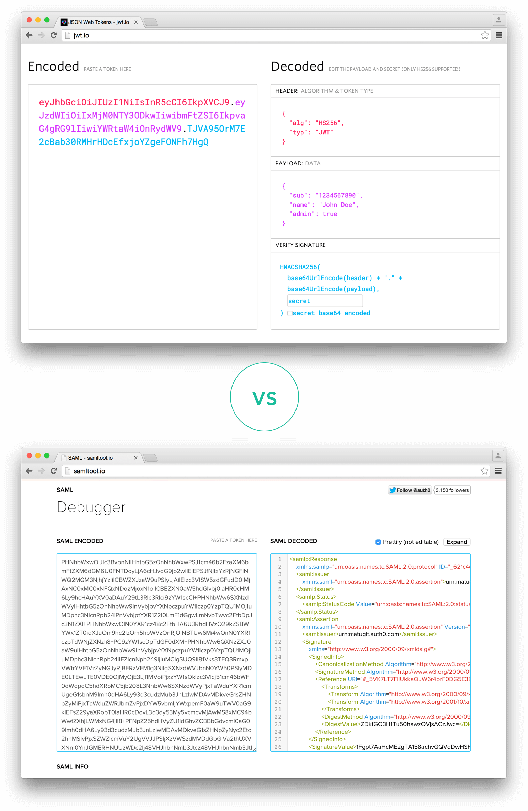

## 什么是 JSON Web Token？

JSON Web Token (JWT) 是一种开放标准 ( [RFC 7519](https://tools.ietf.org/html/rfc7519) )，它定义了一种紧凑且自包含的方式，用于以 JSON 对象的形式在各​​方之间安全地传输信息。此信息可以验证和信任，因为它是经过数字签名的。可以使用密钥（使用**HMAC算法）或使用****RSA**或**ECDSA**的公钥/私钥对对JWT 进行签名。

尽管 JWT 可以加密以在各方之间提供保密性，但我们将重点介绍*签名*令牌。签名令牌可以验证其中包含的声明的*完整性，而加密令牌则向其他方**隐藏*这些声明。当使用公钥/私钥对对令牌进行签名时，签名还会证明只有持有私钥的一方才是签名者。

## 何时应该使用 JSON Web Tokens？

以下是 JSON Web Tokens 有用的一些场景：

* **授权** ：这是使用 JWT 最常见的场景。用户登录后，每个后续请求都将包含 JWT，允许用户访问该令牌允许的路由、服务和资源。单点登录是如今广泛使用 JWT 的一项功能，因为它的开销很小，并且能够轻松跨不同域使用。
* **信息交换** ：JSON Web Tokens 是各方之间安全传输信息的一种好方法。由于 JWT 可以签名（例如，使用公钥/私钥对），因此您可以确保发送者的身份是他们所说的那个人。此外，由于签名是使用标头和有效负载计算的，因此您还可以验证内容未被篡改。

## JSON Web Token 结构是什么？

在其紧凑形式中，JSON Web Tokens 由以点 ( ) 分隔的三部分组成`.`，它们是：

* 标头
* 有效载荷
* 签名

因此，JWT 通常如下所示。

`xxxxx.yyyyy.zzzzz`

让我们分解一下不同的部分。

### 标头

标头*通常*由两部分组成：令牌的类型（即 JWT）和正在使用的签名算法（例如 HMAC SHA256 或 RSA）。

例如：

```
{
  "alg": "HS256",
  "typ": "JWT"
}
```

然后，将此 JSON 经过**Base64Url**编码，形成 JWT 的第一部分。

### 有效载荷

令牌的第二部分是有效负载，其中包含声明。声明是关于实体（通常是用户）和其他数据的声明。声明有三种类型： *已注册* 、*公开*和*私有*声明。

* [**注册声明**](https://tools.ietf.org/html/rfc7519#section-4.1)：这些是一组预定义的声明，它们不是强制性的，但建议使用，以提供一组有用的、可互操作的声明。其中一些是： ** iss** （颁发者）、 ** exp** （到期时间）、 ** sub** （主题）、 ** aud** （受众）[等](https://tools.ietf.org/html/rfc7519#section-4.1)。
  > 请注意，由于 JWT 力求紧凑，因此声明名称只有三个字符。
* [**公开声明**](https://tools.ietf.org/html/rfc7519#section-4.2)：这些声明可以由使用 JWT 的用户随意定义。但为了避免冲突，应在[IANA JSON Web Token Registry](https://www.iana.org/assignments/jwt/jwt.xhtml)中定义它们，或将其定义为包含抗冲突命名空间的 URI。
* [**私人声明**](https://tools.ietf.org/html/rfc7519#section-4.3)：这些是为在同意使用它们的各方之间共享信息而创建的自定义声明，既不是*注册声明*也不是*公开*声明。

示例有效载荷可能是：

```json
{
  "sub": "1234567890",
  "name": "John Doe",
  "admin": true
}
```

然后对有效负载进行**Base64Url**编码以形成 JSON Web Token 的第二部分。

> 请注意，对于签名令牌，此信息虽然受到防篡改保护，但任何人都可以读取。除非已加密，否则不要将机密信息放入 JWT 的有效负载或标头元素中。

### 签名

要创建签名部分，您必须获取编码的标头、编码的有效负载、秘密、标头中指定的算法，然后对其进行签名。

例如，如果您想使用 HMAC SHA256 算法，则签名将按以下方式创建：

```javascript
HMACSHA256(
  base64UrlEncode(header) + "." +
  base64UrlEncode(payload),
  secret)
```

签名用于验证消息在传输过程中未被更改，并且，对于使用私钥签名的令牌，它还可以验证 JWT 的发送者是否是其所述的那个人。

### 综合起来

输出是三个以点分隔的 Base64-URL 字符串，可以在 HTML 和 HTTP 环境中轻松传递，同时与 SAML 等基于 XML 的标准相比更加紧凑。

下面显示了一个已对先前的标头和有效负载进行编码并使用密钥进行签名的 JWT。 

如果您想使用 JWT 并将这些概念付诸实践，您可以使用[jwt.io Debugger](https://jwt.io/#debugger-io)来解码、验证和生成 JWT。


## JSON Web Tokens 如何工作？

在身份验证中，当用户使用其凭据成功登录时，将返回 JSON Web Token。由于令牌是凭据，因此必须格外小心，以防止出现安全问题。一般来说，您不应将令牌保留超过所需时间。

[由于缺乏安全性，](https://cheatsheetseries.owasp.org/cheatsheets/HTML5_Security_Cheat_Sheet.html#local-storage)您也不应将敏感的会话数据存储在浏览器存储中。

每当用户想要访问受保护的路由或资源时，用户代理都应发送 JWT，通常在使用Bearer架构的**Authorization**标头中发送。标头的内容应如下所示：

```bash
Authorization: Bearer <token>
```

在某些情况下，这可能是一种无状态授权机制。服务器的受保护路由将检查`Authorization`标头中是否存在有效的 JWT，如果存在，则允许用户访问受保护的资源。如果 JWT 包含必要的数据，则查询数据库以执行某些操作的需要可能会减少，尽管情况可能并非总是如此。

请注意，如果您通过 HTTP 标头发送 JWT 令牌，则应尝试防止它们变得太大。某些服务器不接受超过 8 KB 的标头。如果您尝试在 JWT 令牌中嵌入过多信息（例如包括所有用户权限），则可能需要替代解决方案，例如[Auth0 细粒度授权](https://fga.dev/)。

如果在标头中发送令牌`Authorization`，则跨源资源共享 (CORS) 将不会成为问题，因为它不使用 cookie。

下图展示了如何获取 JWT 以及如何使用它来访问 API 或资源：


1. 应用程序或客户端向授权服务器请求授权。这是通过不同的授权流程之一执行的。例如，典型的符合[OpenID Connect 的](http://openid.net/connect/)`/oauth/authorize`Web 应用程序将使用[授权码流程](http://openid.net/specs/openid-connect-core-1_0.html#CodeFlowAuth)通过端点。
2. 当授权被批准时，授权服务器会向应用程序返回访问令牌。
3. 应用程序使用访问令牌来访问受保护的资源（如 API）。

请注意，使用签名令牌时，令牌中包含的所有信息都会暴露给用户或其他方，即使他们无法更改这些信息。这意味着您不应将秘密信息放在令牌中。

## 为什么我们应该使用 JSON Web Tokens？

**让我们来谈谈JSON Web 令牌（JWT）与** **简单 Web 令牌（SWT）** 和 **安全断言标记语言令牌（SAML）** 相比的优势。

由于 JSON 比 XML 更简洁，因此编码后的大小也更小，使得 JWT 比 SAML 更紧凑。这使得 JWT 成为在 HTML 和 HTTP 环境中传递的理想选择。

在安全性方面，SWT 只能使用 HMAC 算法通过共享密钥进行对称签名。但是，JWT 和 SAML 令牌可以使用 X.509 证书形式的公钥/私钥对进行签名。与 JSON 签名的简单性相比，使用 XML 数字签名对 XML 进行签名而不引入隐蔽的安全漏洞非常困难。

JSON 解析器在大多数编程语言中很常见，因为它们直接映射到对象。相反，XML 没有自然的文档到对象映射。这使得使用 JWT 比使用 SAML 断言更容易。

就使用而言，JWT 在互联网规模上使用。这凸显了 JSON Web 令牌在多个平台（尤其是移动平台）上的客户端处理的简易性。

 *编码后的 JWT 和编码后的 SAML 的长度比较*
