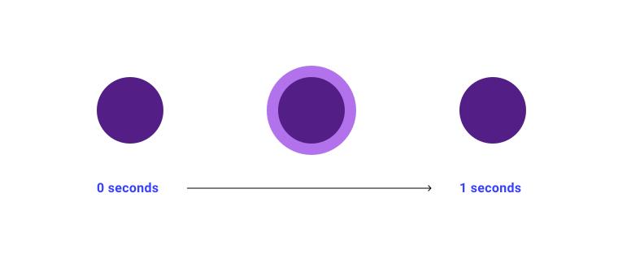
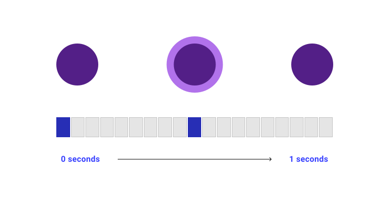
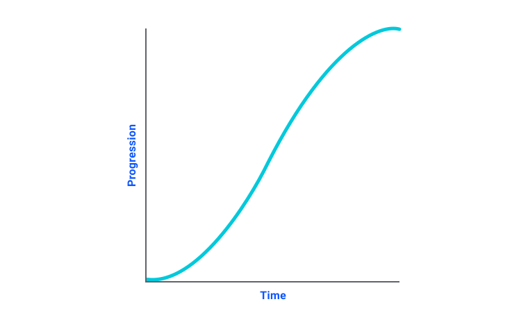

# 动画 

动画是突出互动元素的好方法，可为设计增添趣味和乐趣。在本单元中，您将了解如何使用 CSS 添加和控制动画效果。

有时，您会在界面上看到一些小帮助程序，这些程序会在您点击它们时提供有关其所在部分的实用信息。这类事件通常具有闪烁的动画，让您知道相关信息就在那里，并且应该与之互动。 此模块将介绍如何使用 CSS 创建这些帮助程序和其他动画。

<iframe allow="camera; clipboard-read; clipboard-write; encrypted-media; geolocation; microphone; midi;" loading="lazy" src="https://codepen.io/web-dot-dev/embed/mdRXGeJ?height=300&amp;theme-id=light&amp;default-tab=result&amp;editable=true" data-darkreader-inline-border-top="" data-darkreader-inline-border-right="" data-darkreader-inline-border-bottom="" data-darkreader-inline-border-left="" data-title="Codepen 上 web-dot-dev 的 Pen mdRXGeJ" style="color-scheme: initial; box-sizing: inherit; border: 0px; height: 300px; width: 100%; --darkreader-inline-border-top: 0px; --darkreader-inline-border-right: 0px; --darkreader-inline-border-bottom: 0px; --darkreader-inline-border-left: 0px;"></iframe>

闪烁的图标是确保用户关注重要信息的一种方式。

您可以使用 CSS 设置带有关键帧的动画序列。这些序列可以是基本的单状态动画，也可以是复杂的基于时间的序列。

## 什么是关键帧？

在大多数动画工具中，关键帧是用来为时间轴上的时间戳分配动画状态的机制。

例如，下方是闪烁的“helper”圆点的时间轴。动画会运行 1 秒钟，并有 2 种状态。



脉冲动画的状态。

其中每种动画状态的开始和结束位置都有一个特定点。您可以使用关键帧在时间轴上映射这些元素。



带有关键帧的脉冲动画。

### `@keyframes`
<BrowseSurport code="css.at-rules.keyframes" />

CSS [`@keyframes`](https://developer.mozilla.org/docs/Web/CSS/@keyframes) 与动画关键帧基于相同的概念。

下面是一个具有两种状态的示例：

```css
@keyframes my-animation {
    from { 
        transform: translateY(20px); 
    }  to { 
        transform: translateY(0px); 
    }
}
```

第一个重要部分是[自定义标识符 (`custom-ident`)](https://developer.mozilla.org/docs/Web/CSS/custom-ident)，即关键帧规则的名称。此示例中的标识符为 `my-animation`。自定义标识符的作用类似于[函数](/blogs/web/css/functions)名称，允许您在 CSS 代码中的其他位置引用关键帧规则。

**注意** ：`` 在 CSS 中的各个位置都有使用，可让您为内容提供自己的名称。这些标识符区分大小写，并且在某些情况下，有些字词是您无法使用的。例如，在 CSS 网格中为行命名时，不能使用 `span` 一词。

在关键帧规则中，`from` 和 `to` 是代表 `0%` 和 `100%` 的关键字，这两个关键字是动画的起点和终点。您可以重新创建相同的规则，如下所示：

```css
@keyframes my-animation {
    0% { 
        transform: translateY(20px);  
    }   
    100% {   
        transform: translateY(0px);  
    }
}
```

您可以在时间范围内添加任意数量的排名。 在脉冲辅助程序示例中，有两种状态可转换为两个关键帧。这意味着您在关键帧规则中有两个位置，分别表示每个关键帧的变化。

```css
@keyframes pulse {
    0% {   
        opacity: 0;
    }  
    50% { 
        transform: scale(1.4); 
        opacity: 0.4;
    }
}
```

<iframe allow="camera; clipboard-read; clipboard-write; encrypted-media; geolocation; microphone; midi;" loading="lazy" src="https://codepen.io/web-dot-dev/embed/mdRXGeJ?height=300&amp;theme-id=light&amp;default-tab=css%2Cresult&amp;editable=true" data-darkreader-inline-border-top="" data-darkreader-inline-border-right="" data-darkreader-inline-border-bottom="" data-darkreader-inline-border-left="" data-title="Codepen 上 web-dot-dev 的 Pen mdRXGeJ" style="color-scheme: initial; box-sizing: inherit; border: 0px; height: 300px; width: 854px; --darkreader-inline-border-top: 0px; --darkreader-inline-border-right: 0px; --darkreader-inline-border-bottom: 0px; --darkreader-inline-border-left: 0px;"></iframe>
尝试修改 `pulse` 规则，看看动画会如何变化。100%

## `animation` 属性
<BrowseSurport code="css.properties.animation" />

如需在 CSS 规则中使用 `@keyframes`，您可以单独定义各种动画属性，也可以使用 [`animation`](https://developer.mozilla.org/docs/Web/CSS/animation) 简写属性。

### `animation-duration`
<BrowseSurport code="css.properties.animation-duration" />

```css
.my-element { 
    animation-duration: 10s;
}
```

[Animation-duration](https://developer.mozilla.org/docs/Web/CSS/animation-duration) 属性定义了 `@keyframes` 时间轴的时长值。该时长默认为 0 秒，表示动画仍会运行，但播放速度过快，您无法看到。时间值不能为负数。

### `animation-timing-function`

<BrowseSurport code="css.properties.animation-timing-function" />

为帮助在动画中重现自然运动，您可以使用计时函数来计算动画在每个点的速度。计算值通常是*曲线*的，使得动画在 `animation-duration` 期间以可变速度运行，使元素在浏览器计算出的值超出 `@keyframes` 中定义的值时看起来会弹跳。

CSS 中有多个关键字可作为预设值使用，它们用作 [animate-timing-function](https://developer.mozilla.org/docs/Web/CSS/animation-timing-function) 的值：`linear`、`ease`、`ease-in`、`ease-out`、`ease-in-out`。

```css
.my-element {  
    animation-timing-function: ease-in-out;
}
```

<iframe allow="camera; clipboard-read; clipboard-write; encrypted-media; geolocation; microphone; midi;" loading="lazy" src="https://codepen.io/web-dot-dev/embed/YzNeJbL?height=500&amp;theme-id=light&amp;default-tab=result&amp;editable=true" data-darkreader-inline-border-top="" data-darkreader-inline-border-right="" data-darkreader-inline-border-bottom="" data-darkreader-inline-border-left="" data-title="Pen YzNeJbL（由 web-dot-dev 在 Codepen 上发布）" style="color-scheme: initial; box-sizing: inherit; border: 0px; height: 500px; width: 100%; --darkreader-inline-border-top: 0px; --darkreader-inline-border-right: 0px; --darkreader-inline-border-bottom: 0px; --darkreader-inline-border-left: 0px;"></iframe>
尝试更改动画使用的时间函数。

加/减速函数值显示为曲线，因为加/减速功能是使用**贝塞尔曲线**（一种用于对速度建模的函数）计算得出的。每个计时函数关键字（例如 `ease`）都引用预定义的贝塞尔曲线。在 CSS 中，您可以直接使用 `cubic-bezier()` 函数定义贝塞尔曲线，该函数接受四个数值：`x1`、`y1`、`x2`、`y2`。

```css
.my-element {
    animation-timing-function: cubic-bezier(.42, 0, .58, 1);
}
```

这些值会沿着 X 轴和 Y 轴绘制曲线的每个部分。

贝塞尔曲线示例。

理解贝塞尔曲线非常复杂。可视化工具（例如 Lea Verou 的这个[生成器](https://cubic-bezier.com/)）非常有用。

#### `steps` 加/减速函数

有时，您可能希望通过间隔（而不是沿着曲线）移动，对动画进行更精细的控制。借助 `steps()` 加/减速函数，您可以将时间轴拆分为多个定义的间隔（时长相同）。

```css
.my-element {  
    animation-timing-function: steps(10, end);
}
```

第一个参数是步数。如果关键帧数量与步数相同，那么每个关键帧都会按照其所在步长的精确时长依序播放，状态之间不会有过渡。 如果关键帧少于步数，浏览器会根据第二个参数在关键帧之间添加步。

第二个参数是方向。如果设为 `end`（默认值），则步骤会在时间轴的末尾完成。如果设置为 `start`，则动画的第一步会在开始时立即完成，这意味着它比 `end` 早一个步骤结束。

<iframe allow="camera; clipboard-read; clipboard-write; encrypted-media; geolocation; microphone; midi;" loading="lazy" src="https://codepen.io/web-dot-dev/embed/JjEpege?height=500&amp;theme-id=light&amp;default-tab=result&amp;editable=true" data-darkreader-inline-border-top="" data-darkreader-inline-border-right="" data-darkreader-inline-border-bottom="" data-darkreader-inline-border-left="" data-title="Codepen 上 web-dot-dev 的 Pen JjEpege" style="color-scheme: initial; box-sizing: inherit; border: 0px; height: 500px; width: 100%; --darkreader-inline-border-top: 0px; --darkreader-inline-border-right: 0px; --darkreader-inline-border-bottom: 0px; --darkreader-inline-border-left: 0px;"></iframe>
比较使用步骤和不使用步骤的动画

### `animation-iteration-count`
<BrowseSurport code="css.properties.animation-iteration-count" />
```css
.my-element {   
    animation-iteration-count: 10;
}
```

[animate-iter-count](https://developer.mozilla.org/docs/Web/CSS/animation-iteration-count) 属性定义 `@keyframes` 时间轴应在动画期间运行的次数。默认情况下，该值为 1，表示动画在到达时间轴末尾时停止。此值不能为负数。

<iframe allow="camera; clipboard-read; clipboard-write; encrypted-media; geolocation; microphone; midi;" loading="lazy" src="https://codepen.io/web-dot-dev/embed/oNBEaYB?height=500&amp;theme-id=light&amp;default-tab=css%2Cresult&amp;editable=true" data-darkreader-inline-border-top="" data-darkreader-inline-border-right="" data-darkreader-inline-border-bottom="" data-darkreader-inline-border-left="" data-title="Codepen 上 web-dot-dev 的 Pen oNBEaYB" style="color-scheme: initial; box-sizing: inherit; border: 0px; height: 500px; width: 100%; --darkreader-inline-border-top: 0px; --darkreader-inline-border-right: 0px; --darkreader-inline-border-bottom: 0px; --darkreader-inline-border-left: 0px;"></iframe>
尝试更改此动画的迭代计数。

如需让动画循环播放，请将迭代计数设置为 `infinite`。这就是本课开头脉冲动画的运作方式。

<iframe allow="camera; clipboard-read; clipboard-write; encrypted-media; geolocation; microphone; midi;" loading="lazy" src="https://codepen.io/web-dot-dev/embed/mdRXGeJ?height=500&amp;theme-id=light&amp;default-tab=css%2Cresult&amp;editable=true" data-darkreader-inline-border-top="" data-darkreader-inline-border-right="" data-darkreader-inline-border-bottom="" data-darkreader-inline-border-left="" data-title="Codepen 上 web-dot-dev 的 Pen mdRXGeJ" style="color-scheme: initial; box-sizing: inherit; border: 0px; height: 500px; width: 100%; --darkreader-inline-border-top: 0px; --darkreader-inline-border-right: 0px; --darkreader-inline-border-bottom: 0px; --darkreader-inline-border-left: 0px;"></iframe>
脉冲动画会无限循环播放。

### `animation-direction`

<BrowseSurport code="css.properties.animation-direction" />

```css
.my-element {   
    animation-direction: reverse;
}
```

您可以使用 [Animation-direction](https://developer.mozilla.org/docs/Web/CSS/animation-direction) 设置时间轴在关键帧上的运行方向，其值如下：

- `normal`：默认值，为正向。
- `reverse`：在时间轴上向后运行。
- `alternate`：对于每次动画迭代，时间轴都会在正向和反向运行之间交替。
- `alternate-reverse`：与 `alternate` 类似，但动画从时间轴向后移动。

<iframe allow="camera; clipboard-read; clipboard-write; encrypted-media; geolocation; microphone; midi;" loading="lazy" src="https://codepen.io/web-dot-dev/embed/JjWPqMv?height=500&amp;theme-id=light&amp;default-tab=result&amp;editable=true" data-darkreader-inline-border-top="" data-darkreader-inline-border-right="" data-darkreader-inline-border-bottom="" data-darkreader-inline-border-left="" data-title="Codepen 上 web-dot-dev 的 Pen JjWPqMv" style="color-scheme: initial; box-sizing: inherit; border: 0px; height: 500px; width: 100%; --darkreader-inline-border-top: 0px; --darkreader-inline-border-right: 0px; --darkreader-inline-border-bottom: 0px; --darkreader-inline-border-left: 0px;"></iframe>
尝试更改动画方向。

### `animation-delay`
<BrowseSurport code="css.properties.animation-delay" />

```css
.my-element {   
    animation-delay: 5s;
}
```

[Animation-delay](https://developer.mozilla.org/docs/Web/CSS/animation-delay) 属性定义了浏览器在启动动画之前等待的时间。与 `animation-duration` 属性一样，此属性也采用时间值。

与 `animation-duration` 不同的是，您可以将 `animation-delay` 定义为负值，以便让动画从时间轴中的相应点开始。例如，如果动画时长为 10 秒，并且您将 `animation-delay` 设置为 `-5s`，则动画会从时间轴一半开始开始播放。

<iframe allow="camera; clipboard-read; clipboard-write; encrypted-media; geolocation; microphone; midi;" loading="lazy" src="https://codepen.io/web-dot-dev/embed/bGqbyPw?height=500&amp;theme-id=light&amp;default-tab=result&amp;editable=true" data-darkreader-inline-border-top="" data-darkreader-inline-border-right="" data-darkreader-inline-border-bottom="" data-darkreader-inline-border-left="" data-title="Codepen 上 web-dot-dev 的 Pen bGqbyPw" style="color-scheme: initial; box-sizing: inherit; border: 0px; height: 500px; width: 100%; --darkreader-inline-border-top: 0px; --darkreader-inline-border-right: 0px; --darkreader-inline-border-bottom: 0px; --darkreader-inline-border-left: 0px;"></iframe>
尝试更改动画延迟时间。

### `animation-play-state`

<BrowseSurport code="css.properties.animation-play-state" />
```css
.my-element:hover {  
    animation-play-state: paused;
}
```

您可以使用 [Animation-play-state](https://developer.mozilla.org/docs/Web/CSS/animation-play-state) 属性播放和暂停动画。默认值为 `running`。如果将其设置为 `paused`，动画会暂停。

<iframe allow="camera; clipboard-read; clipboard-write; encrypted-media; geolocation; microphone; midi;" loading="lazy" src="https://codepen.io/web-dot-dev/embed/MWJQZyV?height=400&amp;theme-id=light&amp;default-tab=result&amp;editable=true" data-darkreader-inline-border-top="" data-darkreader-inline-border-right="" data-darkreader-inline-border-bottom="" data-darkreader-inline-border-left="" data-title="web-dot-dev 上的 Pen MWJQZyV" style="color-scheme: initial; box-sizing: inherit; border: 0px; height: 400px; width: 854px; --darkreader-inline-border-top: 0px; --darkreader-inline-border-right: 0px; --darkreader-inline-border-bottom: 0px; --darkreader-inline-border-left: 0px;"></iframe>
将光标悬停在动画元素上即可暂停动画。

### `animation-fill-mode`

<BrowseSurport code="css.properties.animation-fill-mode" />

[Animation-fill-mode](https://developer.mozilla.org/docs/Web/CSS/animation-fill-mode) 属性会定义 `@keyframes` 时间轴中的哪些值在动画开始前或结束之后保持不变。默认值为 `none`，表示动画播放完毕后，时间轴中的值会被舍弃。其他选项包括：
100%
- `forwards`：根据动画方向，最后一个关键帧持续显示。
- `backwards`：根据动画方向持续显示第一个关键帧。
- `both`：第一个和最后一个关键帧都会保留。

<iframe allow="camera; clipboard-read; clipboard-write; encrypted-media; geolocation; microphone; midi;" loading="lazy" src="https://codepen.io/web-dot-dev/embed/rNyBEVK?height=500&amp;theme-id=light&amp;default-tab=result&amp;editable=true" data-darkreader-inline-border-top="" data-darkreader-inline-border-right="" data-darkreader-inline-border-bottom="" data-darkreader-inline-border-left="" data-title="Codepen 上的 web-dot-dev 的 Pen rNyBEVK" style="color-scheme: initial; box-sizing: inherit; border: 0px; height: 500px; width: 100%; --darkreader-inline-border-top: 0px; --darkreader-inline-border-right: 0px; --darkreader-inline-border-bottom: 0px; --darkreader-inline-border-left: 0px;"></iframe>
尝试更改填充模式。

### `animation` 简写

您可以采用 `animation` 简写形式来定义每个属性，而无需单独定义每个属性，这样一来，您就可以按以下顺序定义动画属性：

1. `animation-name`
2. `animation-duration`
3. `animation-timing-function`
4. `animation-delay`
5. `animation-iteration-count`
6. `animation-direction`
7. `animation-fill-mode`
8. `animation-play-state`

```css
.my-element {   
    animation: my-animation 10s ease-in-out 1s infinite forwards forwards running;
}
```

## 使用动画时的注意事项

用户可以在与应用和网站互动时将其操作系统设置为首选减速模式。您可以使用 [prefers-reduced-motion](https://developer.mozilla.org/docs/Web/CSS/@media/prefers-reduced-motion) 媒体查询来检测此偏好设置：

```css
@media (prefers-reduced-motion) { 
    .my-autoplaying-animation {  
        animation-play-state: paused;  
    }
}
```

这不一定是没有动画的偏好。它倾向于使用较少的动画，尤其是较少的动画。

<iframe allow="camera; clipboard-read; clipboard-write; encrypted-media; geolocation; microphone; midi;" loading="lazy" src="https://codepen.io/web-dot-dev/embed/bGqbPwq?height=500&amp;theme-id=light&amp;default-tab=result&amp;editable=true" data-darkreader-inline-border-top="" data-darkreader-inline-border-right="" data-darkreader-inline-border-bottom="" data-darkreader-inline-border-left="" data-title="由 web-dot-dev 在 Codepen 上通过 web-dot-dev 钢笔 bGqbPwq" style="color-scheme: initial; box-sizing: inherit; border: 0px; height: 500px; width: 100%; --darkreader-inline-border-top: 0px; --darkreader-inline-border-right: 0px; --darkreader-inline-border-bottom: 0px; --darkreader-inline-border-left: 0px;"></iframe>
