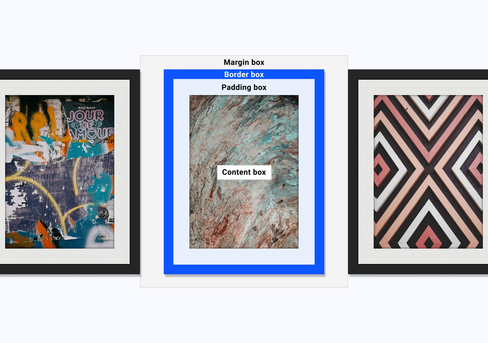

# 边框 

在[ 盒子模型](/blogs/web/css/box-model)模块中，我们考虑了使用帧类比来描述框模型的每个部分。



边框框是框的框架，`border` 属性为您提供了大量选项，供您以您能想到的几乎任何样式创建该框架。

## 边框属性

单个 `border` 属性提供了一种为边框的各个部分设置样式的方法。

<BrowseSurport code="css.properties.border" />


### 风格

如需显示边框，您必须定义 [`border-style`](https://developer.mozilla.org/docs/Web/CSS/border-style)。有以下几个选项可供选择：

<iframe allow="camera; clipboard-read; clipboard-write; encrypted-media; geolocation; microphone; midi;" loading="lazy" src="https://codepen.io/web-dot-dev/embed/GRrvyxY?height=500&amp;theme-id=light&amp;default-tab=result&amp;editable=true" data-darkreader-inline-border-top="" data-darkreader-inline-border-right="" data-darkreader-inline-border-bottom="" data-darkreader-inline-border-left="" data-title="由 web-dot-dev 在 Codepen 上开发的 Pen GRrvyxY" style="color-scheme: initial; box-sizing: inherit; border: 0px; height: 500px; width: 100%; --darkreader-inline-border-top: 0px; --darkreader-inline-border-right: 0px; --darkreader-inline-border-bottom: 0px; --darkreader-inline-border-left: 0px;"></iframe>

使用 `ridge`、`inset`、`outset` 和 `groove` 样式时，浏览器会将第二种颜色的边框颜色调暗，以提供对比和深度。此行为可能会因浏览器而异，尤其是对于深色（例如 `black`）而言。在 Chrome 中，这些边框样式将显示为纯色；在 Firefox 中，这些边框样式会变浅，然后再提供更深的第二种颜色。

浏览器行为也可能因边框样式而异，因此一定要在不同的浏览器中测试您的网站。这种差异的一个常见示例是，每个浏览器如何渲染 `dotted` 和 `dashed` 样式。

Chrome、Firefox 和 Safari 中显示的边框。

若要为框的每一侧设置边框样式，您可以使用 [`border-top-style`](https://developer.mozilla.org/docs/Web/CSS/border-top-style)、[`border-right-style`](https://developer.mozilla.org/docs/Web/CSS/border-right-style)、[`border-left-style`](https://developer.mozilla.org/docs/Web/CSS/border-left-style) 和 [`border-bottom-style`](https://developer.mozilla.org/docs/Web/CSS/border-bottom-style)。

### 简写

与 `margin` 和 `padding` 一样，您可以使用 [`border`](https://developer.mozilla.org/docs/Web/CSS/border) 简写属性在一个声明中定义边框的所有部分。

```css
.my-element {  
    border: 1px solid red;
}
```

`border` 简写形式中的值的顺序是 `border-width`、`border-style`，然后是 `border-color`。

### 颜色

您可以使用 [`border-color`](https://developer.mozilla.org/docs/Web/CSS/border-color) 设置框的各侧或每一侧的颜色。默认情况下，它会使用框的当前文本颜色：`currentColor`。这意味着，如果您仅声明边框属性（如宽度），那么除非您明确设置颜色，否则颜色将采用计算后的值。

```css
.my-element {  
    color: blue;   
    border: solid; /* Will be a blue border */
}
.my-element {
    color: blue; 
    border: solid yellow;
}
```

<iframe allow="camera; clipboard-read; clipboard-write; encrypted-media; geolocation; microphone; midi;" loading="lazy" src="https://codepen.io/web-dot-dev/embed/yLgovoX?height=500&amp;theme-id=light&amp;default-tab=result&amp;editable=true" data-darkreader-inline-border-top="" data-darkreader-inline-border-right="" data-darkreader-inline-border-bottom="" data-darkreader-inline-border-left="" data-title="由 web-dot-dev 在 Codepen 上运营的 Pen yLgovoX" style="color-scheme: initial; box-sizing: inherit; border: 0px; height: 500px; width: 100%; --darkreader-inline-border-top: 0px; --darkreader-inline-border-right: 0px; --darkreader-inline-border-bottom: 0px; --darkreader-inline-border-left: 0px;"></iframe>

如需为框的每一侧设置边框颜色，请使用 [`border-top-color`](https://developer.mozilla.org/docs/Web/CSS/border-top-color)、[`border-right-color`](https://developer.mozilla.org/docs/Web/CSS/border-right-color)、[`border-left-color`](https://developer.mozilla.org/docs/Web/CSS/border-left-color) 和 [`border-bottom-color`](https://developer.mozilla.org/docs/Web/CSS/border-bottom-color)。

<iframe allow="camera; clipboard-read; clipboard-write; encrypted-media; geolocation; microphone; midi;" loading="lazy" src="https://codepen.io/web-dot-dev/embed/MWJvQVO?height=500&amp;theme-id=light&amp;default-tab=result&amp;editable=true" data-darkreader-inline-border-top="" data-darkreader-inline-border-right="" data-darkreader-inline-border-bottom="" data-darkreader-inline-border-left="" data-title="web-dot-dev 在 Codepen 上提供的 Pen MWJvQVO" style="color-scheme: initial; box-sizing: inherit; border: 0px; height: 500px; width: 100%; --darkreader-inline-border-top: 0px; --darkreader-inline-border-right: 0px; --darkreader-inline-border-bottom: 0px; --darkreader-inline-border-left: 0px;"></iframe>

### 宽度

边框的宽度是线条的粗细，由 [`border-width`](https://developer.mozilla.org/docs/Web/CSS/border-width) 控制。默认边框宽度为 `medium`。 不过，除非您定义样式，否则此属性将不可见。您可以使用其他已命名的宽度，例如 `thin` 和 `thick`。

<iframe allow="camera; clipboard-read; clipboard-write; encrypted-media; geolocation; microphone; midi;" loading="lazy" src="https://codepen.io/web-dot-dev/embed/PoWKQxN?height=500&amp;theme-id=light&amp;default-tab=result&amp;editable=true" data-darkreader-inline-border-top="" data-darkreader-inline-border-right="" data-darkreader-inline-border-bottom="" data-darkreader-inline-border-left="" data-title="由 web-dot-dev 在 Codepen 上的 Pen PoWKQxN" style="color-scheme: initial; box-sizing: inherit; border: 0px; height: 500px; width: 100%; --darkreader-inline-border-top: 0px; --darkreader-inline-border-right: 0px; --darkreader-inline-border-bottom: 0px; --darkreader-inline-border-left: 0px;"></iframe>

`border-width` 属性还接受长度单位，例如 `px`、`em`、`rem` 或 `%`。如需为框的每一侧设置边框宽度，请使用 [`border-top-width`](https://developer.mozilla.org/docs/Web/CSS/border-top-width)、[`border-right-width`](https://developer.mozilla.org/docs/Web/CSS/border-right-width)、[`border-left-width`](https://developer.mozilla.org/docs/Web/CSS/border-left-width) 和 [`border-bottom-width`](https://developer.mozilla.org/docs/Web/CSS/border-bottom-width)。

## 逻辑属性

在[逻辑属性](/blogs/web/css/logical-properties)模块中，您了解了如何指代块流和内嵌流，而不是显式的顶部、右侧、底部或左侧。

您也可以使用边框功能：

```css
.my-element {   
    border: 2px dotted; 
    border-inline-end: 2px solid red;
}
```

<iframe allow="camera; clipboard-read; clipboard-write; encrypted-media; geolocation; microphone; midi;" loading="lazy" src="https://codepen.io/web-dot-dev/embed/poRraBp?height=500&amp;theme-id=light&amp;default-tab=result&amp;editable=true" data-darkreader-inline-border-top="" data-darkreader-inline-border-right="" data-darkreader-inline-border-bottom="" data-darkreader-inline-border-left="" data-title="Codepen 上 web-dot-dev 的 Pen poRraBp" style="color-scheme: initial; box-sizing: inherit; border: 0px; height: 500px; width: 100%; --darkreader-inline-border-top: 0px; --darkreader-inline-border-right: 0px; --darkreader-inline-border-bottom: 0px; --darkreader-inline-border-left: 0px;"></iframe>

在此示例中，`.my-element` 的所有边均定义为具有 `2px`（虚线边框，即当前文本颜色）。然后，将 `inline-end` 边框定义为 `2px`（实线和红色）。也就是说，在从左到右书写的语言（如英语）中，红色边框位于框的右侧。在从右到左书写的语言（如阿拉伯语）中，红色边框位于框的左侧。

浏览器对边框的逻辑属性的支持各不相同，因此请务必先查看支持情况，然后再使用。

## 圆角半径

如需为框添加圆角，请使用 [`border-radius`](https://developer.mozilla.org/docs/Web/CSS/border-radius) 属性。

```css
.my-element {   
    border-radius: 1em;
}
```

<iframe allow="camera; clipboard-read; clipboard-write; encrypted-media; geolocation; microphone; midi;" loading="lazy" src="https://codepen.io/web-dot-dev/embed/LYxjQoK?height=500&amp;theme-id=light&amp;default-tab=result&amp;editable=true" data-darkreader-inline-border-top="" data-darkreader-inline-border-right="" data-darkreader-inline-border-bottom="" data-darkreader-inline-border-left="" data-title="由 web-dot-dev 在 Codepen 上开发的 Pen LYxjQoK" style="color-scheme: initial; box-sizing: inherit; border: 0px; height: 500px; width: 100%; --darkreader-inline-border-top: 0px; --darkreader-inline-border-right: 0px; --darkreader-inline-border-bottom: 0px; --darkreader-inline-border-left: 0px;"></iframe>

这种简写形式可为框的每个角添加一致的边框。 与其他边框属性一样，您可以使用 [`border-top-left-radius`](https://developer.mozilla.org/docs/Web/CSS/border-top-left-radius)、[`border-top-right-radius`](https://developer.mozilla.org/docs/Web/CSS/border-top-right-radius)、[`border-bottom-right-radius`](https://developer.mozilla.org/docs/Web/CSS/border-bottom-right-radius) 和 [`border-bottom-left-radius`](https://developer.mozilla.org/docs/Web/CSS/border-bottom-left-radius) 定义每条边的边框半径。

您还可以在简写形式中指定每个角的半径，遵循顺序：左上角、右上角、右下角、左下角。

```css
.my-element {  
    border-radius: 1em 2em 3em 4em;
}
```

<iframe allow="camera; clipboard-read; clipboard-write; encrypted-media; geolocation; microphone; midi;" loading="lazy" src="https://codepen.io/web-dot-dev/embed/yLgovdK?height=500&amp;theme-id=light&amp;default-tab=result&amp;editable=true" data-darkreader-inline-border-top="" data-darkreader-inline-border-right="" data-darkreader-inline-border-bottom="" data-darkreader-inline-border-left="" data-title="由 web-dot-dev 在 Codepen 上运营的 Pen yLgovdK" style="color-scheme: initial; box-sizing: inherit; border: 0px; height: 500px; width: 100%; --darkreader-inline-border-top: 0px; --darkreader-inline-border-right: 0px; --darkreader-inline-border-bottom: 0px; --darkreader-inline-border-left: 0px;"></iframe>

为角定义单个值时，您使用的是另一种简写形式，因为边界半径分为两部分：垂直边和水平边。这意味着，当您设置 `border-top-left-radius: 1em` 时，您将设置左上角向上半径和左上角左上角半径。

您可以按如下方式定义每个角的这两个属性：

```css
.my-element {   
    border-top-left-radius: 1em 2em;
}
```

<iframe allow="camera; clipboard-read; clipboard-write; encrypted-media; geolocation; microphone; midi;" loading="lazy" src="https://codepen.io/web-dot-dev/embed/WNRqoPM?height=500&amp;theme-id=light&amp;default-tab=result&amp;editable=true" data-darkreader-inline-border-top="" data-darkreader-inline-border-right="" data-darkreader-inline-border-bottom="" data-darkreader-inline-border-left="" data-title="由 web-dot-dev 在 Codepen 上开发的 Pen WNRqoPM" style="color-scheme: initial; box-sizing: inherit; border: 0px; height: 500px; width: 100%; --darkreader-inline-border-top: 0px; --darkreader-inline-border-right: 0px; --darkreader-inline-border-bottom: 0px; --darkreader-inline-border-left: 0px;"></iframe>

这会添加 `border-top-left-top` 值 `1em` 和 `border-top-left-left` 值 `2em`。这会将左上角边界半径转换为椭圆半径，而不是默认的圆半径。

您可以在标准值之后使用 `border-radius` 简写形式定义这些值，并使用 `/` 定义椭圆值。这可以让您尽情发挥创意，制作一些复杂的形状。

```css
.my-element {  
    border: 2px solid;  
    border-radius: 95px 155px 148px 103px / 48px 95px 130px 203px;
}
```

<iframe allow="camera; clipboard-read; clipboard-write; encrypted-media; geolocation; microphone; midi;" loading="lazy" src="https://codepen.io/web-dot-dev/embed/abpyqeM?height=500&amp;theme-id=light&amp;default-tab=result&amp;editable=true" data-darkreader-inline-border-top="" data-darkreader-inline-border-right="" data-darkreader-inline-border-bottom="" data-darkreader-inline-border-left="" data-title="在 Codepen 上通过 web-dot-dev 编写的 Pen abpyqeM" style="color-scheme: initial; box-sizing: inherit; border: 0px; height: 500px; width: 100%; --darkreader-inline-border-top: 0px; --darkreader-inline-border-right: 0px; --darkreader-inline-border-bottom: 0px; --darkreader-inline-border-left: 0px;"></iframe>

## 边框图片

您不必在 CSS 中使用基于描边的边框。您还可以通过 [`border-image`](https://developer.mozilla.org/docs/Web/CSS/border-image) 使用任何类型的图片。通过此简写属性，您可以设置源图片、图片的切片方式、图片宽度、边框与边缘的偏移距离以及重复方式。

```css
.my-element {  
    border-image-source: url(https://assets.codepen.io/174183/border-image-frame.jpg); 
    border-image-slice: 61 58 51 48; 
    border-image-width: 20px 20px 20px 20px; 
    border-image-outset: 0px 0px 0px 0px; 
    border-image-repeat: stretch stretch;
}
```

<iframe allow="camera; clipboard-read; clipboard-write; encrypted-media; geolocation; microphone; midi;" loading="lazy" src="https://codepen.io/web-dot-dev/embed/zYNdWNX?height=500&amp;theme-id=light&amp;default-tab=result&amp;editable=true" data-darkreader-inline-border-top="" data-darkreader-inline-border-right="" data-darkreader-inline-border-bottom="" data-darkreader-inline-border-left="" data-title="由 web-dot-dev 在 Codepen 上发布的 Pen zYNdWNX" style="color-scheme: initial; box-sizing: inherit; border: 0px; height: 500px; width: 100%; --darkreader-inline-border-top: 0px; --darkreader-inline-border-right: 0px; --darkreader-inline-border-bottom: 0px; --darkreader-inline-border-left: 0px;"></iframe>

[`border-image-width`](https://developer.mozilla.org/docs/Web/CSS/border-image-width) 属性类似于 `border-width`：您可以通过该属性设置边框图片的宽度。借助 [`border-image-outset`](https://developer.mozilla.org/docs/Web/CSS/border-image-outset) 属性，您可以设置边框图片与其所环绕的框之间的距离。

### `border-image-source`

[`border-image-source`](https://developer.mozilla.org/docs/Web/CSS/border-image-source)（边框图片的来源）可以是任何有效图片（包括 CSS 渐变）的 `url`。

```css
.my-element {   
    border-image-source: url('path/to/image.png');
}
.my-element {  
    border-image-source: linear-gradient(to bottom, #000, #fff);
}
```

### `border-image-slice`

[`border-image-slice`](https://developer.mozilla.org/docs/Web/CSS/border-image-slice) 属性是一个有用的属性，可让您将图片分割为 9 部分，由 4 条分割线组成。其运作方式与 `margin` 简写形式类似，您在其中定义了顶部、右侧、底部和左侧的**偏移值**。

```css
.my-element { 
    border-image: url('image.jpg');  
    border-image-slice: 61 58 51 48;
}
```


定义偏移值后，图片现在有 9 个部分：4 个角、4 个边和中间部分。这些角会应用于带有边框图片的元素角。 这些边缘会应用于相应元素的边缘。[`border-image-repeat`](https://developer.mozilla.org/docs/Web/CSS/border-image-repeat) 属性会定义这些边缘的填充方式，[`border-image-width`](https://developer.mozilla.org/docs/Web/CSS/border-image-width) 属性用于控制切片的大小。

最后，`fill` 关键字会确定是否将切片剩下的中间部分用作元素的背景图片。

### `border-image-repeat`

[`border-image-repeat`](https://developer.mozilla.org/docs/Web/CSS/border-image-repeat) 用于指示 CSS 如何重复显示边框图片。其运作方式与 `background-repeat` 相同。

- 初始值为 `stretch`，即拉伸源图片以填充可用空间。
- `repeat` 值会尽可能多地平铺源图像的边缘，并且可能会裁剪边缘区域以实现这一点。
- `round` 值与重复值相同，但不是裁剪图片边缘区域以适应尽可能多的尺寸，而是拉伸图片并重复绘制以实现无缝重复
- `space` 值再次返回，与重复相同，但此值会在每个边缘区域之间增加空间，以形成无缝图案。

<iframe allow="camera; clipboard-read; clipboard-write; encrypted-media; geolocation; microphone; midi;" loading="lazy" src="https://codepen.io/web-dot-dev/embed/GRrvBYv?height=500&amp;theme-id=light&amp;default-tab=result&amp;editable=true" data-darkreader-inline-border-top="" data-darkreader-inline-border-right="" data-darkreader-inline-border-bottom="" data-darkreader-inline-border-left="" data-title="来自 Codepen 上的 web-dot-dev 的 Pen GRrvBYv" style="color-scheme: initial; box-sizing: inherit; border: 0px; height: 500px; width: 100%; --darkreader-inline-border-top: 0px; --darkreader-inline-border-right: 0px; --darkreader-inline-border-bottom: 0px; --darkreader-inline-border-left: 0px;"></iframe>
