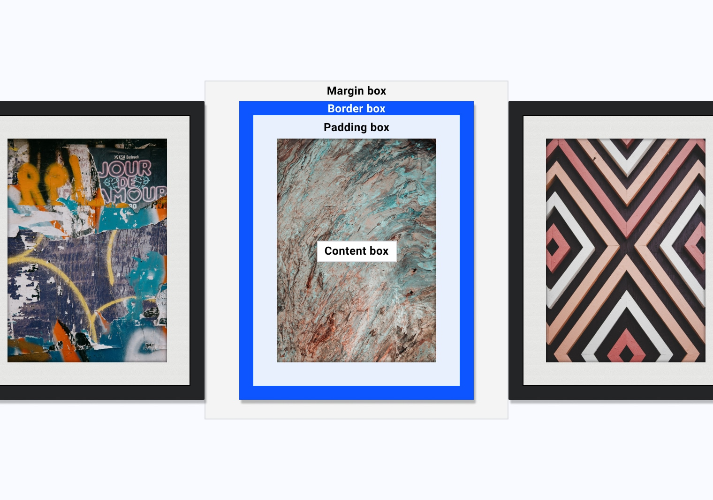

# 盒子模型 

假设您有这样一段 HTML：

```html
<p>I am a paragraph of text that has a few words in it.</p>
```

然后为其编写此 CSS：

```css
p {  
    width: 100px; 
    height: 50px;  
    padding: 20px; 
    border: 1px solid;
}
```

内容最终的宽度为 142 像素，而不是您指定的 100 像素，并且会脱离您的元素。这是为什么？

Box 模型是 CSS 的核心基础。了解框模型的工作原理、CSS 的其他方面对它的影响，重要的是了解如何控制该模型，有助于您编写更具预测性的 CSS。

  <iframe allow="camera; clipboard-read; clipboard-write; encrypted-media; geolocation; microphone; midi;" loading="lazy" src="https://codepen.io/web-dot-dev/embed/WNRemxN?height=300&amp;theme-id=light&amp;default-tab=result&amp;editable=true" data-darkreader-inline-border-top="" data-darkreader-inline-border-right="" data-darkreader-inline-border-bottom="" data-darkreader-inline-border-left="" data-title="由 web-dot-dev 在 Codepen 上撰写 WNRemxN" style="color-scheme: initial; box-sizing: inherit; border: 0px; height: 300px; width: 100%; --darkreader-inline-border-top: 0px; --darkreader-inline-border-right: 0px; --darkreader-inline-border-bottom: 0px; --darkreader-inline-border-left: 0px;"></iframe>

了解 CSS 的框模型将帮助您找出内容无法容纳在元素内的原因。

请务必注意，CSS 显示的所有内容都是框，即使只是一些文本或具有使其看起来像圆形的 `border-radius`。

## 内容和大小

框根据其 `display` 值、设置的尺寸及其包含的内容具有不同的行为。这些内容可以是纯文本，也可以是由子元素生成的更多框。无论选择哪种方式，默认情况下，内容都会影响框的大小。

您可以使用**外部尺寸调整**来控制它，也可以使用**固有尺寸**让浏览器根据内容大小来为您决定。

下面的基本演示说明了它之间的区别：

<iframe allow="camera; clipboard-read; clipboard-write; encrypted-media; geolocation; microphone; midi;" loading="lazy" src="https://codepen.io/web-dot-dev/embed/abpoMBL?height=500&amp;theme-id=light&amp;default-tab=result&amp;editable=true" data-darkreader-inline-border-top="" data-darkreader-inline-border-right="" data-darkreader-inline-border-bottom="" data-darkreader-inline-border-left="" data-title="Codepen 上的 web-dot-dev 的 Pen abpoMBL" style="color-scheme: initial; box-sizing: inherit; border: 0px; height: 500px; width: 100%; --darkreader-inline-border-top: 0px; --darkreader-inline-border-right: 0px; --darkreader-inline-border-bottom: 0px; --darkreader-inline-border-left: 0px;"></iframe>

  如果包装盒有外侧尺寸，在超出开箱即用前，您可以添加的内容数量是有限制的。 这使得“很棒”这个词溢出来。

  该演示在尺寸固定且带有粗边框的框中显示“CSS 太棒了”字样。由于框具有指定宽度，因此其大小可采用外部设置。这意味着，它可控制其子内容的尺寸。不过，“awesome”一词对于框来说过大，因此会溢出到父框的**边框框**之外（稍后会对此进行详细介绍）。防止出现此溢出的一种方法是，通过不设置宽度或在本例中将 `width` 设置为 `min-content`，让框本身可以调整大小。`min-content` 关键字指示框的宽度仅与其内容的最小固有宽度相同（即“awesome”一词）。这可以让框与文本完美契合。

  下面是一个更复杂的示例，显示了不同尺寸对真实内容的影响：

  <iframe allow="camera; clipboard-read; clipboard-write; encrypted-media; geolocation; microphone; midi;" loading="lazy" src="https://codepen.io/web-dot-dev/embed/wvgwOJV?height=650&amp;theme-id=light&amp;default-tab=result&amp;editable=true" data-darkreader-inline-border-top="" data-darkreader-inline-border-right="" data-darkreader-inline-border-bottom="" data-darkreader-inline-border-left="" data-title="Codepen 上的 web-dot-dev 的 Pen wvgwOJV" style="color-scheme: initial; box-sizing: inherit; border: 0px; height: 650px; width: 100%; --darkreader-inline-border-top: 0px; --darkreader-inline-border-right: 0px; --darkreader-inline-border-bottom: 0px; --darkreader-inline-border-left: 0px;"></iframe>

通过外向尺寸，您可以控制元素的尺寸。固有大小可防止文本溢出。

开启和关闭固有尺寸，看看外侧尺寸如何为您提供更多控制，而外在尺寸和固有尺寸可赋予内容更多控制力。如要查看效果，请在卡片中添加几句文字。 如果此元素具有外部尺寸，则在溢出之前可以添加的内容数量存在限制，但当固有尺寸处于开启状态时，不会出现这种情况。

默认情况下，此元素都有一个 `width` 和 `height` 集，每个值均为 `400px`。这些尺寸对元素内的所有内容设定了严格的边界，除非内容过大，无法容纳方框。您可以通过将花朵图片下方的图片说明更改为超过该框高度的内容，来看看它的实际效果。

关键术语：如果内容太大，无法放入盒子，就会发生溢出。您可以使用 `overflow` 属性管理元素处理溢出内容的方式。

切换为固定尺寸后，浏览器会根据框的内容大小为您做出决定。这会使溢出的可能性大大降低，因为框会根据其内容调整大小。

请务必注意，固有大小是浏览器的默认行为，通常比外部大小提供更大的灵活性。

## 盒子模型的面积

方框由不同的方框模型区域组成，这些区域都执行特定工作。


框模型的四个主要区域：内容框、内边距框、边框和外边距框。

**内容框**是内容所在的区域。内容可以控制其父级的大小，因此这通常是大小变化最大的区域。

内容框周围的**内边距框**是由 [`padding`](https://developer.mozilla.org/docs/Web/CSS/padding) 属性创建的空间。由于内边距在框内，因此框的背景在其创建的空间中可见。 如果该框设置了溢出规则（例如 `overflow: auto` 或 `overflow: scroll`），滚动条也会占用此空间。

<iframe allow="camera; clipboard-read; clipboard-write; encrypted-media; geolocation; microphone; midi;" loading="lazy" src="https://codepen.io/web-dot-dev/embed/BaReoEV?height=500&amp;theme-id=light&amp;default-tab=result&amp;editable=true" data-darkreader-inline-border-top="" data-darkreader-inline-border-right="" data-darkreader-inline-border-bottom="" data-darkreader-inline-border-left="" data-title="Codepen 上的 web-dot-dev 的 Pen BaReoEV" style="color-scheme: initial; box-sizing: inherit; border: 0px; height: 500px; width: 100%; --darkreader-inline-border-top: 0px; --darkreader-inline-border-right: 0px; --darkreader-inline-border-bottom: 0px; --darkreader-inline-border-left: 0px;"></iframe>

  滚动条位于内边距框中。

  **边框框**环绕在内边距框周围，其空间由 [`border`](https://developer.mozilla.org/docs/Web/CSS/border) 值定义，而该值会为元素创建视觉框架。元素的**边框边缘**是您能看到的范围。

  最后一个区域，即外边距框，它是框周围的空间，由框的 `margin` 规则定义。[`outline`](https://developer.mozilla.org/docs/Web/CSS/outline) 和 [`box-shadow`](https://developer.mozilla.org/docs/Web/CSS/box-shadow) 等属性也会占用此空间，因为它们绘制在元素之上，不会影响框的大小。更改框的 `outline-width`（即 `200px`）不会改变边框边缘内的任何内容。

  <iframe allow="camera; clipboard-read; clipboard-write; encrypted-media; geolocation; microphone; midi;" loading="lazy" src="https://codepen.io/web-dot-dev/embed/XWprGea?height=500&amp;theme-id=light&amp;default-tab=result&amp;editable=true" data-darkreader-inline-border-top="" data-darkreader-inline-border-right="" data-darkreader-inline-border-bottom="" data-darkreader-inline-border-left="" data-title="由 web-dot-dev 在 Codepen 上发布的 Pen XWprGea" style="color-scheme: initial; box-sizing: inherit; border: 0px; height: 500px; width: 100%; --darkreader-inline-border-top: 0px; --darkreader-inline-border-right: 0px; --darkreader-inline-border-bottom: 0px; --darkreader-inline-border-left: 0px;"></iframe>

较宽的轮廓不会影响元素其余部分的大小。

## 一个实用的类比

  框模型理解起来比较复杂，因此我们把到目前为止您所了解的内容打个比方。

  使用实物相框绘制的盒子模型。

  在此图中，您在墙上连续安装三个相框。加框图片的元素与框模型相对应，如下所示：

  - 内容框就是艺术作品。
  - 内边距框是白色安装板，位于框架和艺术作品之间。
  - 边框是用来为艺术作品提供文字边框的框架。
  - 外边距框是指帧之间的间距。
  - 阴影占用的空间与外边距框相同。

## 调试框模型

  浏览器开发者工具直观地呈现了选定框模型计算的结果，可帮助您了解框模型的工作原理及其对您正在访问的网站的影响。

  请在您自己的浏览器中尝试此操作：

  1. [打开开发者工具](https://developer.chrome.com/docs/devtools/open)。
  2. [选择一个元素](https://developer.chrome.com/docs/devtools/css/reference#select)。
  3. 显示方框模型调试程序。

  <video controls="" style="box-sizing: inherit; border: 0px; height: auto; max-width: 100%; border-radius: var(--devsite-video-border-radius); display: block; margin-left: auto; margin-right: auto;"></video>
  用于大纲演示的盒子模型调试程序。

  ## 控制框模型

  如需了解如何控制框模型，您首先需要了解浏览器中的情况。

  每个浏览器都会将用户代理样式表应用于 HTML 文档，以定义元素在未指定 CSS 时的外观和行为。用户代理样式表中的 CSS 因浏览器而异，但它们提供了合理的默认值，让内容更易于阅读。

  用户代理样式表有一个属性，用于设置框的默认 `display`。例如，在普通流中，`` 元素的默认 `display` 值为 `block`，`` 的默认 `display` 值为 `list-item`，`` 的默认 `display` 值为 `inline`。

  `inline` 元素具有块外边距，但其他元素不遵循该外边距。使用 `inline-block` 时，其他元素会遵循块外边距，但第一个元素保留的大部分行为与其作为 `inline` 元素的行为相同。默认情况下，`block` 项会填充可用的**内嵌空间**，而 `inline` 和 `inline-block` 元素则与其内容大小相同。

  用户代理样式表还设置了 `box-sizing`，以告知框如何计算其框大小。默认情况下，所有元素都具有以下用户代理样式：`box-sizing: content-box;`。这意味着，如果您设置了 `width` 和 `height` 等维度，这些维度会应用到**内容框**。如果您然后设置了 `padding` 和 `border`，这些值就会添加到内容框的大小中。

## 资源

- [框模型简介](https://developer.mozilla.org/docs/Web/CSS/CSS_Box_Model/Introduction_to_the_CSS_box_model)
- [什么是浏览器开发者工具？](https://developer.mozilla.org/docs/Learn/Common_questions/What_are_browser_developer_tools)

### 用户代理样式表

- [Chromium](https://chromium.googlesource.com/chromium/blink/+/master/Source/core/css/html.css)
- [Firefox](https://searchfox.org/mozilla-central/source/layout/style/res/html.css)
- [Webkit](https://trac.webkit.org/browser/trunk/Source/WebCore/css/html.css)


