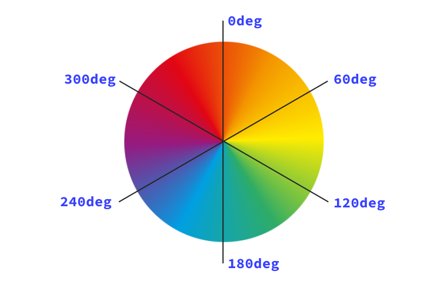

# 颜色 


颜色是任何网站的重要组成部分，在 CSS 中有多种颜色类型、功能和处理方式选项。

如何确定要使用哪种颜色类型？ 如何使颜色变为半透明？ 在本课程中，您将了解您可以通过哪些选项为项目和团队做出正确的决策。

CSS 具有[各种不同的数据类型](https://developer.mozilla.org/docs/Web/CSS/CSS_Types)，例如字符串和数字。 颜色是其中一种类型，它使用其他类型（例如，数字作为自己的定义）。

## 数字颜色

您在 CSS 中首次看到颜色时，很可能是通过数字颜色进行的。我们可以以几种不同形式处理数字颜色值。

### 十六进制颜色

```css
h1 {  
    color: #b71540;
}
```

十六进制记数法（通常简称为十六进制）是 RGB 的简写语法，它将数值分配给红色、绿色和蓝色（三原色）。

**注意** ：根据《网络年鉴》，[十六进制颜色码是最常用的颜色语法类型](https://almanac.httparchive.org/en/2019/css#color-types)。

十六进制范围是 **0-9** 和 **A-F**。 在六位数序列中使用时，它们会转换为 0-255 的 RGB 数值范围，分别对应于红色、绿色和蓝色通道。

<iframe allow="camera; clipboard-read; clipboard-write; encrypted-media; geolocation; microphone; midi;" loading="lazy" src="https://codepen.io/web-dot-dev/embed/BapNrPG?height=430&amp;theme-id=light&amp;default-tab=result&amp;editable=true" data-darkreader-inline-border-top="" data-darkreader-inline-border-right="" data-darkreader-inline-border-bottom="" data-darkreader-inline-border-left="" data-title="由 web-dot-dev 在 Codepen 上开发的 Pen BapNrPG" style="color-scheme: initial; box-sizing: inherit; border: 0px; height: 430px; width: 100%; --darkreader-inline-border-top: 0px; --darkreader-inline-border-right: 0px; --darkreader-inline-border-bottom: 0px; --darkreader-inline-border-left: 0px;"></iframe>

您还可以使用任何数字颜色定义 Alpha 值。Alpha 值是透明度的百分比。 在十六进制代码中，您要在 6 位数序列的基础上再加两位数，形成一个 8 位数序列。例如，如需在十六进制代码中设置黑色，请编写 `#000000`。 如需添加 50% 的透明度，请将其更改为 `#00000080`。

由于十六进制刻度为 **0-9** 和 **A-F**，因此透明度值可能与您的预期不太一样。 以下是添加到黑色十六进制代码 `#000000` 中的一些重要的常用值：

- 0%（完全透明）为 **00**：`#00000000`
- 50% alpha 为 **80**：`#00000080`
- 75% alpha 为 **BF**：`#000000BF`

<iframe allow="camera; clipboard-read; clipboard-write; encrypted-media; geolocation; microphone; midi;" loading="lazy" src="https://codepen.io/web-dot-dev/embed/VwPLXdr?height=540&amp;theme-id=light&amp;default-tab=result&amp;editable=true" data-darkreader-inline-border-top="" data-darkreader-inline-border-right="" data-darkreader-inline-border-bottom="" data-darkreader-inline-border-left="" data-title="由 web-dot-dev 在 Codepen 上开发的 Pen VwPLXdr" style="color-scheme: initial; box-sizing: inherit; border: 0px; height: 540px; width: 100%; --darkreader-inline-border-top: 0px; --darkreader-inline-border-right: 0px; --darkreader-inline-border-bottom: 0px; --darkreader-inline-border-left: 0px;"></iframe>

如需将一个两位数的十六进制值转换为十进制数，需要将第一个数位乘以 16（因为十六进制数是以 16 为底数的），然后加上第二个数位。以 **BF** 为例，说明此值为 75% 的 Alpha 值：

1. B 等于 11，乘以 16 等于 176
2. F 等于 15
3. 176 + 15 = 191
4. Alpha 值为 255 的 191—75%

**注意** ：您还可以使用三位数简写形式写出十六进制代码。三位数十六进制代码是等效的六位数序列的快捷方式。例如，`#a4e` 等同于 `#aa44ee`。若要添加 alpha，`#a4e8` 应扩展为 `#aa44ee88`。

### RGB（红、绿、蓝）

```css
h1 {  
    color: rgb(183, 21, 64);
}
```

RGB 颜色是通过 [`rgb()`](https://developer.mozilla.org/docs/Web/CSS/color_value/rgb) 颜色函数定义的，使用数字或百分比作为参数。数字必须在 **0-255** 的范围内，百分比必须介于 **0% 到 100%** 之间。 RGB 的缩放范围为 0-255，因此 255 相当于 100%，0 到 0%。

如需在 RGB 中设置黑色，请将其设置为 `rgb(0 0 0)`，即零红色、零绿色和零蓝色。黑色也可以定义为 `rgb(0%, 0%, 0%)`。白色是完全相反的字母：`rgb(255, 255, 255)` 或 `rgb(100%, 100%, 100%)`。

您可以通过以下两种方式之一在 `rgb()` 中设置 Alpha 版。在红色、绿色和蓝色参数后面添加一个 `/`，或使用 `rgba()` 函数。alpha 值可以指定为百分比或介于 0 到 1 之间的小数。例如，如需在现代浏览器中设置 50% alpha 黑色，请写入：`rgb(0 0 0 / 50%)` 或 `rgb(0 0 0 / 0.5)`。 如需获得更广泛的支持，请使用 `rgba()` 函数，写入 `rgba(0, 0, 0, 50%)` 或 `rgba(0, 0, 0, 0.5)`。

<iframe allow="camera; clipboard-read; clipboard-write; encrypted-media; geolocation; microphone; midi;" loading="lazy" src="https://codepen.io/web-dot-dev/embed/dyNomWW?height=430&amp;theme-id=light&amp;default-tab=result&amp;editable=true" data-darkreader-inline-border-top="" data-darkreader-inline-border-right="" data-darkreader-inline-border-bottom="" data-darkreader-inline-border-left="" data-title="来自 Codepen 上的 web-dot-dev 的 Pen dyNomWW" style="color-scheme: initial; box-sizing: inherit; border: 0px; height: 430px; width: 100%; --darkreader-inline-border-top: 0px; --darkreader-inline-border-right: 0px; --darkreader-inline-border-bottom: 0px; --darkreader-inline-border-left: 0px;"></iframe>

**注意** ：我们从 `rgb()` 和 `hsl()` 表示法中移除了英文逗号，因为较新的颜色函数（例如 `lab()` 和 `lch()`）使用空格（而非英文逗号）作为分隔符。此更改不仅可以让较新的颜色函数更加一致，还可以提高 CSS 的一致性。为了提高向后兼容性，您仍然可以使用英文逗号来定义 `rgb()` 和 `hsl()`。

### HSL（色调、饱和度、亮度）

```css
h1 { 
    color: hsl(344, 79%, 40%);
}
```

HSL 代表色相、饱和度和亮度。 色调用于描述色轮上的值，范围为 0 度到 360 度，从红色开始（表示 0 和 360 度）。 色调 180（即 50%）位于蓝色范围内。这是我们所见颜色的来源。



饱和度是指所选色相的鲜艳程度。 饱和度完全较低的颜色（饱和度为 `0%`）将显示为灰度。最后，亮度是参数，用于描述增加光的从白变黑的比例。亮度为 `100%` 将始终为您提供白色。

使用 `hsl()`颜色函数，您可以通过写入 `hsl(0 0% 0%)`，甚至是 `hsl(0deg 0% 0%)` 来定义纯黑色。这是因为 hue 参数定义了色轮上的度数（如果您使用数字类型，则值为 **0-360**）。您也可以使用角度类型，即 (`0deg`) 或 `(0turn)`。饱和度和亮度均通过百分比定义。


**注意** ：CSS 中的非常适合定义色调，因为它可以很好地表示色轮的角度。 角度、转弯、弧度和刻度。

<iframe allow="camera; clipboard-read; clipboard-write; encrypted-media; geolocation; microphone; midi;" loading="lazy" src="https://codepen.io/web-dot-dev/embed/poRJLQo?height=430&amp;theme-id=light&amp;default-tab=result&amp;editable=true" data-darkreader-inline-border-top="" data-darkreader-inline-border-right="" data-darkreader-inline-border-bottom="" data-darkreader-inline-border-left="" data-title="来自 Codepen 上的 web-dot-dev 的 Pen poRJLQo" style="color-scheme: initial; box-sizing: inherit; border: 0px; height: 430px; width: 100%; --darkreader-inline-border-top: 0px; --darkreader-inline-border-right: 0px; --darkreader-inline-border-bottom: 0px; --darkreader-inline-border-left: 0px;"></iframe>

Alpha 是在 `hsl()` 中定义的，方式与 `rgb()` 相同，即在色相、饱和度和亮度参数后面添加 `/`，或者使用 `hsla()`函数。alpha 值可以指定为百分比或介于 0 到 1 之间的小数。例如，如需将 Alpha 值设为 50%，请使用 `hsl(0 0% 0% / 50%)` 或 `hsl(0 0% 0% / 0.5)`。使用 `hsla()` 函数写入 `hsla(0, 0%, 0%, 50%)` 或 `hsla(0, 0%, 0%, 0.5)`。

**注意** ：CSS 中引入了一些较新的颜色类型。其中包括 [lab()](https://developer.mozilla.org/docs/Web/CSS/color_value/lab()) 和 [lch()](https://developer.mozilla.org/docs/Web/CSS/color_value/lch())，它们允许指定比 RGB 更广的颜色范围。

## 颜色关键字

[CSS 中有 148 种已命名的颜色](https://developer.mozilla.org/docs/Web/CSS/color_value#color_keywords)。这些是普通的英文名称，例如 purple、tomato 和 goldenrod。 根据[网页年鉴](https://almanac.httparchive.org/en/2019/css)，一些最常用的名称为黑色、白色、红色、蓝色和灰色。我们最喜爱的包括 goldenrod、aliceblue 和 Hotpink。

<iframe allow="camera; clipboard-read; clipboard-write; encrypted-media; geolocation; microphone; midi;" loading="lazy" src="https://codepen.io/web-dot-dev/embed/ZELGraM?height=500&amp;theme-id=light&amp;default-tab=result&amp;editable=true" data-darkreader-inline-border-top="" data-darkreader-inline-border-right="" data-darkreader-inline-border-bottom="" data-darkreader-inline-border-left="" data-title="Codepen 上 web-dot-dev 的 Pen ZELGraM" style="color-scheme: initial; box-sizing: inherit; border: 0px; height: 500px; width: 100%; --darkreader-inline-border-top: 0px; --darkreader-inline-border-right: 0px; --darkreader-inline-border-bottom: 0px; --darkreader-inline-border-left: 0px;"></iframe>

除了标准颜色之外，您还可以使用特殊关键字：

- `transparent` 是一种完全透明的颜色。 它也是 `background-color` 的初始值。
- `currentColor` 是 `color` 属性的上下文计算的动态值。如果文本颜色为 `red`，然后将 `border-color` 设置为 `currentColor`，它也会变为红色。如果您定义 `currentColor` 的元素没有为 `color` 定义值，系统将改为通过级联计算 `currentColor`

**注意** ：系统关键字是由您的操作系统主题定义的颜色。这些颜色的一些示例包括 `Background`（桌面背景颜色）或 `Highlight`（所选内容的突出显示颜色）。这只是[众多选项](https://www.w3.org/wiki/CSS/Properties/color/keywords#System_Colors)中的两个。所有颜色关键字都不区分大小写，但是您经常会看到带有大写的系统颜色，以将其与标准颜色关键字区分开来。

## 在 CSS 规则中的什么位置使用颜色

如果 CSS 属性接受 [``](https://developer.mozilla.org/docs/Web/CSS/color_value) 数据类型作为值，它将接受上述任何表示颜色的方法。如需设置文本样式，请使用 `color`、`text-shadow` 和 `text-decoration-color` 属性，这些属性都接受颜色作为值或颜色作为值的一部分。

对于背景，您可以将颜色设置为 `background` 或 `background-color` 的值。颜色也可以在渐变中使用，例如 `linear-gradient`。渐变是一种可在 CSS 中以编程方式定义的图片。渐变接受两种或更多种颜色格式的任意组合，例如十六进制、RGB 或 hsl。

**注意：** 关于渐变需要学习很多内容，因此我们编写了关于如何使用渐变的[一课](/web/css/gradients)。

最后，`border-color` 和 `outline-color` 用于设置框上的边框和轮廓的颜色。`box-shadow` 属性也接受 color 作为值之一。

<iframe allow="camera; clipboard-read; clipboard-write; encrypted-media; geolocation; microphone; midi;" loading="lazy" src="https://codepen.io/web-dot-dev/embed/bGgdJKd?height=500&amp;theme-id=light&amp;default-tab=result&amp;editable=true" data-darkreader-inline-border-top="" data-darkreader-inline-border-right="" data-darkreader-inline-border-bottom="" data-darkreader-inline-border-left="" data-title="由 web-dot-dev 在 Codepen 上开发的 Pen bGgdJKd" style="color-scheme: initial; box-sizing: inherit; border: 0px; height: 500px; width: 100%; --darkreader-inline-border-top: 0px; --darkreader-inline-border-right: 0px; --darkreader-inline-border-bottom: 0px; --darkreader-inline-border-left: 0px;"></iframe>

## 资源

- [一个方便演示，展示如何在 HSL 中使用角度](https://codepen.io/argyleink/pen/ExjReJa)
- [关于颜色的综合指南](https://css-tricks.com/nerds-guide-color-web/)
- [关于广色域色彩的综合指南](https://developer.chrome.com/articles/high-definition-css-color-guide)
- [[视频\] 有关如何读取十六进制代码的说明](https://www.youtube.com/watch?v=eqZqx6lRPe0&hl=zh-cn)
- [十六进制代码的工作原理](https://medium.com/basecs/hexs-and-other-magical-numbers-9785bc26b7ee)