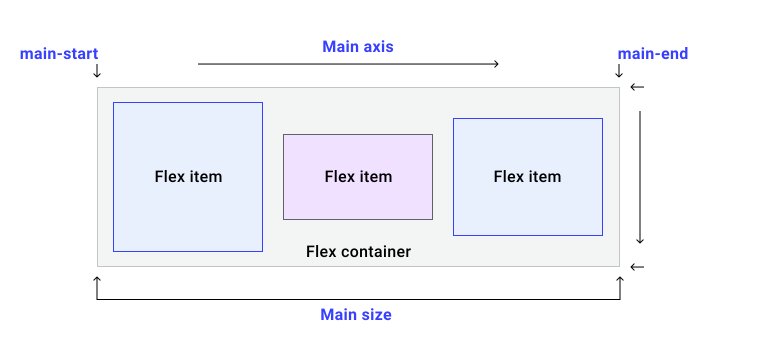

# Flexbox 


在自适应设计中，一种可能难以处理的设计模式是内嵌某些内容的边栏。在有视口空间时，这种模式效果很好，但如果空间是压缩的，这种僵化的布局可能会出现问题。

<iframe allow="camera; clipboard-read; clipboard-write; encrypted-media; geolocation; microphone; midi;" loading="lazy" src="https://codepen.io/web-dot-dev/embed/poRENWv?height=420&amp;theme-id=light&amp;default-tab=result&amp;editable=true" data-darkreader-inline-border-top="" data-darkreader-inline-border-right="" data-darkreader-inline-border-bottom="" data-darkreader-inline-border-left="" data-title="来自 Codepen 上的 web-dot-dev 的 Pen poRENWv" style="color-scheme: initial; box-sizing: inherit; border: 0px; height: 420px; width: 100%; --darkreader-inline-border-top: 0px; --darkreader-inline-border-right: 0px; --darkreader-inline-border-bottom: 0px; --darkreader-inline-border-left: 0px;"></iframe>

弹性框布局模型 (Flexbox) 是专为一维内容设计的布局模型。 它擅长处理大量不同大小的项，并返回这些项的最佳布局。

这是这种边栏模式的理想布局模型。Flexbox 不仅有助于内嵌式排列边栏和内容，而且在空间不足时，边栏会另起一行。借助 Flexbox，您可以提供灵活的边界来提示内容的显示方式，而不是为浏览器设置严格的尺寸。

<iframe allow="camera; clipboard-read; clipboard-write; encrypted-media; geolocation; microphone; midi;" loading="lazy" src="https://codepen.io/web-dot-dev/embed/xxgERMp?height=400&amp;theme-id=light&amp;default-tab=result&amp;editable=true" data-darkreader-inline-border-top="" data-darkreader-inline-border-right="" data-darkreader-inline-border-bottom="" data-darkreader-inline-border-left="" data-title="来自 Codepen 上的 web-dot-dev 的 Pen xxgERMp" style="color-scheme: initial; box-sizing: inherit; border: 0px; height: 400px; width: 100%; --darkreader-inline-border-top: 0px; --darkreader-inline-border-right: 0px; --darkreader-inline-border-bottom: 0px; --darkreader-inline-border-left: 0px;"></iframe>

## 您可以使用 Flex 布局执行哪些操作？

Flex 布局具有以下功能，您可以在本指南中了解这些功能。

- 表格可以显示为行或列。
- 并遵循文档的写入模式。
- 默认情况下，它们是单行，但也可以要求换行。
- 可以在视觉上对布局中的各个项进行重新排序，使其脱离它们在 DOM 中的顺序。
- 空间可以在项内分布，因此它们会根据父级中的可用空间变大或变小。
- 您可以使用 Box Alignment 属性在封装布局中的项和 Flex 线条周围分配空间。
- 项目本身可以在横轴上对齐。

## 主轴和交叉轴

理解 Flexbox 的关键是理解主轴和交叉轴的概念。主轴是您的 `flex-direction` 属性设置的轴。如果值为 `row`，则主轴沿行，如果为 `column`，则主轴沿列。


弹性项目会在主轴上成组移动。 请记住：我们有很多功能，我们会尽力为他们群组提供最佳布局。

交叉轴沿与主轴的相反方向运行，因此如果 `flex-direction` 为 `row`，交叉轴沿列延伸。


您可以在交叉轴上完成两项操作。 您可以单独移动这些项目，也可以组移动项目，这样它们就能彼此对齐，并与灵活容器对齐。此外，如果您已换行 Flex 行，则可以将这些行视为组，以控制向这些行分配空间的方式。您可以在本指南中了解实际操作方式，只需注意主轴跟随 `flex-direction` 即可。

## 创建灵活容器

我们来看看 Flexbox 的行为方式：提取一组大小不同的项并使用 Flexbox 进行布局。

```html
<div class="container" id="container">  
    <div>One</div> 
    <div>Item two</div> 
    <div>The item we will refer to as three</div>
</div>
```

如需使用 Flexbox，您需要声明要使用 flex 格式上下文，而不是常规块和内嵌布局。 为此，请将 `display` 属性的值更改为 `flex`。

```css
.container {  
    display: flex;
}
```

正如您在[布局指南](/web/css/layout)中学到的，这会为您提供一个包含 Flex 子项的块级框。Flex 项目会使用其**初始值**立即开始展示一些 Flexbox 行为。

**注意** ：所有 CSS 属性都具有初始值，用于控制在您未应用任何 CSS 来改变初始行为时，这些属性“开箱即用”的行为方式。一旦 Flex 容器的父项获得 `display: flex`，其子项就会立即变成 Flex 项，因此这些初始值意味着我们将开始看到一些 Flexbox 行为。

初始值意味着：

- 各项会显示为一行。
- 它们不会封装。
- 它们不会扩展为填满容器。
- 它们会在容器的开头对齐。

## 控制项的方向

即使您尚未添加 `flex-direction` 属性，这些项仍显示为行，因为 `flex-direction` 的初始值为 `row`。如果需要一行，则无需添加属性。 要更改方向，请添加 属性和以下四个值之一：

- `row`：各项内容以行的形式排列。
- `row-reverse:`，这些项从 Flex 容器末尾排列成一行。
- `column`：各项内容以列的形式排列。
- `column-reverse`：这些项从弹性容器末端的一列开始排列。

在下面的演示中，您可以使用我们这组商品试用所有值。

<iframe allow="camera; clipboard-read; clipboard-write; encrypted-media; geolocation; microphone; midi;" loading="lazy" src="https://codepen.io/web-dot-dev/embed/bGgKNXq?height=500&amp;theme-id=light&amp;default-tab=result&amp;editable=true" data-darkreader-inline-border-top="" data-darkreader-inline-border-right="" data-darkreader-inline-border-bottom="" data-darkreader-inline-border-left="" data-title="由 web-dot-dev 在 Codepen 上撰写的 Pen bGgKNXq" style="color-scheme: initial; box-sizing: inherit; border: 0px; height: 500px; width: 100%; --darkreader-inline-border-top: 0px; --darkreader-inline-border-right: 0px; --darkreader-inline-border-bottom: 0px; --darkreader-inline-border-left: 0px;"></iframe>

### 反转项目和无障碍功能

使用任何会重新排列视觉显示内容的属性，使之与 HTML 文档中内容的排序方式不同时，请务必保持谨慎，因为这可能会对无障碍功能产生负面影响。`row-reverse` 和 `column-reverse` 值就是一个很好的例子。重新排序只会针对视觉顺序进行，而不会针对逻辑顺序进行。了解这一点非常重要，因为逻辑顺序是屏幕阅读器读出内容的顺序，并且任何使用键盘浏览的用户都会遵循。

任何能够更改 Flexbox 或网格中项顺序的操作都可能会导致此问题。 因此，在进行任何重新排序时，都应进行全面测试，以确保您的网站不会导致某些人难以使用。

如需了解详情，请参阅以下内容：

- [Flexbox 与键盘导航断开连接](https://tink.uk/flexbox-the-keyboard-navigation-disconnect/)

### 写入模式和方向

默认情况下，Flex 项目显示为一行。一行会按照您书写模式和脚本方向的句子流动方向运行。 这意味着，如果您使用的是具有从右到左 (rtl) 脚本方向的阿拉伯语，这些项将在右侧对齐。制表符顺序也从右侧开始，因为这是阿拉伯语句子的阅读方式。

<iframe allow="camera; clipboard-read; clipboard-write; encrypted-media; geolocation; microphone; midi;" loading="lazy" src="https://codepen.io/web-dot-dev/embed/ExZgwWN?height=500&amp;theme-id=light&amp;default-tab=result&amp;editable=true" data-darkreader-inline-border-top="" data-darkreader-inline-border-right="" data-darkreader-inline-border-bottom="" data-darkreader-inline-border-left="" data-title="Codepen 上的 web-dot-dev 提供的 Pen ExZgwWN" style="color-scheme: initial; box-sizing: inherit; border: 0px; height: 500px; width: 100%; --darkreader-inline-border-top: 0px; --darkreader-inline-border-right: 0px; --darkreader-inline-border-bottom: 0px; --darkreader-inline-border-left: 0px;"></iframe>

如果您使用的是垂直书写模式（例如某些日语字体），则一行会从上到下垂直排列。尝试更改此演示中使用垂直书写模式的 `flex-direction`。

<iframe allow="camera; clipboard-read; clipboard-write; encrypted-media; geolocation; microphone; midi;" loading="lazy" src="https://codepen.io/web-dot-dev/embed/qBRaPXX?height=600&amp;theme-id=light&amp;default-tab=result&amp;editable=true" data-darkreader-inline-border-top="" data-darkreader-inline-border-right="" data-darkreader-inline-border-bottom="" data-darkreader-inline-border-left="" data-title="Pen qBRaPXX 由 web-dot-dev 在 Codepen" style="color-scheme: initial; box-sizing: inherit; border: 0px; height: 600px; width: 100%; --darkreader-inline-border-top: 0px; --darkreader-inline-border-right: 0px; --darkreader-inline-border-bottom: 0px; --darkreader-inline-border-left: 0px;"></iframe>

因此，默认情况下 Flex 项的行为方式与文档的写入模式相关联。大多数教程使用英语或其他水平（从左到右）书写模式编写。这样就可以轻松假设弹性项位于**左侧**，并且**水平**运行。

有了主轴和横轴以及要考虑书写模式后，我们讨论的 **start** 和 **end**（而不是 Flexbox 中的顶部、底部、左侧和右侧）可能更容易理解。每条轴都有一个起点和终点。主轴的起点称为“main-start”。因此，我们的 Flex 项目一开始从主线开始就排成一行。 该轴的末端是 main-end。交叉轴的起点为 **cross-start**，终点为 **cross-end**。



## 封装 Flex 项

`flex-wrap` 属性的初始值为 `nowrap`。这意味着，如果容器中空间不足，内容将会溢出。

一旦达到最小内容大小的弹性项目，就会开始溢出容器

使用初始值显示的项会尽可能缩小，在溢出发生之前会缩小到 `min-content`。

如需将项封装，请将 `flex-wrap: wrap` 添加到灵活容器中。

```css
.container { 
    display: flex; 
    flex-wrap: wrap;
}
```

<iframe allow="camera; clipboard-read; clipboard-write; encrypted-media; geolocation; microphone; midi;" loading="lazy" src="https://codepen.io/web-dot-dev/embed/WNRGdNZ?height=601&amp;theme-id=light&amp;default-tab=result&amp;editable=true" data-darkreader-inline-border-top="" data-darkreader-inline-border-right="" data-darkreader-inline-border-bottom="" data-darkreader-inline-border-left="" data-title="由 web-dot-dev 在 Codepen 上发布的 Pen WNRGdNZ" style="color-scheme: initial; box-sizing: inherit; border: 0px; height: 601px; width: 100%; --darkreader-inline-border-top: 0px; --darkreader-inline-border-right: 0px; --darkreader-inline-border-bottom: 0px; --darkreader-inline-border-left: 0px;"></iframe>

当弹性容器封装时，它会创建多个**弹性线条**。就空间分配而言，每一行就像一个新的灵活容器。 因此，如果您要换行，那么第 2 行中的内容将无法与第 1 行中其上方的内容对齐。这就是 Flexbox 是一维的。您可以控制单轴、行或列的对齐方式，但不能像在网格中那样同时控制两者的对齐方式。

### flex-flow 简写形式

您可以使用简写形式 `flex-flow` 设置 `flex-direction` 和 `flex-wrap` 属性。例如，如需将 `flex-direction` 设置为 `column` 并允许换行，请使用以下代码：

```css
.container { 
    display: flex; 
    flex-flow: column wrap;
}
```

## 控制 flex 内容内的空间

假设容器的空间大于显示项所需的空间，这些项会在开始时对齐，且不会增大以填满空间。它们会在达到内容大小上限时停止增长。 这是因为 `flex-` 属性的初始值为：

- `flex-grow: 0`：项不会变大。
- `flex-shrink: 1`：项可以缩小到小于其 [`flex-basis`](https://developer.mozilla.org/docs/Web/CSS/flex-basis)。
- `flex-basis: auto`：项的基本大小为 `auto`。

这可以用关键字值 `flex: initial` 表示。`flex` 简写属性或 `flex-grow`、`flex-shrink` 和 `flex-basis` 的长字会应用于灵活容器的子级。

<iframe allow="camera; clipboard-read; clipboard-write; encrypted-media; geolocation; microphone; midi;" loading="lazy" src="https://codepen.io/web-dot-dev/embed/LYxRebE?height=500&amp;theme-id=light&amp;default-tab=result&amp;editable=true" data-darkreader-inline-border-top="" data-darkreader-inline-border-right="" data-darkreader-inline-border-bottom="" data-darkreader-inline-border-left="" data-title="Codepen 上的 web-dot-dev 的 Pen LYxRebE" style="color-scheme: initial; box-sizing: inherit; border: 0px; height: 500px; width: 100%; --darkreader-inline-border-top: 0px; --darkreader-inline-border-right: 0px; --darkreader-inline-border-bottom: 0px; --darkreader-inline-border-left: 0px;"></iframe>

如需使内容项增大，同时允许大型项拥有比小型项更多的空间，请使用 `flex:auto`。您可以通过上面的演示尝试此操作。 这会将属性设置为：

- `flex-grow: 1`：项的大小可以超过其 `flex-basis`。
- `flex-shrink: 1`：内容可以缩小到小于其 `flex-basis` 的值。
- `flex-basis: auto`：项的基本大小为 `auto`。

使用 `flex: auto` 意味着列表项以不同的大小结束，因为列表项之间共享的空间会在将每项内容布局为最大内容大小之后共享。 因此，较大的项目将获得更多空间。 如需强制所有项具有一致的大小并忽略内容的大小，请在演示中将 `flex:auto` 更改为 `flex: 1`。

这会解压缩到：

- `flex-grow: 1`：项的大小可以超过其 `flex-basis`。
- `flex-shrink: 1`：内容可以缩小到小于其 `flex-basis` 的值。
- `flex-basis: 0`：项的基本大小为 `0`。

使用 `flex: 1` 表示所有项的大小均为零，因此灵活容器中的所有空间均可分配。由于所有项的 `flex-grow` 因数均为 `1`，因此它们平均增长，并且均分空间。

**注意** ：还有一个值 `flex: none`，这会为您提供不会放大或缩小的不够灵活的 Flex 内容。如果您单纯使用 Flexbox 访问对齐属性，但不需要任何灵活行为，这样做可能很有用。

### 允许商品以不同的速率增长

您不必将所有项的 `flex-grow` 系数都设为 `1`。您可以为 Flex 项指定不同的 `flex-grow` 系数。在下面的演示中，第一个项目具有 `flex: 1`、第二个 `flex: 2` 和第三个 `flex: 3`。当这些内容从 `0` 开始增长时，灵活容器中的可用空间会共享为 6。其中一部分分配给第一项，两部分分配给第二项，三部分分配给第三项。

<iframe allow="camera; clipboard-read; clipboard-write; encrypted-media; geolocation; microphone; midi;" loading="lazy" src="https://codepen.io/web-dot-dev/embed/OJWRzEz?height=500&amp;theme-id=light&amp;default-tab=result&amp;editable=true" data-darkreader-inline-border-top="" data-darkreader-inline-border-right="" data-darkreader-inline-border-bottom="" data-darkreader-inline-border-left="" data-title="Codepen 上的 web-dot-dev 的 Pen OJWRzEz" style="color-scheme: initial; box-sizing: inherit; border: 0px; height: 500px; width: 100%; --darkreader-inline-border-top: 0px; --darkreader-inline-border-right: 0px; --darkreader-inline-border-bottom: 0px; --darkreader-inline-border-left: 0px;"></iframe>

您可以通过 `auto` 的 `flex-basis` 执行相同的操作，但需要指定三个值。第一个值为 `flex-grow`、第二个 `flex-shrink` 和第三个 `flex-basis`。

```css
.item1 {  
    flex: 1 1 auto;
}
.item2 {  
    flex: 2 1 auto;
}
```

这是一个不太常见的用例，因为使用 `auto` 的 `flex-basis` 的原因是允许浏览器确定空间分配。如果您希望项的增长幅度略超过算法确定的值，但它可能很有用。

## 对 Flex 内容重新排序

您可以使用 `order` 属性对灵活容器中的项重新排序。此属性允许对**序数组**中的项进行排序。列表项会按照 `flex-direction` 指示的方向进行排列，值最低的排在最前面。如果多项内容具有相同的值，则该属性会与具有该值的其他项一起显示。

以下示例演示了这一排序。

<iframe allow="camera; clipboard-read; clipboard-write; encrypted-media; geolocation; microphone; midi;" loading="lazy" src="https://codepen.io/web-dot-dev/embed/NWdRXoL?height=500&amp;theme-id=light&amp;default-tab=result&amp;editable=true" data-darkreader-inline-border-top="" data-darkreader-inline-border-right="" data-darkreader-inline-border-bottom="" data-darkreader-inline-border-left="" data-title="由 web-dot-dev 在 Codepen 上开发的 Pen NWdRXoL" style="color-scheme: initial; box-sizing: inherit; border: 0px; height: 500px; width: 100%; --darkreader-inline-border-top: 0px; --darkreader-inline-border-right: 0px; --darkreader-inline-border-bottom: 0px; --darkreader-inline-border-left: 0px;"></iframe>

**警告** ：使用 `order` 时，会与 `flex-direction` 的 `row-reverse` 和 `column-reverse` 值出现相同的问题。对于某些用户而言，这会很容易造成不连贯的体验。请勿使用 `order`，因为您要修正文档中的部分混乱问题。如果这些项在逻辑上应该具有不同的顺序，请更改您的 HTML！

## Flexbox 对齐方式概述

Flexbox 附带了一组属性，用于对齐项以及在项之间分配空间。这些属性非常有用，因为这些属性已移至其自己的规范中，因此网格布局中也会出现这些属性。在此处，您可以了解使用 Flexbox 时它们是如何工作的。

该属性集可以分为两组。用于空间分布的属性以及用于对齐的属性。 分配空间的属性包括：

- `justify-content`：主轴上的空间分布情况。
- `align-content`：横轴上的空间分布情况。
- `place-content`：设置上述两个属性的简写形式。

Flexbox 中用于对齐的属性：

- `align-self`：在交叉轴上对齐单个项。
- `align-items`：将所有项作为一个组在交叉轴上对齐。

如果您处理的是主轴，则这些属性以 `justify-` 开头。在横轴上，它们以 `align-` 开头。

## 在主轴上分配空间

在之前使用的 HTML 中，Flex 项排成一行，主轴上有空间。 内容项不够大，无法完全填满 Flex 容器。 这些项在 Flex 容器的开头对齐，因为 `justify-content` 的初始值为 `flex-start`。这些项的开头将排成一行，结尾处还有多余的空格。

将 `justify-content` 属性添加到灵活容器，将其值设为 `flex-end`，这样，项就会排列在容器的末尾，而空闲空间则会排列在开头。

```css
.container { 
    display: flex; 
    justify-content: flex-end;
}
```

您还可以使用 `justify-content: space-between` 在列表项之间分配空间。

请尝试演示中的某些值，并[参阅 MDN](https://developer.mozilla.org/docs/Web/CSS/justify-content) 以了解全部可能值。

<iframe allow="camera; clipboard-read; clipboard-write; encrypted-media; geolocation; microphone; midi;" loading="lazy" src="https://codepen.io/web-dot-dev/embed/JjERpGb?height=500&amp;theme-id=light&amp;default-tab=result&amp;editable=true" data-darkreader-inline-border-top="" data-darkreader-inline-border-right="" data-darkreader-inline-border-bottom="" data-darkreader-inline-border-left="" data-title="由 web-dot-dev 在 Codepen 上开发的 Pen JjERpGb" style="color-scheme: initial; box-sizing: inherit; border: 0px; height: 500px; width: 100%; --darkreader-inline-border-top: 0px; --darkreader-inline-border-right: 0px; --darkreader-inline-border-bottom: 0px; --darkreader-inline-border-left: 0px;"></iframe>

**注意** ：为了让 `justify-content` 属性执行任何操作，您必须在主轴上的容器中留出足够的空间。如果您的项填充了轴，则表示没有空间可供共享，因此该属性将不执行任何操作。

### 活动门票提供商：`flex-direction: column`

如果您已将 `flex-direction` 更改为 `column`，则 `justify-content` 将对该列执行操作。要在以列的形式工作时在容器中有空闲空间，您需要为容器提供 `height` 或 `block-size`。否则，您将没有空闲空间来分发。

尝试使用不同的值，这次使用 Flexbox 列布局。

<iframe allow="camera; clipboard-read; clipboard-write; encrypted-media; geolocation; microphone; midi;" loading="lazy" src="https://codepen.io/web-dot-dev/embed/bGgwLgz?height=600&amp;theme-id=light&amp;default-tab=result&amp;editable=true" data-darkreader-inline-border-top="" data-darkreader-inline-border-right="" data-darkreader-inline-border-bottom="" data-darkreader-inline-border-left="" data-title="由 web-dot-dev 在 Codepen 上发布的 Pen bGgwLgz" style="color-scheme: initial; box-sizing: inherit; border: 0px; height: 600px; width: 100%; --darkreader-inline-border-top: 0px; --darkreader-inline-border-right: 0px; --darkreader-inline-border-bottom: 0px; --darkreader-inline-border-left: 0px;"></iframe>

## 在弹性线条之间分配空间

如果使用封装的弹性容器，则您可能有空间在横轴上分布。在这种情况下，您可以使用与 `justify-content` 相同的值 `align-content` 属性。与默认将项与 `flex-start` 对齐的 `justify-content` 不同，`align-content` 的初始值为 `stretch`。将属性 `align-content` 添加到灵活容器以更改该默认行为。

```css
.container { 
    align-content: center;
}
```

请在演示中试用此功能。 该示例包含 Flex 项的换行，并且容器具有 `block-size`，以便留出一些空闲空间。

<iframe allow="camera; clipboard-read; clipboard-write; encrypted-media; geolocation; microphone; midi;" loading="lazy" src="https://codepen.io/web-dot-dev/embed/poREawo?height=500&amp;theme-id=light&amp;default-tab=result&amp;editable=true" data-darkreader-inline-border-top="" data-darkreader-inline-border-right="" data-darkreader-inline-border-bottom="" data-darkreader-inline-border-left="" data-title="由 Codepen 上的 web-dot-dev 撰写的 Pen poREwake" style="color-scheme: initial; box-sizing: inherit; border: 0px; height: 500px; width: 100%; --darkreader-inline-border-top: 0px; --darkreader-inline-border-right: 0px; --darkreader-inline-border-bottom: 0px; --darkreader-inline-border-left: 0px;"></iframe>

### `place-content` 简写形式

如需同时设置 `justify-content` 和 `align-content`，您可以使用 `place-content` 并指定一个或两个值。如果您指定第一个值用于 `align-content`，第二个用于 `justify-content`，则这两个轴将使用同一值。

```css
.container { 
    place-content: space-between;  /* sets both to space-between */
}
.container {  
    place-content: center flex-end;  /* wrapped lines on the cross axis are centered,  on the main axis items are aligned to the end of the flex container */
}
```

## 在交叉轴上对齐项目

在横轴上，您还可以使用 `align-items` 和 `align-self` 在 Flex 线条中对齐项目。用于此对齐方式的空间取决于灵活容器的高度，或者灵活线条（如果项目是一组换行）的高度。

`align-self` 的初始值为 `stretch`，因此默认情况下，一行中的 Flex 项会拉伸至最高项的高度。若要更改此设置，请将 `align-self` 属性添加到您的任意 Flex 项中。

```css
.container { 
    display: flex;
}
.item1 {
    align-self: flex-start;
}
```

您可以使用以下任何值对齐项：

- `flex-start`
- `flex-end`
- `center`
- `stretch`
- `baseline`

请参阅 [MDN 上值的完整列表](https://developer.mozilla.org/docs/Web/CSS/align-self)。

下一个演示包含一行包含 `flex-direction: row` 的 Flex 内容。最后一项用于定义灵活容器的高度。 第一项具有 `align-self` 属性，其值为 `flex-start`。请尝试更改该属性的值，看看它在横轴空间中的移动情况。

<iframe allow="camera; clipboard-read; clipboard-write; encrypted-media; geolocation; microphone; midi;" loading="lazy" src="https://codepen.io/web-dot-dev/embed/RwKGQee?height=600&amp;theme-id=light&amp;default-tab=result&amp;editable=true" data-darkreader-inline-border-top="" data-darkreader-inline-border-right="" data-darkreader-inline-border-bottom="" data-darkreader-inline-border-left="" data-title="由 web-dot-dev 在 Codepen 上开发的 Pen RwKGQee" style="color-scheme: initial; box-sizing: inherit; border: 0px; height: 600px; width: 100%; --darkreader-inline-border-top: 0px; --darkreader-inline-border-right: 0px; --darkreader-inline-border-bottom: 0px; --darkreader-inline-border-left: 0px;"></iframe>

`align-self` 属性会应用于各个项。`align-items` 属性可应用于灵活容器，将所有单独的 `align-self` 属性设置为一个组。

```css
.container { 
    display: flex; 
    align-items: flex-start;
}
```

在下一个演示中，请尝试更改 `align-items` 的值，使交叉轴上的所有项成组对齐。

<iframe allow="camera; clipboard-read; clipboard-write; encrypted-media; geolocation; microphone; midi;" loading="lazy" src="https://codepen.io/web-dot-dev/embed/QWdKmby?height=600&amp;theme-id=light&amp;default-tab=result&amp;editable=true" data-darkreader-inline-border-top="" data-darkreader-inline-border-right="" data-darkreader-inline-border-bottom="" data-darkreader-inline-border-left="" data-title="由 web-dot-dev 在 Codepen 上开发的 Pen QWdKmby" style="color-scheme: initial; box-sizing: inherit; border: 0px; height: 600px; width: 100%; --darkreader-inline-border-top: 0px; --darkreader-inline-border-right: 0px; --darkreader-inline-border-bottom: 0px; --darkreader-inline-border-left: 0px;"></iframe>

## 为什么 Flexbox 中没有 justify-self？

Flex 项目在主轴上作为一个组进行操作。因此，没有将单个项拆分到该组之外的概念。

在网格布局中，`justify-self` 和 `justify-items` 属性作用于内嵌轴，以便在相应轴上的网格区域内对齐各项。由于 Flex 布局将项目视为一个组，因此这些属性无法在 Flex 上下文中实现。

值得一提的是，Flexbox 与自动外边距确实非常好用。如果您需要将一个项从组中拆分出来，或需要将一个组分为两组，可以通过应用外边距来实现此目的。在下面的示例中，最后一项的左外边距为 `auto`。自动外边距会吸收其应用方向上的所有空间。 这意味着它会将项推送到右侧，从而拆分组。

<iframe allow="camera; clipboard-read; clipboard-write; encrypted-media; geolocation; microphone; midi;" loading="lazy" src="https://codepen.io/web-dot-dev/embed/poRELbR?height=500&amp;theme-id=light&amp;default-tab=result&amp;editable=true" data-darkreader-inline-border-top="" data-darkreader-inline-border-right="" data-darkreader-inline-border-bottom="" data-darkreader-inline-border-left="" data-title="由 web-dot-dev 在 Codepen 上撰写的 Pen poRELbR" style="color-scheme: initial; box-sizing: inherit; border: 0px; height: 500px; width: 100%; --darkreader-inline-border-top: 0px; --darkreader-inline-border-right: 0px; --darkreader-inline-border-bottom: 0px; --darkreader-inline-border-left: 0px;"></iframe>

## 如何将内容垂直和水平居中

对齐方式属性可用于将一个项放在另一个框内。`justify-content` 属性用于在主轴（即行）上对齐项。交叉轴上的 `align-items` 属性。

```css
.container { 
    width: 400px; 
    height: 300px; 
    display: flex; 
    justify-content: center;
    align-items: center;
}
```

**注意** ：将来，我们可能无需将父级设为灵活容器，即可实现这种对齐。为块布局和内嵌布局指定了对齐属性。目前，还没有浏览器实现这些 API。但是，切换到灵活格式上下文后，您便可以访问属性。如果您需要对齐对象，这是一个很好的方法。

## 资源

- [MDN CSS Flexible Box Layout](https://developer.mozilla.org/docs/Web/CSS/CSS_Flexible_Box_Layout) 包含一系列带示例的详细指南。
- [Flexbox CSS 技巧指南](https://css-tricks.com/snippets/css/a-guide-to-flexbox/)
- [创建 Flexbox Flex 容器后的情况](https://www.smashingmagazine.com/2018/08/flexbox-display-flex-container/)
- [您需要了解的关于 Flexbox 中对齐功能的一切信息](https://www.smashingmagazine.com/2018/08/flexbox-alignment/)
- [灵活盒有多大？](https://www.smashingmagazine.com/2018/09/flexbox-sizing-flexible-box/)
- [Flexbox 使用场景](https://www.smashingmagazine.com/2018/10/flexbox-use-cases/)
- [在 Chrome 开发者工具中检查和调试 CSS Flexbox 布局](https://developer.chrome.com/docs/devtools/css/flexbox)