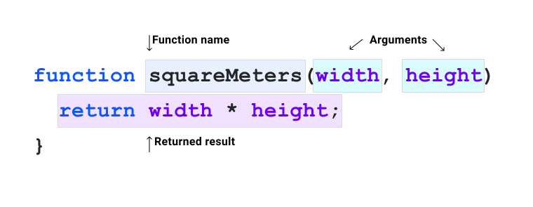

# 函数 


到目前为止，您已经在本课程中了解了几个 CSS 函数。在 [grid](/blogs/web/css/grid) 模块中，我们介绍了 `minmax()` 和 `fit-content()`，它们可以帮助您调整元素大小。在 [color](/blogs/web/css/color) 模块中，我们介绍了 `rgb()` 和 `hsl()`，它们可帮助您定义颜色。

与许多其他编程语言一样，[CSS 提供了大量内置函数](https://developer.mozilla.org/docs/Web/CSS/CSS_Functions)，您可以在需要时随时访问它们。

每个 CSS 函数都有特定的用途。在本课程中，您将大致了解这些函数，从而更好地了解它们的使用场景和使用方式。

## 什么是函数？

函数是完成特定任务的独立命名代码段。 由于已命名函数，因此您可以在代码中调用该函数，并可向该函数传递数据。这称为传递参数。



许多 CSS 函数都是纯函数，也就是说，如果您将相同的参数传递给函数，则无论您代码的其余部分发生了什么，它们都会返回相同的结果。当 CSS 中的值发生更改时，这些函数通常会重新计算，类似于该语言中的其他元素，例如计算的级联值，例如 `currentColor`。

在 CSS 中，您只能使用所提供的函数，而不能自行编写函数，但在某些情况下，函数可以相互嵌套，从而赋予它们更大的灵活性。我们将在本单元后面的部分对此进行详细介绍。

## 功能选择器

```css
.post :is(h1, h2, h3) { 
    line-height: 1.2;
}
```

您学习了[伪类模块](/blogs/web/css/pseudo-classes)中的功能选择器，其中详细介绍了 [`:is()`](https://developer.mozilla.org/docs/Web/CSS/:is) 和 [`:not()`](https://developer.mozilla.org/docs/Web/CSS/:not) 等函数。传递到这些函数的参数为 CSS 选择器，然后对它们进行求值。 如果存在与元素匹配的元素，则系统会将其余 **CSS 规则**应用于这些元素。

## 自定义属性和 `var()`

```css
:root { 
    --base-color: #ff00ff;
}
.my-element {
    background: var(--base-color);
}
```

自定义属性是一种变量，可用于对 CSS 代码中的值进行标记化。[自定义属性也会受级联的影响](https://piccalil.li/tutorial/getting-started-with-css-custom-properties/)，这意味着可以在上下文中操作或重新定义自定义属性。自定义属性必须以两个短划线 (`--`) 为前缀，并且区分大小写。

[`var()`](https://developer.mozilla.org/docs/Web/CSS/var()) 函数接受一个必需参数：您尝试作为值返回的自定义属性。在上面的代码段中，`var()` 函数将 `--base-color` 作为参数传递。如果定义了 `--base-color`，则 `var()` 将返回该值。

```css
.my-element {  
    background: var(--base-color, hotpink);
}
```

您还可以将回退声明值传入 `var()` 函数。这意味着，如果找不到 `--base-color`，系统会改用所传递的**声明**，在本例中，该声明为 `hotpink` 颜色。

<iframe allow="camera; clipboard-read; clipboard-write; encrypted-media; geolocation; microphone; midi;" loading="lazy" src="https://codepen.io/web-dot-dev/embed/zYNPOjP?height=250&amp;theme-id=light&amp;default-tab=css%2Cresult&amp;editable=true" data-darkreader-inline-border-top="" data-darkreader-inline-border-right="" data-darkreader-inline-border-bottom="" data-darkreader-inline-border-left="" data-title="Codepen 上 web-dot-dev 的 Pen zYNPOjP" style="color-scheme: initial; box-sizing: inherit; border: 0px; height: 250px; width: 100%; --darkreader-inline-border-top: 0px; --darkreader-inline-border-right: 0px; --darkreader-inline-border-bottom: 0px; --darkreader-inline-border-left: 0px;"></iframe>

## 返回值的函数

`var()` 函数只是一个可返回值的 CSS 函数。[`attr()`](https://developer.mozilla.org/docs/Web/CSS/attr()) 和 [`url()`](https://developer.mozilla.org/docs/Web/CSS/url()) 等函数遵循与 `var()` 类似的结构，您需要传递一个或多个参数，并在 CSS 声明的**右侧**使用它们。

```css
a::after {  
    content: attr(href);
}
```

这里的 `attr()` 函数会获取 `` 元素的 `href` 属性的内容，并将其设为 `::after` 伪元素的 `content`。如果 `` 元素的 `href` 属性的值发生更改，这会自动反映在此 `content` 属性中。

```css
.my-element { 
    background-image: url('/path/to/image.jpg');
}
```

`url()` 函数采用字符串网址作为参数，用于加载图片、字体和内容。 如果未传入有效网址或找不到网址指向的资源，则 `url()` 函数不会返回任何内容。

## 颜色函数

您已经在 [color](/blogs/web/css/color) 模块中全面了解了颜色函数。如果您还没有读过此类内容，强烈建议您读一读。

CSS 中一些可用的颜色函数包括 `rgb()`、`rgba()`、`hsl()`、`hsla()`、`hwb()`、`lab()` 和 `lch()`。所有这些对象的形式都类似，其中传入配置参数，然后返回颜色。

## 数学表达式

与许多其他编程语言一样，CSS 也提供实用的数学函数来协助进行各种类型的计算。

### calc()

<BrowseSurport code="css.types.calc" />
[`calc()`](https://developer.mozilla.org/docs/Web/CSS/calc()) 函数接受单个数学表达式作为其参数。此数学表达式可以组合多种类型，如长度、数字、角度和频率。单位也可以混用。

```css
.my-element {   
    width: calc(100% - 2rem);
}
```

在此示例中，`calc()` 函数用于将某个元素的宽度调整为其所属父元素的 100%，然后移除该计算值的 `2rem`。

<iframe allow="camera; clipboard-read; clipboard-write; encrypted-media; geolocation; microphone; midi;" loading="lazy" src="https://codepen.io/web-dot-dev/embed/PopYema?height=500&amp;theme-id=light&amp;default-tab=result&amp;editable=true" data-darkreader-inline-border-top="" data-darkreader-inline-border-right="" data-darkreader-inline-border-bottom="" data-darkreader-inline-border-left="" data-title="由 web-dot-dev 在 Codepen 上开发的 Pen PopYema" style="color-scheme: initial; box-sizing: inherit; border: 0px; height: 500px; width: 100%; --darkreader-inline-border-top: 0px; --darkreader-inline-border-right: 0px; --darkreader-inline-border-bottom: 0px; --darkreader-inline-border-left: 0px;"></iframe>

```css
:root {  
    --root-height: 5rem;
}
.my-element { 
    width: calc(calc(10% + 2rem) * 2);  
    height: calc(var(--root-height) * 3);
}
```

`calc()` 函数可以嵌套在另一个 `calc()` 函数中。您还可以将自定义属性作为表达式的一部分在 `var()` 函数中传递。

### `min()`和`max()`

<BrowseSurport code="css.types.min" />

[`min()`](https://developer.mozilla.org/docs/Web/CSS/min()) 函数会返回一个或多个已传递参数的最小计算值。[`max()`](https://developer.mozilla.org/docs/Web/CSS/max()) 函数则相反：获取一个或多个传递的参数中的最大值。

```css
.my-element {  
    width: min(20vw, 30rem); 
    height: max(20vh, 20rem);
}
```

在此示例中，宽度应为 `20vw`（视口宽度的 20%）和 `30rem` 之间的最小值。高度应为 `20vh`（即**视口高度**的 20%）到 `20rem` 之间的最大值。

**注意** ：我们在 [ssize](/blogs/web/css/sizing) 单位模块中介绍了 `vw` 和 `vh` 等单位。

### clamp()

<BrowseSurport code="css.types.clamp" />

[`clamp()`](https://developer.mozilla.org/docs/Web/CSS/clamp()) 函数采用三个参数：最小大小、理想大小和最大大小。

```css
h1 {
    font-size: clamp(2rem, 1rem + 3vw, 3rem);
}
```

在此示例中，`font-size` 将根据视口的宽度保持自适应。将 `vw` 单位添加到 `rem` 单位以帮助进行屏幕缩放，因为无论缩放级别如何，`vw` 单位的大小都是相同的。根据根字字体大小乘以 `rem` 单位，可以为 `clamp()` 函数提供相对计算点。


## 形状

[`clip-path`](https://developer.mozilla.org/docs/Web/CSS/clip-path)、[`offset-path`](https://developer.mozilla.org/docs/Web/CSS/offset-path) 和 [`shape-outside`](https://developer.mozilla.org/docs/Web/CSS/shape-outside) CSS 属性使用形状直观地裁剪方框或提供形状，让内容四处移动。

有一些形状函数可用于这两种属性。[`circle()`](https://developer.mozilla.org/docs/Web/CSS/basic-shape/circle())、[`ellipse()`](https://developer.mozilla.org/docs/Web/CSS/basic-shape/ellipse()) 和 [`inset()`](https://developer.mozilla.org/docs/Web/CSS/basic-shape/inset()) 等简单形状可使用配置参数来确定其大小。更复杂的形状（例如 [`polygon()`](https://developer.mozilla.org/docs/Web/CSS/basic-shape/polygon())）可使用逗号分隔的 X 轴和 Y 轴值对来创建自定义形状。

```css
.circle {
    clip-path: circle(50%);
}
.polygon { 
    clip-path: polygon(0% 0%, 100% 0%, 100% 75%, 75% 75%, 75% 100%, 50% 75%, 0% 75%);
}
```

<iframe allow="camera; clipboard-read; clipboard-write; encrypted-media; geolocation; microphone; midi;" loading="lazy" src="https://codepen.io/web-dot-dev/embed/rNjYNNd?height=500&amp;theme-id=light&amp;default-tab=result&amp;editable=true" data-darkreader-inline-border-top="" data-darkreader-inline-border-right="" data-darkreader-inline-border-bottom="" data-darkreader-inline-border-left="" data-title="Codepen 上的 web-dot-dev 的 Pen rNjYNNd" style="color-scheme: initial; box-sizing: inherit; border: 0px; height: 500px; width: 100%; --darkreader-inline-border-top: 0px; --darkreader-inline-border-right: 0px; --darkreader-inline-border-bottom: 0px; --darkreader-inline-border-left: 0px;"></iframe>

与 `polygon()` 一样，还有一个 `path()` 函数，该函数接受 SVG 填充规则作为参数。因此，可以使用 Illustrator 或 Inkscape 等图形工具绘制高度复杂的形状，然后将其复制到 CSS 中。

## 变形

在本 CSS 函数的概览中，最后介绍的是转换函数，用于倾斜、调整大小甚至更改元素的深度。以下所有函数均与 `transform` 属性一起使用。

### Rotation

<BrowseSurport code="css.types.transform-function.rotate" />

您可以使用 [`rotate()`](https://developer.mozilla.org/docs/Web/CSS/transform-function/rotate()) 函数旋转元素，该函数会围绕元素的中心轴旋转元素。您还可以改用 [`rotateX()`](https://developer.mozilla.org/docs/Web/CSS/transform-function/rotateX())、[`rotateY()`](https://developer.mozilla.org/docs/Web/CSS/transform-function/rotateY()) 和 [`rotateZ()`](https://developer.mozilla.org/docs/Web/CSS/transform-function/rotateZ()) 函数，让元素在特定轴上旋转。您可以通过传递角度、转弯和弧度单位来确定旋转角度。

```css
.my-element { 
    transform: rotateX(10deg) rotateY(10deg) rotateZ(10deg);
}
```

<iframe allow="camera; clipboard-read; clipboard-write; encrypted-media; geolocation; microphone; midi;" loading="lazy" src="https://codepen.io/web-dot-dev/embed/MWJOWzP?height=500&amp;theme-id=light&amp;default-tab=result&amp;editable=true" data-darkreader-inline-border-top="" data-darkreader-inline-border-right="" data-darkreader-inline-border-bottom="" data-darkreader-inline-border-left="" data-title="由 web-dot-dev 在 Codepen 上开发的 Pen MWJOWzP" style="color-scheme: initial; box-sizing: inherit; border: 0px; height: 500px; width: 100%; --darkreader-inline-border-top: 0px; --darkreader-inline-border-right: 0px; --darkreader-inline-border-bottom: 0px; --darkreader-inline-border-left: 0px;"></iframe>

[`rotate3d()`](https://developer.mozilla.org/docs/Web/CSS/transform-function/rotate3d()) 函数采用四个参数。

<BrowseSurport code="css.types.transform-function.rotate3d" />

前 3 个参数是数字，用于定义 X、Y 和 Z 坐标。第四个参数是旋转，与其他旋转函数一样，它接受角度、角度和转弯。

```css
.my-element {  
    transform: rotate3d(1, 1, 1, 10deg);
}
```

<iframe allow="camera; clipboard-read; clipboard-write; encrypted-media; geolocation; microphone; midi;" loading="lazy" src="https://codepen.io/web-dot-dev/embed/GRrOJxa?height=500&amp;theme-id=light&amp;default-tab=result&amp;editable=true" data-darkreader-inline-border-top="" data-darkreader-inline-border-right="" data-darkreader-inline-border-bottom="" data-darkreader-inline-border-left="" data-title="由 web-dot-dev 在 Codepen 上发布的 Pen GRrOJxa" style="color-scheme: initial; box-sizing: inherit; border: 0px; height: 500px; width: 100%; --darkreader-inline-border-top: 0px; --darkreader-inline-border-right: 0px; --darkreader-inline-border-bottom: 0px; --darkreader-inline-border-left: 0px;"></iframe>

### 扩缩

<BrowseSurport code="css.types.transform-function.scale" />

您可以使用 `transform` 和 [`scale()`](https://developer.mozilla.org/docs/Web/CSS/transform-function/scale()) 函数更改元素的缩放比例。该函数接受一个或两个数字作为值，用于确定正类别或负比例。 如果您只定义一个数字参数，X 轴和 Y 轴都将按相同的缩放比例进行缩放，因此定义两者是 X 和 Y 的简写形式。与 `rotate()` 类似，有 [`scaleX()`](https://developer.mozilla.org/docs/Web/CSS/transform-function/scaleX())、[`scaleY()`](https://developer.mozilla.org/docs/Web/CSS/transform-function/scaleY()) 和 [`scaleZ()`](https://developer.mozilla.org/docs/Web/CSS/transform-function/scaleZ()) 函数可用于在特定轴上缩放元素。

```css
.my-element { 
    transform: scaleX(1.2) scaleY(1.2);
}
```

<iframe allow="camera; clipboard-read; clipboard-write; encrypted-media; geolocation; microphone; midi;" loading="lazy" src="https://codepen.io/web-dot-dev/embed/vYgWOoq?height=500&amp;theme-id=light&amp;default-tab=result&amp;editable=true" data-darkreader-inline-border-top="" data-darkreader-inline-border-right="" data-darkreader-inline-border-bottom="" data-darkreader-inline-border-left="" data-title="Codepen 上 web-dot-dev 的 Pen vYgWOoq" style="color-scheme: initial; box-sizing: inherit; border: 0px; height: 500px; width: 100%; --darkreader-inline-border-top: 0px; --darkreader-inline-border-right: 0px; --darkreader-inline-border-bottom: 0px; --darkreader-inline-border-left: 0px;"></iframe>

与 `rotate` 函数一样，还有一个 [`scale3d()`](https://developer.mozilla.org/docs/Web/CSS/transform-function/scale3d()) 函数。这与 `scale()` 类似，但使用三个参数：X、Y 和 Z 缩放比例。

### 翻译
<BrowseSurport code="css.types.transform-function.translate" />
[`translate()`](https://developer.mozilla.org/docs/Web/CSS/transform-function/translate()) 函数会在元素保持其在文档流中的位置时移动元素。它们接受长度和百分比值作为参数。 如果定义了一个参数，`translate()` 函数会沿 X 轴平移元素；如果定义了两个参数，则函数会沿 X 轴和 Y 轴平移元素。

```css
.my-element {  transform: translatex(40px) translatey(25px);}
```

<iframe allow="camera; clipboard-read; clipboard-write; encrypted-media; geolocation; microphone; midi;" loading="lazy" src="https://codepen.io/web-dot-dev/embed/RwKjWgP?height=500&amp;theme-id=light&amp;default-tab=result&amp;editable=true" data-darkreader-inline-border-top="" data-darkreader-inline-border-right="" data-darkreader-inline-border-bottom="" data-darkreader-inline-border-left="" data-title="由 web-dot-dev 在 Codepen 上开发的 Pen RwKjWgP" style="color-scheme: initial; box-sizing: inherit; border: 0px; height: 500px; width: 100%; --darkreader-inline-border-top: 0px; --darkreader-inline-border-right: 0px; --darkreader-inline-border-bottom: 0px; --darkreader-inline-border-left: 0px;"></iframe>

与其他转换函数一样，您可以使用 [`translateX`](https://developer.mozilla.org/docs/Web/CSS/transform-function/translateX())、[`translateY`](https://developer.mozilla.org/docs/Web/CSS/transform-function/translateY()) 和 [`translateZ`](https://developer.mozilla.org/docs/Web/CSS/transform-function/translateZ()) 为特定轴使用特定函数。您还可以使用 [`translate3d`](https://developer.mozilla.org/docs/Web/CSS/transform-function/translate3d())，它允许您在一个函数中定义 X、Y 和 Z 平移。

### 偏差

<BrowseSurport code="css.types.transform-function.skew" />

您可以使用接受角度作为参数的 [`skew()`](https://developer.mozilla.org/docs/Web/CSS/transform-function/skew()) 函数使元素倾斜。`skew()` 函数的工作方式与 `translate()` 非常相似。如果您只定义一个参数，则只会影响 X 轴；如果您同时定义了这两个参数，则会影响 X 轴和 Y 轴。您还可以使用 [`skewX`](https://developer.mozilla.org/docs/Web/CSS/transform-function/skewX()) 和 [`skewY`](https://developer.mozilla.org/docs/Web/CSS/transform-function/skewY()) 分别影响每个轴。

```css
.my-element { 
    transform: skew(10deg);
}
```

<iframe allow="camera; clipboard-read; clipboard-write; encrypted-media; geolocation; microphone; midi;" loading="lazy" src="https://codepen.io/web-dot-dev/embed/JjEOYMq?height=500&amp;theme-id=light&amp;default-tab=result&amp;editable=true" data-darkreader-inline-border-top="" data-darkreader-inline-border-right="" data-darkreader-inline-border-bottom="" data-darkreader-inline-border-left="" data-title="Codepen 上 web-dot-dev 的 Pen JjEOYMq" style="color-scheme: initial; box-sizing: inherit; border: 0px; height: 500px; width: 100%; --darkreader-inline-border-top: 0px; --darkreader-inline-border-right: 0px; --darkreader-inline-border-bottom: 0px; --darkreader-inline-border-left: 0px;"></iframe>

### 车头朝上

<BrowseSurport code="css.properties.perspective" />

最后，您可以使用 [`perspective`](https://developer.mozilla.org/docs/Web/CSS/perspective) 属性（属于转换属性系列的一部分）来更改用户与 Z 平面之间的距离。这种方式可以呈现距离感，并可用于在设计中实现景深。

David Desandro 编写的这个示例来自他们的实用文章，展示了如何使用它以及 `perspective-origin-x` 和 `perspective-origin-y` 属性来打造真正的 3D 体验。

<iframe allow="camera; clipboard-read; clipboard-write; encrypted-media; geolocation; microphone; midi;" loading="lazy" src="https://codepen.io/web-dot-dev/embed/bMqZmr?height=500&amp;theme-id=light&amp;default-tab=result&amp;editable=true" data-darkreader-inline-border-top="" data-darkreader-inline-border-right="" data-darkreader-inline-border-bottom="" data-darkreader-inline-border-left="" data-title="Codepen 上 web-dot-dev 的 Pen bMqZmr" style="color-scheme: initial; box-sizing: inherit; border: 0px; height: 500px; width: 100%; --darkreader-inline-border-top: 0px; --darkreader-inline-border-right: 0px; --darkreader-inline-border-bottom: 0px; --darkreader-inline-border-left: 0px;"></iframe>

## 动画函数、渐变和滤镜

CSS 还提供一些函数来帮助您为元素[添加动画效果](/blogs/web/css/animations)、对其应用[渐变](/blogs/web/css/gradients)，以及使用图形[过滤器](/blogs/web/css/filters)来操纵元素的外观。 为了使本单元尽可能简洁明了，链接的模块中会对其进行介绍。 它们都遵循与本单元演示的函数类似的结构。
