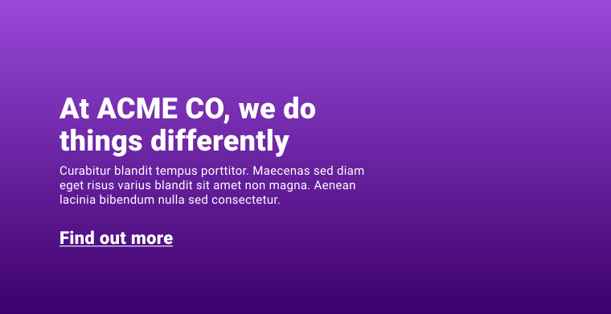

# 渐变 

假设您有一个要构建的网站，顶部有一个介绍性视频，其中包含标题、摘要和按钮。设计师为此简介提供了紫色背景的设计。 唯一的问题是，背景使用两种紫色阴影进行渐变。具体如何操作？



您最初可能以为需要从设计工具中导出图片才能做到这一点，但您可以改用 [`linear-gradient`](https://developer.mozilla.org/docs/Web/CSS/linear-gradient())。

<iframe allow="camera; clipboard-read; clipboard-write; encrypted-media; geolocation; microphone; midi;" loading="lazy" src="https://codepen.io/web-dot-dev/embed/XWpzdoV?height=500&amp;theme-id=light&amp;default-tab=result&amp;editable=true" data-darkreader-inline-border-top="" data-darkreader-inline-border-right="" data-darkreader-inline-border-bottom="" data-darkreader-inline-border-left="" data-title="由 web-dot-dev 在 Codepen 上发布的 Pen XWpzdoV" style="color-scheme: initial; box-sizing: inherit; border: 0px; height: 500px; width: 100%; --darkreader-inline-border-top: 0px; --darkreader-inline-border-right: 0px; --darkreader-inline-border-bottom: 0px; --darkreader-inline-border-left: 0px;"></iframe>

渐变是一种图片，可以在任何可以使用图片的地方使用，但它是用 CSS 创建的，由颜色、数字和角度组成。借助 CSS 渐变，您可以创建介于两种颜色之间的平滑渐变，通过混合和重复使用多种渐变效果，再到令人印象深刻的艺术作品。

## 线性渐变
<BrowseSurport code="css.types.image.gradient.linear-gradient" />

[`linear-gradient()`](https://developer.mozilla.org/docs/Web/CSS/linear-gradient()) 函数逐步生成两种或更多颜色的图片。它需要多个参数，但在最简单的配置中，您可以传递一些颜色（就像这样），它会自动均匀拆分这些颜色，同时进行混合。

```css
.my-element {   
    background: linear-gradient(black, white);
}
```

<iframe allow="camera; clipboard-read; clipboard-write; encrypted-media; geolocation; microphone; midi;" loading="lazy" src="https://codepen.io/web-dot-dev/embed/mdRqPoZ?height=400&amp;theme-id=light&amp;default-tab=css%2Cresult&amp;editable=true" data-darkreader-inline-border-top="" data-darkreader-inline-border-right="" data-darkreader-inline-border-bottom="" data-darkreader-inline-border-left="" data-title="由 web-dot-dev 在 Codepen 上撰写的 Pen mdRqPoZ" style="color-scheme: initial; box-sizing: inherit; border: 0px; height: 400px; width: 100%; --darkreader-inline-border-top: 0px; --darkreader-inline-border-right: 0px; --darkreader-inline-border-bottom: 0px; --darkreader-inline-border-left: 0px;"></iframe>

您还可以传递代表角度的角度或关键字。如果您选择使用关键字，请在 `to` 关键字后指定方向。 这意味着，如果您需要一种从左（黑）到右（白）的黑白渐变，则应将角度指定为 `to right` 作为第一个参数。

```css
.my-element {   
    background: linear-gradient(to right, black, white);
}
```

<iframe allow="camera; clipboard-read; clipboard-write; encrypted-media; geolocation; microphone; midi;" loading="lazy" src="https://codepen.io/web-dot-dev/embed/zYNPqXW?height=400&amp;theme-id=light&amp;default-tab=css%2Cresult&amp;editable=true" data-darkreader-inline-border-top="" data-darkreader-inline-border-right="" data-darkreader-inline-border-bottom="" data-darkreader-inline-border-left="" data-title="由 web-dot-dev 在 Codepen 上发布的 Pen zYNPqXW" style="color-scheme: initial; box-sizing: inherit; border: 0px; height: 400px; width: 100%; --darkreader-inline-border-top: 0px; --darkreader-inline-border-right: 0px; --darkreader-inline-border-bottom: 0px; --darkreader-inline-border-left: 0px;"></iframe>

定义停止颜色并与其相邻颜色混合时的颜色停止值。如果渐变以深红色以 45 度角开始运行，那么渐变大小的 30% 会变为浅红色：如下所示。

```css
.my-element {  
    background: linear-gradient(45deg, darkred 30%, crimson);
}
```

<iframe allow="camera; clipboard-read; clipboard-write; encrypted-media; geolocation; microphone; midi;" loading="lazy" src="https://codepen.io/web-dot-dev/embed/NWdwNZr?height=400&amp;theme-id=light&amp;default-tab=css%2Cresult&amp;editable=true" data-darkreader-inline-border-top="" data-darkreader-inline-border-right="" data-darkreader-inline-border-bottom="" data-darkreader-inline-border-left="" data-title="来自 Codepen 上的 web-dot-dev 的 Pen NWdwNZr" style="color-scheme: initial; box-sizing: inherit; border: 0px; height: 400px; width: 100%; --darkreader-inline-border-top: 0px; --darkreader-inline-border-right: 0px; --darkreader-inline-border-bottom: 0px; --darkreader-inline-border-left: 0px;"></iframe>

您可以在 `linear-gradient()` 中添加任意数量的颜色和颜色停止点，并且可以用逗号分隔各个渐变，从而在彼此之上叠加渐变。

<iframe allow="camera; clipboard-read; clipboard-write; encrypted-media; geolocation; microphone; midi;" loading="lazy" src="https://codepen.io/web-dot-dev/embed/abpVZbj?height=400&amp;theme-id=light&amp;default-tab=css%2Cresult&amp;editable=true" data-darkreader-inline-border-top="" data-darkreader-inline-border-right="" data-darkreader-inline-border-bottom="" data-darkreader-inline-border-left="" data-title="Codepen 上 web-dot-dev 的 Pen abpVZbj" style="color-scheme: initial; box-sizing: inherit; border: 0px; height: 400px; width: 100%; --darkreader-inline-border-top: 0px; --darkreader-inline-border-right: 0px; --darkreader-inline-border-bottom: 0px; --darkreader-inline-border-left: 0px;"></iframe>

## 径向渐变

<BrowseSurport code="css.types.image.gradient.radial-gradient" />

如需创建以圆形辐射的渐变，[`radial-gradient()`](https://developer.mozilla.org/docs/Web/CSS/radial-gradient()) 函数可以提供帮助。它与 `linear-gradient()` 类似，但您可以选择指定位置和结束形状，而不是指定角度。如果您只指定颜色，`radial-gradient()` 会自动将位置设为 `center`，并根据框的大小选择圆形或椭圆形。

```css
.my-element {  
    background: radial-gradient(white, black);
}
```

<iframe allow="camera; clipboard-read; clipboard-write; encrypted-media; geolocation; microphone; midi;" loading="lazy" src="https://codepen.io/web-dot-dev/embed/LYxOZEq?height=400&amp;theme-id=light&amp;default-tab=css%2Cresult&amp;editable=true" data-darkreader-inline-border-top="" data-darkreader-inline-border-right="" data-darkreader-inline-border-bottom="" data-darkreader-inline-border-left="" data-title="Codepen 上 web-dot-dev 的 Pen LYxOZEq" style="color-scheme: initial; box-sizing: inherit; border: 0px; height: 400px; width: 100%; --darkreader-inline-border-top: 0px; --darkreader-inline-border-right: 0px; --darkreader-inline-border-bottom: 0px; --darkreader-inline-border-left: 0px;"></iframe>

使用关键字和/或数值时，渐变的位置类似于 `background-position`。径向渐变的大小决定了渐变的结束形状（圆形或椭圆形）的大小，并且默认为 `farthest-corner`，这意味着它与框离中心最远的角完全一致。您还可以使用以下关键字：

- `closest-corner` 将与渐变中心最接近的角相交。
- `closest-side` 将与框的一侧相接，最接近渐变中心。
- `farthest-side` 的作用与 `closest-side` 相反。

您可以根据需要添加任意数量的颜色停止点，就像使用 `linear-gradient` 一样。同样，您也可以根据需要添加任意数量的 `radial-gradients`。

<iframe allow="camera; clipboard-read; clipboard-write; encrypted-media; geolocation; microphone; midi;" loading="lazy" src="https://codepen.io/web-dot-dev/embed/MWJOepV?height=400&amp;theme-id=light&amp;default-tab=css%2Cresult&amp;editable=true" data-darkreader-inline-border-top="" data-darkreader-inline-border-right="" data-darkreader-inline-border-bottom="" data-darkreader-inline-border-left="" data-title="web-dot-dev 在 Codepen 上发布的 Pen MWJOepV" style="color-scheme: initial; box-sizing: inherit; border: 0px; height: 400px; width: 100%; --darkreader-inline-border-top: 0px; --darkreader-inline-border-right: 0px; --darkreader-inline-border-bottom: 0px; --darkreader-inline-border-left: 0px;"></iframe>

## 圆锥渐变


<BrowseSurport code="css.types.image.gradient.conic-gradient" />

圆锥渐变在框中有一个中心点，从顶部开始（默认情况下），沿着 360 度圆环。

```css
.my-element {  
    background: conic-gradient(white, black);
}
```

<iframe allow="camera; clipboard-read; clipboard-write; encrypted-media; geolocation; microphone; midi;" loading="lazy" src="https://codepen.io/web-dot-dev/embed/qBRVNXG?height=400&amp;theme-id=light&amp;default-tab=css%2Cresult&amp;editable=true" data-darkreader-inline-border-top="" data-darkreader-inline-border-right="" data-darkreader-inline-border-bottom="" data-darkreader-inline-border-left="" data-title="由 web-dot-dev 在 Codepen 上开发的 Pen qBRVNXG" style="color-scheme: initial; box-sizing: inherit; border: 0px; height: 400px; width: 100%; --darkreader-inline-border-top: 0px; --darkreader-inline-border-right: 0px; --darkreader-inline-border-bottom: 0px; --darkreader-inline-border-left: 0px;"></iframe>

[`conic-gradient()`](https://developer.mozilla.org/docs/Web/CSS/conic-gradient()) 函数接受位置和角度参数。

默认情况下，角度为 0 度，从顶部（中心）开始。如果您将角度设置为 `45deg`，则该角度为右上角。angle 参数接受任何类型的角度值，例如线性渐变和径向渐变。

默认情况下，该位置位于中心位置。与径向和线性渐变一样，定位可以基于关键字，也可以用数值定义。

<iframe allow="camera; clipboard-read; clipboard-write; encrypted-media; geolocation; microphone; midi;" loading="lazy" src="https://codepen.io/web-dot-dev/embed/vYgWKpO?height=400&amp;theme-id=light&amp;default-tab=css%2Cresult&amp;editable=true" data-darkreader-inline-border-top="" data-darkreader-inline-border-right="" data-darkreader-inline-border-bottom="" data-darkreader-inline-border-left="" data-title="由 web-dot-dev 在 Codepen 上开发的 Pen vYgWKpO" style="color-scheme: initial; box-sizing: inherit; border: 0px; height: 400px; width: 100%; --darkreader-inline-border-top: 0px; --darkreader-inline-border-right: 0px; --darkreader-inline-border-bottom: 0px; --darkreader-inline-border-left: 0px;"></iframe>

和其他渐变类型一样，您可以根据需要添加任意数量的颜色停止点。使用圆锥渐变功能时，就很适合使用 CSS 渲染饼图。

<iframe allow="camera; clipboard-read; clipboard-write; encrypted-media; geolocation; microphone; midi;" loading="lazy" src="https://codepen.io/web-dot-dev/embed/mdRqExP?height=400&amp;theme-id=light&amp;default-tab=css%2Cresult&amp;editable=true" data-darkreader-inline-border-top="" data-darkreader-inline-border-right="" data-darkreader-inline-border-bottom="" data-darkreader-inline-border-left="" data-title="通过 Codepen 上的 web-dot-dev 创建 mdRqExP" style="color-scheme: initial; box-sizing: inherit; border: 0px; height: 400px; width: 100%; --darkreader-inline-border-top: 0px; --darkreader-inline-border-right: 0px; --darkreader-inline-border-bottom: 0px; --darkreader-inline-border-left: 0px;"></iframe>

## 重复和混合

此外，每种渐变类型都有一个重复类型。分别是 [`repeating-linear-gradient()`](https://developer.mozilla.org/docs/Web/CSS/repeating-linear-gradient())、[`repeating-radial-gradient()`](https://developer.mozilla.org/docs/Web/CSS/repeating-radial-gradient()) 和 [`repeating-conic-gradient()`](https://developer.mozilla.org/docs/Web/CSS/repeating-conic-gradient())。它们与非重复函数类似，并采用相同的参数。 不同之处在于，如果可以重复定义的渐变以填充框，则渐变效果将发生变化。

如果渐变似乎并非重复，可能是因为您尚未设置某个颜色停止点的长度。例如，您可以通过设置颜色停止长度来创建带有 `repeating-linear-gradient` 的条纹背景。

```css
.my-element { 
    background: repeating-linear-gradient(    45deg,    red,    red 30px,    white 30px,    white 60px  );
}
```

<iframe allow="camera; clipboard-read; clipboard-write; encrypted-media; geolocation; microphone; midi;" loading="lazy" src="https://codepen.io/web-dot-dev/embed/ExZbgdy?height=400&amp;theme-id=light&amp;default-tab=css%2Cresult&amp;editable=true" data-darkreader-inline-border-top="" data-darkreader-inline-border-right="" data-darkreader-inline-border-bottom="" data-darkreader-inline-border-left="" data-title="Codepen 上的 web-dot-dev 提供的 Pen ExZbgdy" style="color-scheme: initial; box-sizing: inherit; border: 0px; height: 400px; width: 100%; --darkreader-inline-border-top: 0px; --darkreader-inline-border-right: 0px; --darkreader-inline-border-bottom: 0px; --darkreader-inline-border-left: 0px;"></iframe>

您还可以在 `background` 属性上混用渐变函数，以及根据需要定义任意数量的渐变，就像对背景图片那样。例如，您可以将多个线性渐变混合在一起，或者将两个线性渐变与径向渐变混合在一起。

<iframe allow="camera; clipboard-read; clipboard-write; encrypted-media; geolocation; microphone; midi;" loading="lazy" src="https://codepen.io/web-dot-dev/embed/ExZqGxP?height=400&amp;theme-id=light&amp;default-tab=css%2Cresult&amp;editable=true" data-darkreader-inline-border-top="" data-darkreader-inline-border-right="" data-darkreader-inline-border-bottom="" data-darkreader-inline-border-left="" data-title="Codepen 上的 web-dot-dev 的 Pen ExZqGxP" style="color-scheme: initial; box-sizing: inherit; border: 0px; height: 400px; width: 100%; --darkreader-inline-border-top: 0px; --darkreader-inline-border-right: 0px; --darkreader-inline-border-bottom: 0px; --darkreader-inline-border-left: 0px;"></iframe>

## 资源

- [Conic.css](https://www.conic.style/) - 一个实用的圆锥渐变集合
- [MDN 渐变指南](https://developer.mozilla.org/docs/Web/CSS/CSS_Images/Using_CSS_gradients)
- [渐变生成器](https://www.colorzilla.com/gradient-editor/)


