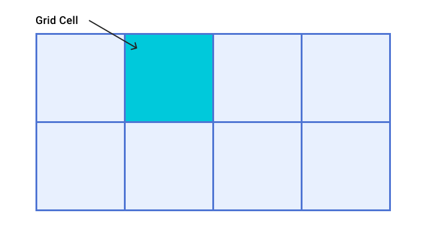

# 网格 


在网页设计中，一种非常常见的布局是页眉、边栏、正文和页脚布局。


多年来，有许多方法可以解决此布局问题，但使用 CSS 网格不仅相对简单，而且有多种选择。 网格特别适用于将外部大小调整的控制与固有大小调整的灵活性相结合，这使其成为此类布局的理想选择。这是因为网格是专为二维内容设计的布局方法。也就是说，同时按行和列进行布局。

创建网格布局时，您可以定义一个包含行和列的网格。然后，将项放置在该网格上，或允许浏览器将其自动放置在您创建的单元格中。需要添加网格的内容有很多，但掌握可用内容概览后，您很快就可以制作网格布局了。

## 概览

那么，您可以使用网格执行哪些操作？ 网格布局具有以下功能。 在本指南中，您将了解所有这些平台。

1. 网格可以用行和列来定义。您可以选择如何调整这些行和列轨道的大小，或者让它们根据内容的大小进行调整。
2. 网格容器的直接子级将自动放置在此网格上。
3. 或者，您也可以将物品放置在所需确切位置。
4. 您可以为网格上的线条和区域命名，以便更轻松地放置。
5. 网格容器中的空闲空间可以分布在轨道之间。
6. 网格项可在其区域内对齐。

## 网格术语

Grid 还带有一堆新术语，这是 CSS 首次拥有真实的布局系统。

### 网格线

网格由水平和垂直排列的线条组成。如果您的网格有四列，则有五列线，包括最后一列后面的一行。

各行从 1 开始编号，按照组件的写入模式和脚本方向进行编号。这意味着第 1 行将采用从左到右书写的语言（如英语）显示在左侧，而以从右到左书写的语言（如阿拉伯语）显示在右侧。


### 网格轨道

轨迹是两条网格线之间的间距。行轨道位于两行行之间，列轨道介于两列行之间。在创建网格时，我们会通过给它们分配大小来创建这些航迹。


### 网格单元

网格单元是由行轨迹和列轨迹的交集定义的网格上的最小空间。就像电子表格中的某个表格单元格或单元格。 如果您定义了一个网格但未放置任何项，则这些项会自动排列在每个已定义的网格单元格中。



### 网格区域

多个网格单元格一起显示。 网格区域是通过使一个项跨越多个轨道而创建的。


### 差距

轨道之间的边线或小巷。 在调整大小时，这些轨道会像常规轨道一样。您无法将内容放置在间隙中，但可以跨越网格项。


### 网格容器

应用了 `display: grid` 的 HTML 元素，以便为直接子级创建新的网格格式设置上下文。

```css
.container {  
    display: grid;
}
```

### 网格项

网格项是作为网格容器的直接子级的项。

```html/1-3
<div class="container">  
    <div class="item"></div>  
    <div class="item"></div>  
    <div class="item"></div>
</div>
```

## 行和列

如需创建基本网格，您可以定义一个网格，其中包含三列轨迹、两条行轨迹以及轨迹之间 10 像素的间距，如下所示。

```css
.container {  
    display: grid;  
    grid-template-columns: 5em 100px 30%;  
    grid-template-rows: 200px auto;  
    gap: 10px;
}
```

此网格演示了术语部分中所述的许多内容。它包含三列音轨。 每首曲目使用不同的长度单位。 它有两个行轨道，一个使用长度单位，另一个使用自动长度单位。如果将其用作轨道，则可将“自动调整”视为与内容一样大。 默认情况下，轨道会自动调整大小。

如果类为 `.container` 的元素包含子级项，这些项会立即在此网格上布局。您可以通过下面的演示了解其实际运作方式。

<iframe allow="camera; clipboard-read; clipboard-write; encrypted-media; geolocation; microphone; midi;" loading="lazy" src="https://codepen.io/web-dot-dev/embed/NWdbrzr?height=500&amp;theme-id=light&amp;default-tab=result&amp;editable=true" data-darkreader-inline-border-top="" data-darkreader-inline-border-right="" data-darkreader-inline-border-bottom="" data-darkreader-inline-border-left="" data-title="来自 Codepen 上的 web-dot-dev 的 Pen NWdbrzr" style="color-scheme: initial; box-sizing: inherit; border: 0px; height: 500px; width: 100%; --darkreader-inline-border-top: 0px; --darkreader-inline-border-right: 0px; --darkreader-inline-border-bottom: 0px; --darkreader-inline-border-left: 0px;"></iframe>

[Chrome 开发者工具中的网格叠加层](https://developer.chrome.com/docs/devtools/css/grid)可帮助您了解网格的各个部分。

在 Chrome 中打开[演示版](https://codepen.io/web-dot-dev/full/NWdbrzr)。 检查 ID 为 `container` 的灰色背景元素。 在 DOM 中选择 `.container` 元素旁边的网格标记，以突出显示网格。在“Layout”标签页中，从下拉菜单中选择 **Display Line Numbers**（显示行号），以在网格上查看行号。

Chrome DevTools 中突出显示的网格会显示行号、单元格和轨迹。

### 固有尺码关键字

除了[尺寸单位](/web/css/sizing)部分中所述的长度和百分比维度之外，网格轨道还可以使用固有的尺寸调整关键字。这些关键字在 Box 大小规范中定义，并在 CSS 中添加了调整框大小的其他方法，而不仅仅是网格轨道。

- `min-content`
- `max-content`
- `fit-content()`

[`min-content`](https://developer.mozilla.org/docs/Web/CSS/min-content) 关键字会将曲目尽可能小，并且不会溢出曲目内容。如果将示例网格布局更改为包含三列轨迹，所有轨迹的大小均为 `min-content`，意味着这些轨迹的宽度将与轨迹中最长的单词一样窄。

[`max-content`](https://developer.mozilla.org/docs/Web/CSS/max-content) 关键字的作用相反。曲目会变得足够宽，可以将所有内容显示在一串不间断的长字符串中。 这可能会导致溢出，因为字符串不会换行。

[`fit-content()`](https://developer.mozilla.org/docs/Web/CSS/fit-content()) 函数最初的作用类似于 `max-content`。不过，一旦轨道达到您传递到函数的大小，内容便会开始换行。因此，如果 `max-content` 大小小于 10em，但永不大于 10em，则 `fit-content(10em)` 将创建小于 10em 的轨道。

在下一个演示中，您可以通过更改网格轨迹的大小来试用不同的固有大小调整关键字。

<iframe allow="camera; clipboard-read; clipboard-write; encrypted-media; geolocation; microphone; midi;" loading="lazy" src="https://codepen.io/web-dot-dev/embed/qBRqNgL?height=600&amp;theme-id=light&amp;default-tab=result&amp;editable=true" data-darkreader-inline-border-top="" data-darkreader-inline-border-right="" data-darkreader-inline-border-bottom="" data-darkreader-inline-border-left="" data-title="由 web-dot-dev 在 Codepen 上开发的 Pen qBRqNgL" style="color-scheme: initial; box-sizing: inherit; border: 0px; height: 600px; width: 100%; --darkreader-inline-border-top: 0px; --darkreader-inline-border-right: 0px; --darkreader-inline-border-bottom: 0px; --darkreader-inline-border-left: 0px;"></iframe>

**注意** ：在此演示中，您可能会注意到，当使用“auto”时，网格列会拉伸以填充容器。如果网格容器中有额外空间，默认情况下，系统会自动拉伸轨迹。

### `fr` 单元

既有长度维度、百分比，还有这些新关键字。 还有一种特殊的尺寸调整方法，仅适用于网格布局。这是 `fr` 单位，这是一种灵活的长度，用于描述网格容器中可用空间的份额。

`fr` 单元的工作方式类似于在 Flexbox 中使用 `flex: auto`。它在布局了列表项后分配空间。 因此，让三列都获得相同可用空间份额：

```css
.container { 
    display: grid; 
    grid-template-columns: 1fr 1fr 1fr;
}
```

由于 fr 单元会分享可用空间，因此可以与固定大小的间隙或固定大小的轨道结合使用。如需让一个组件具有固定大小的元素，并且第二个轨道占用任何剩余空间，您可以用作 `grid-template-columns: 200px 1fr` 的轨道列表。

对 fr 单位使用不同的值将按比例共享空间。 值越大，空闲空间就越多。 在下面的演示中，更改第三首曲目的值。

<iframe allow="camera; clipboard-read; clipboard-write; encrypted-media; geolocation; microphone; midi;" loading="lazy" src="https://codepen.io/web-dot-dev/embed/vYgyXNE?height=600&amp;theme-id=light&amp;default-tab=result&amp;editable=true" data-darkreader-inline-border-top="" data-darkreader-inline-border-right="" data-darkreader-inline-border-bottom="" data-darkreader-inline-border-left="" data-title="由 web-dot-dev 在 Codepen 上开发的 Pen vYgyXNE" style="color-scheme: initial; box-sizing: inherit; border: 0px; height: 600px; width: 100%; --darkreader-inline-border-top: 0px; --darkreader-inline-border-right: 0px; --darkreader-inline-border-bottom: 0px; --darkreader-inline-border-left: 0px;"></iframe>


###  `minmax()` 函数

<BrowseSurport code="css.properties.grid-template-columns.minmax" />

此函数意味着您可以设置轨道的最小和最大大小。此功能非常有用。如果我们以上方分配剩余空间的 `fr` 单元为例，可以使用 [`minmax()`](https://developer.mozilla.org/docs/Web/CSS/minmax()) 作为 `minmax(auto, 1fr)` 将其写出。Grid 会考虑内容的固有大小，然后在为内容提供足够的空间后分配可用空间。这意味着，得到的曲目在网格容器中可用的所有空间中可能并不相同。

如需强制路线均分网格容器中的空间减去间隙，请使用 minmax。 将 `1fr` 轨道大小替换为 `minmax(0, 1fr)`。这会使曲目的最小大小为 0，而不是最小内容大小。然后，Grid 会采用容器中可用的所有尺寸，扣除任何间隙所需的尺寸，并根据 fr 单位分享其余尺寸。

### `repeat()` 表示法

<BrowseSurport code="css.properties.grid-template-columns.repeat" />

如果您想创建列相等的 12 列轨迹网格，可以使用以下 CSS。

```css
.container {   
    display: grid;  
    grid-template-columns:  
        minmax(0,1fr),  
        minmax(0,1fr),    
        minmax(0,1fr),    
        minmax(0,1fr),   
        minmax(0,1fr),   
        minmax(0,1fr),   
        minmax(0,1fr),   
        minmax(0,1fr),  
        minmax(0,1fr),   
        minmax(0,1fr),   
        minmax(0,1fr),   
        minmax(0,1fr);
}
```

或者，您可以使用 [`repeat()`](https://developer.mozilla.org/docs/Web/CSS/repeat()) 将其写出：

```css
.container {   
    display: grid; 
    grid-template-columns: repeat(12, minmax(0,1fr));
}
```

`repeat()` 函数可用于重复曲目详情的任何部分。例如，您可以重复曲目模式。 你还可以创建一些常规轨道和重复版块。

```css
.container {  
    display: grid;
    grid-template-columns: 200px repeat(2, 1fr 2fr) 200px; /*creates 6 tracks*/
}
```

### `auto-fill`和`auto-fit`

您可以结合您学到的有关轨道大小调整、`minmax()` 和重复方面的所有知识，通过网格布局创建实用的图案。或许，您不想指定列轨道的数量，而是想创建适合容器的任意数量的列。

您可以通过 `repeat()` 和 `auto-fill` 或 `auto-fit` 关键字实现此目的。在下面的演示中，网格将根据容器的大小创建任意数量的 200 像素的轨道。在新窗口中打开演示，查看网格如何随着视口大小的变化而变化。

<iframe allow="camera; clipboard-read; clipboard-write; encrypted-media; geolocation; microphone; midi;" loading="lazy" src="https://codepen.io/web-dot-dev/embed/XWpNjgO?height=500&amp;theme-id=light&amp;default-tab=result&amp;editable=true" data-darkreader-inline-border-top="" data-darkreader-inline-border-right="" data-darkreader-inline-border-bottom="" data-darkreader-inline-border-left="" data-title="由 web-dot-dev 在 Codepen 上开发的 Pen XWpNjgO" style="color-scheme: initial; box-sizing: inherit; border: 0px; height: 500px; width: 100%; --darkreader-inline-border-top: 0px; --darkreader-inline-border-right: 0px; --darkreader-inline-border-bottom: 0px; --darkreader-inline-border-left: 0px;"></iframe>

在演示中，我们获得了尽可能多的曲目。但是，轨道不灵活。 结束时会出现间隙，直到有足够的空间再存储一个 200 像素的轨道。 如果添加 `minmax()` 函数，您可以请求任意数量的轨道，大小下限为 200 像素，上限为 1fr。然后，网格会布置 200 像素的轨道，任何剩余空间都会平均分配给这些轨道。

这样即可创建二维响应式布局，无需任何媒体查询。

<iframe allow="camera; clipboard-read; clipboard-write; encrypted-media; geolocation; microphone; midi;" loading="lazy" src="https://codepen.io/web-dot-dev/embed/OJWbRax?height=500&amp;theme-id=light&amp;default-tab=result&amp;editable=true" data-darkreader-inline-border-top="" data-darkreader-inline-border-right="" data-darkreader-inline-border-bottom="" data-darkreader-inline-border-left="" data-title="由 web-dot-dev 在 Codepen 上开发的 Pen OJWbRax" style="color-scheme: initial; box-sizing: inherit; border: 0px; height: 500px; width: 100%; --darkreader-inline-border-top: 0px; --darkreader-inline-border-right: 0px; --darkreader-inline-border-bottom: 0px; --darkreader-inline-border-left: 0px;"></iframe>

`auto-fill` 和 `auto-fit` 之间存在细微区别。在下一个演示中，使用上面介绍的语法使用网格布局，但网格容器中只有两个网格项。使用 `auto-fill` 关键字，您可以看到已创建的空轨道。 将关键字更改为 `auto-fit`，轨道大小会收起为 0。 这意味着柔性轨道现在会扩展以占用空间。

<iframe allow="camera; clipboard-read; clipboard-write; encrypted-media; geolocation; microphone; midi;" loading="lazy" src="https://codepen.io/web-dot-dev/embed/MWJbbNe?height=500&amp;theme-id=light&amp;default-tab=result&amp;editable=true" data-darkreader-inline-border-top="" data-darkreader-inline-border-right="" data-darkreader-inline-border-bottom="" data-darkreader-inline-border-left="" data-title="由 web-dot-dev 在 Codepen 上的 Pen MWJbbNe" style="color-scheme: initial; box-sizing: inherit; border: 0px; height: 500px; width: 100%; --darkreader-inline-border-top: 0px; --darkreader-inline-border-right: 0px; --darkreader-inline-border-bottom: 0px; --darkreader-inline-border-left: 0px;"></iframe>

`auto-fill` 和 `auto-fit` 关键字在其他方面的作用完全相同。第一个轨道填充后，两者之间没有区别。

## 自动放置

到目前为止，您已在演示中看到网格自动放置的实际工作。各项内容会按照在来源中出现的顺序，在网格上为每个单元格放置一个。 许多布局可能只需要这么多。 如果您需要更多掌控权，不妨试试以下措施： 第一项是调整自动放置的布局。

### 将项目分列

网格布局的默认行为是沿着行放置项。您也可以改用 `grid-auto-flow: column` 将这些项放入列中。您需要定义行轨道，否则这些项会创建固有的列轨道，并在一长行中排列所有轨道。

这些值与文档的写入模式相关。 行始终按照句子在文档或组件的书写模式下运行的方向运行。在下一个演示中，您可以更改 `grid-auto-flow` 的值和 `writing-mode` 属性的值。

<iframe allow="camera; clipboard-read; clipboard-write; encrypted-media; geolocation; microphone; midi;" loading="lazy" src="https://codepen.io/web-dot-dev/embed/PoWbWbr?height=600&amp;theme-id=light&amp;default-tab=result&amp;editable=true" data-darkreader-inline-border-top="" data-darkreader-inline-border-right="" data-darkreader-inline-border-bottom="" data-darkreader-inline-border-left="" data-title="来自 Codepen 上的 web-dot-dev 的 Pen PoWbWbr" style="color-scheme: initial; box-sizing: inherit; border: 0px; height: 600px; width: 100%; --darkreader-inline-border-top: 0px; --darkreader-inline-border-right: 0px; --darkreader-inline-border-bottom: 0px; --darkreader-inline-border-left: 0px;"></iframe>

### 跨越曲目

您可以让自动放置的布局中的部分或全部项目跨越多个轨道。 使用 `span` 关键字加上要跨越的行数作为 `grid-column-end` 或 `grid-row-end` 的值。

```css
.item {  
    grid-column-end: span 2; /* will span two lines, therefore covering two tracks */
}
```

由于您尚未指定 `grid-column-start`，因此将使用 `auto` 的初始值，并根据自动放置规则放置。您还可以使用简写形式 `grid-column` 指定相同的内容：

```css
.item {   
    grid-column: auto / span 2;
}
```

### 填补缺口

如果自动放置布局中的某些项跨越多个轨道，可能会导致网格中包含一些未填充的单元格。采用完全自动放置布局的网格布局的默认行为是始终向前推进。这些项将按照其在源代码中的顺序或者通过 `order` 属性进行任何修改来放置。如果没有足够的空间容纳某项内容，网格将会留下间隙并移至下一首。

下一个演示展示了此行为。该复选框将应用密集打包模式。 可通过将 `grid-auto-flow` 的值设为 `dense` 来启用此功能。设置好此值后，grid 将稍后在布局中获取项并使用它们来填补间隙。这可能意味着显示界面脱离逻辑顺序。

<iframe allow="camera; clipboard-read; clipboard-write; encrypted-media; geolocation; microphone; midi;" loading="lazy" src="https://codepen.io/web-dot-dev/embed/ZELBLrJ?height=600&amp;theme-id=light&amp;default-tab=result&amp;editable=true" data-darkreader-inline-border-top="" data-darkreader-inline-border-right="" data-darkreader-inline-border-bottom="" data-darkreader-inline-border-left="" data-title="Codepen 上 web-dot-dev 的 Pen ZELBLrJ" style="color-scheme: initial; box-sizing: inherit; border: 0px; height: 600px; width: 100%; --darkreader-inline-border-top: 0px; --darkreader-inline-border-right: 0px; --darkreader-inline-border-bottom: 0px; --darkreader-inline-border-left: 0px;"></iframe>


## 放置内容

您已有很多 CSS 网格的功能。 现在，我们来看看如何在已创建的网格上放置项目。

首先要记住的是，CSS 网格布局是基于带编号的网格的。 在网格上放置元素最简单的方法是将它们逐行放置。您将在本指南中发现放置项的其他方法，但始终可以使用带编号的行。

您可以使用以下属性按行号放置项目：

- [`grid-column-start`](https://developer.mozilla.org/docs/Web/CSS/grid-column-start)
- [`grid-column-end`](https://developer.mozilla.org/docs/Web/CSS/grid-column-end)
- [`grid-row-start`](https://developer.mozilla.org/docs/Web/CSS/grid-row-start)
- [`grid-row-end`](https://developer.mozilla.org/docs/Web/CSS/grid-row-end)

它们具有简写形式，可让您同时设置起始行和结束行：

- [`grid-column`](https://developer.mozilla.org/docs/Web/CSS/grid-column)
- [`grid-row`](https://developer.mozilla.org/docs/Web/CSS/grid-row)

如要放置内容，请设置要放置内容的网格区域的起始和结束线。

```css
.container {   
    display: grid;  
    grid-template-columns: repeat(4, 1fr); 
    grid-template-rows: repeat(2, 200px 100px);
}
.item { 
    grid-column-start: 1; /* start at column line 1 */   
    grid-column-end: 4; /* end at column line 4 */  
    grid-row-start: 2; /*start at row line 2 */  
    grid-row-end: 4; /* end at row line 4 */
}
```

[Chrome 开发者工具](https://developer.chrome.com/docs/devtools/css/grid)可以直观地指导您查看各行内容，以便您查看内容的放置位置。

行号遵循组件的写入模式和方向。 在下一个演示中，您可以更改书写模式或方向，看看列表项的放置方式如何与文本的流动方式保持一致。

<iframe allow="camera; clipboard-read; clipboard-write; encrypted-media; geolocation; microphone; midi;" loading="lazy" src="https://codepen.io/web-dot-dev/embed/QWdGdzd?height=600&amp;theme-id=light&amp;default-tab=result&amp;editable=true" data-darkreader-inline-border-top="" data-darkreader-inline-border-right="" data-darkreader-inline-border-bottom="" data-darkreader-inline-border-left="" data-title="由 web-dot-dev 在 Codepen 上的 Pen QWdGdzd" style="color-scheme: initial; box-sizing: inherit; border: 0px; height: 600px; width: 100%; --darkreader-inline-border-top: 0px; --darkreader-inline-border-right: 0px; --darkreader-inline-border-bottom: 0px; --darkreader-inline-border-left: 0px;"></iframe>


### 堆叠内容

使用基于线的定位，您可以将项目放置在网格的同一单元格中。这意味着，您可以堆叠多个项，或者使一个项部分重叠另一个项。来源中后面的项目会显示在前一个项目的顶部。 您可以使用 `z-index` 更改此堆叠顺序，就像更改已确定位置的项一样。

<iframe allow="camera; clipboard-read; clipboard-write; encrypted-media; geolocation; microphone; midi;" loading="lazy" src="https://codepen.io/web-dot-dev/embed/BapQWQW?height=600&amp;theme-id=light&amp;default-tab=result&amp;editable=true" data-darkreader-inline-border-top="" data-darkreader-inline-border-right="" data-darkreader-inline-border-bottom="" data-darkreader-inline-border-left="" data-title="由 web-dot-dev 在 Codepen 上开发的 Pen BapQWQW" style="color-scheme: initial; box-sizing: inherit; border: 0px; height: 600px; width: 100%; --darkreader-inline-border-top: 0px; --darkreader-inline-border-right: 0px; --darkreader-inline-border-bottom: 0px; --darkreader-inline-border-left: 0px;"></iframe>


### 负行号

使用 `grid-template-rows` 和 `grid-template-columns` 创建网格时，您会创建所谓的“显式网格”。这是您已定义并设定轨道大小的网格。

有时，您的某些项会显示在此显式网格之外。例如，您可以定义列轨迹，然后添加几行网格项，而无需定义行轨。默认情况下，系统会自动调整轨道大小。您还可以使用 `grid-column-end` 将项放置在已定义的显式网格之外。在这两种情况下，网格都将创建轨迹以使布局正常工作，并且这些轨迹称为隐式网格。

大多数情况下，如果您使用的是隐式或显式网格，并没有什么不同。不过，使用基于线条的展示位置时，您可能会遇到两者之间的主要区别。

使用负行号，您可以从显式网格的末行放置项目。如果您希望某个项的跨度从第一行到最后一列行，这会很有用。在这种情况下，您可以使用 `grid-column: 1 / -1`。该项将一直延伸到显式网格上。

但是，这仅适用于显式网格。截取三行自动放置项的布局，您希望第一项内容跨越到网格的末端。


您可能会认为，您可以将该项指定为 `grid-row: 1 / -1`。在下面的演示中，您可以看到这不起作用。这些轨道是在隐式网格中创建的，无法使用 `-1` 到达网格的末端。

<iframe allow="camera; clipboard-read; clipboard-write; encrypted-media; geolocation; microphone; midi;" loading="lazy" src="https://codepen.io/web-dot-dev/embed/YzNpZeq?height=500&amp;theme-id=light&amp;default-tab=result&amp;editable=true" data-darkreader-inline-border-top="" data-darkreader-inline-border-right="" data-darkreader-inline-border-bottom="" data-darkreader-inline-border-left="" data-title="来自 Codepen 上的 web-dot-dev 的 Pen YzNpZeq" style="color-scheme: initial; box-sizing: inherit; border: 0px; height: 500px; width: 100%; --darkreader-inline-border-top: 0px; --darkreader-inline-border-right: 0px; --darkreader-inline-border-bottom: 0px; --darkreader-inline-border-left: 0px;"></iframe>


#### 调整隐式轨道的大小

默认情况下，在隐式网格中创建的轨道会自动调整大小。但是，如果要控制行的大小，请使用 [`grid-auto-rows`](https://developer.mozilla.org/docs/Web/CSS/grid-auto-rows) 属性，而对于列则使用 [`grid-auto-columns`](https://developer.mozilla.org/docs/Web/CSS/grid-auto-columns) 属性。

如需创建所有隐式行，最小大小为 `10em`，最大大小为 `auto`：

```css
.container {   
    display: grid;  
    grid-auto-rows: minmax(10em, auto);
}
```

用于创建宽度为 100 像素、宽度为 200 像素的轨道的隐式列。 在本例中，第一个隐式列将为 100px、第二个为 200px、第三个为 100px，依此类推。

```css
.container {  
    display: grid;  
    grid-auto-columns: 100px 200px;
}
```

## 已命名的网格线

如果线条名称而不是数字，这样可以更轻松地将项目放入布局中。 您可以为网格上的任何线条命名，只需在方括号之间添加您选择的名称即可。 可以添加多个名称，其中方括号内用空格分隔。 命名行后，您可以使用这些行代替数字。

```css
.container {  
    display: grid;  
    grid-template-columns:  
        [main-start aside-start] 1fr   
        [aside-end content-start] 2fr   
        [content-end main-end]; /* a two column layout */
}
.sidebar { 
    grid-column: aside-start / aside-end;    /* placed between line 1 and 2*/
}
footer {   
    grid-column: main-start / main-end;    /* right across the layout from line 1 to line 3*/
}
```

## 网格模板区域

您还可以为网格的区域命名，并将项目放置在这些命名区域。这是一种很棒的技术，它可以让您直接在 CSS 中查看组件的外观。

首先，使用 [`grid-area`](https://developer.mozilla.org/docs/Web/CSS/grid-area) 属性为网格容器的直接子级命名：

```css
header {   
    grid-area: header;
}
.sidebar { 
    grid-area: sidebar;
}
.content {
    grid-area: content;
}
footer { 
    grid-area: footer;
}
```

名称可以是任意的，除了关键字 `auto` 和 `span` 之外。 为所有项命名后，使用 [`grid-template-areas`](https://developer.mozilla.org/docs/Web/CSS/grid-template-areas) 属性定义每项项将跨越哪些网格单元格。每行都用引号引起来。

```css
.container {  
    display: grid;   
    grid-template-columns: repeat(4,1fr); 
    grid-template-areas:       
        "header header header header"    
        "sidebar content content content"    
        "sidebar footer footer footer";
}
```

使用 `grid-template-areas` 时，需要遵守几条规则。

- 该值必须是不含空单元格的完整网格。
- 如需跨越多个轨道，请重复名称。
- 通过重复名称创建的区域必须为矩形，且不能断开连接。

如果您违反上述任何规则，该值将被视为无效并丢弃。

如需在网格上留下空格，请使用 `.` 或多个整数，中间不要留空格。 例如，要将网格的第一个单元格留空，我可以添加一系列 `.` 字符：

```css
.container {   
    display: grid;  
    grid-template-columns: repeat(4,1fr);  
    grid-template-areas:    
        "....... header header header"    
        "sidebar content content content"   
        "sidebar footer footer footer";
}
```

由于整个布局是在一个位置定义的，因此使用媒体查询重新定义布局变得非常简单。在下一个示例中，我创建了一个双列布局，通过重新定义 `grid-template-columns` 和 `grid-template-areas` 的值将其移动到三列。在新窗口中打开示例，以调整视口大小，看看布局的变化。

与其他网格方法一样，您还可以查看 `grid-template-areas` 属性与 `writing-mode` 和方向的关系。

<iframe allow="camera; clipboard-read; clipboard-write; encrypted-media; geolocation; microphone; midi;" loading="lazy" src="https://codepen.io/web-dot-dev/embed/oNBYepg?height=600&amp;theme-id=light&amp;default-tab=result&amp;editable=true" data-darkreader-inline-border-top="" data-darkreader-inline-border-right="" data-darkreader-inline-border-bottom="" data-darkreader-inline-border-left="" data-title="Codepen 上 web-dot-dev 开发的 Pen oNBYepg" style="color-scheme: initial; box-sizing: inherit; border: 0px; height: 600px; width: 100%; --darkreader-inline-border-top: 0px; --darkreader-inline-border-right: 0px; --darkreader-inline-border-bottom: 0px; --darkreader-inline-border-left: 0px;"></iframe>


## 简写属性

通过两个简写属性，您可以一次性设置多个网格属性。 除非您准确了解这些属性的组成方式，否则看起来有点令人困惑。是想使用还是更喜欢使用长手，完全由您自己决定。

### `grid-template`

<BrowseSurport code="css.properties.grid-template" />

[`grid-template`](https://developer.mozilla.org/docs/Web/CSS/grid-template) 属性是 `grid-template-rows`、`grid-template-columns` 和 `grid-template-areas` 的简写形式。首先定义行以及 `grid-template-areas` 的值。在 `/` 之后添加了列大小调整功能。

```css
.container {   
    display: grid;  
    grid-template:   
        "head head head" minmax(150px, auto) 
        "sidebar content content" auto  
        "sidebar footer footer" auto / 1fr 1fr 1fr;
}
```

### `grid` 个房源

<BrowseSurport code="css.properties.grid" />
[`grid`](https://developer.mozilla.org/docs/Web/CSS/grid) 简写形式的使用方式与 `grid-template` 简写形式完全相同。以这种方式使用时，它会将接受的其他网格属性重置为初始值。完整的集合如下：

- `grid-template-rows`
- `grid-template-columns`
- `grid-template-areas`
- `grid-auto-rows`
- `grid-auto-columns`
- `grid-auto-flow`

您也可以使用此简写形式定义隐式网格的行为，例如：

```css
.container {  
    display: grid; 
    grid: repeat(2, 80px) / auto-flow  120px;
}
```

## 对齐

网格布局使用的对齐属性与您在 [Flexbox](/web/css/flexbox) 指南中了解的相同。在网格中，以 `justify-` 开头的属性始终用于内联轴，即句子在书写模式下的运行方向。

以 `align-` 开头的属性用于块轴，即块在写入模式下的布局方向。

- [`justify-content`](https://developer.mozilla.org/docs/Web/CSS/justify-content) 和 [`align-content`](https://developer.mozilla.org/docs/Web/CSS/align-content)：在网格容器中轨道的周围或之间分配额外的空间。
- [`justify-self`](https://developer.mozilla.org/docs/Web/CSS/justify-self) 和 [`align-self`](https://developer.mozilla.org/docs/Web/CSS/align-self)：应用于某个网格项，使其在网格项所在的网格区域内四处移动。
- [`justify-items`](https://developer.mozilla.org/docs/Web/CSS/justify-items) 和 [`align-items`](https://developer.mozilla.org/docs/Web/CSS/align-items)：应用于网格容器，以设置项的所有 `justify-self` 属性。

### 分配额外空间

在此演示中，网格大于布置固定宽度轨道所需的空间。这意味着，我们在网格的内嵌和块尺寸上都有空间。尝试使用不同的 `align-content` 和 `justify-content` 值来查看轨道的行为。

<iframe allow="camera; clipboard-read; clipboard-write; encrypted-media; geolocation; microphone; midi;" loading="lazy" src="https://codepen.io/web-dot-dev/embed/rNjjMVd?height=650&amp;theme-id=light&amp;default-tab=result&amp;editable=true" data-darkreader-inline-border-top="" data-darkreader-inline-border-right="" data-darkreader-inline-border-bottom="" data-darkreader-inline-border-left="" data-title="web-dot-dev 在 Codepen 上构建 Pen rNjjMVd" style="color-scheme: initial; box-sizing: inherit; border: 0px; height: 650px; width: 100%; --darkreader-inline-border-top: 0px; --darkreader-inline-border-right: 0px; --darkreader-inline-border-bottom: 0px; --darkreader-inline-border-left: 0px;"></iframe>

请注意，使用 `space-between` 等值时，间隙会如何增大，并且跨越两个轨迹的任何网格项也会增大，以吸收增加间隙的额外空间。

**注意** ：与 Flexbox 一样，这些属性仅在有额外空间可分配时才有效。如果你的网格轨迹整齐地填满容器，那么就没有空间可供分享。

### 移动内容

有背景颜色的项看起来会完全填满它们所在的网格区域，因为 `justify-self` 和 `align-self` 的初始值为 `stretch`。

**注意** ：如果您的内容是图片或其他具有固有宽高比的内容，则初始值为 `start`（而不是 `stretch`），以避免拉伸变形。

在演示中，更改 `justify-items` 和 `align-items` 的值以查看这会如何更改布局。网格区域的大小没有变化，而是在定义区域内移动各项。

<iframe allow="camera; clipboard-read; clipboard-write; encrypted-media; geolocation; microphone; midi;" loading="lazy" src="https://codepen.io/web-dot-dev/embed/YzZOOXB?height=650&amp;theme-id=light&amp;default-tab=result&amp;editable=true" data-darkreader-inline-border-top="" data-darkreader-inline-border-right="" data-darkreader-inline-border-bottom="" data-darkreader-inline-border-left="" data-title="由 web-dot-dev 在 Codepen 上发布的 Pen YzZOOXB" style="color-scheme: initial; box-sizing: inherit; border: 0px; height: 650px; width: 100%; --darkreader-inline-border-top: 0px; --darkreader-inline-border-right: 0px; --darkreader-inline-border-bottom: 0px; --darkreader-inline-border-left: 0px;"></iframe>

## 资源

本指南简要介绍了网格布局规范的不同部分。 如需了解详情，请查看以下资源。

- [MDN CSS 网格布局](https://developer.mozilla.org/docs/Web/CSS/CSS_Grid_Layout)
- [网格的完整指南](https://css-tricks.com/snippets/css/complete-guide-grid/)
- [创建网格容器](https://www.smashingmagazine.com/2020/01/understanding-css-grid-container/)
- [在 Chrome 开发者工具中检查 CSS 网格](https://developer.chrome.com/docs/devtools/css/grid)
- [一套全面的网格学习材料](https://gridbyexample.com/)