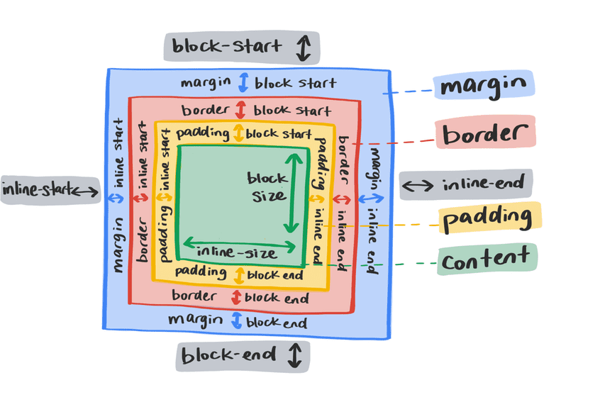

# 布局 


假设您是一名开发者，一位设计师同事为您提供一个全新网站的设计。该设计具有各种有趣的布局和组合：考虑视口宽度和高度的二维布局，以及需要流动和灵活的布局。如何确定使用 CSS 来设置这些样式的最佳方式？

CSS 为我们提供了各种方法来解决横轴、纵轴或两者上的布局问题。为上下文选择正确的布局方法可能并非易事，并且通常您可能需要多种布局方法才能解决问题。为帮助完成这项工作，在接下来的模块中，您将了解每种 CSS 布局机制的独特功能，并据此做出明智的决策。

## 布局：简述

在 Web 发展初期，使用 `` 元素进行布局的设计会比简单的文档更加复杂。当 CSS 在 90 年代后期浏览器得到广泛采用后，您就可以更轻松地将 HTML 与视觉样式分离开来。 CSS 让开发者能够在不接触 HTML 的情况下完全改变网站的外观和风格。 这项新功能激发了 [The CSS Zen Garden](http://www.csszengarden.com/) 等项目的灵感，该项目旨在展示 CSS 的强大功能，鼓励更多开发者学习 CSS。

随着我们对网页设计和浏览器技术的需求不断演变，CSS 也在不断发展。 您可以阅读 [Rachel Andrew 撰写的这篇文章](https://24ways.org/2019/a-history-of-css-through-15-years-of-24-ways/)，了解 CSS 布局以及我们的布局方法是如何不断改进的。


## 布局：现在和未来

现代 CSS 拥有极其强大的布局工具。 我们有专门的布局系统，在深入探讨 Flexbox 和 Grid 的后续模块之前，先大致了解我们可以使用哪些布局。

## 了解 `display` 属性

`display` 属性会执行两项操作。它首先确定应用它所应用的框是 inline 还是块。

```css
.my-element { 
    display: inline;
}
```

内嵌元素的行为类似于句子中的字词。它们在内嵌方向上并排显示。 `` 和 `` 等元素通常用于为所含元素（如 `` [段落]）中的文本段设置样式，它们默认采用内嵌样式。它们还会保留周围的空白。



您无法为内嵌元素设置明确的宽度和高度。周围的元素会忽略任何块级的外边距和内边距。

```css
.my-element { 
    display: block;
}
```

块元素不会并排放置。 他们会自行另起一行。除非被其他 CSS 代码更改，否则块元素将展开为内嵌尺寸，因此在水平书写模式下会跨越整个宽度。将采用 block 元素所有侧边的外边距。

```css
.my-element {  
    display: flex;
}
```

`display` 属性还决定了元素的子元素的行为方式。例如，将 `display` 属性设置为 `display: flex` 会使该框成为块级框，并将其子项转换为弹性项。这会启用用于控制对齐、排序和流动的灵活属性。

## Flexbox 和网格

为多个元素创建布局规则的主要布局机制是 *[flexbox](/web/css/flexbox)* 和 *[grid](/web/css/grid)*。它们虽然有相似之处，但旨在解决不同的布局问题。

**注意** ：我们将在未来的单元中更详细地介绍这两项功能。不过，我们在此简要概述一下两者的用途。

### Flexbox

```css
.my-element { 
    display: flex;
}
```

Flexbox 是一维布局的布局机制。沿单轴布局（水平或垂直）。 默认情况下，Flexbox 将在内嵌方向上彼此相邻地对齐元素的子元素，并在块方向上拉伸这些子元素，使它们的高度相同。

<iframe allow="camera; clipboard-read; clipboard-write; encrypted-media; geolocation; microphone; midi;" loading="lazy" src="https://codepen.io/web-dot-dev/embed/rNjxmor?height=300&amp;theme-id=light&amp;default-tab=css%2Cresult&amp;editable=true" data-darkreader-inline-border-top="" data-darkreader-inline-border-right="" data-darkreader-inline-border-bottom="" data-darkreader-inline-border-left="" data-title="来自 Codepen 上的 web-dot-dev 的 Pen rNjxmor" style="color-scheme: initial; box-sizing: inherit; border: 0px; height: 300px; width: 100%; --darkreader-inline-border-top: 0px; --darkreader-inline-border-right: 0px; --darkreader-inline-border-bottom: 0px; --darkreader-inline-border-left: 0px;"></iframe>
各项内容将保持在同一轴上，且在空间用尽时不会换行。 相反，它们会尝试各自挤入同一行。 可以使用 `align-items`、`justify-content` 和 `flex-wrap` 属性更改此行为。

<iframe allow="camera; clipboard-read; clipboard-write; encrypted-media; geolocation; microphone; midi;" loading="lazy" src="https://codepen.io/web-dot-dev/embed/jOyWLmg?height=500&amp;theme-id=light&amp;default-tab=result&amp;editable=true" data-darkreader-inline-border-top="" data-darkreader-inline-border-right="" data-darkreader-inline-border-bottom="" data-darkreader-inline-border-left="" data-title="来自 Codepen 上的 web-dot-dev 的 Pen jOyWLmg" style="color-scheme: initial; box-sizing: inherit; border: 0px; height: 500px; width: 100%; --darkreader-inline-border-top: 0px; --darkreader-inline-border-right: 0px; --darkreader-inline-border-bottom: 0px; --darkreader-inline-border-left: 0px;"></iframe>
Flexbox 还会将子元素转换为弹性项，这意味着您可以编写规则来控制这些子元素在 Flex 容器中的行为。您可以更改单个内容的对齐方式、顺序和对齐方式。 您还可以使用 `flex` 属性更改其收缩方式。

```css
.my-element div {  
    flex: 1 0 auto;
}
```

`flex` 属性是 `flex-grow`、`flex-shrink` 和 `flex-basis` 的简写形式。您可以按如下方式扩展上面的示例：

```css
.my-element div {
    flex-grow: 1; 
    flex-shrink: 0; 
    flex-basis: auto;
}
```

开发者提供这些低级规则，可以提示浏览器在受到内容和视口尺寸挑战时布局应表现出怎样的行为。这使得它成为响应性网页设计非常有用的机制。

### 网格

```css
.my-element {  
    display: grid;
}
```

网格在很多方面与 **Flexbox** 类似，但其设计是为了控制多轴布局，而不是单轴布局（垂直或水平空间）。

借助网格，您可以针对具有 `display: grid` 的元素编写布局规则，并引入了一些用于布局样式的新基元，例如 `repeat()` 和 `minmax()` 函数。一种实用的网格单元是 `fr` 单元（剩余空间的一小部分），您可以构建传统的 12 列网格，每个项之间有间隔，并具有 3 个 CSS 属性：

```css
.my-element {
    display: grid;  
    grid-template-columns: repeat(12, 1fr); 
    gap: 1rem;
}
```

<iframe allow="camera; clipboard-read; clipboard-write; encrypted-media; geolocation; microphone; midi;" loading="lazy" src="https://codepen.io/web-dot-dev/embed/rNjxGVz?height=500&amp;theme-id=light&amp;default-tab=result&amp;editable=true" data-darkreader-inline-border-top="" data-darkreader-inline-border-right="" data-darkreader-inline-border-bottom="" data-darkreader-inline-border-left="" data-title="由 web-dot-dev 在 Codepen 上撰写的 Pen rNjxGVz" style="color-scheme: initial; box-sizing: inherit; border: 0px; height: 500px; width: 100%; --darkreader-inline-border-top: 0px; --darkreader-inline-border-right: 0px; --darkreader-inline-border-bottom: 0px; --darkreader-inline-border-left: 0px;"></iframe>
上面的此示例展示了一个单轴布局。 Flexbox 主要将各个项视为一个组，而网格可让您在两个维度上精确控制项的位置。我们可以定义此网格中的第一项占据 2 行 3 列：

```css
.my-element :first-child { 
    grid-row: 1/3;  
    grid-column: 1/4;
}
```

`grid-row` 和 `grid-column` 属性指示网格中的第一个元素从第一列跨越到第四列的起始位置，然后从第一行跨越到第三行。

<iframe allow="camera; clipboard-read; clipboard-write; encrypted-media; geolocation; microphone; midi;" loading="lazy" src="https://codepen.io/web-dot-dev/embed/YzNwrwB?height=650&amp;theme-id=light&amp;default-tab=result&amp;editable=true" data-darkreader-inline-border-top="" data-darkreader-inline-border-right="" data-darkreader-inline-border-bottom="" data-darkreader-inline-border-left="" data-title="由 web-dot-dev 在 Codepen 上发布的 Pen YzNwrwB" style="color-scheme: initial; box-sizing: inherit; border: 0px; height: 650px; width: 100%; --darkreader-inline-border-top: 0px; --darkreader-inline-border-right: 0px; --darkreader-inline-border-bottom: 0px; --darkreader-inline-border-left: 0px;"></iframe>
## 流式布局

如果不使用网格或 Flexbox，您的元素会以正常流程显示。在正常流程中，您可以使用多种布局方法来调整项目的行为和位置。

### 内嵌块

还记得周围元素如何不遵循内嵌元素的块外边距和内边距吗？借助 `inline-block`，您可以做到这一点。

```css
p span {  
    display: inline-block;
}
```

使用 `inline-block` 会得到一个具备块级元素一些特性的框，但该框仍然内嵌在文本中。

```css
p span {   
    margin-top: 0.5rem;
}
```

<iframe allow="camera; clipboard-read; clipboard-write; encrypted-media; geolocation; microphone; midi;" loading="lazy" src="https://codepen.io/web-dot-dev/embed/PoWZJKw?height=300&amp;theme-id=light&amp;default-tab=css%2Cresult&amp;editable=true" data-darkreader-inline-border-top="" data-darkreader-inline-border-right="" data-darkreader-inline-border-bottom="" data-darkreader-inline-border-left="" data-title="来自 Codepen 上的 web-dot-dev 的 Pen PoWZJKw" style="color-scheme: initial; box-sizing: inherit; border: 0px; height: 300px; width: 100%; --darkreader-inline-border-top: 0px; --darkreader-inline-border-right: 0px; --darkreader-inline-border-bottom: 0px; --darkreader-inline-border-left: 0px;"></iframe>
### 浮点数

如果某张图片包含在一段文本中，那么这段文字会不会很方便，就像您在报纸中看到的那样？您可以使用浮点数执行此操作。

```css
img {  
    float: left;  
    margin-right: 1em;
}
```

`float` 属性指示元素“浮动”到指定的方向。此示例中的图像被指示向左浮动，然后同级元素可以“环绕”它。您可以指示某个元素悬浮 `left`、`right` 或 `inherit`。

<iframe allow="camera; clipboard-read; clipboard-write; encrypted-media; geolocation; microphone; midi;" loading="lazy" src="https://codepen.io/web-dot-dev/embed/VwPaLMg?height=300&amp;theme-id=light&amp;default-tab=result&amp;editable=true" data-darkreader-inline-border-top="" data-darkreader-inline-border-right="" data-darkreader-inline-border-bottom="" data-darkreader-inline-border-left="" data-title="由 web-dot-dev 在 Codepen 上开发的 Pen VwPaLMg" style="color-scheme: initial; box-sizing: inherit; border: 0px; height: 300px; width: 100%; --darkreader-inline-border-top: 0px; --darkreader-inline-border-right: 0px; --darkreader-inline-border-bottom: 0px; --darkreader-inline-border-left: 0px;"></iframe>
**警告** ：使用 `float` 时，请注意，浮动元素后面的所有元素的布局都可能会调整。为了防止出现这种情况，您可以清除浮动元素，方法是对浮动元素之后的元素使用 `clear: both`，或对浮动元素的父级使用 `display: flow-root`。有关详情，请参阅 [clearfix 黑客攻击结束](https://rachelandrew.co.uk/archives/2017/01/24/the-end-of-the-clearfix-hack/)一文。

### 多列布局

如果您的元素列表非常长，例如全世界所有国家/地区的列表，则可能会导致用户进行*大量*的滚动操作并浪费时间。它还会导致网页上产生多余的空白。 借助 CSS 多列，您可以将此列拆分为多列，以解决这两个问题。

```html
<h1>All countries</h1>
<ul class="countries"> 
    <li>Argentina</li>  
    <li>Aland Islands</li> 
    <li>Albania</li> 
    <li>Algeria</li> 
    <li>American Samoa</li> 
    <li>Andorra</li> 
</ul>
.countries { 
    column-count: 2;   
    column-gap: 1em;
}
```

这会自动将这个长列表拆分成两列，并在两列之间添加一个间距。

<iframe allow="camera; clipboard-read; clipboard-write; encrypted-media; geolocation; microphone; midi;" loading="lazy" src="https://codepen.io/web-dot-dev/embed/gOgrpzO?height=500&amp;theme-id=light&amp;default-tab=result&amp;editable=true" data-darkreader-inline-border-top="" data-darkreader-inline-border-right="" data-darkreader-inline-border-bottom="" data-darkreader-inline-border-left="" data-title="由 web-dot-dev 在 Codepen 上发布的 Pen gOgrpzO" style="color-scheme: initial; box-sizing: inherit; border: 0px; height: 500px; width: 100%; --darkreader-inline-border-top: 0px; --darkreader-inline-border-right: 0px; --darkreader-inline-border-bottom: 0px; --darkreader-inline-border-left: 0px;"></iframe>
```css
.countries {   
    width: 100%; 
    column-width: 260px;  
    column-gap: 1em;
}
```

<iframe allow="camera; clipboard-read; clipboard-write; encrypted-media; geolocation; microphone; midi;" loading="lazy" src="https://codepen.io/web-dot-dev/embed/jOyqPvB?height=500&amp;theme-id=light&amp;default-tab=result&amp;editable=true" data-darkreader-inline-border-top="" data-darkreader-inline-border-right="" data-darkreader-inline-border-bottom="" data-darkreader-inline-border-left="" data-title="由 web-dot-dev 在 Codepen 上开发的 Pen jOyqPvB" style="color-scheme: initial; box-sizing: inherit; border: 0px; height: 500px; width: 100%; --darkreader-inline-border-top: 0px; --darkreader-inline-border-right: 0px; --darkreader-inline-border-bottom: 0px; --darkreader-inline-border-left: 0px;"></iframe>
您还可以使用 `column-width` 定义所需的最小宽度，而不是设置拆分的列数。随着视口中的可用空间增多，系统会自动创建更多列，随着空间的减少，列数也会减少。这在响应性网页设计环境中非常有用。

### Positioning

关于布局机制概述的最后一个内容是定位。 `position` 属性可更改元素在文档正常流程中的行为方式，以及元素与其他元素的关系。可用选项包括 `relative`、`absolute`、`fixed` 和 `sticky`，默认值为 `static`。

```css
.my-element { 
    position: relative; 
    top: 10px;
}
```

此元素相对于其自身位置，基于其在文档中的当前位置向下微移 10 像素。将 `position: relative` 添加到元素也会使其成为包含 `position: absolute` 的任何子元素的包含块。这意味着，当对其应用了绝对位置时，其子元素将重新定位到此特定元素，而不是最顶层的相对父元素。

```css
.my-element { 
    position: relative; 
    width: 100px; 
    height: 100px;
}
.another-element { 
    position: absolute;  
    bottom: 0;  
    right: 0;  
    width: 50px;  
    height: 50px;
}
```

如果将 `position` 设置为 `absolute`，则会将该元素脱离当前文档流程。这意味着有两个方面：

1. 您可以将此元素放到任何位置，只需在其最近的相对父项中使用 `top`、`right`、`bottom` 和 `left` 即可。
2. 绝对元素周围的所有内容都会重排，以填充该元素所剩的剩余空间。

`position` 值为 `fixed` 的元素的行为与 `absolute` 类似，其父级是根 `` 元素。固定位置元素会根据您设置的 `top`、`right`、`bottom` 和 `left` 值保持在左上角锚定。

您可以使用 `sticky` 实现 `fixed` 的锚定固定方面以及 `relative` 的可预测性更强的文档流遵循方面。使用此值时，当视口滚动经过该元素时，它会固定在您设置的 `top`、`right`、`bottom` 和 `left` 值上。

<iframe allow="camera; clipboard-read; clipboard-write; encrypted-media; geolocation; microphone; midi;" loading="lazy" src="https://codepen.io/web-dot-dev/embed/NWdNGZB?height=600&amp;theme-id=light&amp;default-tab=result&amp;editable=true" data-darkreader-inline-border-top="" data-darkreader-inline-border-right="" data-darkreader-inline-border-bottom="" data-darkreader-inline-border-left="" data-title="由 web-dot-dev 在 Codepen 上的 Pen NWdNGZB" style="color-scheme: initial; box-sizing: inherit; border: 0px; height: 600px; width: 100%; --darkreader-inline-border-top: 0px; --darkreader-inline-border-right: 0px; --darkreader-inline-border-bottom: 0px; --darkreader-inline-border-left: 0px;"></iframe>
## 小结

CSS 布局有很多选择余地，也很灵活。 要深入了解 CSS [Flexbox](/web/css/flexbox) 和 [Grid](/web/css/grid) 的强大功能，请继续学习接下来的几个模块。
