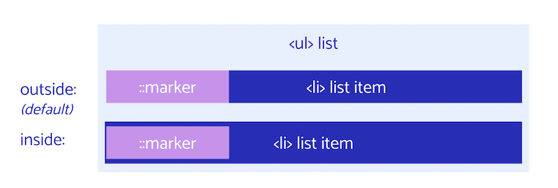
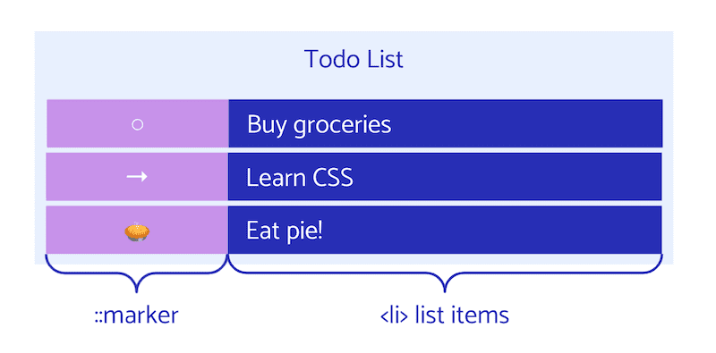

# 列表 


假设您打算在下次采购杂货时购买多件商品。通过列表来直观表示这种样式的一种常用方法是，但该如何向购物清单中添加样式呢？

```html
<ul> 
    <li>oat milk</li> 
    <li>rhubarb</li>
    <li>cereal</li>
    <li>pie crust</li>
</ul>
```

<iframe allow="camera; clipboard-read; clipboard-write; encrypted-media; geolocation; microphone; midi;" loading="lazy" src="https://codepen.io/web-dot-dev/embed/zYzrEOW?height=500&amp;theme-id=light&amp;default-tab=result&amp;editable=true" data-darkreader-inline-border-top="" data-darkreader-inline-border-right="" data-darkreader-inline-border-bottom="" data-darkreader-inline-border-left="" data-title="Codepen 上 web-dot-dev 的 Pen zYzrEOW" style="color-scheme: initial; box-sizing: inherit; border: 0px; height: 500px; width: 100%; --darkreader-inline-border-top: 0px; --darkreader-inline-border-right: 0px; --darkreader-inline-border-bottom: 0px; --darkreader-inline-border-left: 0px;"></iframe>

## 创建列表

上述列表以一个语义元素（即 ``）开头，并将购物清单项（`` 元素）作为子级。如果您检查每个 `` 元素，就会发现它们都包含 `display: list-item`，这也是浏览器默认呈现 `::marker` 的原因。

```css
li { 
    display: list-item;
}
```

还有两种其他类型的列表。

您可以使用 `` 创建有序列表，在这种情况下，列表项会将数字显示为 `::marker`。

```html
<ol> 
    <li>oat milk</li> 
    <li>rhubarb</li> 
    <li>cereal</li> 
    <li>pie crust</li>
</ol>
```

说明列表是使用 `` 创建的，但此列表类型不使用 `` 列表项元素。

```html
<dl> 
    <dt>oat milk</dt> 
    <dd>- non dairy trendy drink</dd>
    <dt>cereal</dt>
    <dd>- breakfast food</dd>
</dl>
```

<iframe allow="camera; clipboard-read; clipboard-write; encrypted-media; geolocation; microphone; midi;" loading="lazy" src="https://codepen.io/web-dot-dev/embed/WNOrZNG?height=500&amp;theme-id=light&amp;default-tab=result&amp;editable=true" data-darkreader-inline-border-top="" data-darkreader-inline-border-right="" data-darkreader-inline-border-bottom="" data-darkreader-inline-border-left="" data-title="Codepen 上的 web-dot-dev 的 Pen WNOrZNG" style="color-scheme: initial; box-sizing: inherit; border: 0px; height: 500px; width: 100%; --darkreader-inline-border-top: 0px; --darkreader-inline-border-right: 0px; --darkreader-inline-border-bottom: 0px; --darkreader-inline-border-left: 0px;"></iframe>

## 列表样式

<BrowseSurport code="css.properties.list-style-position" />


现在，您已经知道了如何创建列表，接下来可以设置列表样式了。首先要发现的 CSS 属性是应用于整个列表的属性。

您可以使用以下三个列表样式属性来设置示例样式：`list-style-position`、`list-style-image` 和 `list-style-type`。

### `list-style-position`

[`list-style-position`](https://developer.mozilla.org/docs/Web/CSS/list-style-position) 可让您将项目符号移至 `inside` 或 `outside` 列表项的内容。默认的 `outside` 表示项目符号不包括在列表项内容中，而 `inside` 会在列表项的内容中移动第一个元素。



<iframe allow="camera; clipboard-read; clipboard-write; encrypted-media; geolocation; microphone; midi;" loading="lazy" src="https://codepen.io/web-dot-dev/embed/ExXPwxL?height=500&amp;theme-id=light&amp;default-tab=result&amp;editable=true" data-darkreader-inline-border-top="" data-darkreader-inline-border-right="" data-darkreader-inline-border-bottom="" data-darkreader-inline-border-left="" data-title="Codepen 上的 web-dot-dev 的 Pen ExXPwxL" style="color-scheme: initial; box-sizing: inherit; border: 0px; height: 500px; width: 100%; --darkreader-inline-border-top: 0px; --darkreader-inline-border-right: 0px; --darkreader-inline-border-bottom: 0px; --darkreader-inline-border-left: 0px;"></iframe>

### `list-style-image`

[`list-style-image`](https://developer.mozilla.org/docs/Web/CSS/list-style-image) 可让您将列表的项目符号替换为图片。通过此设置，您可以设置 `url` 或 `none` 等图片，将项目符号设为图片、svg 或 GIF。您还可以使用任何媒体类型，甚至是数据 URI。

我们来看看如何将每件杂货的图片添加为 `list-style-image`：

<iframe allow="camera; clipboard-read; clipboard-write; encrypted-media; geolocation; microphone; midi;" loading="lazy" src="https://codepen.io/web-dot-dev/embed/GREoMgK?height=500&amp;theme-id=light&amp;default-tab=css%2Cresult&amp;editable=true" data-darkreader-inline-border-top="" data-darkreader-inline-border-right="" data-darkreader-inline-border-bottom="" data-darkreader-inline-border-left="" data-title="web-dot-dev 上的 Pen GREoMgK" style="color-scheme: initial; box-sizing: inherit; border: 0px; height: 500px; width: 100%; --darkreader-inline-border-top: 0px; --darkreader-inline-border-right: 0px; --darkreader-inline-border-bottom: 0px; --darkreader-inline-border-left: 0px;"></iframe>

**注意** ：此属性在控制项目符号的位置和大小方面存在一些限制，因此建议使用 [`::marker`](/web/css/lists#marker_pseudo-element) 属性以获得自定义程度更高的方法。

### `list-style-type`

最后一个选项是设置 [`list-style-type`](https://developer.mozilla.org/docs/Web/CSS/list-style-type) 的样式，这会将项目符号更改为已知样式关键字、自定义字符串、表情符号等。您可以在[此处](https://developer.mozilla.org/docs/Web/CSS/list-style-type)查看所有可能的列表样式类型。

<iframe allow="camera; clipboard-read; clipboard-write; encrypted-media; geolocation; microphone; midi;" loading="lazy" src="https://codepen.io/web-dot-dev/embed/jOwWGEy?height=500&amp;theme-id=light&amp;default-tab=css%2Cresult&amp;editable=true" data-darkreader-inline-border-top="" data-darkreader-inline-border-right="" data-darkreader-inline-border-bottom="" data-darkreader-inline-border-left="" data-title="Codepen 上 web-dot-dev 的 Pen jOwWGEy" style="color-scheme: initial; box-sizing: inherit; border: 0px; height: 500px; width: 100%; --darkreader-inline-border-top: 0px; --darkreader-inline-border-right: 0px; --darkreader-inline-border-bottom: 0px; --darkreader-inline-border-left: 0px;"></iframe>

### `list-style`简写

现在，您已经拥有了所有这些单独的属性，接下来可以使用 [`list-style`](https://developer.mozilla.org/docs/Web/CSS/list-style) 简写形式在一行中设置所有列表样式：

```css
list-style: <'list-style-type'> || <'list-style-position'> || <'list-style-image'>
```

`list-style` 允许您以任何顺序声明一个、两个或三个 `list-style` 属性的组合。如果 `list-style-type` 和 `list-style-image` 均已设置，则在图片不可用时，`list-style-type` 会用作后备值。

```css
/* type */
list-style: square;
/* image */
list-style: url('../img/shape.png');
/* position */
list-style: inside;
/* type | position */
list-style: georgian inside;
/* type | image | position */
list-style: lower-roman url('../img/shape.png') outside;
/* Keyword value */
list-style: none;
/* Global values */
list-style: inherit;
list-style: initial;
list-style: revert;
list-style: unset;
```

这是本部分介绍的列表样式中最常用的属性。一种常见的应用是用于隐藏默认样式的 `list-style: none`。默认样式来自浏览器，您经常看到重置样式表会移除内边距和外边距等列表样式。您还可以使用此简写形式设置样式，例如 `list-style: square inside;`

<iframe allow="camera; clipboard-read; clipboard-write; encrypted-media; geolocation; microphone; midi;" loading="lazy" src="https://codepen.io/web-dot-dev/embed/eYRJGme?height=500&amp;theme-id=light&amp;default-tab=result&amp;editable=true" data-darkreader-inline-border-top="" data-darkreader-inline-border-right="" data-darkreader-inline-border-bottom="" data-darkreader-inline-border-left="" data-title="Codepen 上的 web-dot-dev 的 Pen eYRJGme" style="color-scheme: initial; box-sizing: inherit; border: 0px; height: 500px; width: 100%; --darkreader-inline-border-top: 0px; --darkreader-inline-border-right: 0px; --darkreader-inline-border-bottom: 0px; --darkreader-inline-border-left: 0px;"></iframe>

到目前为止，这些示例侧重于设置整个列表和列表项的样式，那么更精细的方法呢？

## `::marker` 伪元素

`list-item` 标记元素是项目符号、连字符或罗马数字，用于帮助指明列表中的每项内容。



如果您在开发者工具中检查列表，可以看到每个列表项的 `::marker` 元素，即使您未在 HTML 中声明任何元素也是如此。如果您进一步检查 `::marker`，会看到它的浏览器默认样式。

```css
::marker { 
    unicode-bidi: isolate;  
    font-variant-numeric: tabular-nums;  
    text-transform: none;  
    text-indent: 0px !important;  
    text-align: start !important;   
    text-align-last: start !important;
}
```

声明列表时，每个项都会获得一个标记，即使您的 HTML 中没有项目符号或罗马数字。这是一个伪元素，因为浏览器会为您生成它，并提供一个有限的样式 API 来定位它。`::marker` 在 Safari 中[支持有限](https://developer.mozilla.org/docs/Web/CSS/::marker#browser_compatibility)。

### 标记框

在 CSS 布局模型中，列表项标记由与每个列表项相关联的标记框表示。标记框是通常包含项目符号或编号的容器。

若要设置标记框的样式，您可以使用 `::marker` 选择器。这样一来，您可以只选择标记，而不是根据整个列表设置样式。

<iframe allow="camera; clipboard-read; clipboard-write; encrypted-media; geolocation; microphone; midi;" loading="lazy" src="https://codepen.io/web-dot-dev/embed/jOwWGPy?height=500&amp;theme-id=light&amp;default-tab=css%2Cresult&amp;editable=true" data-darkreader-inline-border-top="" data-darkreader-inline-border-right="" data-darkreader-inline-border-bottom="" data-darkreader-inline-border-left="" data-title="Codepen 上 web-dot-dev 的 Pen jOwWGPy" style="color-scheme: initial; box-sizing: inherit; border: 0px; height: 500px; width: 100%; --darkreader-inline-border-top: 0px; --darkreader-inline-border-right: 0px; --darkreader-inline-border-bottom: 0px; --darkreader-inline-border-left: 0px;"></iframe>

**注意** ：`::marker` 元素位于您可能使用 CSS `::before` 插入的任何伪元素之前。

### 标记样式

现在，您已经选择了标记，我们来看看此选择器可用的样式属性。

允许使用的 CSS `::marker` 属性有很多：

- `animation-*`
- `transition-*`
- `color`
- `direction`
- `font-*`
- `content`
- `unicode-bidi`
- `white-space`

<iframe allow="camera; clipboard-read; clipboard-write; encrypted-media; geolocation; microphone; midi;" loading="lazy" src="https://codepen.io/web-dot-dev/embed/eYRJGNy?height=500&amp;theme-id=light&amp;default-tab=result&amp;editable=true" data-darkreader-inline-border-top="" data-darkreader-inline-border-right="" data-darkreader-inline-border-bottom="" data-darkreader-inline-border-left="" data-title="Codepen 上的 web-dot-dev 的 Pen eYRJGNy" style="color-scheme: initial; box-sizing: inherit; border: 0px; height: 500px; width: 100%; --darkreader-inline-border-top: 0px; --darkreader-inline-border-right: 0px; --darkreader-inline-border-bottom: 0px; --darkreader-inline-border-left: 0px;"></iframe>

**注意** ：在有序列表中，项目符号默认为数字。`::marker` 内容值是[计数器](https://developer.mozilla.org/docs/Web/CSS/CSS_Lists_and_Counters/Using_CSS_counters)的一种用例，可用于创建自定义编号。

## 屏幕类型

我们的所有 `list-style` 和 `::marker` 属性都知道为 `` 元素设置样式，因为它们的默认显示值为 list-item。您还可以将非 `` 的内容转换为列表项。

为此，您可以添加属性 `display: list-item`。如果您想在标题上添加一个悬挂的项目符号，以便使用 `::marker` 将其更改为其他内容，就可以使用 `display: list-item`。以下示例展示了使用 `display: list-item` 来设置样式的标题，以及使用正确列表标记的列表。

<iframe allow="camera; clipboard-read; clipboard-write; encrypted-media; geolocation; microphone; midi;" loading="lazy" src="https://codepen.io/web-dot-dev/embed/ExXPwjR?height=500&amp;theme-id=light&amp;default-tab=css%2Cresult&amp;editable=true" data-darkreader-inline-border-top="" data-darkreader-inline-border-right="" data-darkreader-inline-border-bottom="" data-darkreader-inline-border-left="" data-title="Codepen 上的 web-dot-dev 的 Pen ExXPwjR" style="color-scheme: initial; box-sizing: inherit; border: 0px; height: 500px; width: 100%; --darkreader-inline-border-top: 0px; --darkreader-inline-border-right: 0px; --darkreader-inline-border-bottom: 0px; --darkreader-inline-border-left: 0px;"></iframe>

虽然您可以使用 `display` 将任何内容转换为列表项视图，但如果您要设置样式的内容实际上是一个列表，则不应使用该方法，而不应使用正确的列表标记。将某个项的视觉外观更改为列表项不会更改无障碍服务读取和识别该项的方式，因此屏幕阅读器或切换设备时不会将其作为列表项读取。您应该始终使用语义标记并尽可能使用 `` 创建列表。

## 资源

- [关于样式列表的 MDN 指南](https://developer.mozilla.org/docs/Learn/CSS/Styling_text/Styling_lists)
- [Smashing 杂志：CSS 列表、标记和计数器](https://www.smashingmagazine.com/2019/07/css-lists-markers-counters/)
- [使用 CSS 计数器的 MDN](https://developer.mozilla.org/docs/Web/CSS/CSS_Lists_and_Counters/Using_CSS_counters)
- [CSS 列表和计数器模块级别 3](https://www.w3.org/TR/css-lists-3/)
- [CSS 技巧：使用 CSS 计数器和 CSS 网格进行计数](https://css-tricks.com/counting-css-counters-css-grid/)