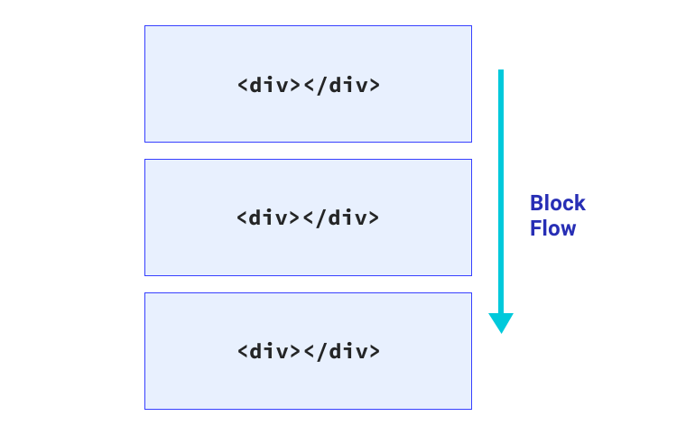

# 逻辑属性 

一种非常常见的界面模式是带有支持内嵌图标的文本标签。

<iframe allow="camera; clipboard-read; clipboard-write; encrypted-media; geolocation; microphone; midi;" loading="lazy" src="https://codepen.io/web-dot-dev/embed/eYgvZBx?height=500&amp;theme-id=light&amp;default-tab=result&amp;editable=true" data-darkreader-inline-border-top="" data-darkreader-inline-border-right="" data-darkreader-inline-border-bottom="" data-darkreader-inline-border-left="" data-title="由 web-dot-dev 在 Codepen 上开发的 Pen eYgvZBx" style="color-scheme: initial; box-sizing: inherit; border: 0px; height: 500px; width: 100%; --darkreader-inline-border-top: 0px; --darkreader-inline-border-right: 0px; --darkreader-inline-border-bottom: 0px; --darkreader-inline-border-left: 0px;"></iframe>

该图标位于文本左侧，两者之间有较小的间隙，由图标上的 `margin-right` 提供。但这存在一个问题，因为此方法仅在文本方向是从左到右时才有效。如果文本方向更改为从右到左（阿拉伯语等语言的阅读方向），则图标将与文本并排显示。

<iframe allow="camera; clipboard-read; clipboard-write; encrypted-media; geolocation; microphone; midi;" loading="lazy" src="https://codepen.io/web-dot-dev/embed/BapWKWm?height=500&amp;theme-id=light&amp;default-tab=result&amp;editable=true" data-darkreader-inline-border-top="" data-darkreader-inline-border-right="" data-darkreader-inline-border-bottom="" data-darkreader-inline-border-left="" data-title="由 web-dot-dev 在 Codepen 上开发的 Pen BapWKWm" style="color-scheme: initial; box-sizing: inherit; border: 0px; height: 500px; width: 100%; --darkreader-inline-border-top: 0px; --darkreader-inline-border-right: 0px; --darkreader-inline-border-bottom: 0px; --darkreader-inline-border-left: 0px;"></iframe>

在 CSS 中如何考虑这一点？ 通过逻辑属性，您可以解决这些情况。该平台还提供许多其他优势，例如免费自动支持国际化。它们可以帮助您构建弹性更佳、更具包容性的前端。

## 术语

顶部、右侧、底部和左侧的物理属性是指视口的物理尺寸。您可以将它们想象成地图上的罗盘。另一方面，逻辑属性指的是框的边缘，因为它们与*内容流*相关。因此，如果文本方向或书写模式发生变化，它们可能会发生变化。 这是对方向样式的一次重大转变，并且在设置界面样式时为我们提供了更大的灵活性。

## 屏蔽数据流

块流是指内容块的放置方向。 例如，如果存在两个段落，则块流是第二个段落的显示位置。 在英语文档中，块流是从上到下。 不妨以自上而下、相继的文本段落为例进行说明。



## 内嵌流程

内嵌流是指文本在句子中的流动方式。在英语文档中，内嵌流程从左到右显示。如果您将网页的文档语言更改为阿拉伯语 (``)，则内嵌流程将为从右到左。


文本沿文档的书写模式确定的方向流动。 您可以使用 `writing-mode` 属性更改文本的布局方向。它可以应用于整个文档或单个元素。

<iframe allow="camera; clipboard-read; clipboard-write; encrypted-media; geolocation; microphone; midi;" loading="lazy" src="https://codepen.io/web-dot-dev/embed/YzNZGam?height=500&amp;theme-id=light&amp;default-tab=result&amp;editable=true" data-darkreader-inline-border-top="" data-darkreader-inline-border-right="" data-darkreader-inline-border-bottom="" data-darkreader-inline-border-left="" data-title="来自 Codepen 上的 web-dot-dev 的 Pen YzNZGam" style="color-scheme: initial; box-sizing: inherit; border: 0px; height: 500px; width: 100%; --darkreader-inline-border-top: 0px; --darkreader-inline-border-right: 0px; --darkreader-inline-border-bottom: 0px; --darkreader-inline-border-left: 0px;"></iframe>


## 流相对

过去，在 CSS 中，我们只能应用相对于边方向方向的外边距等属性。例如，`margin-top` 会应用于元素的实际顶部。如果添加了逻辑属性，`margin-top` 会变为 `margin-block-start`。这意味着，无论语言和文本方向如何，**块流**都有适当的外边距规则。

<iframe allow="camera; clipboard-read; clipboard-write; encrypted-media; geolocation; microphone; midi;" loading="lazy" src="https://codepen.io/web-dot-dev/embed/ZELeBzM?height=500&amp;theme-id=light&amp;default-tab=result&amp;editable=true" data-darkreader-inline-border-top="" data-darkreader-inline-border-right="" data-darkreader-inline-border-bottom="" data-darkreader-inline-border-left="" data-title="Codepen 上 web-dot-dev 的 Pen ZELeBzM" style="color-scheme: initial; box-sizing: inherit; border: 0px; height: 500px; width: 100%; --darkreader-inline-border-top: 0px; --darkreader-inline-border-right: 0px; --darkreader-inline-border-bottom: 0px; --darkreader-inline-border-left: 0px;"></iframe>


## 大小

为防止某个元素超出特定宽度或高度，可以编写如下规则：

```css
.my-element { 
    max-width: 150px;  
    max-height: 100px;
}
```

相对流的等效项是 `max-inline-size` 和 `max-block-size`。您也可以使用 `min-block-size` 和 `min-inline-size`，而不是 `min-height` 和 `min-width`。

如果使用逻辑属性，最大宽度和高度规则将如下所示：

```css
.my-element {
    max-inline-size: 150px;  
    max-block-size: 100px;
}
```

## 开始和结束

不要使用上、右、下、左等方向，而应使用 start 和 end。这为您提供 block-start、inline-end、block-end 和 inline-start。通过这些属性，您可以应用响应写入模式更改的 CSS 属性。

例如，如需将文本右对齐，您可以使用以下 CSS：

```css
p { 
    text-align: right;
}
```

如果您不希望与实际的右侧对齐，而是与阅读方向的开始对齐，则这样做没有用。 借助逻辑值，可映射到文本方向的 `start` 和 `end` 值更加实用。文本对齐规则现在如下所示：

```css
p { 
    text-align: end;
}
```

<iframe allow="camera; clipboard-read; clipboard-write; encrypted-media; geolocation; microphone; midi;" loading="lazy" src="https://codepen.io/web-dot-dev/embed/QWdpdwo?height=500&amp;theme-id=light&amp;default-tab=result&amp;editable=true" data-darkreader-inline-border-top="" data-darkreader-inline-border-right="" data-darkreader-inline-border-bottom="" data-darkreader-inline-border-left="" data-title="由 web-dot-dev 在 Codepen 上的 Pen QWdpdwo" style="color-scheme: initial; box-sizing: inherit; border: 0px; height: 500px; width: 100%; --darkreader-inline-border-top: 0px; --darkreader-inline-border-right: 0px; --darkreader-inline-border-bottom: 0px; --darkreader-inline-border-left: 0px;"></iframe>


## 间距和定位

`margin`、`padding` 和 `inset` 的逻辑属性可以使元素定位以及确定这些元素在写入模式下如何相互交互的方式变得更加轻松和高效。与外边距和内边距相关的属性仍然是指向方向的直接映射，但关键区别在于，当书写模式发生变化时，这些属性会随之发生变化。

```css
.my-element { 
    padding-top: 2em;  
    padding-bottom: 2em; 
    margin-left: 2em; 
    position: relative; 
    top: 0.2em;
}
```

这样会使用 `padding` 添加一些垂直空间，并使用 `margin` 将其从左侧推出。`top` 属性也会将其下移。 使用逻辑属性等效项，则变为如下形式：

```css
.my-element { 
    padding-block-start: 2em; 
    padding-block-end: 2em;
    margin-inline-start: 2em; 
    position: relative; 
    inset-block-start: 0.2em;
}
```

这样会使用 `padding` 添加一些内嵌空间，并使用 `margin` 将其从内嵌开头向外推出。`inset-block` 属性将其从 block-start 向内移动。

`inset-block` 属性不是唯一具有逻辑属性的简写选项。使用外边距和内边距属性的简写版本可以进一步压缩此规则。

```css
.my-element { 
    padding-block: 2em; 
    margin-inline: 2em 0;
    position: relative; 
    inset-block: 0.2em 0;
}
```

## 边框

您也可以使用逻辑属性添加 `border` 和 `border-radius`。要在右下角和右侧添加带有右侧半径的边框，可以编写如下规则：

```css
.my-element {
    border-bottom: 1px solid red;
    border-right: 1px solid red;
    border-bottom-right-radius: 1em;
}
```

或者，您也可以使用如下逻辑属性：

```css
.my-element { 
    border-block-end: 1px solid red; 
    border-inline-end: 1px solid red; 
    border-end-end-radius: 1em;
}
```

`border-end-end-radius` 中的 `end-end` 是块结束和内嵌结束。

<iframe allow="camera; clipboard-read; clipboard-write; encrypted-media; geolocation; microphone; midi;" loading="lazy" src="https://codepen.io/web-dot-dev/embed/yLgMgby?height=500&amp;theme-id=light&amp;default-tab=result&amp;editable=true" data-darkreader-inline-border-top="" data-darkreader-inline-border-right="" data-darkreader-inline-border-bottom="" data-darkreader-inline-border-left="" data-title="由 web-dot-dev 在 Codepen 上开发的 Pen yLgMgby" style="color-scheme: initial; box-sizing: inherit; border: 0px; height: 500px; width: 100%; --darkreader-inline-border-top: 0px; --darkreader-inline-border-right: 0px; --darkreader-inline-border-bottom: 0px; --darkreader-inline-border-left: 0px;"></iframe>


## 单位

逻辑属性引入了两个新单元：`vi` 和 `vb`。在内嵌方向上，`vi` 单位是视口大小的 1%。等效的非逻辑属性为 `vw`。`vb` 单位是块方向上视口的 1%。等效的非逻辑属性为 `vh`。

这些单位将始终与阅读方向相对应。 例如，如果您希望某个元素占据视口的 80% 可用的内嵌空间，那么使用 `vi` 单元后，如果书写模式为垂直，系统会自动将该大小切换为从上到下。

## 切实使用逻辑属性

逻辑属性和写入模式不仅适用于国际化。您可以使用它们来生成功能更丰富的界面。

如果您的图表在 X 轴和 Y 轴上都带有标签，您可能希望 Y 轴上的文本垂直读取。

<iframe allow="camera; clipboard-read; clipboard-write; encrypted-media; geolocation; microphone; midi;" loading="lazy" src="https://codepen.io/web-dot-dev/embed/zYNZNgE?height=500&amp;theme-id=light&amp;default-tab=result&amp;editable=true" data-darkreader-inline-border-top="" data-darkreader-inline-border-right="" data-darkreader-inline-border-bottom="" data-darkreader-inline-border-left="" data-title="由 web-dot-dev 在 Codepen 上发布的 Pen zYNZNgE" style="color-scheme: initial; box-sizing: inherit; border: 0px; height: 500px; width: 100%; --darkreader-inline-border-top: 0px; --darkreader-inline-border-right: 0px; --darkreader-inline-border-bottom: 0px; --darkreader-inline-border-left: 0px;"></iframe>

由于演示中的 Y 轴标签的 `writing-mode` 为 `vertical-rl`，因此您可以对这两个标签使用相同的 `margin` 值。`margin-block-start` 值同时适用于这两个标签，因为块的起点位于 Y 轴右侧，X 轴位于顶部。积木两侧有红色边框，方便您看到。

## 解决图标问题

我们已经介绍了逻辑属性，现在这些知识可以应用于我们一开始的设计问题。

<iframe allow="camera; clipboard-read; clipboard-write; encrypted-media; geolocation; microphone; midi;" loading="lazy" src="https://codepen.io/web-dot-dev/embed/eYgvZBx?height=500&amp;theme-id=light&amp;default-tab=result&amp;editable=true" data-darkreader-inline-border-top="" data-darkreader-inline-border-right="" data-darkreader-inline-border-bottom="" data-darkreader-inline-border-left="" data-title="由 web-dot-dev 在 Codepen 上开发的 Pen eYgvZBx" style="color-scheme: initial; box-sizing: inherit; border: 0px; height: 500px; width: 100%; --darkreader-inline-border-top: 0px; --darkreader-inline-border-right: 0px; --darkreader-inline-border-bottom: 0px; --darkreader-inline-border-left: 0px;"></iframe>

```css
p { 
    display: inline-flex; 
    align-items: center;
}
p svg { 
    width: 1.2em; 
    height: 1.2em; 
    margin-right: 0.5em;  
    flex: none;
}
```

外边距已应用于图标元素的右侧。 为了使图标和文本之间的间距支持所有阅读方向，需要改用 `margin-inline-end` 属性。

```css
p { 
	display: inline-flex;  
    align-items: center;
}
p svg { 
    width: 1.2em; 
    height: 1.2em; 
    margin-inline-end: 0.5em;  
    flex: none;
}
```

<iframe allow="camera; clipboard-read; clipboard-write; encrypted-media; geolocation; microphone; midi;" loading="lazy" src="https://codepen.io/web-dot-dev/embed/qBRrrOy?height=500&amp;theme-id=light&amp;default-tab=result&amp;editable=true" data-darkreader-inline-border-top="" data-darkreader-inline-border-right="" data-darkreader-inline-border-bottom="" data-darkreader-inline-border-left="" data-title="Codepen 上 web-dot-dev 的 Pen qBRrrOy" style="color-scheme: initial; box-sizing: inherit; border: 0px; height: 500px; width: 100%; --darkreader-inline-border-top: 0px; --darkreader-inline-border-right: 0px; --darkreader-inline-border-bottom: 0px; --darkreader-inline-border-left: 0px;"></iframe>

现在，无论阅读方向如何，图标都会自行放置并适当调整自身间距。


