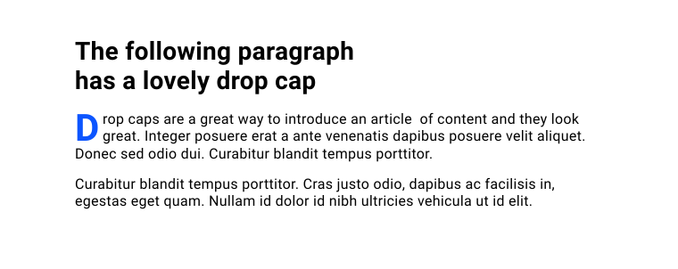

# 伪元素 


如果您有一篇内容文章，并且希望第一个字母大得多，您该如何实现这一点？



在 CSS 中，您可以使用 `::first-letter` 伪元素来实现此类设计细节。

```css
p::first-letter { 
    color: blue;  
    float: left;  
    font-size: 2.6em; 
    font-weight: bold; 
    line-height: 1; 
    margin-inline-end: 0.2rem;
}
```

<iframe allow="camera; clipboard-read; clipboard-write; encrypted-media; geolocation; microphone; midi;" loading="lazy" src="https://codepen.io/web-dot-dev/embed/PoWjybP?height=500&amp;theme-id=light&amp;default-tab=result&amp;editable=true" data-darkreader-inline-border-top="" data-darkreader-inline-border-right="" data-darkreader-inline-border-bottom="" data-darkreader-inline-border-left="" data-title="Codepen 上的 web-dot-dev 的 Pen PoWjybP" style="color-scheme: initial; box-sizing: inherit; border: 0px; height: 500px; width: 100%; --darkreader-inline-border-top: 0px; --darkreader-inline-border-right: 0px; --darkreader-inline-border-bottom: 0px; --darkreader-inline-border-left: 0px;"></iframe>

伪元素类似于添加或定位额外的元素而无需添加更多 HTML。此示例解决方案使用 `::first-letter`，是众多伪元素之一。它们的作用多种多样，在本课程中，您将了解可用的伪元素以及如何使用它们。

## `::before`和`::after`

仅当您定义了 `content` 属性时，[`::before`](https://developer.mozilla.org/docs/Web/CSS/::before) 和 [`::after`](https://developer.mozilla.org/docs/Web/CSS/::after) 伪元素才会在元素内创建子元素。

```css
.my-element::before {  
    content: "";
}
.my-element::after { 
    content: "";
}
```

`content` 可以是任何字符串（即使是空字符串），但请注意，屏幕阅读器可能会读出空字符串以外的任何内容。 您可以添加图片 `url`，它会以原始尺寸插入图片，因此您无法调整其大小。您还可以插入 [`counter`](https://developer.mozilla.org/docs/Web/CSS/counter())。

**关键术语** ：您可以创建命名计数器，然后根据其在文档流中的位置递增该计数器。在各种上下文中，它们都非常实用，例如自动为轮廓编号。

创建 `::before` 或 `::after` 元素后，您可以随意为其设置样式，且没有任何限制。您只能将 `::before` 或 `::after` 元素插入接受子元素的元素（[包含文档树的元素](https://www.w3.org/TR/CSS21/generate.html)），因此 ``、`` 和 `` 等元素将不起作用。

<iframe allow="camera; clipboard-read; clipboard-write; encrypted-media; geolocation; microphone; midi;" loading="lazy" src="https://codepen.io/web-dot-dev/embed/GRrEYrg?height=500&amp;theme-id=light&amp;default-tab=result&amp;editable=true" data-darkreader-inline-border-top="" data-darkreader-inline-border-right="" data-darkreader-inline-border-bottom="" data-darkreader-inline-border-left="" data-title="由 web-dot-dev 在 Codepen 上开发的 Pen GRrEYrg" style="color-scheme: initial; box-sizing: inherit; border: 0px; height: 500px; width: 100%; --darkreader-inline-border-top: 0px; --darkreader-inline-border-right: 0px; --darkreader-inline-border-bottom: 0px; --darkreader-inline-border-left: 0px;"></iframe>

`input[type="checkbox"]` 是一个例外情况。允许包含伪元素子元素。

## `::first-letter`

我们在本课程开始时见过这个伪元素。值得注意的是，以 [`::first-letter`](https://developer.mozilla.org/docs/Web/CSS/::first-letter) 为目标平台时，并非所有 CSS 属性都可以使用。可用的属性包括：

- `color`
- `background` 属性（例如 `background-image`）
- `border` 属性（例如 `border-color`）
- `float`
- `font` 属性（例如 `font-size` 和 `font-weight`）
- 文本属性（如 `text-decoration` 和 `word-spacing`）

```css
p::first-letter { 
    color: goldenrod; 
    font-weight: bold;
}
```

<iframe allow="camera; clipboard-read; clipboard-write; encrypted-media; geolocation; microphone; midi;" loading="lazy" src="https://codepen.io/web-dot-dev/embed/JjEJmOx?height=500&amp;theme-id=light&amp;default-tab=result&amp;editable=true" data-darkreader-inline-border-top="" data-darkreader-inline-border-right="" data-darkreader-inline-border-bottom="" data-darkreader-inline-border-left="" data-title="Codepen 上 web-dot-dev 的 Pen JjEJmOx" style="color-scheme: initial; box-sizing: inherit; border: 0px; height: 500px; width: 100%; --darkreader-inline-border-top: 0px; --darkreader-inline-border-right: 0px; --darkreader-inline-border-bottom: 0px; --darkreader-inline-border-left: 0px;"></iframe>

**注意** ：您只能对块容器使用 `:first-letter`。因此，如果您尝试将其添加到具有 `display: inline` 的元素，此方法将不起作用。

## `::first-line`

仅当已应用 `::first-line` 的元素的 `display` 值为 `block`、`inline-block`、`list-item`、`table-caption` 或 `table-cell` 时，[`::first-line`](https://developer.mozilla.org/docs/Web/CSS/::first-line) 伪元素才会允许您设置文本第一行的样式。

```css
p::first-line { 
    color: goldenrod;  
    font-weight: bold;
}
```

<iframe allow="camera; clipboard-read; clipboard-write; encrypted-media; geolocation; microphone; midi;" loading="lazy" src="https://codepen.io/web-dot-dev/embed/vYgZVaO?height=500&amp;theme-id=light&amp;default-tab=result&amp;editable=true" data-darkreader-inline-border-top="" data-darkreader-inline-border-right="" data-darkreader-inline-border-bottom="" data-darkreader-inline-border-left="" data-title="Codepen 上的 web-dot-dev 的 Pen vYgZVaO" style="color-scheme: initial; box-sizing: inherit; border: 0px; height: 500px; width: 100%; --darkreader-inline-border-top: 0px; --darkreader-inline-border-right: 0px; --darkreader-inline-border-bottom: 0px; --darkreader-inline-border-left: 0px;"></iframe>

与 `::first-letter` 伪元素一样，您只能使用一部分 CSS 属性：

- `color`
- `background` 个房源
- `font` 个房源
- `text` 个房源

## `::backdrop`

如果您有以全屏模式呈现的元素（例如 `` 或 ``），可以使用 [`::backdrop`](https://developer.mozilla.org/docs/Web/CSS/::backdrop) 伪元素设置背景幕（元素与页面其余部分之间的空间）的样式：

```css
video::backdrop { 
    background-color: goldenrod;
}
```

<iframe allow="camera; clipboard-read; clipboard-write; encrypted-media; geolocation; microphone; midi;" loading="lazy" src="https://codepen.io/web-dot-dev/embed/rNjwqRQ?height=500&amp;theme-id=light&amp;default-tab=result&amp;editable=true" data-darkreader-inline-border-top="" data-darkreader-inline-border-right="" data-darkreader-inline-border-bottom="" data-darkreader-inline-border-left="" data-title="Codepen 上 web-dot-dev 的 Pen rNjwqRQ" style="color-scheme: initial; box-sizing: inherit; border: 0px; height: 500px; width: 100%; --darkreader-inline-border-top: 0px; --darkreader-inline-border-right: 0px; --darkreader-inline-border-bottom: 0px; --darkreader-inline-border-left: 0px;"></iframe>

## `::marker`

借助 [`::marker`](https://developer.mozilla.org/docs/Web/CSS/::marker) 伪元素，您可以为列表项或 `` 元素的箭头设置项目符号或编号的样式。

```css
::marker { 
    color: hotpink;
}
ul ::marker { 
    font-size: 1.5em;
}
ol ::marker { 
    font-size: 1.1em;
}
summary::marker { 
    content: '\002B'' '; /* Plus symbol with space */
}
details[open] summary::marker {
    content: '\2212'' '; /* Minus symbol with space */
}
```

`::marker` 仅支持一小部分 CSS 属性：

- `color`
- `content`
- `white-space`
- `font` 个房源
- `animation` 和 `transition` 属性

您可以使用 `content` 属性更改标记符号。例如，您可以使用此参数为 `` 元素的关闭状态和空状态设置加号和减号。

<iframe allow="camera; clipboard-read; clipboard-write; encrypted-media; geolocation; microphone; midi;" loading="lazy" src="https://codepen.io/web-dot-dev/embed/MWJozrR?height=500&amp;theme-id=light&amp;default-tab=result&amp;editable=true" data-darkreader-inline-border-top="" data-darkreader-inline-border-right="" data-darkreader-inline-border-bottom="" data-darkreader-inline-border-left="" data-title="web-dot-dev 上的 Pen MWJozrR" style="color-scheme: initial; box-sizing: inherit; border: 0px; height: 500px; width: 100%; --darkreader-inline-border-top: 0px; --darkreader-inline-border-right: 0px; --darkreader-inline-border-bottom: 0px; --darkreader-inline-border-left: 0px;"></iframe>

## `::selection`

[`::selection`](https://developer.mozilla.org/docs/Web/CSS/::selection) 伪元素可用于设置所选文本的外观。

```css
::selection { 
    background: green;  
    color: white;
}
```

<iframe allow="camera; clipboard-read; clipboard-write; encrypted-media; geolocation; microphone; midi;" loading="lazy" src="https://codepen.io/web-dot-dev/embed/JjEJeZK?height=500&amp;theme-id=light&amp;default-tab=result&amp;editable=true" data-darkreader-inline-border-top="" data-darkreader-inline-border-right="" data-darkreader-inline-border-bottom="" data-darkreader-inline-border-left="" data-title="Codepen 上 web-dot-dev 的 Pen JjEJeZK" style="color-scheme: initial; box-sizing: inherit; border: 0px; height: 500px; width: 100%; --darkreader-inline-border-top: 0px; --darkreader-inline-border-right: 0px; --darkreader-inline-border-bottom: 0px; --darkreader-inline-border-left: 0px;"></iframe>

如上述演示所示，此伪元素可用于设置所有选定文本的样式。它还可以与其他选择器结合使用，以实现更具体的选择样式。

```css
p:nth-of-type(2)::selection { 
    background: darkblue; 
    color: yellow;
}
```

<iframe allow="camera; clipboard-read; clipboard-write; encrypted-media; geolocation; microphone; midi;" loading="lazy" src="https://codepen.io/web-dot-dev/embed/MWJozXM?height=500&amp;theme-id=light&amp;default-tab=result&amp;editable=true" data-darkreader-inline-border-top="" data-darkreader-inline-border-right="" data-darkreader-inline-border-bottom="" data-darkreader-inline-border-left="" data-title="web-dot-dev 上的 Pen MWJozXM" style="color-scheme: initial; box-sizing: inherit; border: 0px; height: 500px; width: 100%; --darkreader-inline-border-top: 0px; --darkreader-inline-border-right: 0px; --darkreader-inline-border-bottom: 0px; --darkreader-inline-border-left: 0px;"></iframe>

与其他伪元素一样，只允许使用 CSS 属性的子集：

- `color`
- `background-color`，但**不是** `background-image`
- `text` 个房源

## `::placeholder`

<BrowseSurport code="css.selectors.placeholder" />
您可以为表单元素添加辅助提示，例如具有 `placeholder` 属性的 ``。您可以使用 [`::placeholder`](https://developer.mozilla.org/docs/Web/CSS/::placeholder) 伪元素设置该文本的样式。

```css
input::placeholder { 
    color: darkcyan;
}
```

<iframe allow="camera; clipboard-read; clipboard-write; encrypted-media; geolocation; microphone; midi;" loading="lazy" src="https://codepen.io/web-dot-dev/embed/KKaqrrY?height=500&amp;theme-id=light&amp;default-tab=result&amp;editable=true" data-darkreader-inline-border-top="" data-darkreader-inline-border-right="" data-darkreader-inline-border-bottom="" data-darkreader-inline-border-left="" data-title="由 web-dot-dev 在 Codepen 上发布的 Pen KKaqrrY" style="color-scheme: initial; box-sizing: inherit; border: 0px; height: 500px; width: 100%; --darkreader-inline-border-top: 0px; --darkreader-inline-border-right: 0px; --darkreader-inline-border-bottom: 0px; --darkreader-inline-border-left: 0px;"></iframe>

`::placeholder` 仅支持部分 CSS 规则：

- `color`
- `background` 个房源
- `font` 个房源
- `text` 个房源

**注意** ：`placeholder` 不是 ``，不应用来代替 ``。表单元素必须添加标签，否则将无法访问。

## `::cue`

<BrowseSurport code="css.selectors.cue" />

在本次伪元素导览中，最后是 [`::cue`](https://developer.mozilla.org/docs/Web/CSS/::cue) 伪元素。这样，您就可以设置 WebVTT 提示（即 `` 元素的字幕）的样式。

您还可以将选择器传递到 `::cue` 中，以便设置标题内的特定元素的样式。

```css
video::cue {  
    color: yellow;
}
video::cue(b) {
    color: red;
}
video::cue(i) { 
    color: lightpink;
}
```


