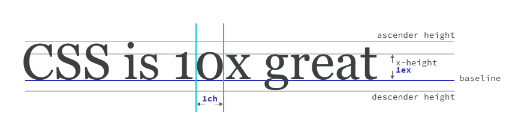

# 单位 

网络属于自适应媒介，但有时您需要控制其尺寸以提高界面的整体质量。限制行长度以提高可读性就是一个很好的例子。在网络这种灵活的媒介中，您如何做到这一点呢？

<iframe allow="camera; clipboard-read; clipboard-write; encrypted-media; geolocation; microphone; midi;" loading="lazy" src="https://codepen.io/web-dot-dev/embed/bGgEGxj?height=500&amp;theme-id=light&amp;default-tab=css%2Cresult&amp;editable=true" data-darkreader-inline-border-top="" data-darkreader-inline-border-right="" data-darkreader-inline-border-bottom="" data-darkreader-inline-border-left="" data-title="由 web-dot-dev 在 Codepen 上撰写的 Pen bGgEGxj" style="color-scheme: initial; box-sizing: inherit; border: 0px; height: 500px; width: 100%; --darkreader-inline-border-top: 0px; --darkreader-inline-border-right: 0px; --darkreader-inline-border-bottom: 0px; --darkreader-inline-border-left: 0px;"></iframe>


在这种情况下，您可以使用 `ch` 单位，它等于所渲染字体中以其计算大小显示的“0”字符的宽度。 此单位允许您使用专门设计文本大小的单位来限制文本的宽度，这样无论文本的大小如何，都可以实现可预测的控制。`ch` 单元是有助于满足特定上下文的少数单元之一，例如本例。

## Numbers 表格

数字用于定义 `opacity`、`line-height`，甚至是 `rgb` 中的颜色通道值。数字是无单位整数（1、2、3、100）和小数（0.1、0.2、0.3）。

数字的含义取决于它们的具体情境。 例如，在定义 `line-height` 时，如果您在没有支持单位的情况下定义，则数字代表比率：

```css
p { 
    font-size: 24px; 
    line-height: 1.5;
}
```

<iframe allow="camera; clipboard-read; clipboard-write; encrypted-media; geolocation; microphone; midi;" loading="lazy" src="https://codepen.io/web-dot-dev/embed/yLgYZRK?height=500&amp;theme-id=light&amp;default-tab=css%2Cresult&amp;editable=true" data-darkreader-inline-border-top="" data-darkreader-inline-border-right="" data-darkreader-inline-border-bottom="" data-darkreader-inline-border-left="" data-title="由 web-dot-dev 在 Codepen 上发布的 Pen yLgYZRK" style="color-scheme: initial; box-sizing: inherit; border: 0px; height: 500px; width: 100%; --darkreader-inline-border-top: 0px; --darkreader-inline-border-right: 0px; --darkreader-inline-border-bottom: 0px; --darkreader-inline-border-left: 0px;"></iframe>


在此示例中，`1.5` 等于 `p` 元素的**计算像素字体大小**的 **150%**。这意味着，如果 `p` 的 `font-size` 为 `24px`，则行高将计算为 `36px`。

**注意** ：最好为 `line-height` 使用无单位值，而不是指定单位。如[继承模块](/blogs/web/css/inheritance)中所述，`font-size` 可以继承。定义无单位 `line-height` 会保留行高相对于字体大小的大小。举例来说，这可提供比 `line-height: 15px` 更好的体验，后者不会发生变化，并且在使用某些字体大小时可能看起来很奇怪。

数字也可以在以下位置使用：

- 设置过滤条件的值时：`filter: sepia(0.5)` 会向元素应用 `50%` 深褐色滤镜。
- 设置不透明度时：`opacity: 0.5` 会应用 `50%` 不透明度。
- 在颜色通道中：`rgb(50, 50, 50)`，可以使用值 0-255 设置颜色值。[请参阅颜色课程](/blogs/web/css/color)。
- 转换元素：`transform: scale(1.2)` 会将元素大小按其初始大小的 120% 缩放。

## 百分比

在 CSS 中使用百分比时，您需要知道百分比的计算方式。 例如，`width` 的计算方式是占父元素可用宽度的百分比。

```css
div { 
    width: 300px; 
    height: 100px;
}
div p { 
    width: 50%; 
}
```

<iframe allow="camera; clipboard-read; clipboard-write; encrypted-media; geolocation; microphone; midi;" loading="lazy" src="https://codepen.io/web-dot-dev/embed/ZELbwwj?height=500&amp;theme-id=light&amp;default-tab=css%2Cresult&amp;editable=true" data-darkreader-inline-border-top="" data-darkreader-inline-border-right="" data-darkreader-inline-border-bottom="" data-darkreader-inline-border-left="" data-title="来自 Codepen 上的 web-dot-dev 的 Pen ZELbwaj" style="color-scheme: initial; box-sizing: inherit; border: 0px; height: 500px; width: 100%; --darkreader-inline-border-top: 0px; --darkreader-inline-border-right: 0px; --darkreader-inline-border-bottom: 0px; --darkreader-inline-border-left: 0px;"></iframe>


在上面的示例中，假设布局使用默认的 `box-sizing: content-box`，`div p` 的宽度为 `150px`。

如果您将 `margin` 或 `padding` 设置为百分比，那么无论方向如何，它们都将成为**父元素宽度**的一部分。

```css
div { 
    width: 300px; 
    height: 100px;
}
div p {
    margin-top: 50%; /* calculated: 150px */  
    padding-left: 50%; /* calculated: 150px */
}
```

<iframe allow="camera; clipboard-read; clipboard-write; encrypted-media; geolocation; microphone; midi;" loading="lazy" src="https://codepen.io/web-dot-dev/embed/WNRQPqX?height=500&amp;theme-id=light&amp;default-tab=css%2Cresult&amp;editable=true" data-darkreader-inline-border-top="" data-darkreader-inline-border-right="" data-darkreader-inline-border-bottom="" data-darkreader-inline-border-left="" data-title="由 web-dot-dev 在 Codepen 上开发的 Pen WNRQPqX" style="color-scheme: initial; box-sizing: inherit; border: 0px; height: 500px; width: 100%; --darkreader-inline-border-top: 0px; --darkreader-inline-border-right: 0px; --darkreader-inline-border-bottom: 0px; --darkreader-inline-border-left: 0px;"></iframe>


在上面的代码段中，`margin-top` 和 `padding-left` 将计算到 `150px`。

```css
div { 
    width: 300px;  
    height: 100px;
}
div p { 
    width: 50%; /* calculated: 150px */  
    transform: translateX(10%); /* calculated: 15px */
}
```

<iframe allow="camera; clipboard-read; clipboard-write; encrypted-media; geolocation; microphone; midi;" loading="lazy" src="https://codepen.io/web-dot-dev/embed/xxgwBxv?height=500&amp;theme-id=light&amp;default-tab=css%2Cresult&amp;editable=true" data-darkreader-inline-border-top="" data-darkreader-inline-border-right="" data-darkreader-inline-border-bottom="" data-darkreader-inline-border-left="" data-title="由 web-dot-dev 在 Codepen 上的 Pen xxgwBxv" style="color-scheme: initial; box-sizing: inherit; border: 0px; height: 500px; width: 100%; --darkreader-inline-border-top: 0px; --darkreader-inline-border-right: 0px; --darkreader-inline-border-bottom: 0px; --darkreader-inline-border-left: 0px;"></iframe>


如果将 `transform` 值设为百分比，则该值取决于设置了转换的元素。在此示例中，`p` 的 `translateX` 值为 `10%`，`width` 为 `50%`。首先，计算宽度：`150px`，因为它是**其父级宽度的 50%**。然后，取 `150px` 的 `10%`，即 `15px`。

**关键术语** ： transform 属性可让您通过旋转、倾斜、缩放和平移元素来更改元素的外观和位置。这可以在 2D 和 3D 空间中完成。

## 尺寸和长度

如果您将单位附加到数字，它就会成为维度。 例如，`1rem` 就是一个维度。在这种情况下，数字与数字对应的单位在规范中称为“维度令牌”。 长度是**表示距离的维度**，可以是绝对的，也可以是相对的。

### 绝对长度

所有绝对长度均针对同一基底进行解析，因此无论在 CSS 中使用什么位置，它们都是可以预测的。例如，如果使用 `cm` 调整元素大小，然后输出，那么与标尺相比，结果应是准确的。

```css
div {  
    width: 10cm; 
    height: 5cm; 
    background: black;
}
```

如果您打印此页面，`div` 会输出为 10x5 厘米的黑色矩形。 请注意，CSS 不可用于数字内容，还用于打印内容的样式。 在设计印刷品时，绝对长度会非常有用。

| 单位                                           | 名称     | 等同于                       |
| :--------------------------------------------- | :------- | :--------------------------- |
| [厘米](https://www.w3.org/TR/css-values-4/#cm) | 厘米     | 1 厘米 = 96 像素/2.54        |
| [毫米](https://www.w3.org/TR/css-values-4/#mm) | 毫米     | 1 毫米 = 1 厘米的 1/10       |
| [问题](https://www.w3.org/TR/css-values-4/#q)  | 1/4 毫米 | 1Q = 1 厘米的 1/40           |
| [in](https://www.w3.org/TR/css-values-4/#in)   | 英寸     | 1 英寸 = 2.54 厘米 = 96 像素 |
| [pc](https://www.w3.org/TR/css-values-4/#pc)   | 毕加语   | 1 个 = 1/6/1 英寸            |
| [磅](https://www.w3.org/TR/css-values-4/#pt)   | 得分     | 1 分 = 1 英寸的 1/72         |
| [像素](https://www.w3.org/TR/css-values-4/#px) | 像素     | 1 px = 1 英寸的 1/96         |

### 相对长度

相对长度根据基本值计算得出，很像百分比。这些值和百分比之间的区别在于，您可以根据上下文调整元素的大小。这意味着 CSS 具有一些单位，例如以文本大小为基础的 `ch`，以及基于视口（浏览器窗口）宽度的 `vw`。由于其响应性，相对长度在网络上特别有用。

#### 字体大小相对单位

CSS 提供了与所呈现排版元素大小相关的实用单位，例如文本本身的大小（`em` 单位）或字型字符的宽度（`ch` 单位）。

| 单位                                                | 相对于：                                                     |
| :-------------------------------------------------- | :----------------------------------------------------------- |
| [em](https://www.w3.org/TR/css-values-4/#em)        | 相对于字体大小，例如 1.5em 将比其父项计算出的基本字体大小大 50%。（过去都是大写字母“M”的高度）。 |
| [示例](https://www.w3.org/TR/css-values-4/#ex)      | 使用启发法来确定是在元素当前计算出的字体大小中使用 x 高度、字母“x”还是“.5em”。 |
| [cap](https://www.w3.org/TR/css-values-4/#cap)      | 元素当前计算出的字体大小中大写字母的高度。                   |
| [ch](https://www.w3.org/TR/css-values-4/#ch)        | 元素字体（以“0”字形表示）较窄字形的平均[字符跳转](https://www.w3.org/TR/css-values-4/#length-advance-measure)。 |
| [ic](https://www.w3.org/TR/css-values-4/#ic)        | 元素字体中全宽字形的平均[字符跳转](https://www.w3.org/TR/css-values-4/#length-advance-measure)，以“水”（以“水”字形，CJK 水表意文字，U+6C34）字形表示。 |
| [快速眼动](https://www.w3.org/TR/css-values-4/#rem) | 根元素的字体大小（默认为 16 像素）。                         |
| [lh](https://www.w3.org/TR/css-values-4/#lh)        | 元素的行高。                                                 |
| rlh                                                 | 根元素的行高。                                               |



#### 视口相对单位

您可以使用视口（浏览器窗口）尺寸作为相对基准。这些单元划分了可用的视口空间。

| 单位                                             | 相对于                                                       |
| :----------------------------------------------- | :----------------------------------------------------------- |
| [vw](https://www.w3.org/TR/css-values-4/#vw)     | 视口宽度的 1%。用户可以使用此单元进行一些很酷的字体调整，例如根据页面宽度调整标题字体的大小，这样当用户调整大小时，字体也会随之调整大小。 |
| [vh](https://www.w3.org/TR/css-values-4/#vh)     | 视口高度的 1%。 例如，如果您有页脚工具栏，则可以使用此参数来排列界面中的项目。 |
| [vi](https://www.w3.org/TR/css-values-4/#vi)     | 根元素的[内嵌轴](https://www.w3.org/TR/css-writing-modes-4/#inline-axis)占视口大小的 1%。 轴是指书写模式。在英语等水平书写模式下，内嵌轴是水平的。 在垂直书写模式（例如某些日语字体）中，内嵌轴从上到下运行。 |
| [vb](https://www.w3.org/TR/css-values-4/#vb)     | 根元素的屏蔽轴占视口大小的 1%。 对于块轴，则是语言的方向性。英语等 LTR 语言会有一个垂直块轴，因为英语读者会从上到下解析页面。 垂直写入模式具有水平块轴。 |
| [vmin](https://www.w3.org/TR/css-values-4/#vmin) | 视口较小尺寸的 1%。                                          |
| [vmax](https://www.w3.org/TR/css-values-4/#vmax) | 视口较大尺寸的 1%。                                          |

```css
div { 
    width: 10vw;
}
p { 
    max-width: 60ch;
}
```

<iframe allow="camera; clipboard-read; clipboard-write; encrypted-media; geolocation; microphone; midi;" loading="lazy" src="https://codepen.io/web-dot-dev/embed/JjEYqXa?height=500&amp;theme-id=light&amp;default-tab=result&amp;editable=true" data-darkreader-inline-border-top="" data-darkreader-inline-border-right="" data-darkreader-inline-border-bottom="" data-darkreader-inline-border-left="" data-title="来自 Codepen 上的 web-dot-dev 的 Pen JjEYqXa" style="color-scheme: initial; box-sizing: inherit; border: 0px; height: 500px; width: 100%; --darkreader-inline-border-top: 0px; --darkreader-inline-border-right: 0px; --darkreader-inline-border-bottom: 0px; --darkreader-inline-border-left: 0px;"></iframe>


在本例中，`div` 将是视口宽度的 10%，因为 `1vw` 是**视口宽度的 1%**。`p` 元素的 `max-width` 为 `60ch`，这意味着在计算的字体和大小中它不能超过 60 个“0”字符的宽度。

**目标** ：使用`em`或`rem`等相对单位（而非`px`等绝对单位）调整文字大小，从而根据用户的偏好调整文字大小。这可以包括系统字体大小或父元素的字体大小，例如```em`的基本尺寸是元素的父级，而`rem`的基本尺寸是文档的基本字体大小。如果您没有在`html`元素上定义`font-size`   

## 其他单位

还有一些其他指定单位已指定，用于处理特定类型的值。

### 角度单位

在[颜色模块](/blogs/web/css/color)中，我们了解了**角度单位**，它有助于定义度数值，例如 `hsl` 中的色相。它们还有助于在转换函数中旋转元素。

```css
div {  
    width: 150px; 
    height: 150px; 
    transform: rotate(60deg);
}
```

<iframe allow="camera; clipboard-read; clipboard-write; encrypted-media; geolocation; microphone; midi;" loading="lazy" src="https://codepen.io/web-dot-dev/embed/VwPvRbK?height=500&amp;theme-id=light&amp;default-tab=css%2Cresult&amp;editable=true" data-darkreader-inline-border-top="" data-darkreader-inline-border-right="" data-darkreader-inline-border-bottom="" data-darkreader-inline-border-left="" data-title="由 web-dot-dev 在 Codepen 上发布的 Pen VwPvRbK" style="color-scheme: initial; box-sizing: inherit; border: 0px; height: 500px; width: 100%; --darkreader-inline-border-top: 0px; --darkreader-inline-border-right: 0px; --darkreader-inline-border-bottom: 0px; --darkreader-inline-border-left: 0px;"></iframe>


您可以使用 `deg` 角度单位将 `div` 在其中心轴上旋转 90°。

```css
div { 
    background-image: url('a-low-resolution-image.jpg');
}
@media (-webkit-min-device-pixel-ratio: 2), (min-resolution: 192dpi) { 
    div { 
        background-image: url('a-high-resolution-image.jpg');  
    }
}
```

**注意** ：其他角度单位包括 `rad`（弧度）、`grad`（梯度）和 `turn` 单位（表示角度的一部分），其中 `1turn` = `360deg`，`0.5turn` = `180deg`。

#### 分辨率单位

在前面的示例中，`min-resolution` 的值为 `192dpi`。`dpi` 单位表示每英寸的点数。一个有用的上下文是检测分辨率非常高的屏幕（例如媒体查询中的 Retina 显示屏），并提供分辨率更高的图片。

## 资源

- [CSS 规范值和单位级别 4](https://www.w3.org/TR/css-values-4)
- [MDN 上的大小和单位](https://developer.mozilla.org/docs/Learn/CSS/Building_blocks/Values_and_units)
- [各种表情符号简介](https://learn.scannerlicker.net/2014/07/31/so-how-much-is-an-em/)
- [百分比形式的解释说明](https://wattenberger.com/blog/css-percents)


