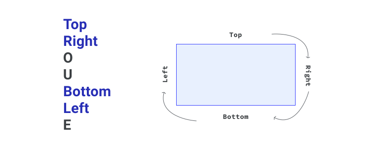
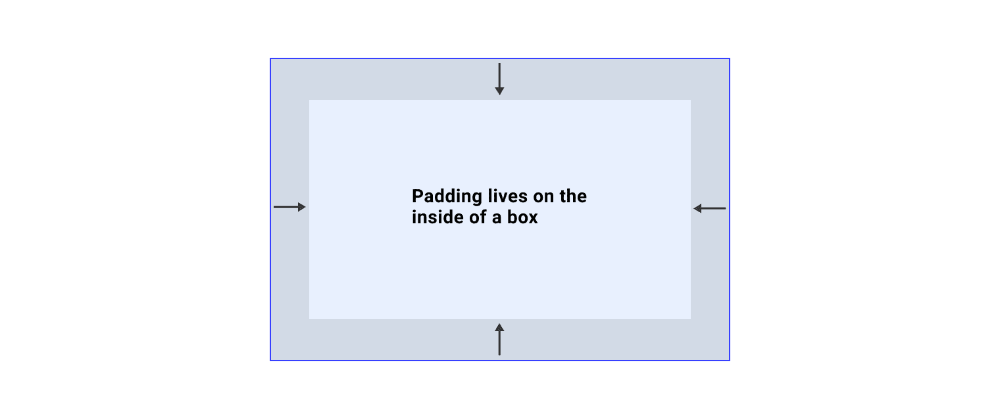
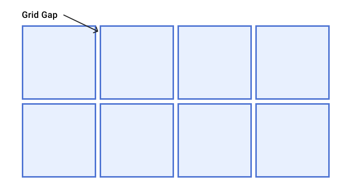
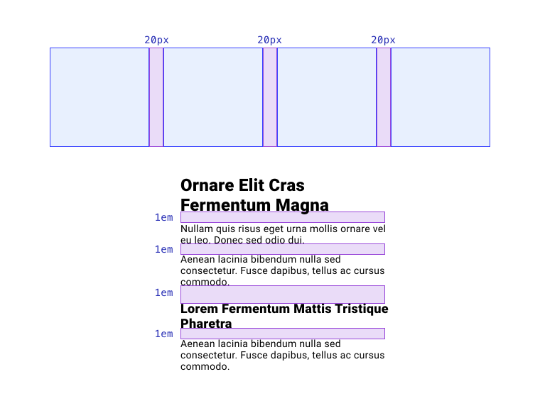

# 间距 

假设您有一个由三个框组成，这些框堆叠在一起的集合，并且您希望它们之间留有空间。您能想到在 CSS 中通过几种方式来实现这一点？


`margin` 属性或许可以提供您所需的内容，但也可能会添加您不想要的额外间距。例如，如何仅定位上述各元素之间的空间？ 在这种情况下，像 `gap` 之类的代码可能更合适。您可以通过多种方式调整界面中的间距，每种方式都有自己的优势和注意事项。

## HTML 间距

HTML 本身提供了一些设置空间元素的方法。 借助 `<br> ` 和 `<hr> ` 元素，您可以在块方向上为元素设置间距。如果您使用的是基于拉丁语的语言，这些方向即为从上到下。

如果您使用 `<br> ` 元素，它会创建一个换行符，就好比您在文字处理器中按 Enter 键。

`<hr>` 会创建一条两侧有空格的水平线，称为 `margin`。

<iframe allow="camera; clipboard-read; clipboard-write; encrypted-media; geolocation; microphone; midi;" loading="lazy" src="https://codepen.io/web-dot-dev/embed/dyNRJQg?height=500&amp;theme-id=light&amp;default-tab=result&amp;editable=true" data-darkreader-inline-border-top="" data-darkreader-inline-border-right="" data-darkreader-inline-border-bottom="" data-darkreader-inline-border-left="" data-title="web-dot-dev 上 Codepen 的 Pen dyNRJQg" style="color-scheme: initial; box-sizing: inherit; border: 0px; height: 500px; width: 100%; --darkreader-inline-border-top: 0px; --darkreader-inline-border-right: 0px; --darkreader-inline-border-bottom: 0px; --darkreader-inline-border-left: 0px;"></iframe>


除了使用 HTML 元素，HTML *实体*也可以创建空间。HTML 实体是浏览器使用字符实体替换的预留字符串。例如，如果您在 HTML 文件中输入 `&copy;`，系统会将其转换为 © 字符。 `&nbsp; ` 实体会转换为不间断空格字符，以提供内嵌空格。但要小心，这个角色的非破坏性方面会将这两个元素拼接在一起，这可能会导致出现奇怪的行为。

**注意** ：仅当 HTML 元素有助于用户理解文档时，才应使用该元素来增加空间。例如，`` 不只是添加空格，还会创建两个内容块的逻辑分隔。如果您只是想在线条周围添加有空格的线条，那么添加带 CSS 的边框可能更加合适。

## 外边距

如果要在元素外部增加空间，可以使用 `margin` 属性。外边距就像在元素周围添加一个缓冲一样。`margin` 属性是 `margin-top`、`margin-right`、`margin-bottom` 和 `margin-left` 的简写形式。


`margin` 简写形式以特定顺序应用属性：上、右、下、左。但记不住这么多消息：TRouBLe。



`margin` 简写形式也可以与一个、两个或三个值结合使用。通过添加第四个值，您可以设置各个面。具体应用方式如下：

- 所有面都会应用一个值。(`margin: 20px`).
- 两个值：第一个值将应用于顶部和底部，第二个值将应用于左侧和右侧。(`margin: 20px 40px`)
- 三个值：第一个值为 `top`，第二个值为 `left` 和 `right`，第三个值为 `bottom`。(`margin: 20px 40px 30px`).

<iframe allow="camera; clipboard-read; clipboard-write; encrypted-media; geolocation; microphone; midi;" loading="lazy" src="https://codepen.io/web-dot-dev/embed/abpwqyQ?height=500&amp;theme-id=light&amp;default-tab=result&amp;editable=true" data-darkreader-inline-border-top="" data-darkreader-inline-border-right="" data-darkreader-inline-border-bottom="" data-darkreader-inline-border-left="" data-title="由 web-dot-dev 在 Codepen 上撰写的 Pen abpwqyQ" style="color-scheme: initial; box-sizing: inherit; border: 0px; height: 500px; width: 100%; --darkreader-inline-border-top: 0px; --darkreader-inline-border-right: 0px; --darkreader-inline-border-bottom: 0px; --darkreader-inline-border-left: 0px;"></iframe>


可以使用长度、百分比或自动值来定义外边距，例如 `1em` 或 `20%`。如果您使用百分比，该值将根据元素所在块的宽度计算得出。

这意味着，如果元素所在块的宽度为 `250px`，元素的 `margin` 值为 `20%`，则元素每边的计算外边距为 `50px`。

<iframe allow="camera; clipboard-read; clipboard-write; encrypted-media; geolocation; microphone; midi;" loading="lazy" src="https://codepen.io/web-dot-dev/embed/YzNQeyb?height=500&amp;theme-id=light&amp;default-tab=result&amp;editable=true" data-darkreader-inline-border-top="" data-darkreader-inline-border-right="" data-darkreader-inline-border-bottom="" data-darkreader-inline-border-left="" data-title="来自 Codepen 上的 web-dot-dev 的 Pen YzNQeyb" style="color-scheme: initial; box-sizing: inherit; border: 0px; height: 500px; width: 100%; --darkreader-inline-border-top: 0px; --darkreader-inline-border-right: 0px; --darkreader-inline-border-bottom: 0px; --darkreader-inline-border-left: 0px;"></iframe>


您还可以为外边距使用 `auto` 值。 对于大小受限的块级元素，`auto` 外边距会在其应用方向上占用可用空间。[Flexbox 模块](/blogs/web/css/flexbox)中的这个模块就是一个很好的例子，在该模块中，项会互相推开。

<iframe allow="camera; clipboard-read; clipboard-write; encrypted-media; geolocation; microphone; midi;" loading="lazy" src="https://codepen.io/web-dot-dev/embed/poRELbR?height=500&amp;theme-id=light&amp;default-tab=result&amp;editable=true" data-darkreader-inline-border-top="" data-darkreader-inline-border-right="" data-darkreader-inline-border-bottom="" data-darkreader-inline-border-left="" data-title="由 web-dot-dev 在 Codepen 上撰写的 Pen poRELbR" style="color-scheme: initial; box-sizing: inherit; border: 0px; height: 500px; width: 100%; --darkreader-inline-border-top: 0px; --darkreader-inline-border-right: 0px; --darkreader-inline-border-bottom: 0px; --darkreader-inline-border-left: 0px;"></iframe>


`auto` 外边距的另一个典型示例是具有最大宽度的水平居中封装容器。这种封装容器通常用于在网站上创建一致的中心列。

```css
.wrapper {  
    max-width: 400px;  
    margin: 0 auto;
}
```

<iframe allow="camera; clipboard-read; clipboard-write; encrypted-media; geolocation; microphone; midi;" loading="lazy" src="https://codepen.io/web-dot-dev/embed/XWpgZKq?height=500&amp;theme-id=light&amp;default-tab=result&amp;editable=true" data-darkreader-inline-border-top="" data-darkreader-inline-border-right="" data-darkreader-inline-border-bottom="" data-darkreader-inline-border-left="" data-title="来自 Codepen 上的 web-dot-dev 的 Pen XWpgZKq" style="color-scheme: initial; box-sizing: inherit; border: 0px; height: 500px; width: 100%; --darkreader-inline-border-top: 0px; --darkreader-inline-border-right: 0px; --darkreader-inline-border-bottom: 0px; --darkreader-inline-border-left: 0px;"></iframe>


在此示例中，从顶部和底部（块）两侧移除了外边距，`auto` 共享左侧和右侧（内嵌）之间的空间。

**注意** ：在前面介绍[逻辑属性](/blogs/web/css/logical-properties)的单元中，您了解到可以使用 `margin-block-start`、`margin-inline-end`、`margin-block-end` 和 `margin-inline-start`，而无需指定 `margin-top`、`margin-right`、`margin-bottom` 和 `margin-left`。

### 负值外边距

负值也可用于外边距。 系统不会在相邻的同级元素之间添加空间，而是**减少它们之间的空间**。如果您声明的负值大于可用空间，可能会导致元素重叠。

<iframe allow="camera; clipboard-read; clipboard-write; encrypted-media; geolocation; microphone; midi;" loading="lazy" src="https://codepen.io/web-dot-dev/embed/YzNQeLP?height=500&amp;theme-id=light&amp;default-tab=result&amp;editable=true" data-darkreader-inline-border-top="" data-darkreader-inline-border-right="" data-darkreader-inline-border-bottom="" data-darkreader-inline-border-left="" data-title="由 web-dot-dev 在 Codepen 上开发的 Pen YzNQeLP" style="color-scheme: initial; box-sizing: inherit; border: 0px; height: 500px; width: 100%; --darkreader-inline-border-top: 0px; --darkreader-inline-border-right: 0px; --darkreader-inline-border-bottom: 0px; --darkreader-inline-border-left: 0px;"></iframe>


### 外边距折叠

外边距折叠是一个棘手的概念，但在构建接口时经常会遇到这个问题。假设您有两个元素：标题和段落上都有垂直外边距：

```html
<article> 
    <h1>My heading with teal margin</h1> 
    <p>A paragraph of text that has blue margin on it, following the heading with margin.</p></article>
h1 {   
	margin-bottom: 2rem;
}
p { 
	margin-top: 3rem;
}
```

<iframe allow="camera; clipboard-read; clipboard-write; encrypted-media; geolocation; microphone; midi;" loading="lazy" src="https://codepen.io/web-dot-dev/embed/OJWgvMx?height=500&amp;theme-id=light&amp;default-tab=result&amp;editable=true" data-darkreader-inline-border-top="" data-darkreader-inline-border-right="" data-darkreader-inline-border-bottom="" data-darkreader-inline-border-left="" data-title="web-dot-dev 上 Codepen 的 Pen OJWgvMx" style="color-scheme: initial; box-sizing: inherit; border: 0px; height: 500px; width: 100%; --darkreader-inline-border-top: 0px; --darkreader-inline-border-right: 0px; --darkreader-inline-border-bottom: 0px; --darkreader-inline-border-left: 0px;"></iframe>


乍一看，您也许以为段落与标题之间以 `5em` 为间隔，因为 `2rem` 和 `3rem` 的总和计算为 `5rem`。不过，由于**垂直外边距会收起**，因此该空间实际上为 `3rem`。

外边距收起的工作原理是，选择两个相邻元素的最大值，并在相邻的两侧设置垂直外边距。`h1` 的下外边距与 `p` 的顶部交汇，因此选择 `h1` 的下外边距和 `p` 的上外边距的最大值。如果 `h1` 的下外边距为 `3.5rem`，则两者之间的间距将为 `3.5rem`，因为它大于 `3rem`。只有块外边距会收起，不会内嵌（水平）外边距。

**注意** ：这种行为根植于当网络大多只是文档时。折叠外边距有助于在元素之间设置一致的间距，而不会意外在已定义外边距的元素之间产生巨大的间隙。

外边距收起也有助于处理空元素。 如果您的某个段落的上外边距和下外边距为 `20px`，则该段落将仅创建 `20px` 的空间，而不是 `40px`。 不过，如果此元素内部添加了*任何内容*（包括 `padding`），其外边距将不再自行收起，并会被视为任何包含内容的框。

#### 防止外边距合拢

如果您使用 `position: absolute` 将某个元素设置为绝对定位，则外边距将不再收起。如果您还使用 `float` 属性，则外边距也不会折叠。

如果您的某个元素在采用块外边距的两个元素之间没有外边距，那么外边距也不会折叠，因为这两个有块外边距的元素不再是相邻的同级元素：它们只是同级。

<iframe allow="camera; clipboard-read; clipboard-write; encrypted-media; geolocation; microphone; midi;" loading="lazy" src="https://codepen.io/web-dot-dev/embed/YzNQavQ?height=500&amp;theme-id=light&amp;default-tab=result&amp;editable=true" data-darkreader-inline-border-top="" data-darkreader-inline-border-right="" data-darkreader-inline-border-bottom="" data-darkreader-inline-border-left="" data-title="由 web-dot-dev 在 Codepen 上开发的 Pen YzNQavQ" style="color-scheme: initial; box-sizing: inherit; border: 0px; height: 500px; width: 100%; --darkreader-inline-border-top: 0px; --darkreader-inline-border-right: 0px; --darkreader-inline-border-bottom: 0px; --darkreader-inline-border-left: 0px;"></iframe>


在[布局课程](/blogs/web/css/layout)中，您已了解 Flexbox 容器和网格容器与块容器非常相似，但处理其子元素的方式截然不同。外边距收起的情况也是如此。

如果我们使用本课程中的原始示例，并通过列方向应用 Flexbox，则外边距会合并，而不是收起。 这可以通过布局工作实现可预测性，这正是 Flexbox 和网格容器的设计目标。

<iframe allow="camera; clipboard-read; clipboard-write; encrypted-media; geolocation; microphone; midi;" loading="lazy" src="https://codepen.io/web-dot-dev/embed/QWdgmNx?height=500&amp;theme-id=light&amp;default-tab=result&amp;editable=true" data-darkreader-inline-border-top="" data-darkreader-inline-border-right="" data-darkreader-inline-border-bottom="" data-darkreader-inline-border-left="" data-title="由 web-dot-dev 在 Codepen 上开发的 Pen QWdgmNx" style="color-scheme: initial; box-sizing: inherit; border: 0px; height: 500px; width: 100%; --darkreader-inline-border-top: 0px; --darkreader-inline-border-right: 0px; --darkreader-inline-border-bottom: 0px; --darkreader-inline-border-left: 0px;"></iframe>


外边距和外边距折叠可能难以理解，但详细了解它们的工作原理非常有用，因此强烈建议您使用[这篇详细的解释器](https://www.smashingmagazine.com/2019/07/margins-in-css)。

## 内边距

`padding`属性会在盒子的**内部**内部创建空间，而不是像`margin`那样在盒子的外侧留出空间，而是采取隔热措施。



`padding` 也可能影响元素的总体尺寸，具体取决于您使用的框模型（我们在[框模型课程](/blogs/web/css/box-model)中对此进行了介绍）。

<iframe allow="camera; clipboard-read; clipboard-write; encrypted-media; geolocation; microphone; midi;" loading="lazy" src="https://codepen.io/web-dot-dev/embed/eYgRrzz?height=500&amp;theme-id=light&amp;default-tab=result&amp;editable=true" data-darkreader-inline-border-top="" data-darkreader-inline-border-right="" data-darkreader-inline-border-bottom="" data-darkreader-inline-border-left="" data-title="Codepen 上 web-dot-dev 的 Pen eYgRrzz" style="color-scheme: initial; box-sizing: inherit; border: 0px; height: 500px; width: 100%; --darkreader-inline-border-top: 0px; --darkreader-inline-border-right: 0px; --darkreader-inline-border-bottom: 0px; --darkreader-inline-border-left: 0px;"></iframe>


`padding` 属性是 `padding-top`、`padding-right`、`padding-bottom` 和 `padding-left` 的简写形式。与 `margin` 一样，`padding` 也具有逻辑属性：`padding-block-start`、`padding-inline-end`、`padding-block-end` 和 `padding-inline-start`。

## Positioning

同样，[layout](/blogs/web/css/layout) 模块中也对此进行了介绍，如果您为 `position` 设置的值是 `static` 以外的任何值，则可以使用 `top`、`right`、`bottom` 和 `left` 属性来设置元素间距。这些方向值的行为方式存在一些差异：

- 具有 `position: relative` 的元素将保持其在文档流中的位置，即使您设置了这些值也是如此。它们还会以元素的位置为参照物。
- 具有 `position: absolute` 的元素将基于相对父项的位置建立方向值。
- 具有 `position: fixed` 的元素将基于视口来确定方向值。
- 具有 `position: sticky` 的元素仅在处于停靠/卡住状态时才应用方向值。

<iframe allow="camera; clipboard-read; clipboard-write; encrypted-media; geolocation; microphone; midi;" loading="lazy" src="https://codepen.io/web-dot-dev/embed/NWdNGZB?height=500&amp;theme-id=light&amp;default-tab=result&amp;editable=true" data-darkreader-inline-border-top="" data-darkreader-inline-border-right="" data-darkreader-inline-border-bottom="" data-darkreader-inline-border-left="" data-title="由 web-dot-dev 在 Codepen 上的 Pen NWdNGZB" style="color-scheme: initial; box-sizing: inherit; border: 0px; height: 500px; width: 100%; --darkreader-inline-border-top: 0px; --darkreader-inline-border-right: 0px; --darkreader-inline-border-bottom: 0px; --darkreader-inline-border-left: 0px;"></iframe>

在[逻辑属性](/blogs/web/css/logical-properties)模块中，您将了解 `inset-block` 和 `inset-inline` 属性，这两个属性可用于设置遵循写入模式的方向值。

这两个属性都是组合了 `start` 和 `end` 值的简写形式，因此可以接受为 `start` 和 `end` 设置的一个值或两个单独的值。

## 网格和 Flexbox

最后，在网格和 Flexbox 中，您可以使用 `gap` 属性在子元素之间创建空间。 `gap` 属性是 `row-gap` 和 `column-gap` 的简写形式，它接受一个或两个值，可以是长度或百分比。您也可以使用 `unset`、`initial` 和 `inherit` 等关键字。如果您只定义一个值，则相同的 `gap` 将同时应用于行和列，但如果您同时定义了这两个值，则第一个值为 `row-gap`，第二个值为 `column-gap`。

借助 Flexbox 和网格，您还可以使用其分布和对齐功能创建空间，[网格模块](/blogs/web/css/grid)和 [Flexbox 模块](/blogs/web/css/flexbox)对此进行了介绍。



## 创建一致的间距

选择并坚持采用这种策略是个不错的选择，可以帮助您创建具有良好流程和节奏的一致界面。为实现这一目标，一种好方法是使用一致的间距度量。

例如，您可以承诺使用 `20px` 作为元素之间所有间隙（称为边线）的一致衡量方式，以使所有布局的外观和风格保持一致。您还可以决定使用 `1em` 作为数据流内容之间的垂直间距，这样便可根据元素的 `font-size` 实现一致的间距。无论您选择哪种类型，都应该将这些值保存为变量（或 CSS 自定义属性），以便对这些值进行标记化，并简化一致性。



```css
:root {
    --gutter: 20px;  --spacing: 1em;
}
h1 {
    margin-left: var(--gutter); 
    margin-top: var(--spacing);
}
```

使用此类自定义属性时，您只需定义一次，然后便可在整个 CSS 中使用它们。当更新值时，无论是在元素本地更新还是全局更新，值将通过级联传递并反映更新后的值。


