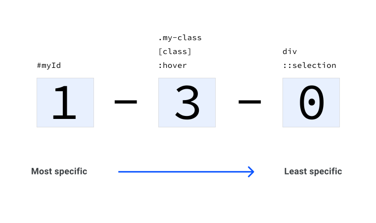

# 特异性 

假设您使用的是以下 HTML 和 CSS：

```html
<button class="branding">Hello, Specificity!</button>
button { 
	color: red;
}
.branding {
	color: blue;
}
```

这里有两条相互竞争的规则。 其中一个将按钮设置为红色，另一个将按钮设置为蓝色。系统会对该元素应用什么规则？ 了解 CSS 规范关于特异性的算法是理解 CSS 如何在竞争规则之间做出决定的关键。

特异性是级联的四个不同阶段之一，我们在上一单元中介绍级联。

<iframe allow="camera; clipboard-read; clipboard-write; encrypted-media; geolocation; microphone; midi;" loading="lazy" src="https://codepen.io/web-dot-dev/embed/YzNKMXm?height=200&amp;theme-id=light&amp;default-tab=result&amp;editable=true" data-darkreader-inline-border-top="" data-darkreader-inline-border-right="" data-darkreader-inline-border-bottom="" data-darkreader-inline-border-left="" data-title="由 web-dot-dev 在 Codepen 上开发的 Pen YzNKMXm" style="color-scheme: initial; box-sizing: inherit; border: 0px; height: 200px; width: 100%; --darkreader-inline-border-top: 0px; --darkreader-inline-border-right: 0px; --darkreader-inline-border-bottom: 0px; --darkreader-inline-border-left: 0px;"></iframe>

## 特异性评分

每条选择器规则都会获得一个评分。 您可以将特异性视为一个总分，每个选择器类型都会获得相应分数。得分最高的选择器胜出。

鉴于真实项目中的特异性，平衡行为是确保您希望应用的 CSS 规则确实*能够应用*，同时通常会降低得分以避免复杂性。 得分只应尽可能高，而不是追求尽可能高的得分。 将来，可能需要应用一些真正更重要的 CSS。如果你寻求最高分，这项工作就会很难。

## 对每种选择器类型进行评分

每种选择器类型都可以获得积分。 将所有点相加即可计算选择器的整体特异性。

### 通用选择器

[通用选择器](https://developer.mozilla.org/docs/Web/CSS/Universal_selectors) (`*`) **没有特异性**，得 **0 分**。也就是说，任何包含 1 个或多个点的规则将覆盖该值

```css
* {
    color: red;
}
```

### 元素或伪元素选择器

[元素](https://developer.mozilla.org/docs/Web/CSS/Type_selectors)（类型）或[伪元素](https://developer.mozilla.org/docs/Web/CSS/Pseudo-elements)选择器有 **1 个特异性点**。

#### 类型选择器

```css
div {
    color: red;
}
```

#### 伪元素选择器

```css
::selection {
  color: red;
}
```

### 类、伪类或属性选择器

[类](https://developer.mozilla.org/docs/Web/CSS/Class_selectors)、[伪类](https://developer.mozilla.org/docs/Web/CSS/Pseudo-classes)或[属性](https://developer.mozilla.org/docs/Web/CSS/Attribute_selectors)选择器有 **10 个特异性点**。

#### 类选择器

```css
.my-class {
  color: red;
}
```

#### 伪类选择器

```css
:hover {
  color: red;
}
```

#### 属性选择器

```css
[href='#'] {
  color: red;
}
```

[`:not()`](https://developer.mozilla.org/docs/Web/CSS/:not) 伪类本身对特异性计算没有任何影响。但是，作为参数传入的选择器确实会添加到特异性计算中。

```css
div:not(.my-class) {
  color: red;
}
```

此示例具有 **11 个特异性点**，因为它有一个类型选择器 (`div`) 和一个位于 `:not()` 内的类。

### ID 选择器

只要您使用 ID 选择器 (`#myID`) 而不是属性选择器 (`[id="myID"]`)，[ID](https://developer.mozilla.org/docs/Web/CSS/ID_selectors) 选择器就有 **100 个特异性**。

```css
#myID {
  color: red;
}
```

### 内嵌样式属性

CSS 直接应用于 HTML 元素的 `style` 属性，会得到**特异性得分 1,000 分**。这意味着，若要在 CSS 中替换它，您必须编写一个极其具体的选择器。

```html
<div style="color: red"></div>
```

### `!important` 规则

最后，CSS 值末尾的 `!important` 的特异性得分为 **10,000 分**。这是单个项目可能获得的最高特异性。

`!important` 规则会应用于 CSS 属性，因此整个规则（选择器和属性）中的所有内容不会获得相同的特异性得分。

```css
.my-class {
  color: red !important; /* 10,000 points */
  background: white; /* 10 points */
}
```

## 上下文的特异性

每个与某元素匹配的选择器的特异性累加在一起。以下面的 HTML 为例：

```html
<a class="my-class another-class" href="#">A link</a>
```

此链接上包含两个类。添加以下 CSS，并获得 **1 个特异性点**：

```css
a {
  color: red;
}
```

引用此规则中的某个类，它现在有 **11 个特异性点**：

```css
a.my-class {
  color: green;
}
```

将另一个类添加到选择器中，它现在有 **21 个特异性点**：

```css
a.my-class.another-class {
  color: rebeccapurple;
}
```

将 `href` 属性添加到选择器，该选择器现在有 **31 个特异性**：

```css
a.my-class.another-class[href] {
  color: goldenrod;
}
```

最后，向所有这些类添加一个 `:hover` 伪类，选择器最终会有 **41 个特异性点**：

```css
a.my-class.another-class[href]:hover {
  color: lightgrey;
}
```

## 直观呈现特异性

在图表和特异性计算器中，特异性通常如下所示：



左侧是 `id` 选择器。第二组是类、属性和伪类选择器。 最后一个组是元素选择器和伪元素选择器。

为便于参考，以下选择器为 `0-4-1`：

```css
a.my-class.another-class[href]:hover { 
    color: lightgrey;
}
```

## 切实提高特异性

假设我们有一些如下所示的 CSS：

```css
.my-button {
    background: blue;
}
button[onclick] {
    background: grey;
}
```

使用如下所示的 HTML：

```html
<button class="my-button" onclick="alert('hello')">Click me</button>
```

<iframe allow="camera; clipboard-read; clipboard-write; encrypted-media; geolocation; microphone; midi;" loading="lazy" src="https://codepen.io/web-dot-dev/embed/abpoxdR?height=500&amp;theme-id=light&amp;default-tab=css%2Cresult&amp;editable=true" data-darkreader-inline-border-top="" data-darkreader-inline-border-right="" data-darkreader-inline-border-bottom="" data-darkreader-inline-border-left="" data-title="web-dot-dev 在 Codepen 上开发的 Pen abpoxdR" style="color-scheme: initial; box-sizing: inherit; border: 0px; height: 500px; width: 100%; --darkreader-inline-border-top: 0px; --darkreader-inline-border-right: 0px; --darkreader-inline-border-bottom: 0px; --darkreader-inline-border-left: 0px;"></iframe>

该按钮显示为灰色背景，因为第二个选择器获得了 **11 个特异性点** (`0-1-1`)。这是因为它有一个类型选择器 (`button`)，分别为 **1 点**和 **10 个点**的属性选择器 (`[onclick]`)。

上一条规则 `.my-button` 会得到 **10 分** (`0-1-0`)，因为它有一个类选择器。

如果要提高此规则，请按如下方式重复使用类选择器：

```css
.my-button.my-button {
  background: blue;
}

button[onclick] {
  background: grey;
}
```

<iframe allow="camera; clipboard-read; clipboard-write; encrypted-media; geolocation; microphone; midi;" loading="lazy" src="https://codepen.io/web-dot-dev/embed/zYNOXBJ?height=500&amp;theme-id=light&amp;default-tab=css%2Cresult&amp;editable=true" data-darkreader-inline-border-top="" data-darkreader-inline-border-right="" data-darkreader-inline-border-bottom="" data-darkreader-inline-border-left="" data-title="由 web-dot-dev 在 Codepen 上发布的 Pen zYNOXBJ" style="color-scheme: initial; box-sizing: inherit; border: 0px; height: 500px; width: 100%; --darkreader-inline-border-top: 0px; --darkreader-inline-border-right: 0px; --darkreader-inline-border-bottom: 0px; --darkreader-inline-border-left: 0px;"></iframe>

现在，该按钮将变为蓝色背景，因为新选择器的特异性分数为 **20 分** (`0-2-0`)。

**注意** ：如果您发现自己需要频繁地提高特异性，则可能表示您编写的选择器过于具体。请考虑您是否可以通过重构 CSS 来降低其他选择器的特异性，从而避免此问题。

## 匹配的特异性分数将认为最新的实例胜出

我们现在仍以按钮示例为例，将 CSS 切换为如下所示：

```css
.my-button {
  background: blue;
}

[onclick] {
  background: grey;
}
```

该按钮具有灰色背景，因为**两个选择器具有相同的特异性得分** (`0-1-0`)。

<iframe allow="camera; clipboard-read; clipboard-write; encrypted-media; geolocation; microphone; midi;" loading="lazy" src="https://codepen.io/web-dot-dev/embed/zYNOXKJ?height=500&amp;theme-id=light&amp;default-tab=css%2Cresult&amp;editable=true" data-darkreader-inline-border-top="" data-darkreader-inline-border-right="" data-darkreader-inline-border-bottom="" data-darkreader-inline-border-left="" data-title="由 web-dot-dev 在 Codepen 上发布的 Pen zYNOXKJ" style="color-scheme: initial; box-sizing: inherit; border: 0px; height: 500px; width: 100%; --darkreader-inline-border-top: 0px; --darkreader-inline-border-right: 0px; --darkreader-inline-border-bottom: 0px; --darkreader-inline-border-left: 0px;"></iframe>

如果您按源代码顺序切换规则，该按钮就会变为蓝色。

```css
[onclick] {
  background: grey;
}

.my-button {
  background: blue;
}
```

<iframe allow="camera; clipboard-read; clipboard-write; encrypted-media; geolocation; microphone; midi;" loading="lazy" src="https://codepen.io/web-dot-dev/embed/WNReWRO?height=500&amp;theme-id=light&amp;default-tab=css%2Cresult&amp;editable=true" data-darkreader-inline-border-top="" data-darkreader-inline-border-right="" data-darkreader-inline-border-bottom="" data-darkreader-inline-border-left="" data-title="由 web-dot-dev 在 Codepen 上发布的 Pen WNReWRO" style="color-scheme: initial; box-sizing: inherit; border: 0px; height: 500px; width: 100%; --darkreader-inline-border-top: 0px; --darkreader-inline-border-right: 0px; --darkreader-inline-border-bottom: 0px; --darkreader-inline-border-left: 0px;"></iframe>

这是唯一胜出的 CSS 较新的 CSS。为此，它必须与定位到同一元素的另一个选择器的特异性相匹配。

## 资源

- [CSS 规范](http://specifishity.com/)
- [特异性计算器](https://specificity.keegan.st/)
- [MDN 特异性](https://developer.mozilla.org/docs/Web/CSS/Specificity)
- [有关 CSS 特异性的具体信息](https://css-tricks.com/specifics-on-css-specificity/)
- [其他特异性计算器](https://polypane.app/css-specificity-calculator)