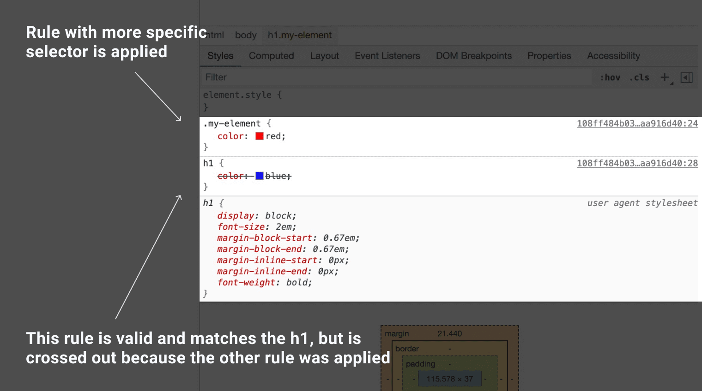

# 瀑布

CSS 表示级联样式表。 级联是一种算法，用于解决多个 CSS 规则应用于 HTML 元素时发生的冲突。 这就是使用以下 CSS 设置样式的按钮文本会显示为蓝色的原因。

```css
button {
  color: red;
}

button {
  color: blue;
}
```

<iframe allow="camera; clipboard-read; clipboard-write; encrypted-media; geolocation; microphone; midi;" loading="lazy" src="https://codepen.io/web-dot-dev/embed/GRrgMOm?height=200&amp;theme-id=light&amp;default-tab=result&amp;editable=true" data-darkreader-inline-border-top="" data-darkreader-inline-border-right="" data-darkreader-inline-border-bottom="" data-darkreader-inline-border-left="" data-title="Codepen 上 web-dot-dev 开发的 Pen GRrgMOm" style="color-scheme: initial; box-sizing: inherit; border: 0px; height: 200px; width: 100%; --darkreader-inline-border-top: 0px; --darkreader-inline-border-right: 0px; --darkreader-inline-border-bottom: 0px; --darkreader-inline-border-left: 0px;"></iframe>

了解级联算法有助于您了解浏览器如何解决此类冲突。级联算法分为 4 个不同的阶段。

1. **显示位置和显示顺序** ：CSS 规则的显示顺序
2. **特异性** ：一种算法，用于确定哪个 CSS 选择器具有最强的匹配项
3. **来源** ：CSS 的出现顺序及来源，是浏览器样式、浏览器扩展程序中的 CSS，还是您自己编写的 CSS
4. **重要性** ：某些 CSS 规则的权重高于其他规则，尤其是 `!important` 规则类型

## 出现的位置和顺序

级联计算在计算冲突解决时，系统会考虑 CSS 规则的显示顺序及其显示方式。

本课开始时的演示是最直接的定位示例。 有两条规则具有特异性完全相同的选择器，因此最后一条要声明的规则优先。

样式可以来自 HTML 网页上的各种来源，例如 `<link>` 标记、嵌入式 `<style>` 标记，以及元素的 `style` 属性中定义的内嵌 CSS。

如果您的 HTML 网页顶部有一个包含 CSS 的 `<link>`，则网页底部包含另一个包含 CSS 的 `<link>`：底部的 `<link>` 的针对性最强。嵌入的 `<style>` 元素也是如此。页面越具体，位置越靠下。

<iframe allow="camera; clipboard-read; clipboard-write; encrypted-media; geolocation; microphone; midi;" loading="lazy" src="https://codepen.io/web-dot-dev/embed/NWdPaWv?height=500&amp;theme-id=light&amp;default-tab=result&amp;editable=true" data-darkreader-inline-border-top="" data-darkreader-inline-border-right="" data-darkreader-inline-border-bottom="" data-darkreader-inline-border-left="" data-title="来自 Codepen 上的 web-dot-dev 的 Pen NWdPaWv" style="color-scheme: initial; box-sizing: inherit; border: 0px; height: 500px; width: 100%; --darkreader-inline-border-top: 0px; --darkreader-inline-border-right: 0px; --darkreader-inline-border-bottom: 0px; --darkreader-inline-border-left: 0px;"></iframe>

根据 CSS 的定义，按钮具有蓝色背景，该背景包含在 <link /> 元素中。 将样式设置为深色的 CSS 规则位于第二个关联的样式表中，并且由于其后面的位置而被应用。

这种排序也适用于嵌入的 `<style>` 元素。如果在 `<link>` 之前声明这些样式，则关联样式表的 CSS 将获得最具体的明确版本。

<iframe allow="camera; clipboard-read; clipboard-write; encrypted-media; geolocation; microphone; midi;" loading="lazy" src="https://codepen.io/web-dot-dev/embed/xxgbLoB?height=500&amp;theme-id=light&amp;default-tab=result&amp;editable=true" data-darkreader-inline-border-top="" data-darkreader-inline-border-right="" data-darkreader-inline-border-bottom="" data-darkreader-inline-border-left="" data-title="由 web-dot-dev 在 Codepen 上撰写的 xxgbLoB" style="color-scheme: initial; box-sizing: inherit; border: 0px; height: 500px; width: 100%; --darkreader-inline-border-top: 0px; --darkreader-inline-border-right: 0px; --darkreader-inline-border-bottom: 0px; --darkreader-inline-border-left: 0px;"></iframe>


`<style>` 元素在 `<head>` 中声明，而 `<link />` 元素在 `<body>` 中声明。这意味着它比 `<style>` 元素具有更高的特异性


声明了 CSS 的内嵌 `style` 属性将替换所有其他 CSS，无论其位置如何，除非在声明中定义了 `!important`。

系统还会按照 CSS 规则的顺序应用位置。 在此示例中，元素具有紫色背景，因为最后声明了 `background: purple`。由于绿色背景是在紫色背景之前声明的，因此现在会被浏览器忽略。


```css
.my-element {
  background: green;
  background: purple;
}
```

若要为不支持特定值的浏览器创建回退，一种简单的方法就是能够为同一属性指定两个值。在下一个示例中，`font-size` 声明了两次。如果浏览器支持 `clamp()`，之前的 `font-size` 声明将被舍弃。如果浏览器不支持 `clamp()`，系统会遵循初始声明，字体大小将为 1.5rem


```css
.my-element {
  font-size:1.5rem;
  font-size: clamp(1.5rem,1rem+3vw,2rem);
}
```

<iframe allow="camera; clipboard-read; clipboard-write; encrypted-media; geolocation; microphone; midi;" loading="lazy" src="https://codepen.io/web-dot-dev/embed/xxgbPMP?height=500&amp;theme-id=light&amp;default-tab=result&amp;editable=true" data-darkreader-inline-border-top="" data-darkreader-inline-border-right="" data-darkreader-inline-border-bottom="" data-darkreader-inline-border-left="" data-title="由 web-dot-dev 在 Codepen 上撰写的 xxgbPMP" style="color-scheme: initial; box-sizing: inherit; border: 0px; height: 400px; width: 100%; --darkreader-inline-border-top: 0px; --darkreader-inline-border-right: 0px; --darkreader-inline-border-bottom: 0px; --darkreader-inline-border-left: 0px;"></iframe>


 **注意 ** ：这种声明同一属性的方法有效，因为浏览器会忽略它们无法理解的值。与其他某些编程语言不同，当 CSS 检测到无法解析的代码行时，不会抛出错误或中断您的程序，也就是说，无法解析的值无效并因此被忽略。然后，浏览器会继续处理其余的 CSS，而不会破坏它已经理解的内容。### 检查您的掌握程度

## 特异性

特异性是一种使用加权或评分系统来确定最具体 CSS 选择器的算法。通过使规则更加具体，即使与选择器匹配的其他一些 CSS 稍后出现在 CSS 中，您也可以应用该规则。

在[下一课](/web/css/specificity)中，您将详细了解特异性是如何计算的，但记住一些事项有助于您避免过多特异性问题。

与只定位元素相比，CSS 将类定位到元素会使该规则更具体，因此被视为更重要的应用。这意味着，对于以下 CSS，`h1` 会显示为红色，即使两条规则都匹配且 `h1` 选择器的规则稍后出现在样式表中。

```css
<h1class="my-element">Heading</h1>
```

```css
.my-element {
  color: red;
}

h1 {
  color: blue;
}
```

`id` 会使 CSS 更加具体，因此应用于 ID 的样式将替换通过其他多种方式应用的样式。这也是通常最好不要将样式附加到 `id` 的原因之一。这可能会使您难以用其他样式覆盖该样式。

### 特异性是累积的

在下一课中您会了解到，每种类型的选择器都有对应的点，用来指示其具体程度，您用来定位某个元素的所有选择器的点会加在一起。这意味着，如果您使用选择器列表（例如 `a.my-class.another-class[href]:hover`）定位某个元素，则会发现一些内容很难被其他 CSS 覆盖。因此，为了提高 CSS 的可重用性，最好使选择器尽可能简单。使用特异性作为工具以在需要时获取元素，但始终考虑重构较长的特定选择器列表（如果可以的话）。

## 原点

您编写的 CSS 不是唯一应用于页面的 CSS。 级联的考虑因素是 CSS 的来源。此来源包括浏览器的内部样式表、由浏览器扩展程序或操作系统添加的样式，以及您编写的 CSS。  **这些来源的特异性顺序** （从最不具体到最具体）如下：

1. **用户代理基本样式** 。这些是默认情况下您的浏览器应用于 HTML 元素的样式。
2. **本地用户样式** 。这些设置可能来自操作系统级别，例如基本字体大小或首选移动优化。它们还可以来自浏览器扩展程序，例如允许用户为网页编写自定义 CSS 的浏览器扩展程序。
3. **自行编写的 CSS** 。您编写的 CSS。
4. **作者：`!important`** 。您添加到自己编写的声明中的任何 `!important`。
5. **本地用户样式 `!important`** 。来自操作系统级或浏览器扩展级 CSS 的任何 `!important`。
6. **用户代理 `!important`** 。在浏览器提供的默认 CSS 中定义的任何 `!important`。


如果您编写的 CSS 中有 `!important` 规则类型，并且用户的自定义 CSS 中有 `!important` 规则类型，那么哪个 CSS 胜出？


## 重要性

并非所有 CSS 规则的计算方式都相同，或者每个规则的特异性也不同。

重要性顺序如下所示（从最不重要到最高）：

1. 一般规则类型，如 `font-size`、`background` 或 `color`
2. `animation` 个规则类型
3. `!important` 规则类型（遵循与源站相同的顺序）
4. `transition` 个规则类型

活跃动画和过渡规则类型的重要性高于普通规则。如果是过渡比 `!important` 规则类型的重要程度高。这是因为，当动画或过渡变为活动状态时，其预期行为是更改视觉状态。

## 使用开发者工具找出某些 CSS 未应用的原因

浏览器开发者工具通常会显示可与某个元素匹配的所有 CSS，其中未使用的那些 CSS 会被划掉。



如果您预期应用的 CSS 根本没有显示，则表示该元素与该元素不匹配。在这种情况下，您需要查找其他地方，可能是类或元素名称拼写错误，或是否存在某些无效的 CSS。

## 资源

* [级联的互动式解释说明](https://2019.wattenberger.com/blog/css-cascade)
* [MDN 级联参考文档](https://developer.mozilla.org/docs/Learn/CSS/Building_blocks/Cascade_and_inheritance)
