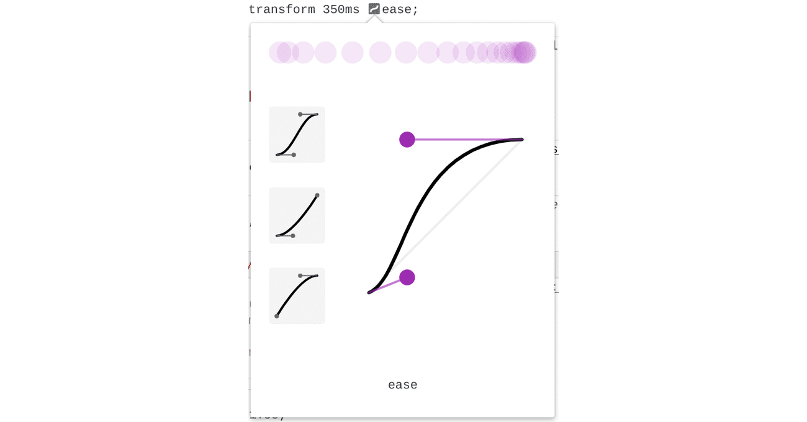
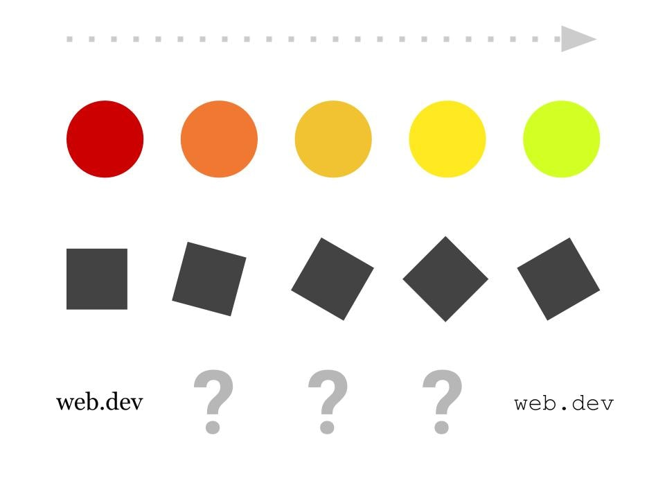

# 过渡

与网站互动时，您可能会注意到，许多元素都有状态。*state*例如，下拉菜单可以处于打开或关闭状态。当获得焦点或悬停在按钮上时，按钮可能会改变颜色。模态窗口出现和消失。

默认情况下，CSS 会即时切换这些状态的样式。

利用 CSS 转换，我们可以在元素的初始状态和目标状态之间插入。两者之间的过渡提供了有关互动原因和效果的视觉方向、支持和提示，从而改善了用户体验。

**关键术语** ：*插值*是创建“中间”步骤的过程，这些步骤能够顺畅地从一种状态转换为另一种状态。

<iframe allow="camera; clipboard-read; clipboard-write; encrypted-media; geolocation; microphone; midi;" loading="lazy" src="https://codepen.io/web-dot-dev/embed/zYzNrJV?height=320&amp;theme-id=light&amp;default-tab=result&amp;editable=true" data-darkreader-inline-border-top="" data-darkreader-inline-border-right="" data-darkreader-inline-border-bottom="" data-darkreader-inline-border-left="" data-title="由 web-dot-dev 在 Codepen 上发布的 Pen zYzNrJV" style="color-scheme: initial; box-sizing: inherit; border: 0px; height: 320px; width: 100%; --darkreader-inline-border-top: 0px; --darkreader-inline-border-right: 0px; --darkreader-inline-border-bottom: 0px; --darkreader-inline-border-left: 0px;"></iframe>

## 过渡属性

<BrowseSurport code="css.properties.transition-property" />
如需在 CSS 中使用过渡，您可以使用各种过渡属性或 `transition` 简写属性。

### transition 属性

[`transition-property`](https://developer.mozilla.org/docs/Web/CSS/transition-property) 属性指定要转换的样式。

```css
.my-element { 
    transition-property: background-color;
}
```

`transition-property` 接受逗号分隔列表中的一个或多个 CSS 属性名称。

（可选）您可以使用 `transition-property: all` 来指示每个属性都应转换。

<iframe allow="camera; clipboard-read; clipboard-write; encrypted-media; geolocation; microphone; midi;" loading="lazy" src="https://codepen.io/web-dot-dev/embed/VwWPeEj?height=400&amp;theme-id=light&amp;default-tab=result&amp;editable=true" data-darkreader-inline-border-top="" data-darkreader-inline-border-right="" data-darkreader-inline-border-bottom="" data-darkreader-inline-border-left="" data-title="来自 Codepen 上的 web-dot-dev 的 Pen VwWPeEj" style="color-scheme: initial; box-sizing: inherit; border: 0px; height: 400px; width: 100%; --darkreader-inline-border-top: 0px; --darkreader-inline-border-right: 0px; --darkreader-inline-border-bottom: 0px; --darkreader-inline-border-left: 0px;"></iframe>

### 过渡持续时间

[`transition-duration`](https://developer.mozilla.org/docs/Web/CSS/transition-duration) 属性用于定义完成过渡所需的时间。

<iframe allow="camera; clipboard-read; clipboard-write; encrypted-media; geolocation; microphone; midi;" loading="lazy" src="https://codepen.io/web-dot-dev/embed/wvegMYp?height=400&amp;theme-id=light&amp;default-tab=result&amp;editable=true" data-darkreader-inline-border-top="" data-darkreader-inline-border-right="" data-darkreader-inline-border-bottom="" data-darkreader-inline-border-left="" data-title="Codepen 上的 web-dot-dev 提供的 Pen wvegMYp" style="color-scheme: initial; box-sizing: inherit; border: 0px; height: 400px; width: 100%; --darkreader-inline-border-top: 0px; --darkreader-inline-border-right: 0px; --darkreader-inline-border-bottom: 0px; --darkreader-inline-border-left: 0px;"></iframe>

`transition-duration` 接受时间单位，可以是秒 (`s`) 或毫秒 (`ms`)，默认值为 `0s`。

### 过渡时间函数

使用 [`transition-timing-function`](https://developer.mozilla.org/docs/Web/CSS/transition-timing-function) 属性可改变 `transition-duration` 期间 CSS 过渡的速度。

默认情况下，CSS 会以恒定速度 (`transition-timing-function: linear`) 转换元素。线性转换最终看起来有点人为：在现实生活中，对象是有权重的，不能立即停止和开始转换。加入或退出过渡效果可让您的过渡更加生动和自然。

<iframe allow="camera; clipboard-read; clipboard-write; encrypted-media; geolocation; microphone; midi;" loading="lazy" src="https://codepen.io/web-dot-dev/embed/QWgdyZx?height=500&amp;theme-id=light&amp;default-tab=result&amp;editable=true" data-darkreader-inline-border-top="" data-darkreader-inline-border-right="" data-darkreader-inline-border-bottom="" data-darkreader-inline-border-left="" data-title="Codepen 上的 web-dot-dev 的 Pen QWgdyZx" style="color-scheme: initial; box-sizing: inherit; border: 0px; height: 500px; width: 100%; --darkreader-inline-border-top: 0px; --darkreader-inline-border-right: 0px; --darkreader-inline-border-bottom: 0px; --darkreader-inline-border-left: 0px;"></iframe>

我们的 [CSS 动画模块](/blogs/web/css/animations#animation-timing-function)很好地概述了计时函数。

您可以使用 [DevTools](https://developer.chrome.com/docs/devtools/css/animations) 实时尝试不同的计时函数。



### 过渡延迟

使用 [`transition-delay`](https://developer.mozilla.org/docs/Web/CSS/transition-delay) 属性指定过渡的开始时间。如果未指定 `transition-duration`，转换将立即开始，因为默认值为 `0s`。此属性接受时间单位，例如秒 (`s`) 或毫秒 (`ms`)。

<iframe allow="camera; clipboard-read; clipboard-write; encrypted-media; geolocation; microphone; midi;" loading="lazy" src="https://codepen.io/web-dot-dev/embed/jOwyWep?height=500&amp;theme-id=light&amp;default-tab=result&amp;editable=true" data-darkreader-inline-border-top="" data-darkreader-inline-border-right="" data-darkreader-inline-border-bottom="" data-darkreader-inline-border-left="" data-title="Codepen 上 web-dot-dev 的 Pen jOwyWep" style="color-scheme: initial; box-sizing: inherit; border: 0px; height: 500px; width: 100%; --darkreader-inline-border-top: 0px; --darkreader-inline-border-right: 0px; --darkreader-inline-border-bottom: 0px; --darkreader-inline-border-left: 0px;"></iframe>

此属性对于交错过渡非常有用，可以通过为组中的每个后续元素设置更长的 `transition-delay` 来实现。

<iframe allow="camera; clipboard-read; clipboard-write; encrypted-media; geolocation; microphone; midi;" loading="lazy" src="https://codepen.io/web-dot-dev/embed/yLXgeRQ?height=410&amp;theme-id=light&amp;default-tab=result&amp;editable=true" data-darkreader-inline-border-top="" data-darkreader-inline-border-right="" data-darkreader-inline-border-bottom="" data-darkreader-inline-border-left="" data-title="由 web-dot-dev 在 Codepen 上撰写的 Pen yLXgeRQ" style="color-scheme: initial; box-sizing: inherit; border: 0px; height: 410px; width: 100%; --darkreader-inline-border-top: 0px; --darkreader-inline-border-right: 0px; --darkreader-inline-border-bottom: 0px; --darkreader-inline-border-left: 0px;"></iframe>

`transition-delay` 对调试也很有用。将延迟时间设置为负值可以开始进一步向时间轴过渡。

### 简写：转换

与大多数 CSS 属性一样，也有一个简写版本。[`transition`](https://developer.mozilla.org/docs/Web/CSS/transition) 组合了 `transition-property`、`transition-duration`、`transition-timing-function` 和 `transition-delay`。

```css
.longhand { 
    transition-property:  transform;  
    transition-duration: 300ms;  
    transition-timing-function: ease-in-out; 
    transition-delay: 0s;
}
.shorthand { 
    transition: transform 300ms ease-in-out 0s;
}
```

## 哪些内容可以转换，哪些不能转换？

编写 CSS 时，您可以指定哪些属性应使用动画过渡。请参阅[这个可呈现动画效果的 CSS 属性的 MDN 列表](https://developer.mozilla.org/docs/Web/CSS/CSS_animated_properties)。

一般来说，只能转换在其起始状态和最终状态之间具有“中间状态”的元素。例如，不可能为 `font-family` 添加过渡，因为不清楚 `serif` 和 `monospace` 之间的“中间状态”应该是什么样子。另一方面，您可以为 `font-size` 添加过渡，因为它的单位是可在其间插入的长度。



以下是一些您可以转换的常见属性。

### 变革性

<BrowseSurport code="css.properties.transform" />

[`transform`](https://developer.mozilla.org/docs/Web/CSS/transform) CSS 属性通常会进行转换，因为它是由 GPU 加速的属性，可以实现更流畅的动画，同时消耗更少的电量。通过此属性，您可以任意缩放、旋转、平移或倾斜元素。

<iframe allow="camera; clipboard-read; clipboard-write; encrypted-media; geolocation; microphone; midi;" loading="lazy" src="https://codepen.io/web-dot-dev/embed/GRErowE?height=500&amp;theme-id=light&amp;default-tab=result&amp;editable=true" data-darkreader-inline-border-top="" data-darkreader-inline-border-right="" data-darkreader-inline-border-bottom="" data-darkreader-inline-border-left="" data-title="来自 Codepen 上的 web-dot-dev 的 Pen GRErowE" style="color-scheme: initial; box-sizing: inherit; border: 0px; height: 500px; width: 100%; --darkreader-inline-border-top: 0px; --darkreader-inline-border-right: 0px; --darkreader-inline-border-bottom: 0px; --darkreader-inline-border-left: 0px;"></iframe>

请查看[我们的“函数”模块](/blogs/web/css/functions)中[有关转换的部分](/blogs/web/css/functions#transforms)。

### 颜色

在互动之前、互动期间和之后，颜色可以很好地反映状态。例如，将鼠标悬停在按钮上时，按钮可能会改变颜色。这种颜色变化可向用户提供按钮可点击的反馈。

`color`、`background-color` 和 `border-color` 属性只是可以在互动时转换颜色的几个位置。

**注意** ：颜色过渡通常不需要晚于[运动减少](/blogs/web/css/transitions#accessibility_considerations)偏好设置。请做出最佳判断。

请查看[关于颜色的模块](/blogs/web/css/color)。

### 阴影

阴影通常会通过过渡来指示高度的变化，例如用户焦点的变化。

<iframe allow="camera; clipboard-read; clipboard-write; encrypted-media; geolocation; microphone; midi;" loading="lazy" src="https://codepen.io/web-dot-dev/embed/gORgPQx?height=300&amp;theme-id=light&amp;default-tab=result&amp;editable=true" data-darkreader-inline-border-top="" data-darkreader-inline-border-right="" data-darkreader-inline-border-bottom="" data-darkreader-inline-border-left="" data-title="由 web-dot-dev 在 Codepen 上开发的 Pen gORgPQx" style="color-scheme: initial; box-sizing: inherit; border: 0px; height: 300px; width: 100%; --darkreader-inline-border-top: 0px; --darkreader-inline-border-right: 0px; --darkreader-inline-border-bottom: 0px; --darkreader-inline-border-left: 0px;"></iframe>

请查看[我们关于阴影的模块](/blogs/web/css/shadows)。

### 过滤条件

[`filter`](https://developer.mozilla.org/docs/Web/CSS/filter) 是一个功能强大的 CSS 属性，可让您即时添加图形效果。在不同 `filter` 状态之间转换可以产生一些非常令人印象深刻的结果。

<iframe allow="camera; clipboard-read; clipboard-write; encrypted-media; geolocation; microphone; midi;" loading="lazy" src="https://codepen.io/web-dot-dev/embed/PojWZxJ?height=350&amp;theme-id=light&amp;default-tab=result&amp;editable=true" data-darkreader-inline-border-top="" data-darkreader-inline-border-right="" data-darkreader-inline-border-bottom="" data-darkreader-inline-border-left="" data-title="来自 Codepen 上的 web-dot-dev 的 Pen PojWZxJ" style="color-scheme: initial; box-sizing: inherit; border: 0px; height: 350px; width: 100%; --darkreader-inline-border-top: 0px; --darkreader-inline-border-right: 0px; --darkreader-inline-border-bottom: 0px; --darkreader-inline-border-left: 0px;"></iframe>

请参阅[关于过滤器的单元](/blogs/web/css/filters)。

## 转换触发器

您的 CSS 必须包含状态更改和触发该状态更改的事件，才能使 CSS 转换生效。此类触发器的一个典型示例是 `:hover` [伪类](/blogs/web/css/pseudo-classes)。当用户将光标悬停在某个元素上时，此伪类会进行匹配。

下面列出了一些可以触发元素状态变化的伪类和事件。

- [`:hover`](/blogs/web/css/pseudo-classes#hover)：如果光标位于相应元素上方，则匹配。
- [`:focus`](/blogs/web/css/pseudo-classes#focus_focus-within_and_focus-visible)：如果元素获得焦点，则匹配。
- [`:focus-within`](/blogs/web/css/pseudo-classes#focus_focus-within_and_focus-visible)：如果元素或其任何后代获得焦点，则匹配。
- [`:target`](/blogs/web/css/pseudo-classes#target)：如果当前网址的[片段](https://developer.mozilla.org/docs/Web/HTTP/Basics_of_HTTP/Identifying_resources_on_the_Web#fragment)与元素的 ID 匹配，则匹配。
- [`:active`](/blogs/web/css/pseudo-classes#active)：在元素激活时（通常是在鼠标上按下时）匹配。
- `class` 与 JavaScript 之间的变化：当元素的 CSS `class` 通过 JavaScript 发生更改时，CSS 会转换已更改的符合条件的属性。

## 进入或退出时的不同过渡效果

通过在悬停/聚焦时设置不同的 `transition` 属性，可以创建一些有趣的效果。

```css
.my-element { 
    background: red;  
    /* This transition is applied on the "exit" transition */  
    transition: background 2000ms ease-in;
}
.my-element:hover { 
    background: blue;  
    /* This transition is applied on the "enter" transition */  
    transition: background 150ms ease;
}
```

<iframe allow="camera; clipboard-read; clipboard-write; encrypted-media; geolocation; microphone; midi;" loading="lazy" src="https://codepen.io/web-dot-dev/embed/OJgWMaO?height=500&amp;theme-id=light&amp;default-tab=result&amp;editable=true" data-darkreader-inline-border-top="" data-darkreader-inline-border-right="" data-darkreader-inline-border-bottom="" data-darkreader-inline-border-left="" data-title="来自 Codepen 上的 web-dot-dev 的 Pen OJgWMaO" style="color-scheme: initial; box-sizing: inherit; border: 0px; height: 500px; width: 100%; --darkreader-inline-border-top: 0px; --darkreader-inline-border-right: 0px; --darkreader-inline-border-bottom: 0px; --darkreader-inline-border-left: 0px;"></iframe>

## 无障碍功能注意事项

CSS 过渡并非适用于所有人。对于有些人，过渡和动画可能会导致晕动病或不适。幸运的是，CSS 有一项名为 [`prefers-reduced-motion`](https://developer.mozilla.org/docs/Web/CSS/@media/prefers-reduced-motion) 的媒体功能，用于检测用户是否偏好减少设备上的动作。

```css
/*  If the user has expressed their preference for  reduced motion, then don't use transitions.*/
@media (prefers-reduced-motion: reduce) {
    .my-element { 
        transition: none;  
    }
}
/*  If the browser understands the media query and the user  explicitly hasn't set a preference, then use transitions.*/
@media (prefers-reduced-motion: no-preference) { 
    .my-element {   
        transition: transform 250ms ease;  
    }
}
```


**注意** ：在关于[动画和动画](/blogs/web/accessibility/motion)的“学习无障碍”模块中，您可以了解如何为网站增添乐趣，同时又不会给某些用户带来问题。
