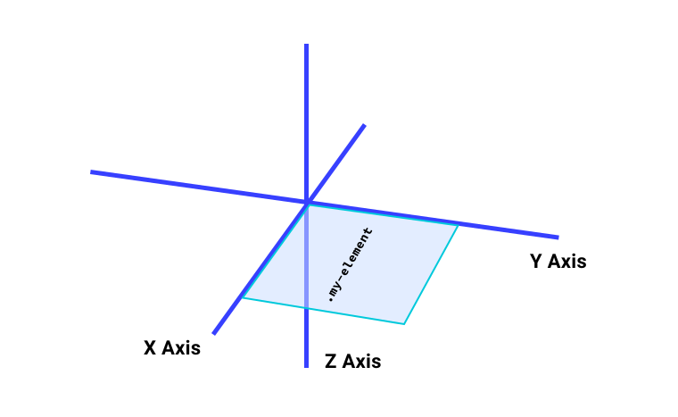

# Z-index 和堆叠上下文

假设您有几个元素已绝对定位，且本应位于彼此上方。您可能会像下面这样编写一些 HTML 代码：

```html
<div class="stacked-items">
    <div class="item-1">Item 1</div>
    <div class="item-2">Item 2</div>
</div>
```

但默认情况下，哪一个会叠放在另一个上？ 如需知道哪个项会执行此操作，您需要了解 Z-index 和堆叠上下文。

## Z-index

[`z-index`](https://developer.mozilla.org/docs/Web/CSS/z-index) 属性可基于浏览器的 3D 空间（Z 轴）明确设置 HTML 的图层顺序。这条轴表示哪些图层离您更近一些，哪些图层离您更远。Web 上的纵轴是 Y 轴，横轴是 X 轴。



`z-index` 属性接受数值，可以是正数，也可以是负数。如果元素的 `z-index` 值较高，它们将显示在另一个元素上方。如果元素上未设置 `z-index`，则默认行为是文档来源顺序决定 Z 轴。也就是说，文档靠下的元素会位于在其前面显示的元素之上。

<iframe allow="camera; clipboard-read; clipboard-write; encrypted-media; geolocation; microphone; midi;" loading="lazy" src="https://codepen.io/web-dot-dev/embed/GRrMEjZ?height=500&amp;theme-id=light&amp;default-tab=result&amp;editable=true" data-darkreader-inline-border-top="" data-darkreader-inline-border-right="" data-darkreader-inline-border-bottom="" data-darkreader-inline-border-left="" data-title="Codepen 上 web-dot-dev 的 Pen GRrMEjZ" style="color-scheme: initial; box-sizing: inherit; border: 0px; height: 500px; width: 100%; --darkreader-inline-border-top: 0px; --darkreader-inline-border-right: 0px; --darkreader-inline-border-bottom: 0px; --darkreader-inline-border-left: 0px;"></iframe>

在普通流程中，如果您为 `z-index` 设置了特定值但该值不起作用，则需将该元素的 `position` 值设置为 `static` 以外的任何值。这是人们与 `z-index` 斗争的常见地方。

<iframe allow="camera; clipboard-read; clipboard-write; encrypted-media; geolocation; microphone; midi;" loading="lazy" src="https://codepen.io/web-dot-dev/embed/bGgoRzv?height=500&amp;theme-id=light&amp;default-tab=result&amp;editable=true" data-darkreader-inline-border-top="" data-darkreader-inline-border-right="" data-darkreader-inline-border-bottom="" data-darkreader-inline-border-left="" data-title="来自 Codepen 上的 web-dot-dev 的 Pen bGgoRzv" style="color-scheme: initial; box-sizing: inherit; border: 0px; height: 500px; width: 100%; --darkreader-inline-border-top: 0px; --darkreader-inline-border-right: 0px; --darkreader-inline-border-bottom: 0px; --darkreader-inline-border-left: 0px;"></iframe>

不过，在 Flexbox 或网格环境中则并非如此，因为您无需添加 `position: relative` 即可修改 flex 或网格项的 Z-index。

<iframe allow="camera; clipboard-read; clipboard-write; encrypted-media; geolocation; microphone; midi;" loading="lazy" src="https://codepen.io/web-dot-dev/embed/QWdqMOP?height=500&amp;theme-id=light&amp;default-tab=result&amp;editable=true" data-darkreader-inline-border-top="" data-darkreader-inline-border-right="" data-darkreader-inline-border-bottom="" data-darkreader-inline-border-left="" data-title="Codepen 上的 web-dot-dev 的 Pen QWdqMOP" style="color-scheme: initial; box-sizing: inherit; border: 0px; height: 400px; width: 100%; --darkreader-inline-border-top: 0px; --darkreader-inline-border-right: 0px; --darkreader-inline-border-bottom: 0px; --darkreader-inline-border-left: 0px;"></iframe>

## Z-index 为负

如需将某个元素设置为位于另一个元素的后面，请为 `z-index` 添加一个负值。

```css
.my-element {
    background:rgb(232240254/0.4);
}

.my-element .child {
    position: relative;
    z-index:-1;
}
```

只要 `.my-element` 的 `z-index` 的初始值为 `auto`，`.child` 元素就会位于其后面。

<iframe allow="camera; clipboard-read; clipboard-write; encrypted-media; geolocation; microphone; midi;" loading="lazy" src="https://codepen.io/web-dot-dev/embed/XWpeayj?height=400&amp;theme-id=light&amp;default-tab=result&amp;editable=true" data-darkreader-inline-border-top="" data-darkreader-inline-border-right="" data-darkreader-inline-border-bottom="" data-darkreader-inline-border-left="" data-title="由 web-dot-dev 在 Codepen 上开发的 Pen XWpeayj" style="color-scheme: initial; box-sizing: inherit; border: 0px; height: 500px; width: 100%; --darkreader-inline-border-top: 0px; --darkreader-inline-border-right: 0px; --darkreader-inline-border-bottom: 0px; --darkreader-inline-border-left: 0px;"></iframe>

将以下 CSS 添加到 `.my-element`，这样 `.child` 元素就不会位于其后面了。

```css
.my-element {
  position: relative;
  z-index:0;
  background: rgb(232240254/0.4);
}
```

<iframe allow="camera; clipboard-read; clipboard-write; encrypted-media; geolocation; microphone; midi;" loading="lazy" src="https://codepen.io/web-dot-dev/embed/bGgorZy?height=400&amp;theme-id=light&amp;default-tab=result&amp;editable=true" data-darkreader-inline-border-top="" data-darkreader-inline-border-right="" data-darkreader-inline-border-bottom="" data-darkreader-inline-border-left="" data-title="Codepen 上的 web-dot-dev 的 Pen bGgorZy" style="color-scheme: initial; box-sizing: inherit; border: 0px; height: 400px; width: 100%; --darkreader-inline-border-top: 0px; --darkreader-inline-border-right: 0px; --darkreader-inline-border-bottom: 0px; --darkreader-inline-border-left: 0px;"></iframe>

由于 `.my-element` 现在的 `position` 值不是 `static`，`z-index` 值不是 `auto`，因此它创建了新的堆叠上下文。**这意味着，即使将 `.child` 的 `z-index` 设置为 `-999`，它也不会位于 `.my-parent` 之后。**

**## 叠加上下文

堆叠上下文是一组具有共同父项的元素，并一起沿 z 轴上下移动。

<iframe allow="camera; clipboard-read; clipboard-write; encrypted-media; geolocation; microphone; midi;" loading="lazy" src="https://codepen.io/web-dot-dev/embed/JjErOXV?height=600&amp;theme-id=light&amp;default-tab=result&amp;editable=true" data-darkreader-inline-border-top="" data-darkreader-inline-border-right="" data-darkreader-inline-border-bottom="" data-darkreader-inline-border-left="" data-title="由 web-dot-dev 在 Codepen 上发布的 Pen JjErOXV" style="color-scheme: initial; box-sizing: inherit; border: 0px; height: 500px; width: 100%; --darkreader-inline-border-top: 0px; --darkreader-inline-border-right: 0px; --darkreader-inline-border-bottom: 0px; --darkreader-inline-border-left: 0px;"></iframe>

在此示例中，第一个父元素的 `z-index` 为 `1`，因此系统会创建一个新的堆叠上下文。 其子元素的 `z-index` 为 `999`。此父元素旁边还有另一个父元素，该父元素包含一个子元素。父元素的 `z-index` 为 `2`，子元素的 `z-index` 也为 `2`。由于两个父项都会创建堆叠上下文，因此所有子项的 `z-index` 均基于其父项的上下文。

堆叠上下文内元素的 `z-index` 始终相对于父项在其自己的堆叠上下文中的当前顺序。

**注意 ** ：`<html>` 元素本身是一个堆叠的上下文，其后面没有任何内容。您可以在 `<body>` 后面放置一些内容，直到用它创建堆叠上下文为止。## 创建堆叠上下文

您无需应用 `z-index` 和 `position` 即可创建新的[堆叠上下文](https://developer.mozilla.org/docs/Web/CSS/CSS_Positioning/Understanding_z_index/The_stacking_context)。您可以通过为用于创建新的复合层（如 `opacity`、`will-change` 和 `transform`）的属性添加值来创建新的堆叠上下文。您可以[在此处查看完整的属性列表](https://developer.mozilla.org/docs/Web/CSS/CSS_Positioning/Understanding_z_index/The_stacking_context)。

为了解释复合层是什么，我们先假设网页是一张画布。浏览器会获取您的 HTML 和 CSS 并使用这些信息来计算画布的大小。 然后，它会在该画布上绘制页面。 如果要更改某个元素（例如，它的位置发生变化），浏览器必须返回并重新确定要绘制的内容。

为提高性能，浏览器会创建新的复合图层，这些图层叠加在画布之上。这有点像便利贴：四处移动并更改它对整体画布没有太大影响。系统会为具有 `opacity`、`transform` 和 `will-change` 的元素创建新的复合图层，因为这些元素很可能会发生变化，因此浏览器会使用 GPU 应用样式调整，确保更改的效果尽可能好。

**注意 ** ：您还可以通过添加 `filter` 并设置 `backface-visibility: hidden` 来创建堆叠上下文。## 资源

* [强制使用层](https://surma.dev/things/forcing-layers/)
* [了解 Z-index](https://ishadeed.com/article/understanding-z-index/)
