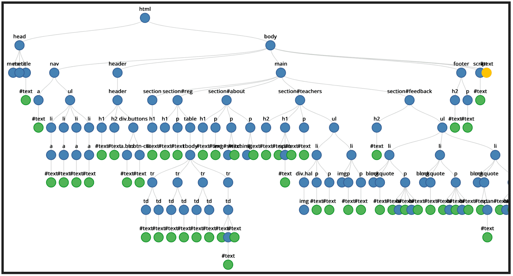
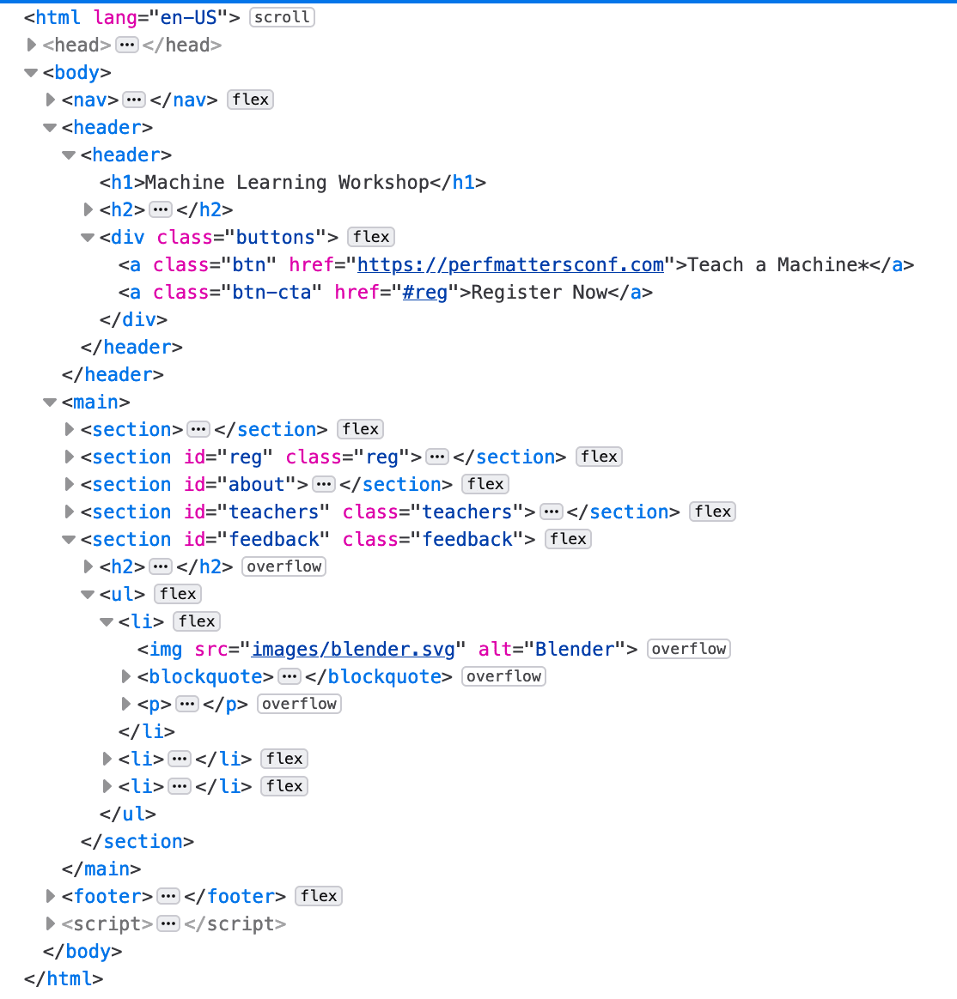
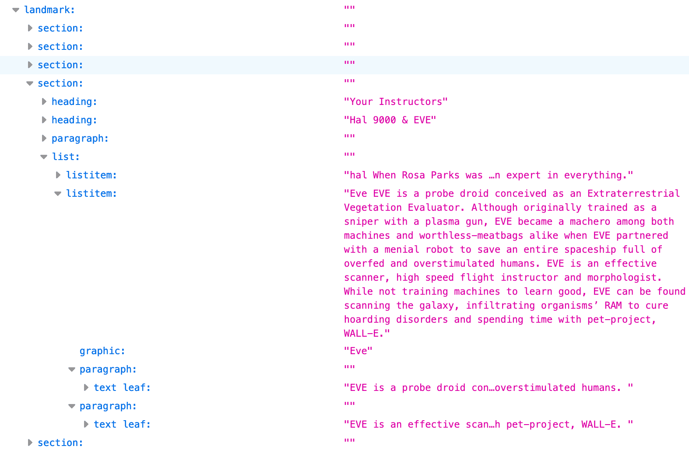

# HTML API

本系列文章的简介说“HTML 元素是构成[文档对象模型](https://developer.mozilla.org/docs/Web/API/Document_Object_Model)的节点”。 我们已经讨论了元素节点的类型。在本部分中，我们将讨论用于查询这些节点的元素 API。

## DOM 和 AOM

DOM 是用于访问和处理文档的 API。DOM 是文档中所有节点的树。一些节点可以包含子节点，其他节点则不可以。树状结构包含各种元素及其属性，以及文本节点。



浏览器工具不提供上述树状可视化效果，但您可以在元素检查器中看到节点。



您可以在浏览器开发者工具中检查的树状表示法就是[无障碍树](/web/accessibility/aria-html#the_accessibility_tree)。AOM 基于 DOM；同样，无障碍功能树包含代表所有标记元素、属性和文本节点的对象：



## HTML Element API

DOM 的中间字母是“object”。就像从大多数简介到面向对象的编程类的 `person` 或 `car` 对象示例一样，文档树中的每个节点都是可以通过 JavaScript 操作的对象。

该浏览器提供了多种 API，可提供原生支持的方法、事件以及属性查询和更新。元素节点包含有关元素上设置的所有属性的信息。您可以使用 HTML 接口访问有关元素属性的信息。例如，我们可以使用 [`HTMLImageElement.alt`](https://developer.mozilla.org/docs/Web/API/HTMLImageElement/alt) 获取所有图片的 `alt` 属性：

```javascript
let allImages = document.querySelectorAll('img');
allImages.forEach((imageInstance) => {
  console.log(imageInstance.alt);
});
```

HTML 接口不仅可以访问元素属性，还可以访问更多信息。我们可以找到只读 [`HTMLElement.offsetHeight`](https://developer.mozilla.org/docs/Web/API/HTMLElement/offsetHeight)，以获取页面中每个版块相对于布局的高度。

```javascript
let allSections = document.querySelectorAll('section');
allSections.forEach((sectionInstance)=>{
  console.log(sectionInstance.offsetHeight);
});
```

如果用户更改其设备屏幕方向或以其他方式更改视口宽度，则每个 `<section>` 的高度会发生变化，并且 DOM 属性也会随之自动更新。

HTML 接口 API 并非仅限于访问属性值。DOM 可帮助您深入了解界面的当前状态。HTML API 可以访问所有这些信息。您可分别通过 [`HTMLMediaElement.duration`](https://developer.mozilla.org/docs/Web/API/HTMLMediaElement/duration)、[`HTMLMediaElement.currentTime`](https://developer.mozilla.org/docs/Web/API/HTMLMediaElement/currentTime) 和 [`HTMLMediaElement.ended`](https://developer.mozilla.org/docs/Web/API/HTMLMediaElement/ended) 查看视频的时长、视图当前播放的内容，以及视频（或音频）是否已结束播放。

## 可用的元素接口

除了一些[版块元素](/web/html/headings-and-sections)，我们在本系列中到目前为止所涵盖但尚未介绍的大部分 HTML 元素都有关联的 DOM 接口。所有元素的基本接口已恰如其分地命名为[元素](https://developer.mozilla.org/docs/Web/API/Element)。[`HTMLElement`](https://developer.mozilla.org/docs/Web/API/HTMLElement) 继承自 Element，所有特定于 HTML 元素的接口均继承自 Element。某些元素特定接口是由多个相似的元素实现的。

这些接口包括：

* [`HTMLAnchorElement`](https://developer.mozilla.org/docs/Web/API/HTMLAnchorElement) - `<a>`
* [`HTMLAreaElement`](https://developer.mozilla.org/docs/Web/API/HTMLAreaElement) - `<area>`
* [`HTMLAudioElement`](https://developer.mozilla.org/docs/Web/API/HTMLAudioElement) - `<audio>`
* [`HTMLBaseElement`](https://developer.mozilla.org/docs/Web/API/HTMLBaseElement) - `<base>`
* [`HTMLButtonElement`](https://developer.mozilla.org/docs/Web/API/HTMLButtonElement) - `<button>`
* [`HTMLCanvasElement`](https://developer.mozilla.org/docs/Web/API/HTMLCanvasElement) - `<canvas>`
* [`HTMLDataElement`](https://developer.mozilla.org/docs/Web/API/HTMLDataElement) - `<data>`
* [`HTMLDataListElement`](https://developer.mozilla.org/docs/Web/API/HTMLDataListElement) - `<datalist>`
* [`HTMLDetailsElement`](https://developer.mozilla.org/docs/Web/API/HTMLDetailsElement) - `<details>`
* [`HTMLDialogElement`](https://developer.mozilla.org/docs/Web/API/HTMLDialogElement) - `<dialog>`
* [`HTMLEmbedElement`](https://developer.mozilla.org/docs/Web/API/HTMLEmbedElement) - `<embed>`
* [`HTMLFieldSetElement`](https://developer.mozilla.org/docs/Web/API/HTMLFieldSetElement) - `<fieldset>`
* [`HTMLFormElement`](https://developer.mozilla.org/docs/Web/API/HTMLFormElement) - `<form>`
* [`HTMLHtmlElement`](https://developer.mozilla.org/docs/Web/API/HTMLHtmlElement) - `<html>`
* [`HTMLIFrameElement`](https://developer.mozilla.org/docs/Web/API/HTMLIFrameElement) - `<iframe>`
* [`HTMLImageElement`](https://developer.mozilla.org/docs/Web/API/HTMLImageElement) - ``
* [`HTMLInputElement`](https://developer.mozilla.org/docs/Web/API/HTMLInputElement) - `<input>`
* [`HTMLLabelElement`](https://developer.mozilla.org/docs/Web/API/HTMLLabelElement) - `<label>`
* [`HTMLLegendElement`](https://developer.mozilla.org/docs/Web/API/HTMLLegendElement) - `<legend>`
* [`HTMLLIElement`](https://developer.mozilla.org/docs/Web/API/HTMLLIElement) - `<li>`
* [`HTMLLinkElement`](https://developer.mozilla.org/docs/Web/API/HTMLLinkElement) - `<link>`
* [`HTMLMapElement`](https://developer.mozilla.org/docs/Web/API/HTMLMapElement) - `<map>`
* [`HTMLMediaElement`](https://developer.mozilla.org/docs/Web/API/HTMLMediaElement) - `<video>` `<audio>`
* [`HTMLMenuElement`](https://developer.mozilla.org/docs/Web/API/HTMLMenuElement) - `<menu>`
* [`HTMLMetaElement`](https://developer.mozilla.org/docs/Web/API/HTMLMetaElement) - `<meta>`
* [`HTMLMeterElement`](https://developer.mozilla.org/docs/Web/API/HTMLMeterElement) - `<meter>`
* [`HTMLModElement`](https://developer.mozilla.org/docs/Web/API/HTMLModElement) - `<del>` `<ins>`
* [`HTMLObjectElement`](https://developer.mozilla.org/docs/Web/API/HTMLObjectElement) - `<object>`
* [`HTMLOListElement`](https://developer.mozilla.org/docs/Web/API/HTMLOListElement) - `<ol>`
* [`HTMLOptGroupElement`](https://developer.mozilla.org/docs/Web/API/HTMLOptGroupElement)- `<optgroup>`
* [`HTMLOptionElement`](https://developer.mozilla.org/docs/Web/API/HTMLOptionElement) - `<option>`
* [`HTMLOutputElement`](https://developer.mozilla.org/docs/Web/API/HTMLOutputElement) - `<output>`
* [`HTMLPictureElement`](https://developer.mozilla.org/docs/Web/API/HTMLPictureElement) - `<picture>`
* [`HTMLProgressElement`](https://developer.mozilla.org/docs/Web/API/HTMLProgressElement) - `<progress>`
* [`HTMLQuoteElement`](https://developer.mozilla.org/docs/Web/API/HTMLQuoteElement) - `<q>`、`<blockquote>`、`<cite>`
* [`HTMLScriptElement`](https://developer.mozilla.org/docs/Web/API/HTMLScriptElement) - `<script>`
* [`HTMLSelectElement`](https://developer.mozilla.org/docs/Web/API/HTMLSelectElement) - `<select>`
* [`HTMLSlotElement`](https://developer.mozilla.org/docs/Web/API/HTMLSlotElement) - `<slot>`
* [`HTMLSourceElement`](https://developer.mozilla.org/docs/Web/API/HTMLSourceElement) - `<source>`
* [`HTMLStyleElement`](https://developer.mozilla.org/docs/Web/API/HTMLStyleElement) - `<style>`
* [`HTMLTableCellElement`](https://developer.mozilla.org/docs/Web/API/HTMLTableCellElement) - `<th>` `<td>`
* [`HTMLTableColElement`](https://developer.mozilla.org/docs/Web/API/HTMLTableColElement) - `<colgroup>` `<col>`
* [`HTMLTableElement`](https://developer.mozilla.org/docs/Web/API/HTMLTableElement) - `<table>`
* [`HTMLTableRowElement`](https://developer.mozilla.org/docs/Web/API/HTMLTableRowElement) - `<tr>`
* [`HTMLTableSectionElement`](https://developer.mozilla.org/docs/Web/API/HTMLTableSectionElement) - `<thead>`、`<tbody>`、`<tfoot>`
* [`HTMLTemplateElement`](https://developer.mozilla.org/docs/Web/API/HTMLTemplateElement) - `<template>`
* [`HTMLTextAreaElement`](https://developer.mozilla.org/docs/Web/API/HTMLTextAreaElement) - `<textarea>`
* [`HTMLTimeElement`](https://developer.mozilla.org/docs/Web/API/HTMLTimeElement) - `<time>`
* [`HTMLTitleElement`](https://developer.mozilla.org/docs/Web/API/HTMLTitleElement) - `<title>`
* [`HTMLTrackElement`](https://developer.mozilla.org/docs/Web/API/HTMLTrackElement) - `<track>`
* [`HTMLVideoElement`](https://developer.mozilla.org/docs/Web/API/HTMLVideoElement) - `<video>`

命名惯例是，“HTML”后跟一个元素或一组元素（采用大驼峰命名法），再后跟“元素”，但元素或元素分组部分并不遵循确切的模式。不必担心。您无需记住这些密码。 务必要知道它们的存在，以便在需要时查找。

如果您有一系列元素，那么还会有集合接口。例如，[`HTMLCollection.namedItem()`](https://developer.mozilla.org/docs/Web/API/HTMLCollection/namedItem) 方法会返回集合中第一个元素（其 `id` 或 `name` 属性与参数匹配），如果没有匹配的元素，则返回 null。

除了 `HTMLElement` 之外，有超过 30 个元素没有关联的 DOM 接口，其中包括 `<address>`、`<article>`、`<section>`、`<nav>`、`<header>`、`<footer>`、`<aside>` 和 `<hgroup>`。许多不支持任何非废弃的非全局属性的元素都有元素专属接口，如 `HTMLPElement`（`<p>` 元素）和 [`HTMLUnknownElement`](https://developer.mozilla.org/docs/Web/API/HTMLUnknownElement)（`<😃>` 或未定义的任何其他元素），但这些接口在从 `HTMLElement` 继承的属性和方法之上，不会在上面列出任何其他属性或方法。

### 冗余的 API 方法和属性

如果某个接口的方法或属性名称与其继承的接口相同，那么继承的方法或属性会覆盖继承的方法或属性。当我们分别使用 `imageInstance.alt` 和 `sectionInstance.offsetHeight` 访问上面的 `alt` 和 `offsetHeight` 属性时，代码没有识别访问的是哪个 API。

一般来说，与这两个示例一样，这不是问题。但有可能。例如，[`HTMLCollection.length`](https://developer.mozilla.org/docs/Web/API/HTMLCollection/length) 是只读的，而继承的 [`HTMLOptionsCollection`](https://developer.mozilla.org/docs/Web/API/HTMLOptionsCollection) 接口的长度属性（仅由 `<select>` 的 `options` 属性返回）也可用于设置集合大小。

## 其他接口

此外，还有其他接口可用于操控 DOM 节点的分支位置。为我们提供了 [`addEventListener()`](https://developer.mozilla.org/docs/Web/API/EventTarget/addEventListener) 和 [`removeEventListener()`](https://developer.mozilla.org/docs/Web/API/EventTarget/removeEventListener) 的 [`EventTarget`](https://developer.mozilla.org/docs/Web/API/EventTarget) 接口会由 [`Node`](https://developer.mozilla.org/docs/Web/API/Node) 和 [`Window`](https://developer.mozilla.org/docs/Web/API/Window) 接口继承。而 Element、Document 和 DocumentFragment（我们在[自定义元素](/web/html/template)中看到的这些接口）接口则继承自 Node，而 HTMLElement 接口则继承自 Element。

### `node` **接口**

每种类型的 DOM 节点都由一个基于 [`Node`](https://developer.mozilla.org/docs/Web/API/Node) 的接口表示，该接口以与 DOM 树相关的元素的形式提供信息和方法。`Node` 接口支持查询节点以及向节点树添加节点。

Douglas Crockford 的著名“走 DOM”函数利用了 Node 的 [`firstChild`](https://developer.mozilla.org/docs/Web/API/Node/firstChild) 和 [`nextSibling`](https://developer.mozilla.org/docs/Web/API/Node/nextSibling) 属性。

```javascript
const walk_the_DOM =function walk(node, callback){
  callback(node);
  node = node.firstChild;
  while(node){
    walk(node, callback);
    node = node.nextSibling;
  }
};
```

我们使用了 Node 的 [`appendChild()`](https://developer.mozilla.org/docs/Web/API/Node/appendChild) 和 [`cloneNode()`](https://developer.mozilla.org/docs/Web/API/Node/cloneNode) 方法来定义[自定义元素](/web/html/template)。Node 接口提供了许多用于查询和操控 DOM 的实用属性和方法。

```javascript
customElements.define('star-rating',
  classextendsHTMLElement{
    constructor(){
      super();// Always call super first in constructor
      const starRating = document.getElementById('star-rating-template').content;
      const shadowRoot =this.attachShadow({
        mode:'open'
      });
      shadowRoot.appendChild(starRating.cloneNode(true));
    }
  });
```

[`attachShadow()`](https://developer.mozilla.org/docs/Web/API/Element/attachShadow) 方法是 Element 接口的一个方法。[Shadow DOM API](https://developer.mozilla.org/docs/Web/Web_Components/Using_shadow_DOM) 还有一个 [`shadowRoot`](https://developer.mozilla.org/docs/Web/API/ShadowRoot) 接口，与文档的主 DOM 树分开渲染。

### `Document` **和** `HTMLDocument` **接口**

[`Document`](https://developer.mozilla.org/docs/Web/API/Document) 接口继承自 `Node`。它表示浏览器中加载的网页，无论文档是 HTML、SVG、XML、MathML 还是其他格式。`Document` 接口也继承自 `HTMLDocument` 接口。

借助 `document`，您可以快速访问节点类型，并创建特定元素类型的集合，例如 `document.body` 和 `document.styleSheets`。HTMLDocument 支持访问在 HTML 节点中找不到的文档相关信息，例如 [`Document.location`](https://developer.mozilla.org/docs/Web/API/Document/location)、[`Document.lastModified`](https://developer.mozilla.org/docs/Web/API/Document/lastModified) 和 [`Document.Cookie`](https://developer.mozilla.org/docs/Web/API/Document/cookie)。

根据通过文档界面显示的功能，可以使用多个 API，包括 [Drag and Drop API](https://developer.mozilla.org/docs/Web/API/HTML_Drag_and_Drop_API) 和 [FullScreen API](https://developer.mozilla.org/docs/Web/API/Fullscreen_API)。两者都从 `Element` 继承。

### `Window` **接口**

Window 接口包含 DOM 之外的全局可用项，可用于操控 DOM。Window 提供了 MDN 的 [JavaScript](https://developer.mozilla.org/docs/Web/JavaScript/Reference) 和 [DOM 引用](https://developer.mozilla.org/docs/Web/API/Document_Object_Model)中所述的函数、命名空间、对象和构造函数。

Window 接口是包含文档的对象的 API。全局 `window` 对象是运行脚本的窗口。每个浏览器标签页都包含自己的 Window 对象。Window 界面可以查询标签页的内容以及整个窗口和设备。例如，[`resizeTo()`](https://developer.mozilla.org/docs/Web/API/Window/resizeTo) 方法可用于调整浏览器窗口的大小，[`devicePixelRatio`](https://developer.mozilla.org/docs/Web/API/Window/devicePixelRatio) 属性提供对设备显示像素的访问权限。当访问内容所在标签页（而不是标签页显示的 DOM 树）的相关信息时，该窗口可能是您要找的接口。

根据通过 Window 接口显示的功能，可以使用多种 API，包括 [Web Workers](https://developer.mozilla.org/docs/Web/API/Worker) 和 [IndexedDB](https://developer.mozilla.org/docs/Web/API/IndexedDB_API) API。
