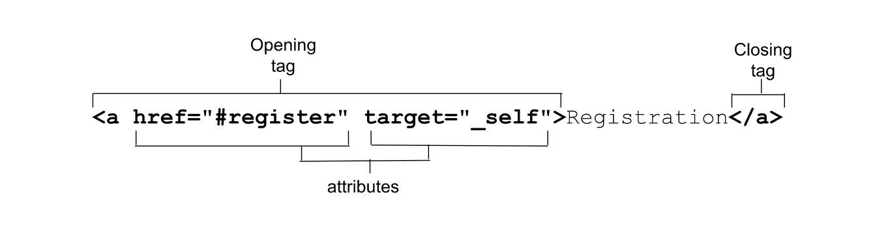

# 属性

[HTML 概述](/web/html/overview#attributes)中简要讨论了属性；现在，我们将进行深入探讨。

属性是让 HTML 如此强大的原因。属性是起始标记中显示的以空格分隔的名称和名称/值对，用于提供相应元素的相关信息和功能。



属性定义了元素的行为、关联和功能。有些属性是全局属性，也就是说它们可以出现在任何元素的起始标记中。其他属性适用于多个元素（但并非全部），而其他属性则特定于元素，仅与单个元素相关。在 HTML 中，除布尔值之外的所有属性以及在某种程度上枚举属性都需要值。

如果属性值包含空格或特殊字符，则必须用引号括住该值。出于这个原因，也为了提高易读性，始终建议使用引号。

虽然 HTML 不区分大小写，但有些属性值区分大小写。属于 HTML 规范的值不区分大小写。 定义的字符串值（例如类和 ID 名称）区分大小写。如果属性值在 HTML 中区分大小写，那么在 CSS 和 JavaScript 中用作[属性选择器](https://developer.mozilla.org/docs/Web/CSS/Attribute_selectors)的一部分时则区分大小写；在其他情况下则不区分大小写。

```javascript
<!-- the type attribute is case insensitive: these are equivalent -->
<inputtype="text">
<inputtype="TeXt">

<!-- the id attribute is case sensitive: they are not equivalent -->
<divid="myId">
<divid="MyID">
```

## 布尔值属性

如果存在布尔值属性，则该属性始终为 true。布尔值属性包括 `autofocus`、`inert`、`checked`、`disabled`、`required`、`reversed`、`allowfullscreen`、`default,` `loop`、`autoplay`、`controls`、`muted`、`readonly`、`multiple,` 和 `selected`。如果存在其中一个或多个属性，则该元素会被停用、必需、只读等。如果不存在，则不存在。

布尔值可以省略、设为空字符串或者设为属性名称；但值实际上并非必须设为字符串 `true`。包括 `true`、`false` 和 `😀` 等的所有无效值都将解析为 true。

以下三个标记是等效的：

```javascript
<inputrequired>
<inputrequired="">
<inputrequired="required">
```

如果属性值为 false，请省略该属性。如果该属性为 true，请包含该属性，但不提供值。 例如，`required="required"` 在 HTML 中不是有效值；但由于 `required` 是布尔值，因此无效值会解析为 true。 但是，由于无效的枚举属性不一定解析为与缺失值相同的值，因此，相对于记住哪些属性是布尔值和枚举属性，并且可能会提供无效值，更容易养成省略值的习惯。

在 true 和 false 之间切换时，请使用 JavaScript 完全添加和移除属性，而不是切换值。

```javascript
const myMedia = document.getElementById("mediaFile");
myMedia.removeAttribute("muted");
myMedia.setAttribute("muted");
```

请注意，在 XML 语言（例如 SVG）中，所有属性（包括布尔属性）都需要包含一个值。

## 枚举属性

枚举属性有时会与布尔值属性相混淆。它们属于 HTML 属性，具有一组有限的预定义有效值。与布尔值属性一样，如果属性存在但缺少值，则它们具有默认值。例如，如果您添加 `<style contenteditable>`，则默认为 `<style contenteditable="true">`。

不过，与布尔值属性不同的是，省略该属性并不意味着该属性为 false；具有缺失值的当前属性并不一定为 true；无效值的默认值也不一定与 null 字符串相同。继续以此示例为例，如果 `contenteditable` 缺失或无效，则默认为 `inherit`，并且可以明确设置为 `false`。

默认值取决于属性。与布尔值不同，属性如果存在，不会自动为“true”。如果您添加了 `<style contenteditable="false">`，则元素无法修改。如果值无效（例如 `<style contenteditable="😀">`）或出人意料的 `<style contenteditable="contenteditable">`，则该值无效，默认为 `inherit`。

在大多数情况下，使用枚举属性时，缺失值和无效值是相同的。例如，如果 `<input>` 上的 `type` 属性缺失、存在但不含值或包含无效值，则默认为 `text`。虽然这种行为很常见，但并不常见。 因此，请务必了解哪些属性是布尔值属性，哪些属性为枚举值；如果可能的话，请省略值，以免弄错，并根据需要查找值。

## 全局属性

全局属性是指可在任何 HTML 元素上设置的属性，包括 `<head>` 中的元素。全局属性数量超过 [30 个](https://developer.mozilla.org/docs/Web/HTML/Global_attributes#list_of_global_attributes)。虽然从理论上讲，所有这些都可以添加到任何 HTML 元素中，但某些全局属性在对某些元素进行设置时不会产生任何影响；例如，在 `<meta>` 上设置 `hidden` 时不会显示元内容。

### `id`

全局属性 `id` 用于定义元素的唯一标识符。它有多种用途，包括： - 链接的片段标识符的目标。 - 识别用于编写脚本的元素。 - 将表单元素与其标签相关联。 - 为辅助技术提供标签或说明。 - 在 CSS 中以（高特异性或作为属性选择器）定位样式。

`id` 值是一个不含空格的字符串。如果包含空格，文档不会中断，但您必须使用 HTML、CSS 和 JS 中的转义字符来定位 `id`。所有其他字符均有效。`id` 值可以是 `😀` 或 `.class`，但不建议这样做。为了简化当前和未来的编程，请将 `id` 的第一个字符设为字母，并仅使用 ASCII 字母、数字、`_` 和 `-`。最好先制定一个 `id` 命名惯例，然后严格遵循该惯例，因为 `id` 值区分大小写。

`id` 应该是文档中唯一的。如果 `id` 多次使用，网页的布局可能不会中断，但 JavaScript、链接和元素互动可能不会按预期运行。

#### 链接片段标识符

导航栏包含四个链接。我们稍后将介绍链接元素，但目前要认识到，链接并不仅限于基于 HTTP 的网址，它们可以是当前文档（或其他文档中）的网页部分的片段标识符。

在机器学习研讨会网站上，页眉中的导航栏包含四个链接：

<iframe allow="camera; clipboard-read; clipboard-write; encrypted-media; geolocation; microphone; midi;" loading="lazy" src="https://codepen.io/web-dot-dev/embed/GRGzbXR?height=300&amp;theme-id=dark&amp;default-tab=html%2Cresult&amp;editable=true" data-darkreader-inline-border-top="" data-darkreader-inline-border-right="" data-darkreader-inline-border-bottom="" data-darkreader-inline-border-left="" data-title="由 web-dot-dev 在 Codepen 上开发的 Pen GRGzbXR"></iframe>

href 属性提供激活链接后用户会转到的超链接。如果网址包含井号 (`#`)，后跟一串字符，该字符串就是片段标识符。如果该字符串与网页中某个元素的 `id` 匹配，该 fragment 就是该元素的锚标记或书签。浏览器将滚动到定义锚点的位置。

这四个链接指向我们网页中使用 `id` 属性标识的四个版块。当用户点击导航栏中的四个链接中的任何一个时，由 fragment 标识符关联的元素（包含匹配 ID 减去 `#` 的元素）将滚动到视野范围内。

机器学习研讨会的 `<main>` 内容分为四个带有 ID 的部分。当网站访问者点击 `<nav>` 中的其中一个链接时，具有该 fragment 标识符的部分会滚动到视野范围内。标记类似于以下内容：

```html
<section id="reg">
  <h2>Machine Learning Workshop Tickets</h2>
</section>

<section id="about">
  <h2>What you'll learn</h2>
</section>

<section id="teachers">
  <h2>Your Instructors</h2>
  <h3>Hal 9000 <span>&amp;</span> EVE</h3>
</section>

<section id="feedback">
  <h2>What it's like to learn good and do other stuff good too</h2>
</section>
```

比较 `<nav>` 链接中的 fragment 标识符，您会注意到，每个标识符都与 `<main>` 中 `<section>` 的 `id` 匹配。浏览器为我们提供了免费的“页首”链接。设置 `href="#top"`（不区分大小写或仅设置 `href="#"`）会将用户滚动到页面顶部。

`href` 中的哈希标记分隔符不是片段标识符的一部分。片段标识符始终是网址的最后一部分，不会发送到服务器。

#### CSS 选择器

在 CSS 中，您可以使用 ID 选择器（如 `#feedback`）来定位每个版块，或者使用区分大小写的[属性选择器](/web/css/selectors#attribute_selector) `[id="feedback"]`（为降低[特异性](https://developer.mozilla.org/docs/Web/CSS/Specificity)）。

#### 设计脚本

MLW.com 上有只鼠标用户的复活节彩蛋功能。点击灯开关即可打开和关闭网页。

灯光开关图片的标记如下： `html ` `id` 属性可用作 [`getElementById()`](https://developer.mozilla.org/docs/Web/API/Document/getElementById) 方法的参数，且带有 `#` 前缀，可用作 [`querySelector()`](https://developer.mozilla.org/docs/Web/API/Document/querySelector) 和 [`querySelectorAll()`](https://developer.mozilla.org/docs/Web/API/Document/querySelectorall) 方法参数的一部分。

```javascript
const switchViaID = document.getElementById("switch");
const switchViaSelector = document.querySelector("#switch");
```

我们的一个 JavaScript 函数就是利用这种功能按元素的 `id` 属性定位元素的：

```javascript
<script>
  /* switch is a reserved word in js, so we us onoff instead */
  const onoff = document.getElementById('switch');
  onoff.addEventListener('click',function(){
    document.body.classList.toggle('black');
  });
</script>
```

#### `<label>`

[HTML `<label>` 元素](https://developer.mozilla.org/docs/Web/HTML/Element/label)有一个 `for` 属性，该属性将与其相关联的表单控件的 `id` 作为其值。通过在每个表单控件上添加 `id` 并将每个表单控件与标签的 `for` 属性配对来创建显式标签，可确保每个表单控件都有一个关联的标签。

<iframe allow="camera; clipboard-read; clipboard-write; encrypted-media; geolocation; microphone; midi;" loading="lazy" src="https://codepen.io/web-dot-dev/embed/JjZxQOB?height=300&amp;theme-id=dark&amp;default-tab=html%2Cresult&amp;editable=true" data-darkreader-inline-border-top="" data-darkreader-inline-border-right="" data-darkreader-inline-border-bottom="" data-darkreader-inline-border-left="" data-title="由 web-dot-dev 在 Codepen 上发布的 Pen JjZxQOB"></iframe>

虽然每个标签只能与一个表单控件相关联，但一个表单控件可以有多个关联标签。

<iframe allow="camera; clipboard-read; clipboard-write; encrypted-media; geolocation; microphone; midi;" loading="lazy" src="https://codepen.io/web-dot-dev/embed/dyKaBda?height=300&amp;theme-id=dark&amp;default-tab=html%2Cresult&amp;editable=true" data-darkreader-inline-border-top="" data-darkreader-inline-border-right="" data-darkreader-inline-border-bottom="" data-darkreader-inline-border-left="" data-title="Codepen 上 web-dot-dev 的 Pen dyKaBda"></iframe>

如果表单控件嵌套在 `<label>` 起始标记和结束标记之间，则无需使用 `for` 和 `id` 属性：这称为“隐式”标签。通过标签，所有用户均可了解每个表单控件的用途。

```html
<label>
  Send me a reminder <input type="number" name="min"> before the workshop resumes
</label>.
```

`for` 与 `id` 之间的关联性可让使用辅助技术的用户获取相关信息。此外，点击标签的任意位置会将焦点转到关联的元素，从而扩展控件的点击区域。这不仅对因灵敏性问题而导致鼠标操作不准确的用户有助益，而且还有助于每位移动设备用户用手指宽于单选按钮，

<iframe allow="camera; clipboard-read; clipboard-write; encrypted-media; geolocation; microphone; midi;" loading="lazy" src="https://codepen.io/web-dot-dev/embed/BaVMgxo?height=300&amp;theme-id=dark&amp;default-tab=html%2Cresult&amp;editable=true" data-darkreader-inline-border-top="" data-darkreader-inline-border-right="" data-darkreader-inline-border-bottom="" data-darkreader-inline-border-left="" data-title="Codepen 上 web-dot-dev 的 Pen BaVMgxo"></iframe>

在此代码示例中，虚构测验的第五个虚假问题是单选题。每个表单控件都有明确的标签，且每个标签具有唯一的 `id`。为了确保我们不会意外地重复 ID，ID 值应由问题编号和问题值组成。

添加单选按钮时，由于标签会描述单选按钮的值，因此我们会在 `<fieldset>` 中包含所有同名的按钮，其中 `<legend>` 是整个组的标签或问题。

#### 其他无障碍用途

在无障碍功能和易用性上使用`id`不仅限于标签。在[文字简介](/web/html/text-basics)中，通过将 `<h2>` 的 `id` 引用为 `<section>` 的 `aria-labelledby` 的值以提供无障碍名称，将 `<section>` 转换为区域地标：

```html
<section id="about" aria-label ledby="about_heading">
<h2 id="about_heading">What you'll learn</h2>
```

可用于确保可访问性的 `aria-*` 状态和属性超过 50 种。[`aria-labelledby`](https://developer.mozilla.org/docs/Web/Accessibility/ARIA/Attributes/aria-labelledby)、[`aria-describedby`](https://developer.mozilla.org/docs/Web/Accessibility/ARIA/Attributes/aria-describedby)、[`aria-details`](https://developer.mozilla.org/docs/Web/Accessibility/ARIA/Attributes/aria-details) 和 [`aria-owns`](https://developer.mozilla.org/docs/Web/Accessibility/ARIA/Attributes/aria-owns) 将一个以空格分隔的 `id` 引用列表作为它们的值。[`aria-activedescendant`](https://developer.mozilla.org/docs/Web/Accessibility/ARIA/Attributes/aria-activedescendant) 用于标识当前获得焦点的后代元素，将单个 `id` 引用作为其值，即具有焦点的单个元素的引用（一次只能聚焦一个元素）。

**注意 ** ：使用 `aria-labelledby`，您可以创建从表单控件到多个标签的反向关联，包括未嵌套在 `<label>` 中的文本，无论文本是否标记了多个表单控件。如果控件同时具有 `<label>` 和 `aria-labelledby`，则以 `aria-labelledby` 为准；除非 `aria-labelledby` 包含标签的 ID，否则用户将不会听到 `<label>` 文本。### `class`

`class` 属性提供了一种使用 CSS（和 JavaScript）定位元素的额外方法，但在 HTML 中它没有其他用途（尽管框架和组件库可能会使用它们）。类属性接受以空格分隔的元素类（区分大小写）的列表，作为其值。

**注意 ** ：您可以使用 CSS 选择器和 DOM 方法根据元素名称、属性、属性值、在 DOM 树中的位置等来选择元素。语义 HTML 提供了有意义的钩子，因此通常不需要添加类名称。添加类名称、使用 [`document.getElementsByClassName()`](https://developer.mozilla.org/docs/Web/API/Document/getElementsByClassName) 与根据属性和页面结构定位元素（使用更可靠的 document.querySelectorAll()）之间的独特区别在于：前者会返回活跃节点列表，后者是静态的。构建合理的语义结构后，我们就可以根据元素的位置和功能来定位元素。声音结构支持使用后代元素选择器、关系选择器和属性选择器。在了解本部分的属性时，请考虑如何为具有相同属性或属性值的元素设置样式。这并不是您不应使用类属性，只是大多数开发者没有意识到它们通常不需要。

到目前为止，MLW 尚未使用任何类。一个网站能否在没有单个类名称的情况下启动？等着瞧。

### `style`

借助 `style` 属性，您可以应用内嵌样式，即应用于设置了该属性的单个元素的样式。 `style` 属性以 CSS 属性值对作为其值，并且值的语法与 CSS 样式块的内容相同：属性后跟英文冒号，就像在 CSS 中一样，并且英文分号作为每个声明的结尾，在值之后。

样式仅应用于设置了该属性的元素，如果嵌套元素或 `<style>` 块或样式表中的其他样式声明未覆盖，后代会继承继承的属性值。由于该值相当于仅应用于相应元素的单个样式块的内容，因此不能用于生成的内容、制作关键帧动画或应用任何其他 @ 规则。

虽然 `style` 确实是全局属性，但不建议使用它。而应在单独的文件或文件中定义样式。 也就是说，`style` 属性在开发过程中可以派上用场，以便实现快速样式设置，例如用于测试目的。然后，选择“solution”样式并将其粘贴在关联的 [CSS](/web/css) 文件中。

### `tabindex`

您可以向任何元素添加 `tabindex` 属性，以使该元素能够获得焦点。`tabindex` 值用于指定是否将其添加到 Tab 键顺序中，以及（可选）添加到非默认 Tab 键顺序中。

`tabindex` 属性接受整数值。负值（惯例是使用 `-1`）使元素能够获得焦点（例如通过 JavaScript），但不会将该元素添加到 Tab 键序列中。如果 `tabindex` 值为 `0`，元素可聚焦并可通过 Tab 键访问，同时按源代码顺序添加到网页的默认 Tab 键顺序中。如果值等于或大于 `1`，则系统会将相应元素置于优先对焦序列，因此不建议使用。

此页面提供了一项使用 `<share-action>` 自定义元素充当 `<button>` 的分享功能。包含了零的 `tabindex`，用于将自定义元素添加到键盘的默认 Tab 键顺序中：

```html
<share-action authors="@estellevw" data-action="click" data-category="web.dev" data-icon="share" data-label="share, twitter" role="button" tabindex="0">
  <svg aria-label="share" role="img" xmlns="http://www.w3.org/2000/svg">
    <use href="#shareIcon"/>
  </svg>
  <span>Share</span>
</share-action>
```

[`button` 的 `role`](https://developer.mozilla.org/docs/Web/Accessibility/ARIA/Roles/button_role) 用于告知屏幕阅读器用户，此元素的行为应类似于按钮。JavaScript 用于确保按钮功能承诺得到遵守，包括处理 [click](https://developer.mozilla.org/docs/Web/API/Element/click_event) 和 [keydown](https://developer.mozilla.org/docs/Web/API/Element/keydown_event) 事件，以及处理 Enter 键和空格键的按键操作。

表单控件、链接、按钮和[内容可修改](/web/html/attributes#contenteditable)元素能够获得焦点；当键盘用户点击 Tab 键时，焦点会移到下一个可聚焦元素，就好像它们已设置 `tabindex="0"` 一样。默认情况下，其他元素不可聚焦。为这些元素添加 `tabindex` 属性可让这些元素在其他情况下无法获得焦点。

如果文档包含的 `tabindex` 为 `1` 或更高的元素，这些元素会包含在单独的标签页序列中。正如您在代码笔中看到的，按 Tab 键从低到高的顺序从单独的序列开始，然后再按源顺序按常规序列进行选择。

<iframe allow="camera; clipboard-read; clipboard-write; encrypted-media; geolocation; microphone; midi;" loading="lazy" src="https://codepen.io/web-dot-dev/embed/ExRGBPE?height=300&amp;theme-id=light&amp;default-tab=html%2Cresult&amp;editable=true" data-darkreader-inline-border-top="" data-darkreader-inline-border-right="" data-darkreader-inline-border-bottom="" data-darkreader-inline-border-left="" data-title="Codepen 上 web-dot-dev 的 Pen ExRGBPE"></iframe>

改变 Tab 键顺序可能会造成非常糟糕的用户体验。使用户很难依靠键盘和屏幕阅读器等辅助技术来浏览内容。对开发者来说，管理和维护难度也很大。焦点很重要；整个单元中讨论焦点和焦点顺序。

### `role`

[`role` 属性](https://developer.mozilla.org/docs/Web/Accessibility/ARIA/Roles)是 [ARIA 规范](https://w3c.github.io/aria/#introroles)（而非 [WHATWG HMTL 规范](https://html.spec.whatwg.org/#global-attributes:attr-aria-role)）的一部分。`role` 属性可用于提供内容的语义含义，以便屏幕阅读器将对象的预期用户互动告知网站用户。

有一些常见的界面 widget（如[组合框](https://developer.mozilla.org/docs/Web/Accessibility/ARIA/Roles/combobox_role)、[菜单栏](https://developer.mozilla.org/docs/Web/Accessibility/ARIA/Roles/menubar_role)、[标签页列表](https://developer.mozilla.org/docs/Web/Accessibility/ARIA/Roles/tablist_role)和 [treegrids](https://developer.mozilla.org/docs/Web/Accessibility/ARIA/Roles/treegrid_role)）没有等效的原生 HTML 代码。例如，创建标签页式设计模式时，可以使用 [`tab`](https://developer.mozilla.org/docs/Web/Accessibility/ARIA/Roles/tab_role)、`tablist` 和 [`tabpanel`](https://developer.mozilla.org/docs/Web/Accessibility/ARIA/Roles/tabpanel_role) 角色。能看到界面的人已经通过经验教会了如何通过点击关联的标签页来导航 widget 和显示不同的面板。当使用一组按钮显示不同的面板时，将 `tab` 角色与 `<button role="tab">` 包含在其中，可让屏幕阅读器用户知道当前具有焦点的 `<button>` 可以将相关面板切换到视图，而不是实现类似于按钮的典型功能。

`role` 属性不会更改浏览器行为，也不会改变键盘或指针设备的交互 - 向 `<span>` 添加 `role="button"` 不会使其变为 `<button>`。因此，我们建议您将语义 HTML 元素用于预期用途。但是，当无法使用正确的元素时，`role` 属性可让您在非语义元素已调整为语义元素的角色时通知屏幕阅读器用户。

### `contenteditable`

将 `contenteditable` 属性设置为 `true` 的元素可修改、可聚焦，并可添加到 Tab 键顺序中，就如同设置了 `tabindex="0"`。`Contenteditable` 是支持值 `true` 和 `false` 的枚举属性，如果属性不存在或具有无效值，则默认值为 `inherit`。

以下三个起始标记是等效的：

```html
<style contenteditable>
<style contenteditable="">
<style contenteditable="true">
```

如果您添加了 `<style contenteditable="false">`，则元素不可修改（除非默认情况下可修改，例如 `<textarea>`）。如果值无效（例如 `<style contenteditable="😀">` 或 `<style contenteditable="contenteditable">`），则值默认为 `inherit`。

若要切换状态，请查询 [HTMLElement.isContentEditable](https://developer.mozilla.org/docs/Web/API/HTMLElement/contentEditable) 只读属性的值。

```javascript
const editor = document.getElementById("myElement");
if(editor.contentEditable){
  editor.setAttribute("contenteditable","false");
}else{
  editor.setAttribute("contenteditable","");
}
```

或者，您也可以通过将 `editor.contentEditable` 设置为 `true`、`false` 或 `inherit` 来指定此属性。

全局属性可应用于所有元素，甚至是 `<style>` 元素。您可以使用属性和少量 CSS 来创建实时 CSS 编辑器。

```css
<style contenteditable>
style {
  color:inherit;
  display:block;
  border:1px solid;
  font:inherit;
  font-family: monospace;
  padding:1em;
  border-radius:1em;
  white-space: pre;
}
</style>
```

尝试将 `style` 的 `color` 更改为 `inherit` 以外的值。然后，尝试将 `style` 更改为 `p` 选择器。请勿移除 display 属性，否则样式块会消失。

## 自定义特性

我们现在仅涉及 HTML 全局属性的表面。还有更多属性仅适用于一个或一组有限的元素。即使有数百个已定义的属性，您也可能需要一个规范中没有的属性。HTML 助您一臂之力。

您可以通过添加 [`data-`](https://developer.mozilla.org/docs/Web/HTML/Global_attributes/data-*) 前缀来创建任何所需的自定义属性。您可以为属性命名，名称以 `data-` 开头，后跟一组不以 `xml` 开头且不包含英文冒号 (`:`) 的小写字符。

如果您创建不以 `data` 开头的不受支持的属性，或者即使自定义属性以 `xml` 开头或包含 `:`，则 HTML 不会出错，但创建以 `data-` 开头的有效自定义属性会带来很多好处。有了自定义数据属性，您便不会意外地使用现有的属性名称。自定义数据属性可满足未来需求。

虽然浏览器不会为任何带有 `data-` 前缀的特定属性实现默认行为，但内置了数据集 API 可以遍历您的自定义属性。自定义属性是通过 JavaScript 传达应用特定信息的绝佳方式。以 `data-name` 的形式向元素添加自定义属性，并对相关元素使用 `dataset[name]` 通过 DOM 访问这些属性。

```html
<blockquote data-machine-learning="workshop"
  data-first-name="Blendan"data-last-name="Smooth"
  data-formerly="Margarita Maker"data-aspiring="Load Balancer"
  data-year-graduated="2022">
  HAL and EVE could teach a fan to blow hot air.
</blockquote>
```

您可以使用完整属性名称的 `getAttribute()`，也可以利用更简单的 [`dataset`](https://developer.mozilla.org/docs/Web/API/HTMLElement/dataset) 属性。

```javascript
el.dataset["machineLearning"];// workshop
e.dataset.machineLearning;// workshop
```

`dataset` 属性会返回每个元素的 `data-` 属性的 `DOMStringMap` 对象。`<blockquote>` 上有多个自定义属性。数据集属性意味着您无需知道这些自定义属性即可访问其名称和值：

```javascript
for(let key in el.dataset){
  customObject[key]= el.dataset[key];
}
```

本文中的属性是全局属性，这意味着它们可以应用于任何 HTML 元素（尽管它们并不都对这些元素产生影响）。接下来，我们会分析简介图片中未涉及的两个属性（`target` 和 `href`），以及几个其他特定于元素的属性，以深入了解链接。

