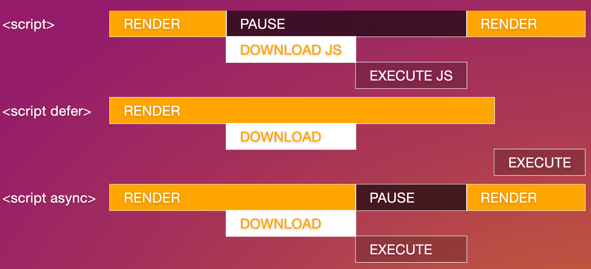

# 文档结构


HTML 文档包含一个文档类型声明和 `<html>` 根元素。`<html>` 元素中嵌套的是文档标头和文档正文。虽然视力正常的访问者看不到文档标头，但让网站正常运行至关重要。它包含所有元信息，包括搜索引擎和社交媒体结果的相关信息、浏览器标签页和移动设备主屏幕快捷方式的图标，以及您的内容的行为和呈现方式。在这一部分中，您会发现那些虽然不可见的组件，但是几乎会显示在每个网页上。

若要创建 MachineLearningWorkshop.com (MLW) 网站，首先要加入每个网页应具备的要素：文档类型、内容所用的人类语言、字符集，当然还要包括网站或应用的标题或名称。

## 添加到每个 HTML 文档

有些功能对于任何网页来说都是必不可少的。如果缺少这些元素，浏览器仍会呈现内容，但包含它们。始终。

### `<!DOCTYPE html>`

任何 HTML 文档中的第一项内容都是序言。对于 HTML，您只需提供 `<!DOCTYPE html>` 即可。它可能看起来像是 HTML 元素，但实际上不是。它是一个名为“doctype”的特殊节点。doctype 告诉浏览器使用标准模式。如果省略此参数，浏览器将使用不同的呈现模式，称为“怪异模式”。[](https://developer.mozilla.org/docs/Web/HTML/Quirks_Mode_and_Standards_Mode)添加 doctype 有助于防止怪异模式。

### `<html>`

`<html>` 元素是 HTML 文档的根元素。它是 `<head>` 和 `<body>` 的父级，其中包含 HTML 文档中除 DOCTYPE 之外的所有内容。如果省略，则是隐含的，但一定要包含它，因为这是声明文档内容语言的元素。

### 内容语言

添加到 `<html>` 标记的 `lang` 语言属性用于定义文档的主要语言。[`lang` 属性](https://developer.mozilla.org/docs/Web/HTML/Global_attributes/lang#language_tag_syntax)的值是两个或三个字母的 ISO 语言代码，后跟区域。地区为可选项，但建议您提供，因为不同地区之间的语言可能差异很大。例如，加拿大 (`fr-CA`) 和布基纳法索 (`fr-BF`) 的法语截然不同。此语言声明让屏幕阅读器、搜索引擎和翻译服务能够识别文档的语言。

`lang` 属性不限于 `<html>` 标记。如果网页中有文本使用的语言与主文档的语言不同，则应使用 `lang` 属性标识文档中主要语言的例外情况。就像包含在 head 中一样，body 中的 `lang` 属性也没有视觉效果。它仅添加了语义，使辅助技术和自动化服务能够了解受影响内容的语言。

除了设置文档的语言以及该基本语言的例外情况之外，此属性还可以在 CSS 选择器中使用。可以使用属性和语言选择器 [`[lang|="fr"]`](https://developer.mozilla.org/docs/Web/CSS/Attribute_selectors#attrvalue_3) 和 [`:lang(fr)`](https://developer.mozilla.org/docs/Web/CSS/:lang) 定位 `<span lang="fr-fr">Ceci n'est pas une pipe.</span>`。

### `<head>`

在起始标记和结束标记 `<html>` 之间，我们找到了两个子级：`<head>` 和 `<body>`：

```html
<!DOCTYPE html>
<html lang="en-US">
  <head>
  </head>
  <body>
  </body>
</html>
```

`<head>`（即文档元数据标头）包含网站或应用的所有元数据。正文包含可见内容。本部分的其余内容重点介绍嵌套在起始和结束 `<head></head>` 中的组件

## `<head>` **中的必需组件**

文档元数据（包括文档标题、字符集、视口设置、说明、基准网址、样式表链接和图标）位于 `<head>` 元素中。尽管您可能并不需要全部这些功能，但请始终添加字符集、标题和视口设置。

### 字符编码

`<head>` 中的第一个元素应该是 `charset` 字符编码声明。它放在标题之前，以确保浏览器可以呈现标题中的字符以及文档其余部分中的所有字符。

大多数浏览器中的[默认编码](https://html.spec.whatwg.org/multipage/parsing.html#documentEncoding)为 `windows-1252`，具体取决于语言区域。不过，您应该使用 [`UTF-8`](https://developer.mozilla.org/docs/Glossary/UTF-8)，因为它支持对所有字符进行 1 到 4 字节编码，即使您根本不知道存在这些字符也是如此。此外，它也是 HTML5 所需的编码类型。

如需将字符编码设置为 UTF-8，请添加以下代码：

```html
<meta charset="utf-8" />
```

通过声明 `UTF-8`（不区分大小写），您甚至可以在标题中包含表情符号（但请勿这样做）。

字符编码会继承到文档中的所有内容，包括 `<style>` 和 `<script>`。这个小声明意味着您可以在类名称和 selectorAPI 中包含表情符号（再次强调，请勿这样做）。如果您确实要[使用表情符号](https://readabilityguidelines.co.uk/images/emojis/)，请确保使用表情符号时能提高易用性，同时又不影响无障碍功能。

### 文档标题

您的首页和所有其他网页都应该有一个唯一的标题。文档标题的内容、起始和结束 `<title>` 标记之间的文本会显示在浏览器标签页中、打开的窗口列表、历史记录、搜索结果以及社交媒体卡片（除非使用 [`<meta>` 标记](/web/html/metadata)重新定义）中。

```html
<title>Machine Learning Workshop</title>
```

### 视口元数据

[viewport](/web/design/intro#a_meta_element_for_viewport) 元标记也应视为必不可少，它有助于提升网站响应速度，无论视口宽度如何，内容在默认情况下都能正常呈现。虽然[视口元标记](https://developer.mozilla.org/docs/Web/HTML/Viewport_meta_tag)自 2007 年 6 月以来就存在，但当第一款 iPhone 问世时，它最近才[在规范中载明](https://drafts.csswg.org/css-viewport/#viewport-meta)。强烈建议您使用它，因为它能够控制视口的大小和缩放比例，并防止将网站内容的尺寸缩小到 960px 的网站适应 320px 的屏幕。

```html
<meta name="viewport" content="width=device-width" />
```

上述代码的含义是“让网站采用自适应设计，首先将内容的宽度设为屏幕的宽度。”除了 `width` 之外，您还可以设置缩放和可伸缩性，但它们默认使用可访问的值。如果你想是明确具体的人，可以添加以下内容：

```html
<meta name="viewport" content="width=device-width, initial-scale=1, user-scalable=1" />
```


到目前为止，我们的 HTML 文件的大纲如下：

```html
<!DOCTYPE html>
<html lang="en">
  <head>
    <meta charset="utf-8" />
    <title>Machine Learning Workshop</title>
    <meta name="viewport" content="width=device-width" />
  </head>
  <body>

  </body>
</html>
```

## 其他 `<head>` **内容**

`<head>` 中包含许多其他内容。事实上，所有元数据都是如此。此处介绍了 `<head>` 中的大多数元素，同时还会为下一章保存大量的 `<meta>` 选项。

您已经了解了元字符集和文档标题，但除了 `<meta>` 标记之外，还需要包含许多其他元数据。

### CSS

`<head>` 是为 HTML 添加样式的位置。如果您想了解样式，但需要了解如何将这些样式添加到 HTML 文档中，请参阅[专门针对 CSS 的学习路线](/web/css)。

您可以通过以下三种方式添加 CSS：`<link>`、`<style>` 和 `style` 属性。

在 HTML 文件中添加样式的主要方式有以下两种：使用 `<link>` 元素（`rel` 属性设置为 `stylesheet`）添加外部资源；或直接在文档标头的开始和结束 `<style>` 标记内添加 CSS。

`<link>` 标记是添加样式表的首选方法。链接一个或几个外部样式表，有利于开发者体验和网站性能：您可以在一个位置维护 CSS，而不是将其分散到各个地方，而且浏览器可以缓存外部文件，这意味着无需在每次网页导航时都重新下载。

语法为 `<link rel="stylesheet" href="styles.css">`，其中 style.css 是您的样式表的网址。你经常会看到`type="text/css"`。不需要！如果您要包含用 CSS 之外的其他语言编写的样式，则需要 `type`，但由于没有任何其他类型，因此不需要此属性。`rel` 属性定义关系：在本例中为 `stylesheet`。如果忽略此项，您的 CSS 将不会关联。

您稍后会看到一些其他的 `rel` 值，不过我们先来讨论添加 CSS 的其他方法。

如果您希望外部样式表样式位于级联层中，但无权修改 CSS 文件以将图层信息放入其中，则需要在 `<style>` 内添加带有 [`@import`](https://developer.mozilla.org/docs/Web/CSS/@import) 的 CSS：

```css
<style>
  @import "styles.css" layer(firstLayer);
</style>
```

使用 `@import` 将样式表导入文档（可以选择性地导入级联层）时，`@import` 语句必须是 `<style>` 或关联样式表中的第一个语句（字符集声明之外）。

虽然级联层还是比较新，您可能不会在 head `<style>` 中发现 `@import`，但通常会看到在 head 样式块中声明的自定义属性：

```css
<style>
  :root {
    --theme-color: #226DAA;
  }
</style>
```

**注意 ** ：样式（表示层）是 CSS 的范围，我们在这里正在考虑如何将样式附加到内容层（即 HTML）。如果您对上述代码的 CSS 感兴趣，请查找[级联层](https://developer.mozilla.org/docs/Learn/CSS/Building_blocks/Cascade_layers)和[自定义属性](https://developer.mozilla.org/docs/Web/CSS/Using_CSS_custom_properties)。样式（通过 `<link>` 和/或 `<style>`）应位于标题中。这些样式在包含在文档的正文中时有效，但出于性能方面的原因，您希望将样式显示在标头中。这似乎不合常理，因为您可能认为先加载内容，但实际上是希望浏览器知道如何在内容加载后呈现内容。添加样式首先可防止在元素首次渲染后对其进行样式设置时发生不必要的重绘。

然后，有一种方法可以在文档的 `<head>` 中包含您永远不会使用的样式：内嵌样式。您可能永远都不会在标题中使用内嵌样式，因为用户代理的样式表在默认情况下会隐藏标题。但如果您想创建一个不含 JavaScript 的 CSS 编辑器，例如为了测试页面的自定义元素，您可以使用 `display: block` 将标头设为可见，然后隐藏标头中的所有内容，然后使用内嵌 `style` 属性使内容可修改的样式块可见。

```css
<style contenteditable style="display: block; font-family: monospace; white-space: pre;">
  head { display: block; }
  head * { display: none; }
  :root {
    --theme-color: #226DAA;
  }
</style>
```

虽然您可以在 `<style>` 上添加内嵌样式，但在 `style` 中设置 `<style>` 的样式会更有趣。我离奇了。

### `<link>` **元素的其他用途**

`link` 元素用于创建 HTML 文档与外部资源之间的关系。部分资源可供下载，其他资源则仅供参考。关系的类型由 `rel` 属性的值定义。目前，[`rel` 属性有 25 个可用值](https://html.spec.whatwg.org/multipage/links.html#linkTypes)，这些值可以与 `<link>`、`<a>` 和 `<area>` 或 `<form>` 一起使用，但只有少数值可与所有值一起使用。最好在 `<body>` 中包含与标头中的元信息相关的字词和与性能相关的字词。

现在，您的标题中将包含另外三种类型：`icon`、`alternate` 和 `canonical`。（在下一单元中，您将添加第四种类型，即 [`rel="manifest"`](/web/html/metadata)）。

#### 网站图标

使用 `<link>` 标记和 `rel="icon"` 属性/值对来标识要用于文档的网站图标。网站图标是显示在浏览器标签页上的非常小的图标，通常位于文档标题的左侧。当您打开过多的标签页时，标签页会缩小，标题可能会完全消失，但图标始终可见。大多数网站图标都是公司或应用的徽标。

如果您未声明网站图标，浏览器会在顶级目录（网站的根文件夹）中查找名为 `favicon.ico` 的文件。使用 `<link>` 时，您可以使用不同的文件名和位置：

```html
<link rel="icon" sizes="16x16 32x32 48x48" type="image/png" href="/images/mlwicon.png" />
```

上述代码表示“在 16px、32px 或 48px 合理的场景中使用 `mlwicon.png` 作为图标。”size 属性接受可缩放图标的 `any` 值或以空格分隔的方形 `widthXheight` 值列表；如果宽度值和高度值在相应几何序列中不低于 16、32、48，像素单位会被省略，并且 X 不区分大小写。

```html
<link rel="apple-touch-icon" sizes="180x180" href="/images/mlwicon.png" />
<link rel="mask-icon" href="/images/mlwicon.svg" color="#226DAA" />
```

Safari 浏览器有两种特殊的非标准图标：`apple-touch-icon` 用于 iOS 设备，`mask-icon` 用于 macOS 上的固定标签页。仅当用户将网站添加到主屏幕时，系统才会应用 `apple-touch-icon`：您可以为不同的设备指定多个具有不同 `sizes` 的图标。仅当用户在桌面版 Safari 中固定标签页时才会使用 `mask-icon`：图标本身应该是单色 SVG，并且 `color` 属性会在图标中填充所需的颜色。

虽然您可以使用 `<link>` 在每个网页上甚至是每次加载网页时定义完全不同的图片，但请不要这样做。为了保持一致性和良好的用户体验，请使用单张图片！Twitter 使用蓝色小鸟：当您在浏览器标签页中看到蓝色小鸟时，就表示无需点击标签页即可打开 Twitter 页面。Google 为不同的应用使用不同的网站图标：例如邮件图标、日历图标。但是，所有 Google 图标都使用同一种配色方案。同样，您通过图标就能确切地知道打开的标签页包含哪些内容。

#### 网站的备用版本

我们使用 `rel` 属性的 `alternate` 值来标识网站的翻译或替代呈现方式。

假设我们有该网站的两个版本，分别翻译成法语和巴西葡萄牙语：

```html
<link rel="alternate" href="https://www.machinelearningworkshop.com/fr/" hreflang="fr-FR" />
<link rel="alternate" href="https://www.machinelearningworkshop.com/pt/" hreflang="pt-BR" />
```

使用 `alternate` 进行转换时，必须设置 `hreflang` 属性。

备选值不仅适用于翻译。例如，当 `type` 属性设置为 `application/rss+xml` 或 `application/atom+xml` 时，`type` 属性可以定义 RSS Feed 的备用 URI。我们提供指向模拟 PDF 版本的网站的链接。

```html
<link rel="alternate" type="application/x-pdf" href="https://machinelearningworkshop.com/mlw.pdf" />
```

如果 `rel` 值为 `alternate stylesheet`，那么它将定义一个[备用样式表](https://developer.mozilla.org/docs/Web/CSS/Alternative_style_sheets)，并且必须设置 `title` 属性来为该备用样式命名。

#### Canonical

如果您创建了多个机器学习研讨会的翻译或多个版本，搜索引擎可能会分不清哪个版本是权威来源。为此，请使用 `rel="canonical"` 标识网站或应用的首选网址。

在您的所有翻译网页和首页上添加规范网址，并指明我们的首选网址：

```html
<link rel="canonical" href="https://www.machinelearning.com" />
```

`rel="canonical"` 规范链接最常用于与出版物和博客平台交叉发布内容，以注明原始来源；当网站整合内容时，应添加指向原始来源的规范链接。

### 脚本

`<script>` 标记用于包含脚本。默认类型为 JavaScript。如果您要添加任何其他脚本语言，请添加 `type` 属性并指定 MIME 类型；如果是 [JavaScript 模块](https://developer.mozilla.org/docs/Web/JavaScript/Guide/Modules#applying_the_module_to_your_html)，请添加 `type="module"`。只有 JavaScript 和 JavaScript 模块才会被解析和执行。

`<script>` 标记可用于封装您的代码或下载外部文件。MLW 中没有外部脚本文件，因为与普遍的观点相反，即正常运行的网站不需要 JavaScript，而且这是一个 HTML 学习路线，而不是 JavaScript 路径。

稍后，您将添加少量 JavaScript 来创建复活节彩蛋：[](https://www.webopedia.com/definitions/easter-egg/)

```javascript
<script>
  document.getElementById('switch').addEventListener('click', function() {
    document.body.classList.toggle('black');
  });
</script>
```

此代码段会为 ID 为 `switch` 的元素创建事件处理脚本。使用 JavaScript 时，您不希望在元素存在之前引用它。该地区尚不存在，因此我们不会将其加入。当我们添加灯开关元素时，我们将在 `<body>` 底部（而不是在 `<head>` 中）添加 `<script>`。原因何在？有两个原因。我们希望确保在遇到引用某些元素的脚本之前存在这些元素，因为我们的脚本并不是基于 [DOMContentLoaded 事件](https://developer.mozilla.org/docs/Web/API/Document/DOMContentLoaded_event)。而且，主要是，JavaScript 不仅会阻塞渲染，而且浏览器会在脚本下载完毕后停止下载所有素材资源，并在 JavaScript 执行完毕之前继续下载其他素材资源。[](https://developer.chrome.com/docs/lighthouse/performance/render-blocking-resources)因此，您经常会在文档末尾（而不是标头）发现 JavaScript 请求。

有两个属性可以降低 JavaScript 下载和执行的阻塞性：`defer` 和 `async`。使用 `defer` 时，系统不会在下载过程中阻止 HTML 呈现，而且 JavaScript 只会在文档呈现完毕后才执行。使用 `async` 时，下载期间也不会阻止呈现，但脚本下载完成后，系统会在执行 JavaScript 时暂停呈现。



如需将 MLW 的 JavaScript 包含在外部文件中，您可以编写：

```html
<script src="js/switch.js" defer></script>
```

添加 [`defer`](https://developer.mozilla.org/docs/Learn/JavaScript/First_steps/What_is_JavaScript#script_loading_strategies) 属性会将脚本的执行推迟到所有内容呈现完毕后，从而防止脚本影响性能。`async` 和 `defer` 属性仅对外部脚本有效。

### 基础

另一个元素仅在 `<head>.` 中找到。不经常使用，通过 `<base>` 元素可设置默认链接网址和目标。`href` 属性定义所有相对链接的基础网址。

`target` 属性在 `<base>` 以及链接和表单上有效，用于设置这些链接的打开位置。默认值为 `_self`，会在与当前文档相同的上下文中打开链接的文件。其他选项包括 `_blank`（会在新窗口中打开所有链接）、当前内容的 `_parent`（如果打开程序不是 iframe，则可能与自身相同）或 `_top`（在同一浏览器标签页中，但从任何上下文中弹出来占据整个标签页）。

大多数开发者会在链接或表单上自行为少数几个（如果有）链接打开新窗口，而不是使用 `<base>` 来添加 `target` 属性。

```html
<base target="_top" href="https://machinelearningworkshop.com" />
```

如果我们的网站发现自己嵌套在 Yummly 等网站的 iframe 中，添加 `<base>` 元素意味着当用户点击文档中的任何链接时，链接将从 iframe 中弹出，从而占据整个浏览器窗口。

此元素的缺点之一是，锚链接是通过 `<base>` 解析的。`<base>` 有效地将链接 `<a href="#ref">` 转换为 `<a target="_top" href="https://machinelearningworkshop.com#ref">`，从而触发对附加了 fragment 的基础网址的 HTTP 请求。

关于 `<base>` 的一些其他注意事项：文档中只能有一个 `<base>` 元素，并且该元素应在使用任何相对网址之前，包括可能的脚本或样式表引用。

代码现在如下所示：

```html
<!DOCTYPE html>
<html lang="en">
  <head>
    <meta charset="utf-8" />
    <title>Machine Learning Workshop</title>
    <meta name="viewport" content="width=device-width" />
    <link rel="stylesheet" src="css/styles.css" />
    <link rel="icon" type="image/png" href="/images/favicon.png" />
    <link rel="alternate" href="https://www.machinelearningworkshop.com/fr/" hreflang="fr-FR" />
    <link rel="alternate" href="https://www.machinelearningworkshop.com/pt/" hreflang="pt-BR" />
    <link rel="canonical" href="https://www.machinelearning.com" />
  </head>
  <body>

    <!-- <script defer src="scripts/lightswitch.js"></script>-->
  </body>
</html>
```

### HTML 注释

请注意，脚本用尖括号、破折号和尖括号括起来。这是您注释掉 HTML 的方式。我们将注释掉脚本，直到显示网页上的实际内容。`<!--` 和 `-->` 之间的任何内容都将不可见或解析。HTML 注释可以放在网页上的任何位置，包括头部或正文，但脚本或样式块除外，在这两个位置应分别使用 JavaScript 和 CSS 注释。

您已经了解了 `<head>` 内容的基础知识，但您还想了解更多基础知识。在接下来的部分中，我们将了解元标记，以及如何控制将您的网站链接到社交媒体时所显示的内容。
