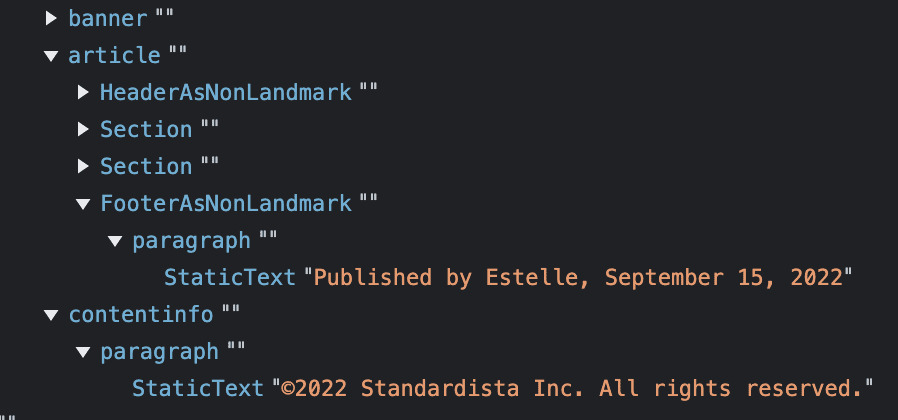
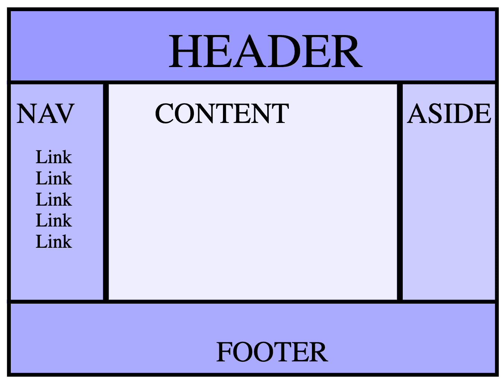

# 标题和版块


在上一部分中，您了解了即使您不知道网页上的字词的含义，当语义元素为文档提供有意义的结构时，其他人员（搜索引擎、辅助技术、未来的维护者、新的团队成员）也能理解文档大纲。

在本部分中，您将了解文档结构；回顾上一部分中的划分元素；并标记应用的大纲。

以编码方式为作业选择合适的元素，这意味着您无需重构或注释掉 HTML。考虑对作业使用正确的元素时，通常都是为作业选择合适的元素。否则，您很可能不会这样做。

至此您已[了解标记语义](/blogs/web/html/semantic-html)，也明白了选择正确元素的重要性。在了解了所有不同的元素之后，您通常无需花费太多精力（如果有）就能选择合适的元素。

## 网站 `<header>`

我们来构建一个网站标题。您将从非语义标记开始，并设法找到一个很好的解决方案，以便在此过程中了解 HTML 部分和标题元素的优势。

如果您几乎没有考虑标题的语义，则可以使用如下代码：

```html
<!-- start header -->
<div id="pageHeader">
  <div id="title">Machine Learning Workshop</div>
  <!-- navigation -->
  <div id="navigation">
    <a href="#reg">Register</a>
    <a href="#about">About</a>
    <a href="#teachers">Instructors</a>
    <a href="#feedback">Testimonials</a>
  </div>
  <!-- end navigation bar -->
</div>
<!-- end of header -->
```

CSS 可以确保（几乎）所有标记都能正常显示。但是，对所有操作都使用非语义 `<div>` 实际上会带来额外的工作。如需使用 CSS 定位多个 `<div>`，您最终需要使用 ID 或类来标识内容。此代码还包含每个结束 `</div>` 的注释，以指明每个 `</div>` 关闭的起始标记。

虽然 `id` 和 `class` 属性为样式设置和 JavaScript 提供了钩子，但它们不会为屏幕阅读器和（在大多数情况下）搜索引擎添加任何语义值。

您可以添加 `role` 属性来提供语义，以便为屏幕阅读器创建良好的无障碍对象模型 (AOM)：

```html
<!-- start header -->
<div role="banner">
  <div role="heading" aria-level="1">Machine Learning Workshop</div>
  <div role="navigation">
    <a href="#reg">Register</a>
    <a href="#about">About</a>
    <a href="#teachers">Instructors</a>
    <a href="#feedback">Testimonials</a>
  </div>
  <!-- end navigation bar -->
<div>
<!-- end of header -->
```

这至少提供了语义，支持在 CSS 中使用属性选择器，但它仍然添加了注释，以确定每个 `</div>` 关闭的 `<div>`。

如果您了解 HTML，只需想想内容的用途即可。然后，您可以在不使用 `role` 和注释结束标记的情况下，从语义上编写此代码：

```html
<header>
  <h1>Machine Learning Workshop</h1>
  <nav>
    <a href="#reg">Register</a>
    <a href="#about">About</a>
    <a href="#teachers">Instructors</a>
    <a href="#feedback">Testimonials</a>
  </nav>
</header>
```

此代码使用两个语义地标：`<header>` 和 `<nav>`。

这是主标头。`<header>` 元素并非始终是地标。其语义取决于嵌套位置。当 `<header>` 为顶级时，它是网站 `banner`，一个地标角色，您可能已经在 `role` 代码块中注意到了。当 `<header>` 嵌套在 `<main>`、`<article>` 或 `<section>` 中时，它仅将其标识为该部分的标头，而不是地标。

`<nav>` 元素将内容标识为导航。由于此 `<nav>` 嵌套在网站标题中，因此它是网站的主导航栏。如果将其嵌套在 `<article>` 或 `<section>` 中，则只是相应部分的内部导航。通过使用语义元素，您构建了一个有意义的[无障碍对象模型](https://developer.mozilla.org/docs/Glossary/Accessibility_tree) (AOM)。借助 AOM，屏幕阅读器可以告知用户此部分由一个主要导航块组成，用户可以浏览或跳过该块。

通过使用 `</nav>` 和 `</header>` 结束标记，您就无需再使用注释来标识每个结束标记结束的哪个元素。此外，如果对不同的元素使用不同的标记，则无需再使用 `id` 和 `class` 钩子。CSS 选择器的[特异性](/blogs/web/css/specificity)可能较低；您可以使用 `header nav a` 定位链接，而不必担心冲突。

您在编写标头时仅包含极少的 HTML，也没有类或 ID。使用语义 HTML 时，不需要这样做。

## 网站 `<footer>`

让我们对网站页脚进行编码。

```html
<footer>
  <p>&copy;2022 Machine Learning Workshop, LLC. All rights reserved.</p>
</footer>
```

与 `<header>` 类似，页脚是否为地标取决于页脚的嵌套位置。如果它是网站页脚，则是一个位置标记，并且应包含您希望在每个页面上放置的网站页脚信息，例如版权声明、联系信息以及指向您的隐私权和 Cookie 政策的链接。网站页脚的隐式 `role` 为 `contentinfo`。否则，页脚没有隐式角色，也不是地标，如以下 Chrome 中 AOM 的屏幕截图（其 `<article>` 的 `<header>` 和 `<footer>` 位于 `<header>` 和 `<footer>` 之间）所示。



在此屏幕截图中，有两个页脚：一个位于 `<article>` 中，另一个位于顶层。顶层页脚是一个具有 `contentinfo` 隐式角色的地标。另一个页脚不是位置标记。Chrome 会显示为 `FooterAsNonLandmark`；Firefox 会显示为 `section`。

这并不意味着不应使用 `<footer>`。假设您有一个博客。此博客具有一个具有隐式 `contentinfo` 角色的网站页脚。每篇博文还可以有一个 `<footer>`。在博客的主着陆页上，浏览器、搜索引擎和屏幕阅读器都知道主要页脚是顶层页脚，并且所有其他页脚都与嵌套在其中的帖子有关。

如果 `<footer>` 是 `<article>`、`<aside>`、`<main>`、`<nav>` 或 `<section>` 的后代，则它不是地标。如果帖子单独显示（具体取决于标记），该页脚可能会得到提升。

页脚通常用于查找联系信息的位置，这些信息封装在联系人地址元素 `<address>` 中。这个元素的名称不太明显；它用于提供个人或组织的联系信息，而非实际邮寄地址。

```html
<footer>
  <p>&copy;2022 Machine Learning Workshop, LLC. All rights reserved.</p>
  <address>Instructors: <a href="/hal.html">Hal</a> and <a href="/eve.html">Eve</a></address>
</footer>
```

## 文档结构

此模块以 `<header>` 和 `<footer>` 开头，因为它们仅在有时作为地标（即“分割”）元素具有唯一性。下面我们通过讨论最常见的页面布局来介绍“全时段”版块元素：



包含一个页眉、两个边栏和一个页脚的布局称为“圣杯布局”。您可以通过多种方式标记此内容，包括：

```html
<body>
  <header>Header</header>
  <nav>Nav</nav>
  <main>Content</main>
  <aside>Aside</aside>
  <footer>Footer</footer>
</body>
```

如果您要创建博客，可以在 `<main>` 中找到一系列文章：

```html
<body>
  <header>Header</header>
  <nav>Nav</nav>
  <main>
    <article>First post</article>
    <article>Second post</article>
  </main>
  <aside>Aside</aside>
  <footer>Footer</footer>
</body>
```

采用语义元素时，浏览器能够创建有意义的无障碍树，让屏幕阅读器用户能够更轻松地进行导航。此处，`banner` 和 `contentinfo` 是通过网站 `<header>` 和 `<footer>` 提供的。此处添加的新元素包括 `<main>`、`<aside>` 和 `<article>`；以及您之前使用的 `<h1>` 和 `<nav>`，以及您尚未使用过的 `<section>`。

### `<main>`

只有 1 个 `<main>` 地标元素。`<main>` 元素标识文档的主要内容。每个网页应该只有 1 个 `<main>`。

### `<aside>`

`<aside>` 适用于与文档的主要内容间接相关的内容。例如，本文与 HTML 有关。在一个介绍三个网站标题示例（div、角色和语义）的 CSS 选择器特异性的部分中，相切相关的 aside 可包含在 `<aside>` 中；而且与大多数网站一样，`<aside>` 可能会呈现在边栏或调用框中。`<aside>` 也是一个地标，其隐式角色为 `complementary`。

### `<article>`

在 `<main>` 中，我们添加了两个 `<article>` 元素。在第一个示例中，主要内容只是一个字词，而在现实世界中，则是单个内容版块，因此并不需要这样做。但是，如果您要编写博客（如第二个示例所示），则每篇博文都应位于嵌套在 `<main>` 的 `<article>` 中。

`<article>` 表示完整或独立的内容部分，原则上可以独立重复使用。您可以把文章想象成报纸上的文章。在印刷版中，关于新西兰总理 Jacinda Ardern 的新闻报道可能只会出现在一个版块中，也可能是国际新闻。在报纸网站上，同一篇新闻报道可能会出现在主页、“政治”版块、大洋洲或亚太地区新闻版块中；根据新闻主题的不同，也可能会出现在体育、生活方式或科技版块中。这篇文章也可能会显示在 Pocket 或 Yahoo News!

### `<section>`

`<section>` 元素用于在没有更具体的语义元素可供使用时包含文档的常规独立部分。除非少数例外情况，否则每个版块都应有标题。

回到 Jacinda Ardern 的示例，报纸首页上的横幅将包括报纸名称，后跟单个 `<main>`，分成多个 `<section>`，每个 `<section>` 都有标题，例如“世界新闻”和“政治”。在每个版块中，您会看到一系列 `<article>`。在每个 `<article>` 中，您可能还会找到一个或多个 `<section>` 元素。查看此页面就会发现，整个“标题和部分”部分就是 `<article>`。然后，此 `<article>` 分为几个 `<section>`，包括 `site header`、`site footer` 和文档结构。文章本身和每个部分都有标题。

除非具有无障碍名称，否则 `<section>` 不是地标；如果具有无障碍名称，则隐式角色为 `region`。应谨慎使用[地标角色](https://developer.mozilla.org/docs/Web/Accessibility/ARIA/Roles#landmark_roles)，以便标识文档的大部分内容。使用过多的特征点角色可能会在屏幕阅读器中造成“干扰”因素，使用户难以理解页面的整体布局。如果您的 `<main>` 包含两个或三个重要的子部分，为每个 `<section>` 提供一个无障碍名称，这样做可能会很有帮助。

## 标题：`<h1>`-`<h6>`

有六个版块标题元素：`<h1>`、`<h2>`、`<h3>`、`<h4>`、`<h5>` 和 `<h6>`。每个版块代表六个版块标题级别之一，`<h1>` 是最高或最重要的版块级别，`<h6>` 是最低的版块级别。

如果标题嵌套在文档横幅 `<header>` 中，则是应用或网站的标题。嵌套在 `<main>` 中时，无论是否嵌套在 `<main>` 的 `<header>` 中，它都是该网页的标头，而不是整个网站的标头。当嵌套在 `<article>` 或 `<section>` 中时，它是页面该子部分的标题。

<iframe allow="camera; clipboard-read; clipboard-write; encrypted-media; geolocation; microphone; midi;" loading="lazy" src="https://codepen.io/web-dot-dev/embed/oNdePZj?height=500&amp;theme-id=dark&amp;default-tab=html%2Cresult&amp;editable=true" data-darkreader-inline-border-top="" data-darkreader-inline-border-right="" data-darkreader-inline-border-bottom="" data-darkreader-inline-border-left="" data-title="Codepen 上的 web-dot-dev 的 Pen oNdePZj"></iframe>

建议使用与文本编辑器中的标题级别类似的标题级别：以 `<h1>` 作为主标题，以 `<h2>` 作为子部分的标题，如果这些子部分包含部分，则使用 `<h3>`；避免跳过标题级别。您可以参阅这篇[关于版块标题的好文章](https://developer.mozilla.org/docs/Web/HTML/Element/Heading_Elements)。

有些屏幕阅读器用户可以访问标题以了解页面的内容。起初，标题用来描绘文档的内容，就像 MS Word 或 Google 文档能够根据标题生成概览一样，但浏览器从未实现这种结构。虽然浏览器确实会以越来越小的字体大小显示嵌套标题（如下例所示），但它们实际上并不支持边框。

您现在已掌握了足够的知识，可以对 MachineLearningWorkshop.com 进行介绍：

## 概述 MLW.**com 的**`<body>`

以下是机器学习研讨会网站上的可见内容大纲：

<iframe allow="camera; clipboard-read; clipboard-write; encrypted-media; geolocation; microphone; midi;" loading="lazy" src="https://codepen.io/web-dot-dev/embed/gOzxdxR?height=700&amp;theme-id=dark&amp;default-tab=html&amp;editable=true" data-darkreader-inline-border-top="" data-darkreader-inline-border-right="" data-darkreader-inline-border-bottom="" data-darkreader-inline-border-left="" data-title="Codepen 上的 web-dot-dev 的 Pen gOzxdxR"></iframe>

**注意 ** ：此代码段仅包含 `<body>` 的内容。前面介绍了 [`<!doctype>`、`<html>`、`<body>` 和元信息](/blogs/web/html/metadata)。由于没有任何内容是独立的、完整的内容，因此 `<section>` 比 `<article>` 更合适；虽然每个部分都有标题，但每个版块都不能成为 `<footer>`。

到目前为止，您应该已经知道了，不过，请勿使用标题设置粗体或放大文本，而应改用 CSS。如果您想突出文本，也可以使用语义元素来实现这一点。我们会在更深入地介绍属性之后介绍这一点，并在讨论文本基础知识时填写页面的大部分内容。
