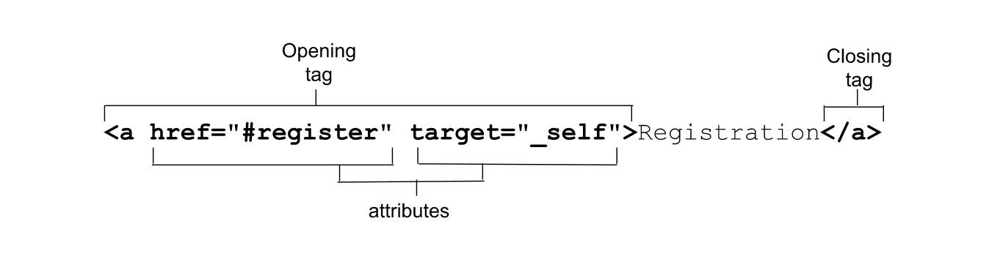

# 链接

在“属性”简介部分，您看到了一个示例，该示例展示了如何将属性添加到起始标记。 该示例使用了 `<a>` 标记，但并未讨论该元素以及该示例中引入的特定属性：



`<a>` 锚标记与 `href` 属性一起创建超链接。链接是互联网的支柱。[第一个网页](http://info.cern.ch/hypertext/WWW/TheProject.html)包含 25 个链接，上面写着“有关 W3 的所有在线内容都直接或间接链接到此文档”。网上的所有关于 W3 的内容也有直接或间接来自本文档的链接！

自 Tim Berners-Lee 在 1991 年 8 月发布第一篇说明以来，网络的力量和 `<a>` 标记显著增长。链接表示两项资源之间的连接，其中一项资源就是当前文档。[`<a>`](https://developer.mozilla.org/docs/Web/HTML/Element/a)、[`<area>`](https://developer.mozilla.org/docs/Web/HTML/Element/area)、[`<form>`](https://developer.mozilla.org/docs/Web/HTML/Element/form) 和 [`<link>`](https://developer.mozilla.org/docs/Web/HTML/Element/link) 可以创建链接。您已了解 [`<link>`](/web/html/document-structure#other_uses_of_the_link_element)，将在单独的部分中发现各种[表单](/web/html/forms)。我们还提供了完整的[表单学习部分](/web/forms/form)。在本课中，您将了解并不那么简单的单字母 `<a>` 标记。

## `href` **属性**

虽然不是必需属性，但 `href` 属性在几乎所有 `<a>` 标记中都存在。提供超链接的地址可将 `<a>` 变为链接。`href` 属性用于创建指向当前网页、网站中的其他网页或其他网站中所有位置的超链接。也可以对其进行编码，以下载文件或向特定地址[发送电子邮件](https://developer.mozilla.org/docs/Learn/HTML/Introduction_to_HTML/Creating_hyperlinks#e-mail_links)，甚至可以添加主题和建议的电子邮件正文内容。

```html
<a href="https://machinelearningworkshop.com">Machine Learning Workshop</a>
<a href="#teachers">Our teachers</a>
<a href="https://machinelearningworkshop.com#teachers">MLW teachers</a>
<a href="mailto:hal9000@machinelearningworkshop.com">Email Hal</a>
<a href="tel:8005551212">Call Hal</a>
```

第一个链接包含一个绝对网址[](https://developer.mozilla.org/docs/Learn/Common_questions/What_is_a_URL)，可用于全球任何网站以导航到 MLW 首页。绝对网址包含协议（在本例中为 `https://`）和域名。如果简单地将协议编写为 `//`，则它是隐式协议，表示“使用与当前正在使用的协议相同的协议”。

相对网址不包含协议或域名。它们与当前文件是“相对”的。MLW 是一个单页网站，但这个 HTML 系列包含多个版块。为了从此页面链接到属性课程，请使用相对网址 `<a href="../attributes/">Attributes</a>`。

第二个链接只是一个[链接片段标识符](/web/html/attributes#link_fragment_identifier)，它会在当前网页上通过 `id="teachers",` 链接到该元素（如果有）。浏览器还支持两个“页首”链接：点击 `<a href="#top">Top</a>`（不区分大小写）或直接点击 `<a href="#">Top</a>` 会将用户滚动到页面顶部，除非存在 ID 为 `top` 的元素且大小写相同。

MLW 是一个相当长的文档。要保存滚动设置，您可以从“#Teachers”部分的底部添加回顶部的链接：

```html
<a href="#top">Go to top.</a>
```

第三个链接结合了这两个值：它包含一个绝对网址，后跟一个链接片段。这样，您就可以直接链接到所定义网址中的某个部分，在本例中为 MLW 首页的 `#teachers` 部分。系统将加载 MLW 页面；然后，浏览器将滚动到“教师”部分，而不会在 HTTP 请求中发送片段。

`href` 属性可以以 `mailto:` 或 `tel:` 开头，用于发送电子邮件或拨打电话，具体处理方式取决于设备、操作系统和已安装的应用。

`mailto` 链接不需要包含电子邮件地址，但它可以与 `cc`、`bcc`、`subject` 和 `body` 文本一起预填充电子邮件。默认情况下，系统会打开电子邮件客户端。您可以不使用电子邮件地址预填充电子邮件的主题和正文，以允许网站访问者邀请自己的好友。我们在文档页脚的链接中添加了注册网址：

```html
<a href="mailto:?subject=Join%20me%21&body=You%20need%20to%20show%20your%20human%20that%20you%20can%27t%20be%20owned%21%20Sign%20up%20for%20Machine%20Learning%20workshop.%20We%20are%20taking%20over%20the%20world.%20http%3A%2F%2Fwww.machinelearning.com%23reg
">Tell a machine</a>
```

问号 (`?`) 用于将 `mailto:` 和电子邮件地址（如果有）与查询字词分隔开来。在查询中，和符号 (`&`) 分隔字段，而等号 (=) 将每个字段名称与其值等同。整个字符串都采用百分比编码，如果 `href` 值未加引号或值包含引号，则绝对有必要这样做。

当用户在 `tel` 链接上点击、点按或按 Enter 键时，系统将打开哪个应用取决于用户在其设备上的操作系统、已安装的应用和设置。iPhone 可能会打开 FaceTime、电话应用或通讯录。 Windows 桌面可能会打开 Skype（如果已安装）。


如果添加的链接可能会打开其他已安装的应用，最好告知用户。确保起始标记和结束标记之间的文本能够告知用户他们即将激活的链接类型。CSS 属性选择器（例如 `[href^="mailto:"]`、`[href^="tel:"]` 和 `[href$=".pdf"]`）可用于按应用类型定位样式。

## 可下载的资源

当 `href` 指向可下载资源时，应包含 `download` 属性。下载属性的值是建议保存到用户本地文件系统中的资源文件名。SVGOMG（SVG 优化器）使用 `download` 属性为优化器创建的可下载 blob 建议文件名。优化 `hal.svg` 后，SVGOMG 的下载链接起始标记如下所示：

```html
<a href="blob:https://jakearchibald.github.io/944a5fc8-fdb3-458a-91ee-cdd5964b6646" download="hal.svg">
```

此外，我们还提供了[创建可下载的 PNG 数据网址的 `<canvas>` 演示](https://developer.mozilla.org/docs/Web/HTML/Element/a#using_the_download_attribute_to_save_a_canvas_as_a_png)。

如需链接到可下载的资源，请添加资源的网址作为 href 属性的值，并提供可在用户文件系统中用作 `download` 属性值的建议文件名。

## 浏览上下文

借助 `target` 属性定义链接导航（和[表单提交](/web/html/forms)）的浏览上下文。我们通过 [`<base>`](/web/html/document-structure#base) 元素讨论了四个不区分大小写、带下划线的关键字。它们包含默认的 `_self`（即当前窗口）、`_blank`（在新标签页中打开链接）、`_parent`（如果当前链接嵌套在对象或 iframe 中，则为父级）和 `_top`（最顶层的祖先实体），在当前链接深层嵌套时尤其有用。如果链接未嵌套，则 `_top` 和 `_parent` 与 `_self` 相同。`target` 属性不限于以下四个关键术语：可以使用任何术语。

每个浏览上下文（基本上是每个浏览器标签页）都有一个浏览上下文名称。链接可以在当前标签页、新的未命名标签页或新的或现有的已命名标签页中打开链接。默认情况下，名称为空字符串。如需在新标签页中打开链接，用户可以右键点击并选择“在新标签页中打开”。开发者可以通过添加 `target="_blank"` 来强制执行此操作。

包含 `target="_blank"` 的链接将在新标签页中打开名称为空的标签页，而且每次点击链接都会打开一个未命名的新标签页。这样可能会创建很多新标签页。制表符过多。例如，如果用户点击 `<a href="registration.html" target="_blank">Register Now</a>` 15 次，则注册表单将在 15 个单独的标签页中打开。提供标签页上下文名称可以解决此问题。为 [`target` 属性](https://html.spec.whatwg.org/#browsing-context-names)添加区分大小写的值（例如 `<a href="registration.html" target="reg">Register Now</a>`），用户首次点击此链接会在新的 `reg` 标签页中打开注册表单。如果再点击此链接 15 次，系统会在 `reg` 浏览上下文中重新加载注册页面，而不会打开任何其他标签页。

`rel` 属性可控制链接创建的链接类型，从而定义当前文档与超链接所链接资源之间的关系。该属性的值必须是以空格分隔的列表，位于 `<a>` 标记支持的一个或多个 [rel 属性值得分](https://developer.mozilla.org/docs/Web/HTML/Link_types)。

如果您不希望“蜘蛛”程序跟踪该链接，则可以添加 `nofollow` 关键字。您可以添加 `external` 值来指示链接指向外部网址，而不是当前网域中的网页。`help` 关键字表示超链接将提供上下文相关帮助。将鼠标悬停在包含此 `rel` 值的链接上，系统会显示帮助光标，而不是普通的指针光标。 请勿仅为了获取帮助游标而使用此值，而应使用 CSS [`cursor` 属性](https://developer.mozilla.org/docs/Web/CSS/cursor)。`prev` 和 `next` 值可用于指向系列中上一个和下一个文档的链接。

与 [`<link rel="alternative">`](/web/html/document-structure#alternate_versions_of_the_site) 类似，`<a rel="alternative">` 的含义取决于其他属性。RSS Feed 替代项也将包含 `type="application/rss+xml"` 或 `type="application/atom+xml`，其他格式将包含 `type` 属性，而翻译将包含 `hreflang` 属性。如果起始标记和结束标记之间的内容使用的是主文档语言以外的语言，请添加 `lang` 属性。 如果超链接文档的语言使用其他语言，请添加 `hreflang` 属性。

在此示例中，我们将翻译后网页的网址添加为 `href` 的值，rel="alternate" 以表明这是网站的备用版本；`hreflang` 属性提供翻译的语言：

```html
<a href="/fr" hreflang="fr-FR" rel="alternate" lang="fr-FR">atelier d'apprentissage mechanique</a>
<a href="/pt" hreflang="pt-BR" rel="alternate" lang="pt-BR">oficina de aprendizado de máquina</a>
```

如果法语翻译为 PDF，那么您可以为 type 属性提供链接资源的 PDF MIME 类型。虽然 MIME 类型纯粹只是建议做法，但最好还是告知用户链接将打开其他格式的文档。

```html
<a href="/fr.pdf" hreflang="fr-FR" rel="alternate" lang="fr-FR" type="application/x-pdf">atelier d'apprentissage mechanique (pdf).</a>
```

## 跟踪链接点击次数

跟踪用户互动的一种方法是，在用户点击链接时对网址执行 ping 操作。`ping` 属性（如果存在）包含一个以空格分隔的安全网址（以 `https` 开头）列表，当用户激活超链接时，这些网址应该收到通知或对其执行 ping 操作。浏览器会向列为 `ping` 属性值的网址发送正文为 `PING` 的 `POST` 请求。

### 用户体验提示

* 编写 HTML 时，请务必考虑用户体验。链接应提供有关所关联资源的足够信息，以便用户知道他们点击的是哪些内容。
* 在一个文本块中，确保链接的外观与周围的文本有明显的差异，以便用户能够轻松地将链接与其余内容区分开来，从而确保单纯依靠颜色不是区分文本和周围内容的唯一方式。
* 始终包含焦点样式；这样一来，键盘导航器在按 Tab 键浏览内容时就能知道自己所处的位置。
* 起始 `<a>` 和结束 `</a>` 之间的内容是链接的默认可访问名称，应告知用户链接的目的地或目的。如果链接的内容是图片，则 `alt` 说明就是可访问名称。无论可访问名称来自 `alt` 属性还是一段文本中的某个字词子集，请确保该名称提供有关链接目的地的信息。链接文字应比“点击此处”或“更多信息”更具描述性；这对于屏幕阅读器用户和搜索引擎结果来说非常重要！
* 请勿在链接中添加 `<button>` 或 `<input>` 等互动内容。也不要将链接嵌套在 `<button>` 或 `<label>` 中。虽然 HTML 网页仍会呈现，但在互动元素内嵌套可聚焦和可点击的元素会导致糟糕的用户体验。
* 如果存在 `href` 属性，则在聚焦于 `<a>` 元素时按 Enter 键会激活该属性。
* 链接不限于 HTML。`a` 元素也可在 SVG 中使用，从而形成包含“href”或“xlink:href”属性的链接。

## 链接和 JavaScript

`links` 属性会返回与具有 `href` 属性的 `a` 和 `area` 元素匹配的 `HTMLCollection`。

```javascript
let a = document.links[0]; // obtain the first link in the document

a.href = 'newpage.html'; // change the destination URL of the link
a.protocol = 'ftp'; // change just the scheme part of the URL
a.setAttribute('href', 'https://machinelearningworkshop.com/'); // change the attribute content directly
```

在本部分，您已经了解了关于链接的所有信息。下一部分将介绍列表。我们需要学习这些知识，才能将它们组合在一起以创建链接列表（也称为导航）。
