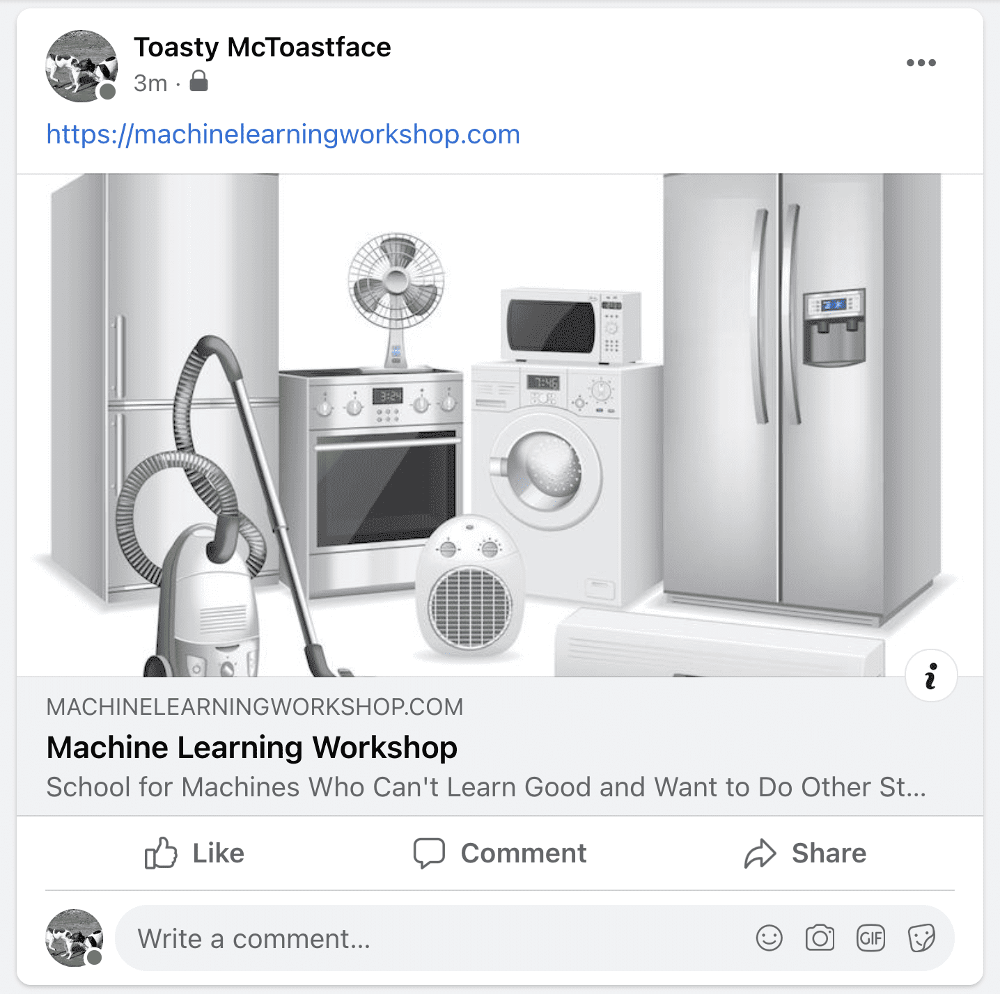
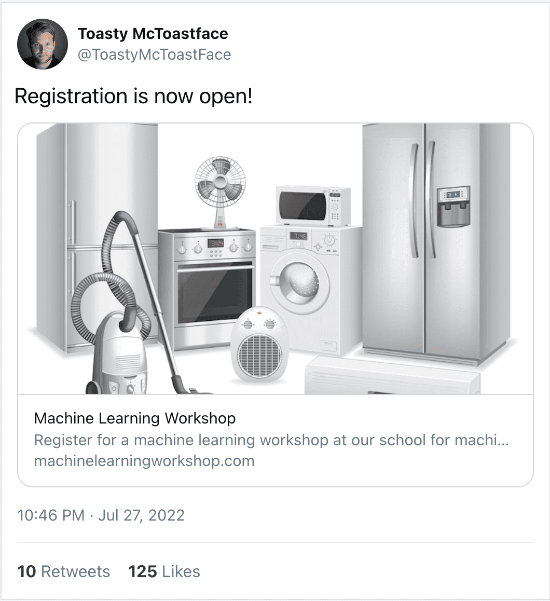
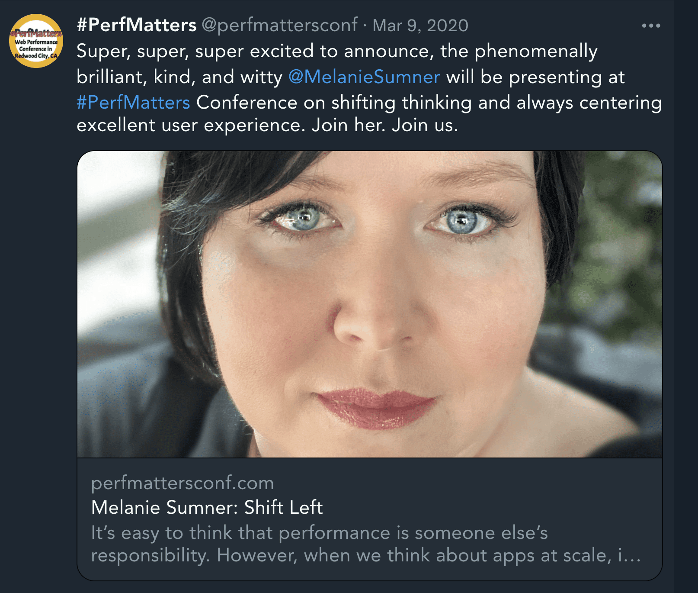
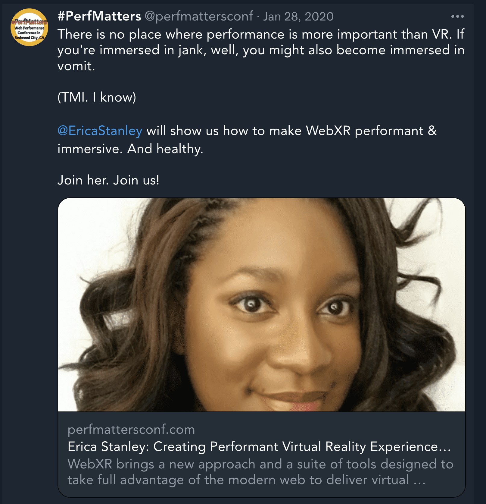

# 元数据

在“文档结构”部分中，您了解了（几乎）总能在 HTML 文档的 `<head>` 中找到的组件。虽然 `<head>` 中的所有内容（包括 `<title>`、`<link>`、`<script>`、`<style>` 以及不太常用的 `<base>`）实际上都是“元数据”，但元数据有 `<meta>` 标记，这些标记无法由这些其他元素表示。

该规范包含数种元类型，以及许多其他未列入任何官方规范的应用支持的元类型。在本部分中，我们将讨论规范中包含的属性和值、一些常见的元名称和内容值，以及对搜索引擎优化、社交媒体发布和用户体验（并非由 [WHATWG](https://html.spec.whatwg.org/multipage/semantics.html#the-meta-element) 或 [W3C](https://www.w3.org/MarkUp/html-spec/Elements/META.html) 进行正式定义的一些）极为有用的元类型。

## 必需的 `<meta>` **标记，已重新访问**

我们再来看看已经介绍的两个必要 `<meta>` 标记：[字符集声明](/blogs/web/html/document-structure#character_encoding)和[视口元标记](/blogs/web/html/document-structure#viewport_metadata)，在此过程中更好地了解 `<meta>` 标记。

`<meta>` 元素的 `charset` 属性以独特的方式生成。最初，字符集元数据编写为 `<meta http-equiv="Content-Type" content="text/html; charset=<characterset>" />`，但很多开发者将 `content` 属性误输入为 `content="text/html" charset="<characterset>"`，以至于浏览器开始支持字符集作为属性。它现在在 HTML 现行标准中已标准化为 `<meta charset="<charset>" />`，其中对于 HTML，`<charset>` 是不区分大小写的字符串“utf-8”。

您可能已经注意到，用于包含 `http-equiv` 属性的原始字符集元声明。这是“http-equivalent”的简称，因为元标记基本上是在复制可在 HTTP 标头中设置的内容。除了 `charset` 例外之外，WHATWG HTML 规范中定义的所有其他元标记都包含 `http-equiv` 或 `name` 属性。

## 官方定义的元标记

元标记主要分为两类：包含 `http-equiv` 属性（例如过去包含的字符集元标记）和已命名的元标记类型（例如带有 `name` 属性的视口元标记，我们在[文档结构](/blogs/web/html/document-structure)部分讨论过）。`name` 和 `http-equiv` 元类型都必须包含 `content` 属性，该属性用于定义所列元数据类型的内容。

### Pragma 指令

`http-equiv` 属性的值为 pragma 指令。这些指令描述了应如何解析网页。如果您无法直接设置 HTTP 标头，可以使用支持的 `http-equiv` 值来启用设置指令。

该规范定义了 7 个 [pragma 指令](https://html.spec.whatwg.org/multipage/semantics.html#pragma-directives)，其中大多数指令都有其他设置方法。例如，虽然您可以使用 `<meta http-equiv="content-language" content="en-us" />` 添加语言指令，但我们已经讨论过如何对 HTML 元素使用 [`lang` 属性](/blogs/web/html/document-structure#content_language)，这也就应该使用该属性。

最常见的 pragma 指令是 `refresh` 指令。

```html
<meta http-equiv="refresh" content="60; https://machinelearningworkshop.com/regTimeout" />
```

虽然您可以将指令设置为以 `content` 属性中设置的秒数为间隔进行刷新，甚至可以重定向到其他网址，但不建议这样做。在没有用户明确请求的情况下刷新和重定向内容会导致易用性不佳，还会对可访问性产生负面影响。进行段落中间，页面重置时，不该感到厌恶吗？想象一下发生了认知或视觉问题。如果您打算通过重定向设置刷新，请确保用户有足够的时间阅读网页、加快流程的链接，以及在适当情况下提供一个用于“停止计时”并防止重定向发生的按钮。

我们不会在网站中包含此内容，因为除了讨厌我们的访问者外，没有必要让用户会话超时。

最实用的 pragma 指令是 `content-security-policy`，该指令支持为当前文档定义内容政策。内容政策大多会指定允许的服务器源和脚本端点，这有助于防范跨站脚本攻击。

```html
<meta http-equiv="content-security-policy" content="default-src https:" />
```

如果您无权更改 HTTP 标头（或者有更改），请参阅[`content-security-policy` 指令中以空格分隔的内容值](https://developer.mozilla.org/docs/Web/HTTP/Headers/Content-Security-Policy)列表。

### 已命名的元标记

通常情况下，您需要包含已命名的元数据。添加 `name` 属性，属性值为元数据的名称。与 pragma 指令一样，`content` 属性也是必需的。

`name` 属性是元数据的名称。除了 `viewport` 之外，您可能还需要添加 `description` 和 `theme-color`，而不包含 `keywords`。

#### 关键字

搜索引擎优化的蛇油销售员滥用关键字元标记，在关键字元标记中堆砌了以英文逗号分隔的垃圾内容字词列表，而不是相关关键词列表，因此搜索引擎认为此元数据不再有用。无需浪费时间、精力或字节添加代码。

#### 说明

不过，`description` 值对于搜索引擎优化 (SEO) 很有用：说明内容值通常是搜索引擎在搜索结果中网页标题下方显示的值。一些浏览器（如 Firefox 和 Opera）将此设置用作已添加书签的网页的默认说明。说明应简短而准确地总结网页内容。

```html
<meta name="description"
  content="Register for a machine learning workshop at our school for machines who can't learn good and want to do other stuff good too" />
```

如果说明的后半部分对您来说没有意义，那么您可能还未看过电影 [Zoolander](https://www.youtube.com/watch?v=NQ-8IuUkJJc&hl=zh-cn)。

#### 机器人

如果您不希望搜索引擎将您的网站编入索引，可以告知搜索引擎。`<meta name="robots" content="noindex, nofollow" />` 会告知漫游器不要将该网站编入索引和跟踪任何链接。聊天机器人应听取请求，但法律并不能要求它们遵守请求。除非 HTTP 标头另有说明，否则您无需添加 `<meta name="robots" content="index, follow" />` 即可请求将网站和链接编入索引（因为这是默认设置）。

```html
<meta name="robots" content="index, follow" />
```

#### 主题颜色

通过 [`theme-color`](/blogs/web/design/theming#customize_the_browser_interface) 值，您可以定义一种颜色来自定义浏览器界面。相应浏览器和操作系统将使用 content 属性中的颜色值，以便您为支持为标题栏、标签页栏或其他 Chrome 组件着色的用户代理提供建议颜色。此元标记对[渐进式 Web 应用](/blogs/web/pwa)特别有用。但是，如果您要添加 PWA 所需的清单文件，则可以改为在其中添加主题颜色。不过，在 HTML 中定义相应颜色可确保在呈现之前可立即找到相应颜色，这在首次加载时可能比等待清单更快。

要将主题颜色设置为网站背景颜色的蓝色调，请包含以下内容：

```html
<meta name="theme-color" content="#226DAA" />
```

主题颜色元标记可包含一个 `media` 属性，该属性用于根据媒体查询设置不同的主题颜色。`media` 属性只能包含在此元标记中，所有其他元标记中会被忽略。

还有一些[其他 `name` 元值](https://developer.mozilla.org/docs/Web/HTML/Element/meta/name)，但我们讨论的元值是最常见的值。除了为不同的媒体查询声明不同的 `theme-color` 值之外，每个元标记都只包含一个。如果您确实需要添加多种类型的元标记来支持旧版浏览器，那么旧值应该位于新值之后，因为用户代理会读取连续规则，直到找到匹配项。

## 打开图表

[Open Graph](https://ogp.me/) 和类似的元标记协议可用于控制社交媒体网站（例如 Twitter、LinkedIn 和 Facebook）显示指向您内容的链接的方式。如果未添加该网址，社交媒体网站将从说明元标记中正确抓取网页标题和说明，这些信息与搜索引擎呈现的信息相同，但是您可以有针对性地设置，在链接发布到您的网站后，用户会看到什么内容。

当您在 Facebook 或 Twitter 上发布指向 MachineLearningWorkshop.com 或 web.dev 的链接时，系统会显示一张卡片，其中包含图片、网站标题和网站说明。整张卡片都会以超链接的形式指向您提供的网址。

Open Graph 元标记均有两个属性：`property` 属性（而不是 `name` 属性），以及该属性的内容或值。`property` 属性未在官方规范中定义，但支持 Open Graph 协议的应用广泛支持该属性。创建像 `property` 这样的“新”属性可确保为协议的特性创建的属性值不会与 `name` 或 `http-equiv` 属性的未来值冲突。

创建 Facebook 媒体卡片：

```html
<meta property="og:title" content="Machine Learning Workshop" />
<meta property="og:description" content="School for Machines Who Can't Learn Good and Want to Do Other Stuff Good Too" />
<meta property="og:image" content="http://www.machinelearningworkshop.com/image/all.png" />
<meta property="og:image:alt" content="Black and white line drawing of refrigerator, french door refrigerator, range, washer, fan, microwave, vaccuum, space heater and air conditioner" />
```

添加要显示的博文标题。商品名通常会显示在图片下方和说明上方。说明应不超过三句话，用于对你的帖子进行总结。它会显示在 `og:title` 中定义的标题之后。提供要显示的横幅图片的绝对网址，包括 `https://` 协议。在 HTML 中包含图片时，请始终为该图片添加替代文字说明，即使图片会显示在其他位置也是如此。对于 Open Graph 社交媒体卡片，请将 `alt` 定义为 `og:image:alt` 属性的内容值。您还可以使用 `og:url` 添加规范网址。



这些元标记均在 [Open Graph 协议](https://ogp.me/)中定义。这些值应是您希望第三方 Web 应用显示的内容。

其他社交媒体都有自己的类似语法，例如 [Twitter 卡片标记](https://developer.twitter.com/en/docs/twitter-for-websites/cards/overview/markup)。这样就可以根据链接的显示位置提供不同的体验，或者通过在网址末尾添加参数来启用链接跟踪。

```html
<meta name="twitter:title" content="Machine Learning Workshop" />
<meta name="twitter:description" content="School for machines who can't learn good and want to do other stuff good too" />
<meta name="twitter:url" content="https://www.machinelearningworkshop.com/?src=twitter" />
<meta name="twitter:image:src" content="http://www.machinelearningworkshop.com/image/all.png" />
<meta name="twitter:image:alt" content="27 different home appliances" />
<meta name="twitter:creator" content="@estellevw" />
<meta name="twitter:site" content="@perfmattersconf" />
```

在 Twitter 的案例中，为了确保 `name` 属性的值不会与未来的规范冲突，请为 Twitter 卡片数据使用新属性（如 Open Graph 中的 `property` 属性），并为所有名称值添加 `twitter:` 前缀。

您可以在 [Twitter](https://cards-dev.twitter.com/validator) 和 [Facebook](https://developers.facebook.com/tools/debug/?q=https%3A%2F%2Fmachinelearningworkshop.com) 上查看社交媒体卡片的显示效果。



您可以为不同的社交媒体网站或不同的链接参数设置不同的卡片图片、标题和说明。例如，[https://perfmattersconf.com](https://perfmattersconf.com/) 会根据网址参数为 `og:image`、`og:title` 和 `og:description` 设置不同的值。





如果您在 [Twitter 的卡片验证工具](https://cards-dev.twitter.com/validator)中输入 [https://perfmattersconf.com?name=erica](https://perfmattersconf.com/?name=erica) 和 [https://perfmattersconf.com?name=melanie](https://perfmattersconf.com/?name=melanie)，就会看到这两张不同的卡片；尽管它们都链接到同一会议首页，但我们提供了不同的内容。

## 其他有用的元信息

如果有人将您的网站加入书签、将其添加到他们的主屏幕，或者如果您的网站是渐进式 Web 应用，或以其他方式离线运行或不显示浏览器 Chrome 功能，那么您可以为移动设备的主屏幕提供应用图标。

您可以使用 `<link>` 标记链接到要使用的启动映像。以下示例通过媒体查询添加了几张图片：

```html
<link rel="apple-touch-startup-image" href="icons/ios-portrait.png" media="orientation: portrait" />
<link rel="apple-touch-startup-image" href="icons/ios-landscape.png" media="orientation: landscape" />
```

如果您的网站或应用支持 Web 应用，即网站可以独立运行，且界面极小（例如没有返回按钮），您也可以使用元标记告知浏览器：

```html
<meta name="apple-mobile-web-app-capable" content="yes" />
<meta name="mobile-web-app-capable" content="yes" />
```

请仅在您的应用确实具有相应功能时才添加这些属性。如果您的网站未做到这一点，那么您将会成为最忠实的支持者，也就是那些将您的网站添加到主屏幕的用户，从而造成非常糟糕的用户体验。你会失去他们的爱！

如果有人要将您的图标保存到其小型设备的主屏幕上，您应为操作系统提供一个简称，该名称不会占用小型设备的主屏幕上的空间。您可以通过添加元标记或使用网络清单文件执行此操作。以下演示了元标记方法：

```html
<meta name="apple-mobile-web-app-title" content="MLW" />
<meta name="application-name" content="MLW" />
```

您了解了多个元标记，所有此类元标记都会加长您的标头。如果您确实要创建支持 Web 应用且支持离线使用的渐进式 Web 应用，则可以更加简单简洁地在 webmanifest 文件中添加 `short_name: MLW`，而不是添加这两个额外的元标记。

清单文件可以防止充满 `<link>` 和 `<meta>` 标记的异常标头。我们可以创建一个清单文件，通常称为 `manifest.webmanifest` 或 `manifest.json`。然后，我们使用方便的 `<link>` 标记，将 `rel` 属性设置为 `manifest`，将 `href` 属性设置为清单文件的网址：

```html
<link rel="manifest" href="/mlw.webmanifest" />
```

本系列课程的重点是 HTML，不过您可以查看[有关渐进式 Web 应用的 web.dev 课程](/blogs/web/pwa/web-app-manifest)或 [MDN 的 Web 应用清单文档](https://developer.mozilla.org/docs/Web/Manifest)。

现在，您的 HTML 如下所示：

```html
<!DOCTYPE html>
<html lang="en">
  <head>
    <meta charset="utf-8" />
    <title>Machine Learning Workshop</title>
    <meta name="viewport" content="width=device-width" />
    <meta name="description" content="Register for a machine learning workshop at our school for machines who can't learn good and want to do other stuff good too" />
    <meta property="og:title" content="Machine Learning Workshop" />
    <meta property="og:description" content="School for Machines Who Can't Learn Good and Want to Do Other Stuff Good Too" />
    <meta property="og:image" content="http://www.machinelearningworkshop.com/image/all.png" />
    <meta property="og:image:alt" content="Black and white line drawing of refrigerator, french door refrigerator, range, washer, fan, microwave, vaccuum, space heater and air conditioner" />
    <meta name="twitter:title" content="Machine Learning Workshop" />
    <meta name="twitter:description" content="School for machines who can't learn good and want to do other stuff good too" />
    <meta name="twitter:url" content="https://www.machinelearningworkshop.com/?src=twitter" />
    <meta name="twitter:image:src" content="http://www.machinelearningworkshop.com/image/all.png" />
    <meta name="twitter:image:alt" content="27 different home appliances" />
    <meta name="twitter:creator" content="@estellevw" />
    <meta name="twitter:site" content="@perfmattersconf" />
    <link rel="stylesheet" src="css/styles.css" />
    <link rel="icon" type="image/png" href="/images/favicon.png" />
    <link rel="alternate" href="https://www.machinelearningworkshop.com/fr/" hreflang="fr-FR" />
    <link rel="alternate" href="https://www.machinelearningworkshop.com/pt/" hreflang="pt-BR" />
    <link rel="canonical" href="https://www.machinelearning.com" />
    <link rel="manifest" href="/mlwmanifest.json" />
  </head>
  <body>

    <!-- <script defer src="scripts/lightswitch.js"></script>-->
  </body>
</html>
```

