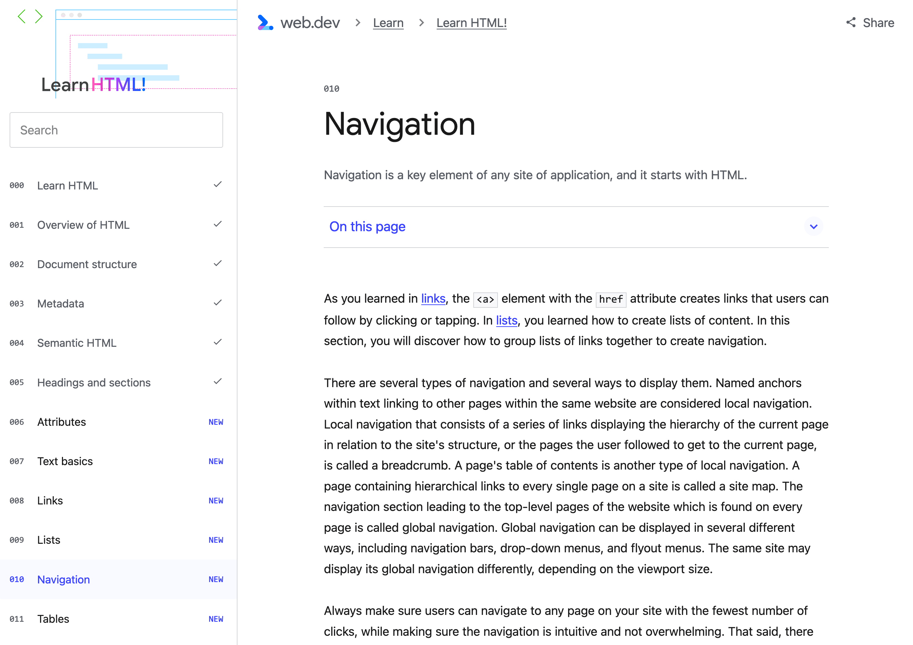
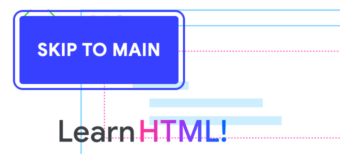
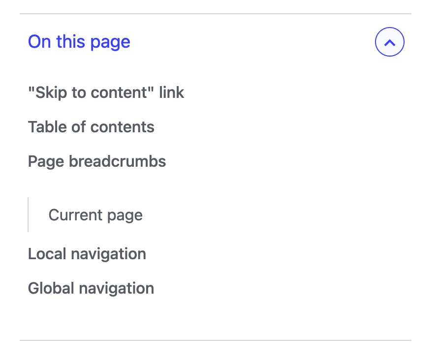
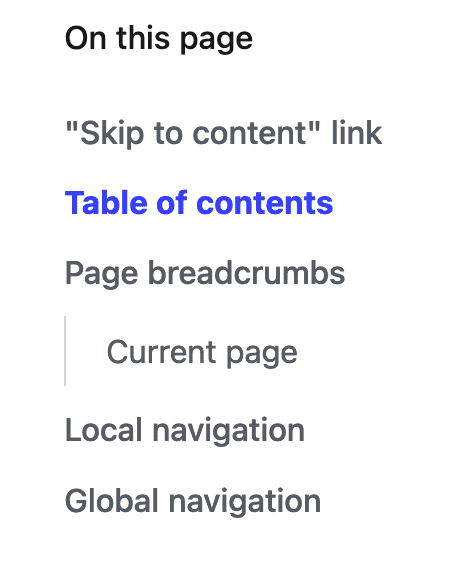
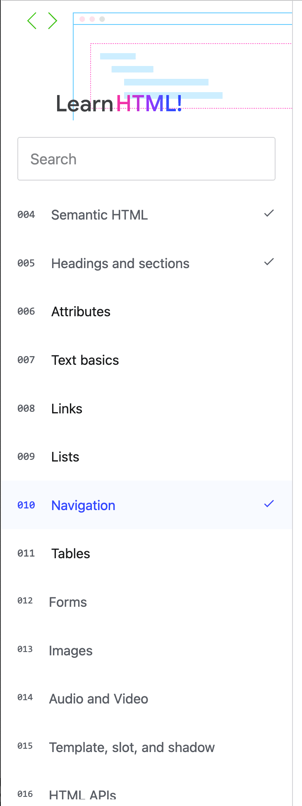
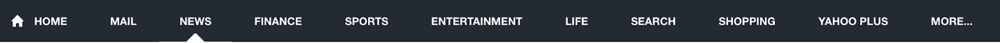

# 导航

如[链接](/web/html/links)部分所述，具有 `href` 属性的 `<a>` 元素会创建链接，用户可以通过点击或点按来访问这些链接。在[清单](/web/html/lists)中，您学习了如何创建内容列表。在本部分中，您将了解如何将链接列表分组在一起来创建导航。

导航分为多种类型，显示方式也有多种。链接到同一网站内其他网页的文本内的命名锚标记被视为本地导航。本地导航称为面包屑导航，由一系列链接组成，这些链接显示当前页面（与网站结构相关的页面）的层次结构，或用户访问后到达当前页面的页面。页面的目录是另一种类型的本地导航。包含指向网站上每个网页的分层链接的网页称为“站点地图”。导航部分指向网站的顶级页面（在每个页面上都有），称为全局导航。 全局导航可通过多种不同的方式显示，包括导航栏、下拉菜单和浮出菜单。 同一网站会以不同的方式显示其全局导航，具体取决于视口大小。

请始终确保用户能够通过最少的点击导航到您网站上的任何网页，同时确保导航直观且不会过多。也就是说，对导航元素没有具体要求。[MachineLearningWorkshop.com](https://machinelearningworkshop.com/) 是一个单页网站，其右上角具有本地导航栏；多页网站通常在此处放置全局导航。



如果您是在 web.dev 上查看此页面，可能会发现一些导航功能。标题上方有一个面包屑导航，标题后面是“在此页面上”目录，还有一个“学习 HTML”目录，它会根据屏幕宽度始终显示或显示，只需点击菜单按钮即可显示。该网页上的第一个元素是指向 #main，可让您跳过边栏和面包屑导航链接的隐藏链接。

## “跳至内容”链接

该网页上的第一个元素是内部链接：

```html
<a href="#main" class="skip-link button">Skip to main</a>
```

当用户点击该按钮时，或当它获得焦点且用户点击 `Enter` 时，会滚动页面并将焦点置于主要内容上：一个 `id` 为 `main` 的标签 `<main>`：

```html
<main id="main">
```

即使您已阅读前面的所有部分，您可能也从未在此网站上看到过该链接。 它仅在获得焦点时显示：



为了提高易用性和可访问性，请务必让用户绕过每个网页上重复显示的内容块。 我们添加了跳过链接，这样当键盘用户在加载时点击 `tab` 时，他们可以快速跳至网站的主要内容，无需按 Tab 键进行大量关联。在此页面上，“跳过”链接会跳过部分范围的边栏导航和面包屑导航导航，将用户直接转到网页标题。

大多数设计人员都不喜欢页面顶部包含链接的外观。您可以在视图中隐藏该链接，同时要谨记该链接获得焦点（当键盘用户在网页上的链接按 Tab 键时），该链接必须对所有用户可见。仅使用类似于 `.visually-hidden:not(:focus):not(:active)` 的选择器隐藏处于非聚焦状态和非活动状态的内容。

显示的链接文字为“跳至主”。这是链接的可访问名称。这是一个技术网站，用户可能知道“主”的含义。与所有链接文字一样，无障碍名称应该清楚地指明链接会将用户转到何处。链接目标应是网页主要内容的开头。要测试这一点，请在网页加载时，按 Tab 键转到“跳到主网页”链接。然后按 `Enter` 以确保其“跳转”到主要内容。

## 目录

“跳转到内容”链接可将主要内容滚动到用户视野范围内。第一个元素是带有本部分标题的 `<h1>` 标题。在此示例中为 `<h1>Marking up navigation</h1>`。主要标题后面是宣传口号，这是对本教程内容的简要说明。目录导航在代码库中的标题之前还是之后取决于浏览器的宽度。


在较窄的屏幕上，目录会隐藏在“此页面”按钮后面，该按钮用于切换导航栏的可见性。


在宽屏设备上，目录始终可见，指向当前部分的链接会以蓝色突出显示。

如果您的浏览器宽度大于 80em，目录会显示在标记中的标题之前，并且类似于以下内容（为简化标记，我们已移除类名称）：

```html
<nav aria-label="On this page">
  <div>On this page</div>
  <div>
    <ul>
      <li>
        <a href="#skip">Skip to content link</a>
      </li>
      <li>
        <a href="#toc">Table of contents</a>
      </li>
      <li>
        <a href="#bc">Page breadcrumbs</a>
      </li>
      <li>
        <a href="#ln">Local navigation</a>
      </li>
      <li>
        <a href="#global">Global navigation</a>
      </li>
    </ul>
  </div>
</nav>
```

`<nav>` 是最适合用于导航部分的元素：它会自动通知屏幕阅读器和搜索引擎某个部分具有 `navigation`（一个标志角色）的角色。

添加 [`aria-label`](https://developer.mozilla.org/docs/Web/Accessibility/ARIA/Attributes/aria-label) 属性可简要说明导航的目的。在这种情况下，由于该属性的值对于页面上可见的文本来说是多余的，因此最好使用 [`aria-labelledby`](https://developer.mozilla.org/docs/Web/Accessibility/ARIA/Attributes/aria-labelledby) 来引用可见文本。

我们可以将非语义 `<div>` 更改为段落 `<p>`，然后添加 [`id`](/web/html/attributes#id)，以便引用该段落。然后，我们使用 `aria-labelledby`：

```html
<nav aria-labelledby="tocTitle">
  <p id="tocTitle">On this page</p>
```

除了减少冗余之外，翻译服务还会翻译可见文本，而属性值可能不会翻译。 如果可能的话，如果存在可提供适当标签的文本，则优先考虑文本而不是属性文本。

此导航就是目录。如果您要使用 `aria-label`，请提供相应信息，而不是重复显示可见文本：

```html
<nav aria-label="Table of Contents">
  <p>On this page</p>
```

在元素上提供可访问的名称时，请勿包含元素的名称。屏幕阅读器会向用户提供该信息。 例如，使用 `<nav>` 元素时，请勿包含“navigation”；使用语义元素时，会包含该信息。

链接本身位于一个无序的列表中。虽然这些列表不必嵌套在列表中，但使用列表可以让屏幕阅读器用户知道有多少列表项（即链接）是导航中的单个列表。

```html
<nav aria-labelledby="tocTitle">
  <p id="tocTitle">On this page</p>
  <ul role="list">
    <li>
      <a href="#skip">Skip to content link</a>
    </li>
    <li>
      <a href="#toc">Table of contents</a>
    </li>
    <li>
      <a href="#bc">Page breadcrumbs</a>
    </li>
    <li>
      <a href="#ln">Local navigation</a>
    </li>
    <li>
      <a href="#global">Global navigation</a>
    </li>
  </ul>
</nav>
```

如果您的浏览器宽度小于 80em，则“在此页面”微件位于标题和标语下方。方法是添加两个目录导航组件，并根据媒体查询使用 CSS `display: none;` 隐藏其中一个组件。

添加两个相同的 widget 以仅显示一个 widget 属于反模式。额外的字节可以忽略不计。使用 CSS `display: none` 对所有用户隐藏 HTML 内容是恰当的做法。问题在于，在宽屏屏幕上，目录位于 `#main` 之前；而在窄屏上，目录会嵌套在 #main 中。使用键盘跳至内容会跳过宽屏幕上的目录。虽然用户已经习惯于在更换设备或增加字体大小时内容能够响应并且会改变位置，但他们并不希望标签页顺序随之改变。页面布局应该在整个网站上可访问、可预测且一致。在这里，目录的位置是不可预测的。

## 网页面包屑导航

路径提供了辅助导航信息，可帮助用户了解自己在网站上的位置。它们通常会显示当前文档的网址层次结构以及当前页面在网站结构中的位置。用户角度的网站结构可能与服务器上的文件结构不同。没关系。用户无需知道您如何整理文件，但需要能够浏览您的内容。

面包屑导航可帮助用户浏览并了解您网站的组织结构，这样一来，他们便可以使用 `back` 功能快速导航到任意祖先部分，而无需返回到之前访问过的每个网页来转到当前网页。

如果网站具有简单的目录分层结构（就像 web.dev 一样），面包屑导航导航通常由指向首页或主机名的链接组成，并在网址路径名中包含指向每个目录的索引文件的链接。是否包含当前网页是可选的，需要特别注意。

```javascript
const url = new URL("/html/navigation");
const sections = url.hostname + url.pathname.split('/');
// "web.dev,learn,html,navigation"
```

路径的各个部分会显示从当前网页到首页的路径，中间的每一级别都会显示出来。


每个“学习 HTML”模块页面都采用相同的面包屑导航导航，显示了 `web.dev` 的 `learn` 部分中的 `HTML` 课程的层次结构。代码与以下代码类似，其中为清楚起见，移除了类和 SVG 详细信息：

```html
<nav aria-label="breadcrumbs">
  <ul role="list">
    <li>
      <a href="/">
        <svg aria-label="web.dev" role="img">
          <use href="#webDevLogo" />
        </svg>
      </a>
    </li>
    <li>
      <a href="/learn">Learn</a>
    </li>
    <li>
      <a href="/learn/html">Learn HTML!</a>
    </li>
  </ul>
  <share-action authors="@estellevw" data-action="click" data-category="web.dev" data-icon="share" data-label="share, twitter" role="button" tabindex="0">
    <svg aria-label="share" role="img">
      <use href="#shareIcon" />
    </svg>
    <span>Share</span>
  </share-action>
</nav>
```

此面包屑导航遵循了最佳实践。它使用 `<nav>` 元素（地标角色），因此辅助技术会将面包屑导航显示为网页上的导航元素。 随 `aria-label` 提供的“面包屑导航”的无障碍名称使其与当前文档中的其他导航地标区分开来。

在链接之间，有 CSS 生成的内容分隔符。分隔符位于每个列表项之前，以第二个 `<li>` 开头。

```css
[aria-label^="breadcrumb" i] li + li::before {
  content: "";
  display: block;
  width: 8px;
  height: 8px;
  border-top: 2px solid currentColor;
  border-right: 2px solid currentColor;
  rotate: 45deg;
  opacity: .8
}
```

屏幕阅读器不会“看到”它们，最佳做法是：应向屏幕阅读器隐藏面包屑导航链接之间的分隔符。 此外，它们还必须与背景形成足够的对比，与常规文字一样。

此版本使用无序列表和列表项。由于系统会枚举有序列表项，因此最好使用有序列表。此外，它是一个列表：由于某些 CSS 显示属性值移除了某些元素的语义，因此系统重新添加了 `role="list"`。

通常情况下，面包屑导航中指向首页的链接应为“首页”，而不是以网站名称作为标签的网站徽标。但是，由于面包屑导航位于文档顶部，并且是页面上的唯一徽标出现，因此有必要解释为什么使用这种反模式。

最后一个元素是自定义 `<share-action>` 元素。第 15 节介绍了自定义元素。虽然此自定义元素不是面包屑导航的一部分，但可以在 `<nav>` 中包含不相关的元素，但前提是所有页面包含的元素一致。

### 当前页面

在此页面上，当前页面“导航”未包含在面包屑导航中。当当前网页包含在面包屑导航中时，相应文本最好不是链接，并且 `aria-current="page"` 应包含在当前网页的列表项中。如果未添加该标题，指明后跟的标题是带有图标或其他符号的当前页面会很有帮助。

如果设计发生变化，可以使用面包屑导航的替代版本：

```html
<nav aria-label="breadcrumbs">
  <ol role="list">
    <li>
      <a href="/">Home</a>
    </li>
    <li>
      <a href="/learn">Learn</a>
    </li>
    <li>
      <a href="/learn/html">Learn HTML!</a>
    </li>
    <li aria-current="page">
      Navigation
    </li>
  </ol>
</nav>
```

面包屑导航不适用于线性步骤。例如，用户在转到当前页面时所遵循的路径列表，或者到食谱中到目前为止的后续步骤列表可以嵌套在 `<nav>` 中，但不应标记为面包屑导航。

## 本地导航

此页面上还有另一个导航组件。如果您使用的是宽屏设备，则左侧有一个边栏，其中包含“学习 HTML”徽标、搜索栏，以及指向“学习 HTML”课程（共 20 个部分）中每个部分的链接。每个链接都包含章节号、章节标题和已访问部分右侧的对勾标记。如果您已离开页面后又返回，则可能是这个链接。指向“学习 HTML”中所有部分的链接，以及搜索标头和本地标头都是位置导航。

如果您通过平板电脑或移动设备访问此网站，或者因为屏幕宽度变窄，那么在加载此网页时，边栏会处于隐藏状态。您可以通过顶部导航栏中的汉堡式菜单将其显示出来（是的，标题是设置了 `role="navigation"` 的自定义 `<web-header>` 元素）。

宽屏上的永久性本地导航与窄屏上的本地导航之间可以显示和消失的主要区别在于，在可隐藏的版本上显示关闭按钮。此图标会在使用“`display: none;`”的宽屏设备上隐藏。



指向此文档的链接（第 010 节）的外观与本地导航中的其他链接略有不同，以便向视力正常的用户表明这是当前页面。这种视觉差异是通过 CSS 实现的。当前网页也使用 `aria-current="page"` 属性进行标识。这会告知辅助技术它是指向当前页面的链接。此列表项在此本地导航栏中的 HTML 类似于：

```html
<li>
  <a aria-current="page" href="/learn/html/navigation" data-complete="true">
    <span>010</span>
    <span>Navigation</span>
    <svg aria-label="Check" role="img">
      <use href="#checkmark" />
    </svg>
  </a>
</li>
```

如果这不是您第一次访问此页面，则系统不会显示对勾标记。如果您过去访问过此页面，`data-complete` [自定义属性](/web/html/attributes)会设为 `true`，并显示对勾标记。每个链接中都包含对勾标记，但 CSS 会根据缺少 `data-complete="true"` 属性和值，通过 `display: none` 向之前未访问过此页面的用户隐藏该复选框：

```css
.course .stack-nav a:not([data-complete="true"]) svg {
  display: none;
}
```

如果将 `display` 设置为 `none` 以外的值，`role` 会告知辅助技术：内嵌 SVG 是图片，而 `aria-label` 则充当 `` 的 `alt` 属性。

## 全局导航

全局导航是指向网站顶级页面（在网站的每个页面上都相同）的导航部分。 网站的全局导航也可能由标签页组成，这些标签页会打开指向网站所有子部分或其他菜单的嵌套链接列表。 它可能包含已命名的部分、按钮和搜索微件。这些附加功能并非硬性要求。您要求的导航元素显示在每个页面上，并且每个页面上都是一样的；当然，指向当前页面的所有链接都必须包含 `aria-current="page"`。

全局导航提供了一种一致的方式，可让用户在应用程序或网站的任何位置出行。Google 页面顶部没有全局导航。Yahoo! 可以。虽然所有 Yahoo! 主要属性都有不同的样式，但大多数部分的内容都是相同的。




“新闻”和“体育”的全球导航标题的内容是相同的，但显示用户当前正在参加体育活动的图标对比度不足，无法使用；即使是对于弱视的访问者，也是如此。这两个版块都有一个全局导航，其下方有一个特定于版块的本地导航。

与全局导航类似，所有页面上的页脚应完全相同。但这是唯一的相似之处。全局导航支持从产品的角度导航到网站的所有部分。页脚中的导航元素没有特定要求。一般来说，页脚将包括公司链接（例如法律声明）、关于公司和职业生涯的链接，并且可能会将用户转到外部来源，例如社交媒体图标。

此页面的页脚包含三个额外的 `<nav>` 元素：页脚导航、Google 开发者以及条款和政策，每个元素都是一个链接。页脚导航包括如何在 GitHub 上为 web.dev 做贡献、Google 在 web.dev 之外提供的其他培训内容，以及外部“如何连接”链接。

`<footer>` 中的这三个导航是 `<nav>` 元素，具有 `aria-label` 为这些地标角色提供无障碍名称。我们看到的所有导航都是嵌套在导航内的[列表](/web/html/links)中的[链接](/web/html/lists)。我们涵盖了创建自己的导航栏所需了解的所有内容。

