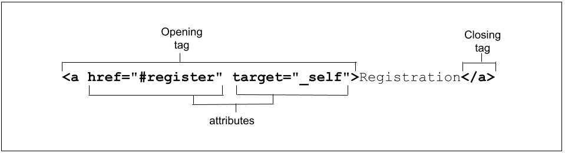

# HTML 概述

超文本标记语言 (HTML) 是用于描述 Web 上显示的文档结构的标准标记语言。HTML 由一系列用于标记文档所有组成部分的元素和属性组成，以便采用有意义的方式组织文档。

HTML 文档基本上是一种节点树，其中包括 HTML 元素和文本节点。HTML 元素为文档提供语义和格式设置，包括创建段落、列表和表格，以及嵌入图片和表单控件。每个元素可以指定多个属性。许多元素都可以有内容，包括其他元素和文本。其他元素为空，其功能由标记和属性定义。

元素有多种类别，包括元数据、版块、文本、内嵌语义、表单、互动、媒体、组件和脚本。本系列视频中将会介绍其中的大部分内容。首先，什么是元素？

## 元素

HTML 由一系列元素组成，您可以使用这些元素封装或封装内容的不同部分，使其以特定方式显示或运行。HTML 元素用标记进行分隔，并用尖括号（`<` 和 `>`）编写。

网页标题是一个一级标题，我们为其使用 `<h1>` 标记。实际标题“机器学习研讨会”是我们元素的内容。内容位于开始标记和结束标记之间。整个元素（起始标记、结束标记和内容）都是元素。


结束标记与起始标记相同，前面带有一条斜线。

元素和标记并不是完全相同的概念，尽管很多人会混用这两个术语。标记名称是括号中的内容。该标记包含括号。在本示例中为 `<h1>`。“元素”是起始标记和结束标记，以及这些标记之间的所有内容，包括嵌套元素。

```html
<p>This paragraph has some
  <strong><em>strongly emphasized</em></strong>
  content</p>
```

此段落元素内*嵌套*了其他元素。嵌套元素时，正确嵌套元素非常重要。HTML 标记的关闭顺序应与打开顺序相反。在上面的示例中，请注意 `<em>` 如何在起始和结束 `<strong>` 标记内打开和关闭，以及 `<strong>` 在 `<p>` 标记中如何同时开启和关闭。

浏览器不会显示这些标记。这些代码用于解读网页内容。

HTML 的宽容度非常高。例如，如果我们省略 `</li>` 结束标记，则隐含着这些结束标记。

```html
<ul>
  <li>Blendan Smooth
  <li>Hoover Sukhdeep
  <li>Toasty McToastface
</ul>
```

虽然不关闭 `<li>` 是有效的，但这并不是一种好的做法。必须使用结束 `</ul>`。如果省略了无序列表的结束标记，则浏览器会尝试确定列表和列表项的结束标记，但您可能不同意这一决定。

每个元素的规范都会列出结束标记是否必需。该规范中的“两个标记都不例外”表示必须同时提供起始标记和结束标记。[该规范提供了所有必需的结束标记](https://html.spec.whatwg.org/multipage/syntax.html#syntax-tag-omission)。

如果之前示例中的 `<em>` 或 `<strong>` 尚未关闭，那么浏览器不一定会为您关闭该元素。不关闭 `<em>` 只会导致内容的呈现方式与您的预期不同。如果省略了 `</ul>`，且下一个标记是列表父级容器的结束标记，那么您就很幸运了。另一方面，如果它是起始 `<h1>` 标记，则浏览器会假定标头是列表的一部分，包括继承样式。有些省略的结束标记会导致更大的问题：不结束某些标记（例如 `<script>`、`<style>`、`<template>`、`<textarea>` 和 `<title>`）会破坏后续内容，如以下示例所示。

<iframe allow="camera; clipboard-read; clipboard-write; encrypted-media; geolocation; microphone; midi;" loading="lazy" src="https://codepen.io/web-dot-dev/embed/VwxzBLq?height=500&amp;theme-id=dark&amp;default-tab=html%2Cresult&amp;editable=true" data-darkreader-inline-border-top="" data-darkreader-inline-border-right="" data-darkreader-inline-border-bottom="" data-darkreader-inline-border-left="" data-title="由 web-dot-dev 在 Codepen 上开发的 Pen VwxzBLq"></iframe>

无意中将某些内容设为斜体或缩进标题，不会破坏您的业务。您的大部分内容在 200x300 的文本区域中显示为未设置样式，因为您忘记添加 `</textarea>`，或者由于忘记关闭 `</style>` 而根本不显示，会导致网站无法使用。

在某些情况下，即使标记中不存在这些标记，浏览器也会包含这些元素。由于元素是隐式的，因此即使标记不存在，元素也可能存在。即使您没有在内容周围添加 `<body></body>`，浏览器也会在表格行周围添加 `<tbody></tbody>`。不过，虽然省略标记是有效的，但请不要这样做。此外，如前所述，请确保它们的嵌套正确无误。您日后担任标记维护者，以及负责代码库的其他任何人，都将感激您。

元素有两种类型：被替换和未替换。

### 未替换的元素

上一部分中标记的段落、标题和列表均不会被替换。未被替换的元素周围会有起始标记和（有时可选）结束标记，这些标记可以包含文本和其他标记作为子元素。这些封装标签可将短语或图片转换为超链接、将句子转换为标题、对字词给予强调，等等。

### 替换的元素和空元素

系统会将所替换的元素替换为对象，例如在大多数表单控件下为图形界面 (UI) 微件，或者（对于大多数图片而言，为光栅或可缩放图片文件）。每个 都由 对象所取代，都具有默认外观。适用的样式会受到限制，具体取决于对象的类型和浏览器。例如，大多数浏览器都启用了界面 widget 和相关伪元素的有限样式设置。对于光栅图像，可以使用 CSS 轻松完成高度、宽度、裁剪和过滤，但其他操作不多。另一方面，使用基于类似于 HTML 的 XML 的标记语言的可缩放矢量图形可完全缩放（除非它们包含光栅图片）。还可以设置各种样式。请注意，能否通过链接到嵌入 SVG 的 HTML 文件的 CSS 设置嵌入的 SVG 的样式，取决于 SVG 的设置方式。

在此示例中，`` 和 `<input>` 这两个被替换的元素分别被替换为非文本内容：图片和图形界面对象。

```html
<input type="range">

```

上述 HTML 的输出：

[ ] 

被替换的元素和空元素通常会混淆。Void 元素均为自闭合元素，并由一个标记表示。这意味着，void 元素并不存在结束标记之类的内容。或者，您也可以在代码末尾添加一条斜线，很多人都认为这样会使标记更易于阅读。继续讨论此示例，我们使用斜杠自行结束标记：

```html
<input type="range"/>

```

末尾的斜线属于旧式：这表示元素会自动关闭，没有匹配的结束或结束标记。

Void 元素不能包含文本内容或嵌套元素。Void 元素包括 `<br>`、`<col>`、`<embed>`、`<hr>`、``、`<input>`、`<link>`、`<meta>`、`<source>`、`<track>` 和 `<wbr>` 等。

大部分被替换的元素都是空元素，但不是全部元素。`video`、`picture`、`object` 和 `iframe` 元素会被替换，但并不为空。它们都可以包含其他元素或文本，因此它们都有一个结束标记。

大多数空元素都会被替换；但同样，并非所有空元素都会被替换，如 `base`、`link`、`param` 和 `meta` 所示。为什么有一个空元素，其中没有任何内容，因为没有被替换，因而不会在屏幕上呈现任何内容？以便提供有关内容的信息！信息由元素的属性提供。

## 属性

您可能已经注意到，`` 和 `<input`> 示例的起始标记中不仅包含元素类型，这些用空格分隔的名称/值对（尽管有时可选择添加值）的多余位称为“属性”。属性使得 HTML 如此强大。在本系列中，我们将介绍数百个属性和属性值，但在这里，我们仅讨论一般属性和添加方法。

属性提供元素的相关信息。与起始标记的其余部分一样，此属性不会出现在内容中，但它们有助于确定内容对视力正常的用户和非视力用户（辅助技术和搜索引擎）用户的显示方式。

属性仅显示在起始标记中。起始标记始终以元素类型开头。类型后面可以跟零个或多个属性，属性之间可以用一个或多个空格分隔。大多数属性名称后跟一个等号，等同于属性值，并用左引号和右引号括起来。



在此示例中，我们有一个包含两个属性的锚链接。这两个属性已将内容“Registration”（注册）转换为内部锚链接，当用户点击、点按或使用键盘或其他设备激活该链接时，该链接会滚动到当前浏览器标签页中的 `id="register"` 属性。

属性定义了元素的行为、关联和功能。我们将在本系列的[属性](/blogs/web/html/attributes)部分介绍更多属性。目前只需注意，有些属性是全局性的，这意味着它们可以出现在任何元素的开始标记中。有些仅适用于部分元素，而非全部，而有些则只适用于元素，只与单个元素相关。

大多数属性都是名称/值对。布尔值属性（其值为 true、false 或与属性名称相同）可以仅作为属性包含在内：该值不是必需的。

```html

```

此图片有三个属性：`src`、`alt` 和 `ismap`。`src` 属性用于提供 SVG 图片资源的位置。`alt` 属性提供描述图片内容的替代文本。`ismap` 属性为布尔值，不需要值。这只是解释什么是属性。我们将在[图片](/blogs/web/html/images)部分详细介绍这些属性。

虽然您并不总是要求用引号括住属性，但有时也确实这么做。如果值包含空格或特殊字符，就需要使用引号。因此，始终建议使用引号。如果属性值已加引号，则属性之间可以添加一个或多个空格，但为了安全起见，为了方便阅读，建议使用引号和空格。

HTML 不区分大小写，但部分属性值区分大小写。规范中定义的值不区分大小写。未定义为关键字的字符串通常区分大小写，包括 `id` 和 `class` 值。

请注意，如果某个属性值在 HTML 中区分大小写，那么在 CSS 和 JavaScript 中用作[属性选择器](https://developer.mozilla.org/docs/Web/CSS/Attribute_selectors)的一部分时，则区分大小写。

为了使标记更易于阅读，我们建议您（但并非必须）在标记的所有元素名称和属性名称中使用小写字母标记 HTML，并引用所有属性值。如果您听说过“XHTML 样式标记”这一术语，就会明白这是什么意思，以及以斜杠结尾的自闭空元素。

## 元素的外观

语义元素的默认外观由用户代理样式表设置。大多数浏览器都会出于这一目的使用实际的样式表，而另一些浏览器则是在代码中模拟这些样式表。最终的结果都是一样的。尽管 HTML 规范规定了用户代理样式表的一些限制，但浏览器有很多宽限，这意味着不同浏览器之间存在一些差异。

由于标签具有语义含义，因此您选择的元素以及您使用的标签应当适合您显示的内容。元素的语义（即 `role`）对于辅助技术和（在某些情况下）搜索引擎非常重要。[](/blogs/web/html/semantic-html)HTML 应该用于设计内容的结构，而不是定义内容的外观。外观是 CSS 的一大重点。虽然许多会改变内容外观的元素（例如 `<h1>`、`<strong>` 和 `<em>`）都具有语义含义，但外观可以而且通常会随作者样式而改变。

```html
<h1>This header has both <strong>strong</strong> and <em>emphasized</em> content</h1>
```

## 元素、属性和 JavaScript

文档对象模型 (DOM) 是 HTML 文档结构和内容的数据表示。浏览器在解析 HTML 时，会为遇到的每个元素和文本部分创建一个 JavaScript 对象。这些对象称为节点，分别是元素节点和文本节点。

有一个接口可以定义每个 HTML 元素的功能。[HTML DOM API](https://developer.mozilla.org/docs/Web/API/HTML_DOM_API) 提供了通过 DOM 访问和控制每个 HTML 元素的功能，为 HTML 元素以及从该元素继承的所有 HTML 类提供了接口。[HTMLElement](https://developer.mozilla.org/docs/Web/API/HTMLElement) 接口表示 HTML 元素及其所有后代节点。所有其他元素都通过从其继承的接口来实现它。每个继承接口都有一个构造函数、方法和属性。通过继承的 HTMLElement 属性，您可以访问每个全局属性，以及 `input`、`pointer`、`transition` 和 `animation` 事件。通过单个元素的子类型（例如 [HTMLAnchorElement](https://developer.mozilla.org/docs/Web/API/HTMLAnchorElement) 和 [HTMLImageElement](https://developer.mozilla.org/docs/Web/API/HTMLImageElement)），您可以访问元素特有的属性值和方法。
