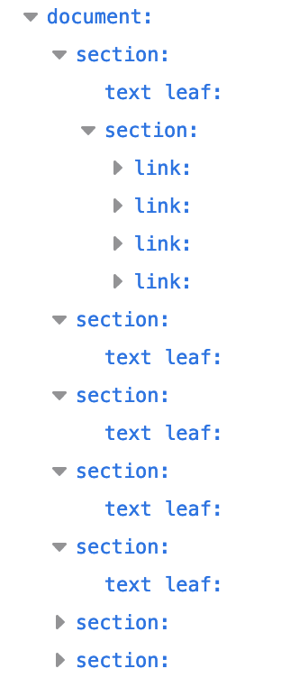
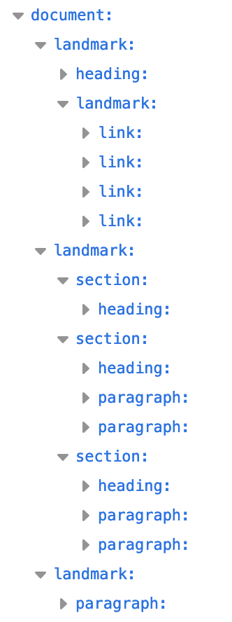
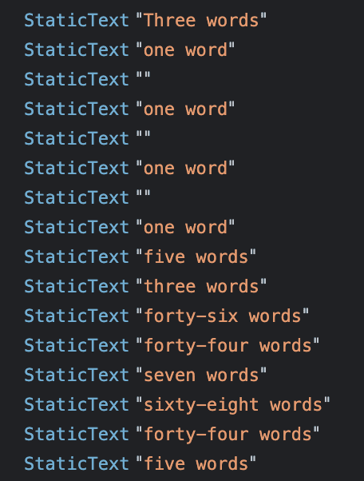
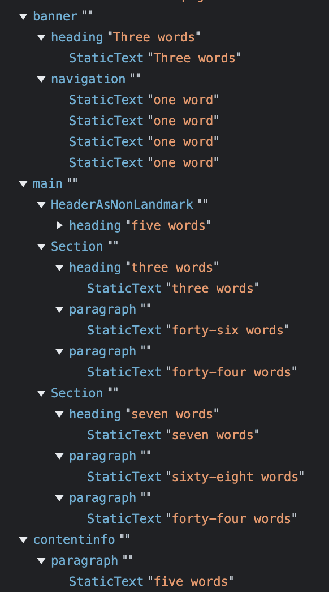

# 语义 HTML 

我们提供 100 多个 HTML 元素以及创建自定义元素的能力，让您可通过无数种方式标记内容；但有些方面（特别是在*语义*上）优于其他方面。

*语义*是指“与含义相关”。编写语义 HTML 意味着使用 HTML 元素根据每个元素的含义（而不是其外观）构建内容结构。

本系列文章尚未介绍许多 HTML 元素，但即使不了解 HTML，下面的两个代码段展示了语义标记如何提供内容上下文。两者都使用字数统计而非 *ipsum lorem* 来节省一些滚动时间，请发挥您的想象力来展开“30 个字词”转换为 30 个字词：

第一个代码段使用 `<div>` 和 `<span>`，这两个元素没有语义值。

```html
<div>
  <span>Three words</span>
  <div>
    <a>one word</a>
    <a>one word</a>
    <a>one word</a>
    <a>one word</a>
  </div>
</div>
<div>
  <div>
    <div>five words</div>
  </div>
  <div>
    <div>three words</div>
    <div>forty-six words</div>
    <div>forty-four words</div>
  </div>
  <div>
    <div>seven words</div>
    <div>sixty-eight words</div>
    <div>forty-four words</div>
  </div>
</div>
<div>
   <span>five words</span>
</div>
```

您能理解这些字词的扩展含义吗？不喜欢。

让我们使用语义元素重写此代码：

```html
<header>
  <h1>Three words</h1>
  <nav>
    <a>one word</a>
    <a>one word</a>
    <a>one word</a>
    <a>one word</a>
  </nav>
</header>
<main>
  <header>
    <h1>five words</h1>
  </header>
  <section>
    <h2>three words</h2>
    <p>forty-six words</p>
    <p>forty-four words</p>
  </section>
  <section>
    <h2>seven words</h2>
    <p>sixty-eight words</p>
    <p>forty-four words</p>
  </section>
</main>
<footer>
  <p>five words</p>
</footer>
```

哪个代码块传达了含义？如果只使用 `<div>` 和 `<span>` 的非语义元素，您确实无法分辨第一个代码块中的内容代表什么。第二个代码示例包含语义元素，为非编码器提供了足够的上下文来解释目的和含义，而无需遇到 HTML 标记。它确实能为开发者提供足够的背景信息，帮助他们理解网页的概要，即使他们无法理解网页内容（如外语内容）也是如此。

在第二个代码块中，我们即使不了解内容也能理解架构，因为语义元素提供了含义和结构。您可以看出，第一个标题是网站的横幅，其中 `<h1>` 可能是网站名称。页脚是网站页脚：这五个字词可能是版权声明或公司地址。

语义标记不仅仅是为了让标记更易于阅读；它在帮助自动化工具解码标记方面尤为重要。开发者工具展示了语义元素如何提供机器可读的结构。

## 无障碍功能对象模型 (AOM)

浏览器在解析接收到的内容时，会构建文档对象模型 (DOM) 和 CSS 对象模型 (CSSOM)。然后构建无障碍树。辅助设备（例如屏幕阅读器）使用 AOM 来解析和解释内容。DOM 是文档中所有节点的树。AOM 就像是 DOM 的语义版本。

我们来比较一下这两种文档结构在 Firefox 无障碍功能面板中的呈现方式：



<ph type="x-smartling-placeholder"></ph> 图 1.节点列表，其中的节点均为链接或文本。



<ph type="x-smartling-placeholder"></ph>图 2.具有清晰地标的节点列表。

在图 2 中，第二个代码块中有四个标志角色。它使用名为 `<header>`、`<main>`、`<footer>` 和 `<nav>` 的语义特征点来方便地进行“导航”。 地标可以构建 Web 内容的结构，并确保屏幕阅读器用户可通过键盘导航的重要内容部分。

请注意，`header` 和 `footer` 是地标，分别具有 `banner` 和 `contentinfo` 角色（当它们未嵌套在其他地标中时）。Chrome 的 AOM 如下所示：


<ph type="x-smartling-placeholder"></ph> 图 3.第一个代码段。


<ph type="x-smartling-placeholder"></ph>图 4.第二个代码段。

查看 Chrome 开发者工具时，您会注意到，在使用语义元素时与不使用语义元素的无障碍对象模型之间存在显著差异。

很明显，使用语义元素有助于实现无障碍功能，而使用非语义元素会降低无障碍功能。HTML 在默认情况下是可以访问的。作为开发者，我们的职责是既保护 HTML 的默认可访问性，又确保尽可能为用户提供可访问性。您可以[在开发者工具中检查 AOM](https://developer.chrome.com/docs/devtools/accessibility/reference#explore-tree)。

### `role` 属性

`role` 属性描述元素在文档上下文中的角色。`role` 属性是全局属性，也就是说，该属性对所有元素都有效。该规范由 [ARIA 规范](https://w3c.github.io/aria/#dfn-role)定义，而非 [WHATWG HTML 规范](https://html.spec.whatwg.org/dev/)，本系列中的几乎所有其他内容均由后者定义。

每个语义元素都具有隐式角色，有些取决于上下文。正如我们在 Firefox 无障碍功能开发者工具屏幕截图中看到的那样，顶层的 `<header>`、`<main>`、`<footer>` 和 `<nav>`都是地标，而嵌套在 `<main>` 中的 `header` 则是其中一个部分。Chrome 屏幕截图列出了这些元素的[ARIA 角色](https://developer.mozilla.org/docs/Web/Accessibility/ARIA/Roles)：`<mian>` 是 `main`，`<nav>` 是 `navigation`，`<footer>` 是文档的页脚，所以是 `contentinfo`。如果 `<header>` 是文档的标题，则默认角色为 `banner`（将此部分定义为全局网站标题）。当 `<header>` 或 `<footer>` 嵌套在分区元素中时，它不是地标角色。两种开发者工具”屏幕截图显示了这一点。

元素角色名称在构建 AOM 时非常重要。元素（或“角色”）的语义对辅助技术、在某些情况下，对搜索引擎来说都非常重要。辅助技术用户依靠语义来浏览和理解内容的含义。通过该元素的角色，用户可以快速访问他们查找的内容，而且可能更重要的是，该角色会告知屏幕阅读器用户在互动元素获得焦点后如何与互动元素互动。

互动元素（例如按钮、链接、范围和复选框）都具有隐式角色，所有会自动添加到键盘标签页序列中，并且都具有默认的预期用户操作支持。隐式角色或显式 `role` 值会通知用户预期与元素特有的默认用户互动。

使用 `role` 属性，您可以为任何元素指定角色，其中包括与标记所暗示的不同角色。例如，`<button>` 具有 `button` 的隐式角色。借助 `role="button"`，您可以在语义上将任何元素转换为按钮：`Click Me`。

虽然向元素添加 `role="button"` 会告知屏幕阅读器该元素是按钮，但不会更改元素的外观或功能。`button` 元素提供了许多功能，您无需进行任何操作。`button` 元素会自动添加到文档的制表符排序序列中，这意味着默认情况下，该元素可在键盘上聚焦。按 Enter 键和空格键即可激活该按钮。按钮还具有 [HTMLButtonElement](https://developer.mozilla.org/docs/Web/API/HTMLButtonElement) 接口为其提供的所有方法和属性。如果您没有为按钮使用语义按钮，则必须重新编写所有这些功能。使用 `` 要简单得多。

返回到非语义代码块的 AOM 的屏幕截图。您会注意到，非语义元素没有隐式角色。我们可以通过为每个元素分配一个角色来使非语义版本具有语义：

```html
<div role="banner">
  <span role="heading" aria-level="1">Three words</span>
  <div role="navigation">
    <a>one word</a>
    <a>one word</a>
    <a>one word</a>
    <a>one word</a>
  </div>
</div>
```

虽然 `role` 属性可用于向任何元素添加语义，但您应改用具有所需隐式角色的元素。

## 语义元素

不妨问问自己：“哪个元素最能代表这部分标记的功能？”通常会为作业选择最合适的元素。由于标签具有语义含义，因此您选择的元素及使用的标签应适合您要显示的内容。

HTML 应该用于构建内容，而不是定义内容的外观。外观是 CSS 的范畴。虽然某些元素被定义为以某种特定方式显示，但请不要根据用户代理样式表让元素默认显示的方式来使用某个元素。相反，您应根据元素的语义含义和功能选择每个元素。以逻辑、语义且有意义的方式对 HTML 进行编码有助于确保 CSS 按预期得到应用。

在编写代码时，为作业选择正确的元素意味着您不必重构 HTML 或为其添加注释。如果您打算为作业使用正确的元素，通常就是为作业选择合适的元素。否则可能不会。如果您了解了每个元素的语义，也知道了为什么选择正确的元素很重要，您通常就能够在不花太多精力的情况下做出正确的选择。

