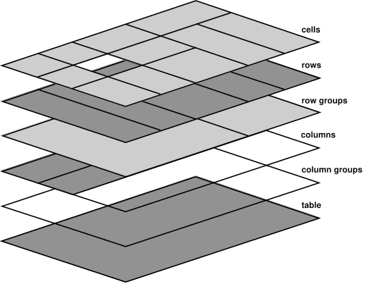

# 表格

HTML 表格用于显示包含行和列的表格数据。决定是否使用 `<table>` 应基于您要展示的内容以及用户对此内容的需求。如果要对数据进行呈现、比较、排序、计算或交叉引用，那么 `<table>` 可能是正确的选择。如果您只想巧妙地布局非表格内容（例如大量缩略图），表格并不适合您：相反，您可以[创建图片列表](/web/html/lists)，并[使用 CSS 设置网格](/web/css/grid)的样式。

在本部分中，我们将讨论构成表格的所有元素，以及展示表格数据时应考虑的一些无障碍功能和易用性功能。虽然“学习 HTML”并非 CSS 的根本，但有一整套课程专门用于[学习 CSS](/web/css)，但我们将介绍一些特定于表格的 CSS 属性。

## 表格元素（按顺序排列）

[`<table>`](https://developer.mozilla.org/docs/Web/HTML/Element/table) 标记用于封装表格内容，包括所有表格元素。`<table>` 的隐式 ARIA 角色为 `table`；辅助技术知道此元素是包含按行和列排列的数据的表结构。如果表格保持选择状态、提供二维导航或允许用户重新排列单元格顺序，请设置 [`role="grid"`](https://developer.mozilla.org/docs/Web/Accessibility/ARIA/Roles/grid_role)。如果 `grid` 中的行可以展开和收起，请改用 [`role="treegrid"`](https://developer.mozilla.org/docs/Web/Accessibility/ARIA/Roles/treegrid_role)。

在 `<table>` 中，您会看到表格标题 (`<thead>`)、表格正文 (`<tbody>`) 和可选的表格页脚 (`<tfoot>`)。 其中每个行都由表格行 (`<tr>`) 组成。行包含表格标题 (`<th>`) 和表格数据 (`<td>`) 单元格，而表格数据单元格则包含了所有数据。 在 DOM 中，在上述任何一项之前，您可能会看到另外两个功能：表格标题 (`<caption>`) 和列组 (`<colgroup>`)。根据 `<colgroup>` 是否具有 `span` 属性，它可能包含嵌套的表格列 (`<col>`) 元素。

该表的子项按顺序排列：

1. [`<caption>`](https://developer.mozilla.org/docs/Web/HTML/Element/caption) 元素
2. [`<colgroup>`](https://developer.mozilla.org/docs/Web/HTML/Element/colgroup) 元素
3. [`<thead>`](https://developer.mozilla.org/docs/Web/HTML/Element/thead) 元素
4. [`<tbody>`](https://developer.mozilla.org/docs/Web/HTML/Element/tbody) 元素
5. [`<tfoot>`](https://developer.mozilla.org/docs/Web/HTML/Element/tfoot) 元素

我们将介绍 `<table>` 元素的子项（均为可选但建议添加），然后再了解一下行、表格标题单元格和表格数据单元格。最后介绍 `<colgroup>`。

### 表格标题

作为原生语义元素，[`<caption>`](https://developer.mozilla.org/docs/Web/HTML/Element/table) 是为表命名的首选方法。`<caption>` 提供以程序化方式关联的描述性表格标题。默认情况下，它对所有用户可见并可供使用。

`<caption>` 元素应该是嵌套在 `<table>` 元素中的第一个元素。包含该参数可让所有用户立即了解该表的用途，而无需阅读周围的文本。或者，您也可以对 `<table>` 使用 `aria-label` 或 `aria-labelledby`，提供一个无障碍名称作为图片说明。`<caption>` 元素没有特定于元素的属性。

图片说明显示在表格外。可以使用 CSS [`caption-side`](https://developer.mozilla.org/docs/Web/CSS/caption-side) 属性来设置字幕的位置，这与使用已废弃的 `align` 属性相比，是更好的做法。这可以将字幕设为顶部和底部。目前尚不完全支持使用 `inline-start` 和 `inline-end` 进行左侧和右侧定位。顶部是默认的浏览器呈现方式。

<iframe allow="camera; clipboard-read; clipboard-write; encrypted-media; geolocation; microphone; midi;" loading="lazy" src="https://codepen.io/web-dot-dev/embed/yLEZRyW?height=300&amp;theme-id=dark&amp;default-tab=html%2Cresult&amp;editable=true" data-darkreader-inline-border-top="" data-darkreader-inline-border-right="" data-darkreader-inline-border-bottom="" data-darkreader-inline-border-left="" data-title="由 web-dot-dev 撰写的 Codepen yLEZRyW" style="color-scheme: initial; box-sizing: inherit; border: 0px; height: 300px; width: 100%; --darkreader-inline-border-top: 0px; --darkreader-inline-border-right: 0px; --darkreader-inline-border-bottom: 0px; --darkreader-inline-border-left: 0px;"></iframe>

最好是数据表格应有清晰的标题和说明，并且内容要简洁明了，几乎不言而喻。请注意，并非所有用户的认知能力都相同。当表格“表明观点”或需要其他解读时，请提供关于表格要点或功能的简要总结。摘要的放置位置取决于其长度和复杂程度。如果简短，可用作字幕的内部文字。如果更长，请在说明中汇总，并在表格前面的段落中提供摘要，将两者与 [`aria-describedby`](https://developer.mozilla.org/docs/Web/Accessibility/ARIA/Attributes/aria-describedby) 属性相关联。另一种方法是将表放入 `<figure>` 中，并将摘要放入 `<figcaption>` 中。

### 数据划分

表格的内容最多由三个部分组成：零个或多个表格标题 (`<thead>`)、表格正文 (`<tbody>`) 和表格页脚 (`<tfoot>`)。所有部分都是可选的，每个部分可以有零个或多个部分。

这些元素不会帮助或妨碍表格的无障碍功能，但在易用性方面非常有用。它们提供样式钩子。例如，[标题内容可以设置为粘性](https://adrianroselli.com/2020/01/fixed-table-headers.html)，而 `<tbody>` 内容可以设置为滚动。未嵌套在这三个包含元素中的任何一个的行会隐式封装在 `<tbody>` 中。这三者具有相同的隐式角色 [`rowgroup`](https://developer.mozilla.org/docs/Web/Accessibility/ARIA/Roles/Rowgroup_Role)。这三个元素都没有任何特定于元素的属性。

到目前为止：

```html
<table>
  <caption>MLW Students</caption>
  <thead></thead>
  <tbody></tbody>
  <tfoot></tfoot>
</table>
```

出于无障碍方面的原因，`<tfoot>` 元素最初被指定为紧跟在 `<thead>` 之后、`<tbody>` 之前，因此，您可能会在旧版代码库中遇到这种不直观的源代码顺序。

### 表格内容

表格可以划分为表格的页眉、正文和页脚，但如果表格不包含表格的行、单元格和内容，这些表格将不会执行任何操作。表格中的每一行都包含一个或多个单元格。`<tr>`如果单元格是标题单元格，请使用 `<th>`。 否则，请使用 `<td>`。

用户代理样式表通常会以粗体显示 `<th>` 表格标题单元格中的内容。这些默认样式（以及所有样式）最好使用 CSS 进行控制，而不是使用过去可用于单个单元格、行甚至 `<table>` 的已弃用属性。

一些属性可用于在单元格之间和单元格内添加内边距、添加边框和进行文本对齐。单元格内边距和单元格间距用于定义单元格内容与其边框之间的间距以及相邻单元格的边框之间的间距，应分别使用 CSS 的 [border-collapse](https://developer.mozilla.org/docs/Web/CSS/border-collapse) 和 [border-spacing](https://developer.mozilla.org/docs/Web/CSS/border-spacing) 属性进行设置。如果设置了 `border-collapse: collapse`，则 `Border-spacing` 将不会产生任何影响。如果设置了 `border-collapse: separate;`，则可以使用 `empty-cells: hide;` 完全隐藏空单元格。如需详细了解如何设置表格的样式，请参阅[与表格相关的 CSS 样式](https://estelle.github.io/CSS/tables/#slide1)的互动式幻灯片组。

在示例中，我们在表格和带有 CSS 的每个单元格上添加了边框，使某些功能更加明显：

<iframe allow="camera; clipboard-read; clipboard-write; encrypted-media; geolocation; microphone; midi;" loading="lazy" src="https://codepen.io/web-dot-dev/embed/oNymmWw?height=300&amp;theme-id=dark&amp;default-tab=html%2Cresult&amp;editable=true" data-darkreader-inline-border-top="" data-darkreader-inline-border-right="" data-darkreader-inline-border-bottom="" data-darkreader-inline-border-left="" data-title="Codepen 上 web-dot-dev 的 Pen oNymmWw" style="color-scheme: initial; box-sizing: inherit; border: 0px; height: 300px; width: 100%; --darkreader-inline-border-top: 0px; --darkreader-inline-border-right: 0px; --darkreader-inline-border-bottom: 0px; --darkreader-inline-border-left: 0px;"></iframe>

在这个示例中，我们有一个图片说明、一个表格标题和一个表格正文。标题中有一行包含三个标题 `<th>` 单元格，因此共有三列。正文包含三行数据：第一个单元格是相应行的标题单元格，因此我们使用 `<th>` 而不是 `<td>`。

`<th>` 单元格具有语义含义，具有隐式 ARIA 角色[列标题](https://w3c.github.io/aria/#columnheader)或[行标头](https://w3c.github.io/aria/#rowheader)。它将单元格定义为表格单元格的列或行的标题，具体取决于枚举 `scope` 属性的值。如果未明确设置 `scope`，浏览器将默认为 `col` 或 `row`。由于我们使用了语义标记，因此 `1956` 单元格有两个标题：Year 和 Lou Minious。这种关联表明“1956”是“Lou Minious”毕业的“年份”。在此示例中，我们可以看到整个表格，这种关联非常明显。 使用 `<th>` 可提供这种关联，即使标题列或行滚动到视图以外也无妨。我们可以明确设置 `<th scope="col">Year</th>` 和 `<th scope="row">Lou Minious</th>`，但对于像这样的简单表格，枚举的默认值就可以正常使用。`scope` 的其他值包括 `rowgroup` 和 `colgroup`，它们对于复杂的表很有用。

## 合并单元格

与 MS Excel、Google 表格和 Numbers 表格类似，您也可以将多个单元格合并成一个单元格。这是通过 HTML 实现的！ `colspan` 属性用于合并单行中的两个或多个相邻单元格。`rowspan` 属性用于跨行合并单元格，它们放置在顶行的单元格上。

<iframe allow="camera; clipboard-read; clipboard-write; encrypted-media; geolocation; microphone; midi;" loading="lazy" src="https://codepen.io/web-dot-dev/embed/GRGzzEd?height=300&amp;theme-id=dark&amp;default-tab=html%2Cresult&amp;editable=true" data-darkreader-inline-border-top="" data-darkreader-inline-border-right="" data-darkreader-inline-border-bottom="" data-darkreader-inline-border-left="" data-title="Codepen 上的 web-dot-dev 的 Pen GRGzzEd" style="color-scheme: initial; box-sizing: inherit; border: 0px; height: 350px; width: 100%; --darkreader-inline-border-top: 0px; --darkreader-inline-border-right: 0px; --darkreader-inline-border-bottom: 0px; --darkreader-inline-border-left: 0px;"></iframe>

在此示例中，表格标题包含两行。第一个标题行包含三个单元格，跨越四列：中间单元格具有 `colspan="2"`。此操作会合并两个相邻的单元格。第一个和最后一个单元格包含 `rowspan="2"`。此操作会将单元格与相邻行中的单元格合并，该单元格紧邻其下方。

表格标题中的第二行包含两个单元格；它们分别是第二行中第二列和第三列的单元格。 第一列或最后一列的单元格未声明为第一行和最后一列中的单元格跨越两行。

如果单元格由多个标题单元格定义，而关联不能仅由 `scope` 属性设置，请添加 `headers` 属性，并附加以空格分隔的关联标头列表。由于此示例是一个更复杂的表格，因此我们使用 `scope` 属性明确定义标头的范围。为进一步说明，我们为每个单元格添加了 `headers` 属性。

在这样一个简单的用例中，`headers` 属性可能不是必需的，但随着表变得越来越复杂，在工具条中添加这些属性就变得非常重要。对于具有复杂结构的表格（例如合并标题或单元格的表格，或具有两级以上列或行标题的表格），您需要明确标识关联的标题单元格。在此类复杂的表格中，请使用所有关联标头的以空格分隔的 `id` 值列表作为 `headers` 属性的值，将每个数据单元格与每个相应的标题单元格明确关联。

`headers` 属性在 `<td>` 元素中常见，但在 `<th>` 中同样有效。

也就是说，所有用户（而不仅仅是屏幕阅读器用户）都可能难以理解复杂的表格结构。从认知和屏幕阅读器支持方面来看，较为简单的表格（只有少量甚至没有跨屏单元格）更易于理解。它们也更易于管理！

## 设置表格的样式

简要提及了两个相对模糊的元素：列组 [`<colgroup>`](https://developer.mozilla.org/docs/Web/HTML/Element/colgroup) 元素及其唯一的后代元素，即空 [`<col>`](https://developer.mozilla.org/docs/Web/HTML/Element/col) 列元素。`<colgroup>` 元素用于定义表中的列组或 `<col>` 元素。

如果使用了列分组，则应将列分组嵌套在 `<table>` 中，紧跟在 `<caption>` 之后、任何表数据之前。 如果它们跨越多列，请使用 `span` 属性。

表的内容大纲顺序通常如下所示，其中 `<table>` 和 `<caption>` 是应包含的两个元素：

```html
<table>
  <caption>Table Caption</caption>
  <colgroup>
    <col/>
  </colgroup>
  <thead>...
```

`<colgroup>` 和 `<col>` 在帮助使表格更便于访问方面都没有语义含义，但它们允许有限的列样式设置，包括使用 CSS 设置列的宽度。

只要没有替换相应样式的 `<td>` 或 `<th>` 样式，`<col>` 样式就会设置列的样式。例如，当使用 `<colspan>` 来合并表中部分行（而非全部）的单元格时，您无法确定用于选择每行的第 8 个子行的选择器（例如 `tr > *:nth-child(8)`）会全盘突出显示第 8 列，还是会突出显示第 8 列的若干行，但根据合并的单元格数量，只有第 9 和第 10 列的单元格之间相差无几。

遗憾的是，系统仅支持少数属性，样式不会继承到单元格中，并且在定位单元格中使用 `<col>` 元素的唯一方式是使用包含 [`:has()` 关系选择器](https://developer.mozilla.org/docs/Web/CSS/:has)的复杂选择器。



如果 `<table>` 和 `<colgroup>` 均有背景颜色，则 `<colgroup>` 的 `background-color` 位于顶部。绘制顺序为：表、列组、列、行组、行，单元格最后和在顶部，如[表层的架构](https://w3c.github.io/csswg-drafts/css2/#table-layers)所示。`<td>` 和 `<th>` 元素不是 `<colgroup>` 或 `<col>` 元素的后代，且不会继承其样式。

要让表格变得条纹，CSS 结构选择器会派上用场。例如，`tbody tr:nth-of-type(odd) {background-color: rgba(0 0 0 / 0.1);}` 会向表格正文中的每个奇数行添加半透明的黑色，从而使在 `<colgroup>` 上设置的任何背景效果得以显示。

默认情况下，表没有响应。而是默认根据其内容调整大小。您需要采取额外的措施，才能让表格布局样式在各种设备上有效运行。如果您要[更改表元素的 CSS 显示属性](https://adrianroselli.com/2018/02/tables-css-display-properties-and-aria.html)，请添加 ARIA `role` 属性。虽然听起来可能没有必要，但 CSS `display` 属性会影响某些浏览器中的无障碍功能树。

## 呈现数据

表格元素具有语义含义，辅助技术利用这些元素在行和列中导航而不会“丢失”。不应将 `<table>` 元素用于展示。如果您需要使用标题来覆盖列表，请使用[标题](/web/html/headings-and-sections#headings_h1-h6)和[列表](/web/html/lists)。如果您想以多列的形式布置内容，请使用[多列布局](https://developer.mozilla.org/docs/Web/CSS/CSS_Columns)。 如果您想在网格中布置内容，请使用 [CSS 网格](/web/css/grid)。仅使用表来存储数据。您不妨这样理解：如果您的数据需要使用电子表格才能在会议中展示，请使用 `<table>`。 如果您想使用演示文稿软件（如 Keynote 或 PowerPoint）中提供的功能，则可能需要[说明列表](/web/html/lists)。

虽然对表格中的列进行排序是 JavaScript 的范畴，但标记标头以让用户知道该列可排序是 HTML 的范畴。 告知用户表格列可按升序、降序或未排序的图标进行排序。当前排序的列应包含带有排序方向枚举值的 [aria-sort](https://developer.mozilla.org/docs/Web/Accessibility/ARIA/Attributes/aria-sort) 属性。`<caption>` 可以通过 [aria-live](https://developer.mozilla.org/docs/Web/Accessibility/ARIA/Attributes/aria-live) 礼貌地通告对排序顺序进行的更新，以及动态更新的 span（该 span 对屏幕阅读器用户可见）。由于可以通过点击标题内容对列进行排序，因此标题内容应为 `<button>`。

<iframe allow="camera; clipboard-read; clipboard-write; encrypted-media; geolocation; microphone; midi;" loading="lazy" src="https://codepen.io/web-dot-dev/embed/XWYOOed?height=300&amp;theme-id=dark&amp;default-tab=html%2Cresult&amp;editable=true" data-darkreader-inline-border-top="" data-darkreader-inline-border-right="" data-darkreader-inline-border-bottom="" data-darkreader-inline-border-left="" data-title="由 web-dot-dev 在 Codepen 上对 Pen XWYOO 进行的操作" style="color-scheme: initial; box-sizing: inherit; border: 0px; height: 350px; width: 100%; --darkreader-inline-border-top: 0px; --darkreader-inline-border-right: 0px; --darkreader-inline-border-bottom: 0px; --darkreader-inline-border-left: 0px;"></iframe>

如果您没有以表格形式呈现数据，请勿使用 `<table>`，如果您使用表格进行演示，请设置 `role="none"`。


