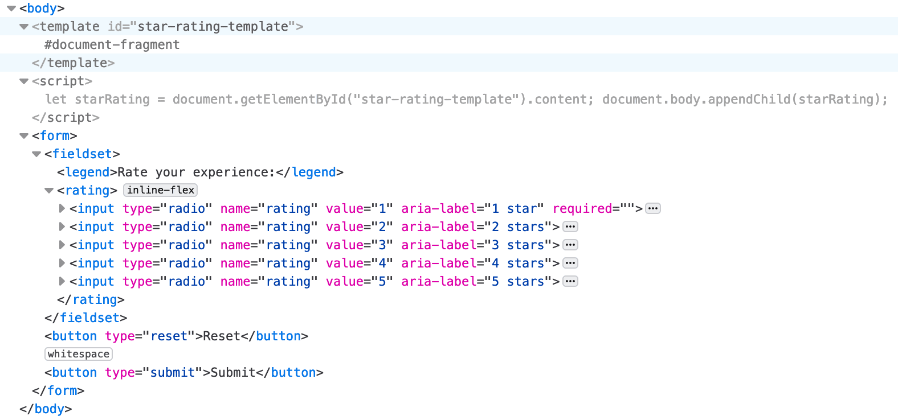
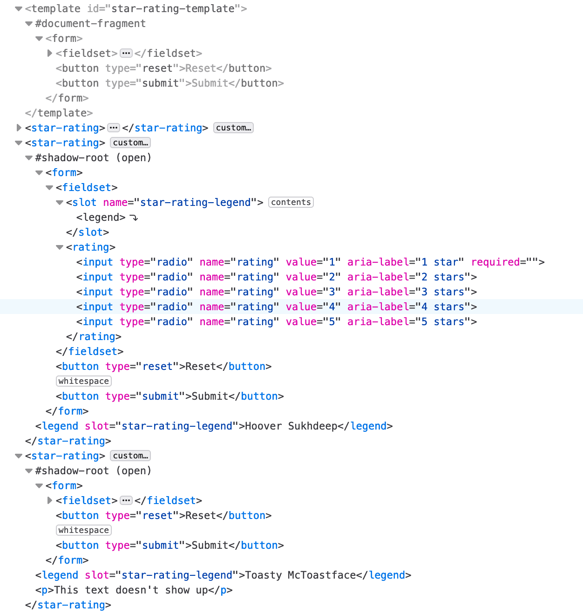

# 模板、槽和阴影

网络组件的优势在于其可重用性：您只需创建一次界面 widget，即可多次重复使用。虽然您需要使用 JavaScript 来创建网络组件，但不需要 JavaScript 库。HTML 和相关 API 可以提供您所需的一切。

Web 组件标准由三部分组成：[HTML 模板](https://developer.mozilla.org/docs/Web/Web_Components/Using_templates_and_slots)、[自定义元素](https://developer.mozilla.org/docs/Web/Web_Components/Using_custom_elements)和 [Shadow DOM](https://developer.mozilla.org/docs/Web/Web_Components/Using_shadow_DOM)。结合使用这些元素，开发者能够构建可无缝集成到现有应用中的自定义、独立（封装）可重用元素，就像我们已经介绍的所有其他 HTML 元素一样。

在本部分中，我们将创建 `<star-rating>` 元素，这是一个 Web 组件，可让用户对体验进行 1 到 5 星的评分。为自定义元素命名时，建议全部使用小写字母。此外，请添加短划线，因为这有助于区分常规元素和自定义元素。

我们将讨论如何使用 `<template>` 和 `<slot>` 元素、`slot` 属性以及 JavaScript 创建一个具有封装的 Shadow DOM 模板。然后，我们将重复使用已定义的元素，自定义一段文本，就像您对任何元素或网络组件进行自定义一样。我们还会简要讨论如何在自定义元素内外使用 CSS。

## `<template>` **元素**

`<template>` 元素用于声明要通过 JavaScript 克隆并插入到 DOM 中的 HTML 片段。默认情况下，元素的内容不会呈现。而是使用 JavaScript 对其进行实例化。

```html
<template id="star-rating-template">
  <form>
    <fieldset>
      <legend>Rate your experience:</legend>
      <rating>
        <input type="radio" name="rating" value="1" aria-label="1 star" required />
        <input type="radio" name="rating" value="2" aria-label="2 stars" />
        <input type="radio" name="rating" value="3" aria-label="3 stars" />
        <input type="radio" name="rating" value="4" aria-label="4 stars" />
        <input type="radio" name="rating" value="5" aria-label="5 stars" />
      </rating>
    </fieldset>
    <button type="reset">Reset</button>
    <button type="submit">Submit</button>
  </form>
</template>
```

由于 `<template>` 元素的内容不会写入屏幕，因此 `<form>` 及其内容不会呈现。是的，此 Codepen 是空白的，但如果您检查 HTML 标签页，就会看到 `<template>` 标记。

<iframe allow="camera; clipboard-read; clipboard-write; encrypted-media; geolocation; microphone; midi;" loading="lazy" src="https://codepen.io/web-dot-dev/embed/vYzBNKR?height=500&amp;theme-id=light&amp;default-tab=result&amp;editable=true" data-darkreader-inline-border-top="" data-darkreader-inline-border-right="" data-darkreader-inline-border-bottom="" data-darkreader-inline-border-left="" data-title="由 web-dot-dev 在 Codepen 上发布的 Pen vYzBNKR" style="color-scheme: initial; box-sizing: inherit; border: 0px; height: 300px; width: 100%; --darkreader-inline-border-top: 0px; --darkreader-inline-border-right: 0px; --darkreader-inline-border-bottom: 0px; --darkreader-inline-border-left: 0px;"></iframe>

在本例中，`<form>` 不是 DOM 中 `<template>` 的子级。相反，`<template>` 元素的内容是 [`HTMLTemplateElement.content`](https://developer.mozilla.org/docs/Web/API/HTMLTemplateElement/content) 属性返回的 [`DocumentFragment`](https://developer.mozilla.org/docs/Web/API/DocumentFragment) 的子元素。若要使其可见，必须使用 JavaScript 获取内容并将这些内容附加到 DOM。

<iframe allow="camera; clipboard-read; clipboard-write; encrypted-media; geolocation; microphone; midi;" loading="lazy" src="https://codepen.io/web-dot-dev/embed/WNgeQGq?height=500&amp;theme-id=light&amp;default-tab=result&amp;editable=true" data-darkreader-inline-border-top="" data-darkreader-inline-border-right="" data-darkreader-inline-border-bottom="" data-darkreader-inline-border-left="" data-title="由 web-dot-dev 在 Codepen 上开发的 Pen WNgeQGq" style="color-scheme: initial; box-sizing: inherit; border: 0px; height: 300px; width: 100%; --darkreader-inline-border-top: 0px; --darkreader-inline-border-right: 0px; --darkreader-inline-border-bottom: 0px; --darkreader-inline-border-left: 0px;"></iframe>

这段简短的 JavaScript 没有创建自定义元素。不过，此示例将 `<template>` 的内容附加到了 `<body>` 中。该内容已成为可见且可设置样式的 DOM 的一部分。



要求 JavaScript 仅实现一个星级的模板不是很有用，但为重复使用的可自定义星级 widget 创建网络组件会很有用。

## `<slot>` **元素**

我们提供了一个槽，其中包含自定义的“每次出现”图例。HTML 会在 `<template>` 内提供一个 [`<slot>`](https://developer.mozilla.org/docs/Web/HTML/Element/slot) 元素作为占位符，如果提供名称，则会创建一个“命名槽”。命名槽可用于自定义 Web 组件中的内容。通过 `<slot>` 元素，我们可以控制应将自定义元素的子项插入其影子树的什么位置。

在模板中，我们将 `<legend>` 更改为 `<slot>`：

```html
<template id="star-rating-template">
  <form>
    <fieldset>
      <slot name="star-rating-legend">
        <legend>Rate your experience:</legend>
      </slot>
```

如果元素具有 [slot](https://developer.mozilla.org/docs/Web/HTML/Global_attributes/slot) 属性且其值与命名槽的名称匹配，则 `name` 属性用于将槽分配给其他元素。如果自定义元素没有与广告位匹配，则会呈现 `<slot>` 的内容。因此，我们添加了包含通用内容的 `<legend>`，如果任何人在其 HTML 中只包含 `<star-rating></star-rating>` 而不包含任何内容，即可呈现该内容。

```html
<star-rating>
  <legend slot="star-rating-legend">Blendan Smooth</legend>
</star-rating>
<star-rating>
  <legend slot="star-rating-legend">Hoover Sukhdeep</legend>
</star-rating>
<star-rating>
  <legend slot="star-rating-legend">Toasty McToastface</legend>
  <p>Is this text visible?</p>
</star-rating>
```

[slot](https://developer.mozilla.orgdocs/Web/HTML/Global_attributes/slot) 属性是一个全局属性，用于替换 `<template>` 中 `<slot>` 的内容。在我们的自定义元素中，具有插槽属性的元素是 `<legend>`。不一定非要如此。在我们的模板中，`<slot name="star-rating-legend">` 将替换为 `<anyElement slot="star-rating-legend">`，其中 `<anyElement>` 可以是任何元素，甚至可以是其他自定义元素。

## 未定义的元素

在 `<template>` 中，我们使用了 `<rating>` 元素。这不是自定义元素。而是未知元素。浏览器如果无法识别某个元素，则不会失败。无法识别的 HTML 元素会被浏览器视为可以使用 CSS 设置样式的匿名内嵌元素。与 `<span>` 类似，`<rating>` 和 `<star-rating>` 元素没有用户代理应用的样式或语义。

<iframe allow="camera; clipboard-read; clipboard-write; encrypted-media; geolocation; microphone; midi;" loading="lazy" src="https://codepen.io/web-dot-dev/embed/jOvNbwO?height=500&amp;theme-id=light&amp;default-tab=result&amp;editable=true" data-darkreader-inline-border-top="" data-darkreader-inline-border-right="" data-darkreader-inline-border-bottom="" data-darkreader-inline-border-left="" data-title="由 web-dot-dev 在 Codepen 上发布的 Pen jOvNbwO" style="color-scheme: initial; box-sizing: inherit; border: 0px; height: 400px; width: 100%; --darkreader-inline-border-top: 0px; --darkreader-inline-border-right: 0px; --darkreader-inline-border-bottom: 0px; --darkreader-inline-border-left: 0px;"></iframe>

请注意，系统不会呈现 `<template>` 和内容。`<template>` 是一个已知元素，包含不应渲染的内容。`<star-rating>` 元素尚未定义。在我们定义某个元素之前，浏览器会像所有无法识别的元素一样显示该元素。目前，无法识别的 `<star-rating>` 被视为匿名内嵌元素，因此第三个 `<star-rating>` 中的内容（包括图例和 `<p>`）会像在 `<span>` 中一样显示。

让我们定义 元素，将这个无法识别的元素转换为自定义元素。

### 自定义元素

需要使用 JavaScript 才能定义自定义元素。定义后，`<star-rating>` 元素的内容将被替换为影子根，影子根包含我们与其关联的模板的所有内容。系统会将模板中的 `<slot>` 元素替换为 `<star-rating>`（其 `slot` 属性值与 `<slot>` 的名称值（如果有）匹配）中相应元素的内容。否则，系统会显示模板广告位的内容。

未与槽位关联的自定义元素（第三个 `<star-rating>` 中的 `<p>Is this text visible?</p>`）中的内容不会包含在影子根中，因此不会显示。

我们通过扩展 `HTMLElement` 来[定义名为 `star-rating` 的自定义元素](https://developer.mozilla.org/docs/Web/Web_Components/Using_custom_elements)：

```javascript
customElements.define('star-rating',
  class extends HTMLElement {
    constructor() {
      super(); // Always call super first in constructor
      const starRating = document.getElementById('star-rating-template').content;
      const shadowRoot = this.attachShadow({
        mode: 'open'
      });
      shadowRoot.appendChild(starRating.cloneNode(true));
    }
  });
```

<iframe allow="camera; clipboard-read; clipboard-write; encrypted-media; geolocation; microphone; midi;" loading="lazy" src="https://codepen.io/web-dot-dev/embed/poOzjpj?height=500&amp;theme-id=light&amp;default-tab=result&amp;editable=true" data-darkreader-inline-border-top="" data-darkreader-inline-border-right="" data-darkreader-inline-border-bottom="" data-darkreader-inline-border-left="" data-title="来自 Codepen 上的 web-dot-dev 的 Pen poOzjpj" style="color-scheme: initial; box-sizing: inherit; border: 0px; height: 500px; width: 100%; --darkreader-inline-border-top: 0px; --darkreader-inline-border-right: 0px; --darkreader-inline-border-bottom: 0px; --darkreader-inline-border-left: 0px;"></iframe>

定义元素后，每当浏览器遇到 `<star-rating>` 元素时，都会按照带有 `#star-rating-template`（我们的模板）的元素定义进行渲染。浏览器会将一个 shadow DOM 树附加到该节点，并将模板内容的克隆[](https://developer.mozilla.org/docs/Web/API/Node/cloneNode)附加到该 shadow DOM。请注意，可用于 [`attachShadow()` 的元素有限](https://developer.mozilla.org/docs/Web/API/Element/attachShadow#elements_you_can_attach_a_shadow_to)。

```javascript
const shadowRoot = this.attachShadow({mode: 'open'});
shadowRoot.appendChild(starRating.cloneNode(true));
```

如果查看开发者工具，您会注意到 `<template>` 中的 `<form>` 是每个自定义元素的影子根的一部分。`<template>` 内容的克隆在开发者工具中的每个自定义元素中显而易见，并且在浏览器中可见，但自定义元素本身的内容不会呈现到屏幕上。



在 `<template>` 示例中，我们将模板内容附加到了文档正文，并将内容添加到了常规 DOM 中。在 [`customElements` 定义](https://developer.mozilla.org/docs/Web/API/CustomElementRegistry/define)中，我们使用了相同的 [`appendChild()`](https://developer.mozilla.org/docs/Web/API/Node/appendChild)，但克隆的模板内容附加到了封装的 shadow DOM 中。

您有没有注意到，星标是如何变回未设置样式的单选按钮？作为 shadow DOM 而非标准 DOM 的一部分，Codepen 的 CSS 标签页中的样式并不适用。该标签页的 CSS 样式的作用域限定为文档，而非 shadow DOM，因此系统不会应用这些样式。我们必须创建封装样式，以便设置封装 Shadow DOM 内容的样式。

## 阴影 DOM

Shadow DOM 将 CSS 样式的作用域限定为每个影子树，将其与文档的其余部分隔离开来。这意味着外部 CSS 不适用于您的组件，并且组件样式对文档的其余部分没有影响，除非我们特意将它们设置为。

由于我们已将内容附加到 shadow DOM，因此可以包含一个 [`<style>`](/web/html/document-structure#css) 元素，以便为自定义元素提供封装 CSS。

<iframe allow="camera; clipboard-read; clipboard-write; encrypted-media; geolocation; microphone; midi;" loading="lazy" src="https://codepen.io/web-dot-dev/embed/dyqbYme?height=500&amp;theme-id=light&amp;default-tab=result&amp;editable=true" data-darkreader-inline-border-top="" data-darkreader-inline-border-right="" data-darkreader-inline-border-bottom="" data-darkreader-inline-border-left="" data-title="Codepen 上的 web-dot-dev 提供的 Pen dyqbYme" style="color-scheme: initial; box-sizing: inherit; border: 0px; height: 500px; width: 100%; --darkreader-inline-border-top: 0px; --darkreader-inline-border-right: 0px; --darkreader-inline-border-bottom: 0px; --darkreader-inline-border-left: 0px;"></iframe>

将作用域限定为自定义元素后，我们无需担心样式会扩展到文档的其余部分。我们可以大幅降低选择器的特异性。例如，由于自定义元素中使用的唯一输入是单选按钮，因此我们可以使用 `input` 而不是 `input[type="radio"]` 作为选择器。

```html
 <template id="star-rating-template">
  <style>
    rating {
      display: inline-flex;
    }
    input {
      appearance: none;
      margin: 0;
      box-shadow: none;
    }
    input::after {
      content: '\2605'; /* solid star */
      font-size: 32px;
    }
    rating:hover input:invalid::after,
    rating:focus-within input:invalid::after {
      color: #888;
    }
    input:invalid::after,
      rating:hover input:hover ~ input:invalid::after,
      input:focus ~ input:invalid::after  {
      color: #ddd;
    }
    input:valid {
      color: orange;
    }
    input:checked ~ input:not(:checked)::after {
      color: #ccc;
      content: '\2606'; /* hollow star */
    }
  </style>
  <form>
    <fieldset>
      <slot name="star-rating-legend">
        <legend>Rate your experience:</legend>
      </slot>
      <rating>
        <input type="radio" name="rating" value="1" aria-label="1 star" required/>
        <input type="radio" name="rating" value="2" aria-label="2 stars"/>
        <input type="radio" name="rating" value="3" aria-label="3 stars"/>
        <input type="radio" name="rating" value="4" aria-label="4 stars"/>
        <input type="radio" name="rating" value="5" aria-label="5 stars"/>
      </rating>
    </fieldset>
    <button type="reset">Reset</button>
    <button type="submit">Submit</button>
  </form>
</template>
```

虽然 Web 组件使用 `<template>` 内标记进行封装，CSS 样式的作用域限定为 shadow DOM 且对组件外部的所有内容隐藏起来，但被渲染的槽内容（即 `<star-rating>` 的 `<anyElement slot="star-rating-legend">` 部分）并未封装。

## 样式设置在当前范围之外

您可以在 shadow DOM 内设置文档样式，并通过全局样式设置 shadow DOM 的内容样式，但并非简单。您可以遍历影子边界（即 shadow DOM 结束和常规 DOM 开始的位置），但只有您有意这样做。

影子树是 shadow DOM 内部的 DOM 树。影子根是影子树的根节点。

[`:host`](https://developer.mozilla.org/docs/Web/CSS/:host) 伪类会选择 `<star-rating>`，即阴影宿主元素。影子主机是附加了 shadow DOM 的 DOM 节点。如需仅定位到主机的特定版本，请使用 [`:host()`](https://developer.mozilla.org/docs/Web/CSS/:host_function)。 这将仅选择与传递的参数匹配的影子宿主元素，例如类或属性选择器。若要选择所有自定义元素，您可以使用全局 CSS 中的 `star-rating { /* styles */ }`，或在模板样式中使用 `:host(:not(#nonExistantId))`。在[特异性](https://developer.mozilla.org/docs/Web/CSS/Specificity)方面，全球 CSS 胜出。

[`::slotted()`](https://developer.mozilla.org/docs/Web/CSS/::slotted) 伪元素从 shadow DOM 内部越过了 shadow DOM 边界。如果与选择器匹配，则会选择带槽的元素。在我们的示例中，`::slotted(legend)` 与我们的三个图例匹配。

如果要在全局范围内从 CSS 定位 shadow DOM，则需要修改模板。您可以在要为其设置样式的任何元素中添加 [`part`](https://developer.mozilla.org/docs/Web/HTML/Global_attributes#part) 属性。然后，使用 [`::part()`](https://developer.mozilla.org/docs/Web/CSS/::part) 伪元素来匹配影子树中与传递的参数匹配的元素。伪元素的锚点或原始元素是宿主（即自定义元素名称，在本例中为 `star-rating`）。形参是 `part` 属性的值。

如果模板标记的开头如下所示：

```html
<template id="star-rating-template">
  <form part="formPart">
    <fieldset part="fieldsetPart">
```

我们可以用以下代码定位 `<form>` 和 `<fieldset>`：

```css
star-rating::part(formPart) { /* styles */ }
star-rating::part(fieldsetPart) { /* styles */ }
```

<iframe allow="camera; clipboard-read; clipboard-write; encrypted-media; geolocation; microphone; midi;" loading="lazy" src="https://codepen.io/web-dot-dev/embed/abaovjL?height=500&amp;theme-id=light&amp;default-tab=result&amp;editable=true" data-darkreader-inline-border-top="" data-darkreader-inline-border-right="" data-darkreader-inline-border-bottom="" data-darkreader-inline-border-left="" data-title="由 web-dot-dev 在 Codepen 上开发的 Pen abaovjL" style="color-scheme: initial; box-sizing: inherit; border: 0px; height: 500px; width: 100%; --darkreader-inline-border-top: 0px; --darkreader-inline-border-right: 0px; --darkreader-inline-border-bottom: 0px; --darkreader-inline-border-left: 0px;"></iframe>

部件名称的作用与类相似：一个元素可以有多个以空格分隔的部件名称，多个元素可以具有相同的部件名称。


