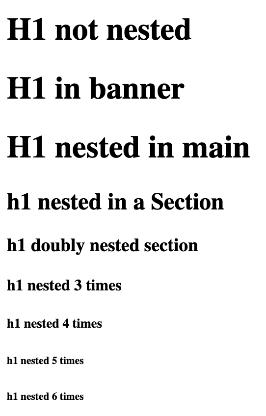

# 文字基础知识

与文本编辑器如何提供 `<h1>` 到 `<h6>` 标题类似，以及大量以有意义且直观的方式设置文本部分格式的方法，HTML 提供了一组非常相似的语义和非语义元素来表现散文的意义。

本部分介绍了标记文本的主要方法或文本基础知识。然后，我们会讨论属性，然后再探索标记文本的其他方法（例如列表、表格和表单）。

## 重新查看的标题

有六个部分标题元素：`<h1>`、`<h2>`、`<h3>`、`<h4>`、`<h5>` 和 `<h6>`，其中 `<h1>` 最重要，`<h6>` 最不重要。多年来，开发者都被要求浏览器使用标题来概述文档。这最初是目标，但浏览器尚未实现功能概述。不过，屏幕阅读器用户确实会使用标题作为探索策略来了解页面的内容，方法是使用 `h` 键浏览标题。因此，请务必按照文档大纲的方式实现标题级别，这样您的内容便于访问，而且我们依然强烈建议您这样做。

默认情况下，浏览器将 `<h1>` 设为最大的样式，将 `<h2>` 设为略小的样式，且默认情况下，每个后续标题级别都会变小。有趣的是，默认情况下，浏览器还会根据嵌套 `<article>`、`<aside>`、`<nav>` 或 `<section>` 元素的数量来减小 `<h1>` 字体大小。



某些用户代理样式表包含以下选择器或类似选择器，用于为嵌套的 `<h1>` 元素设置样式，就像它们属于某个不太重要的级别一样：

```css
h2,:is(article, aside, nav, section) h1 {}
h3,:is(article, aside, nav, section):is(article, aside, nav, section) h1 {}
```

不过，无障碍对象模型 (AOM) 仍会正确报告元素的级别；在本例中为“标题，级别 1”。 请注意，浏览器不会针对其他标题级别执行此操作。也就是说，不要使用基于标题级别的浏览器样式。即使浏览器不支持 Outline，也要假装自己支持 Outline；请像这样标记内容标题。这样，搜索引擎、屏幕阅读器和未来的维护者（可能就是您）都能理解您的内容。

在标题之外，大多数结构化文本由一系列段落组成。在 HTML 中，段落使用 `<p>` 标记进行标记；结束标记是可选的，但始终建议使用。

#about 部分有一个标题和几个段落：

<iframe allow="camera; clipboard-read; clipboard-write; encrypted-media; geolocation; microphone; midi;" loading="lazy" src="https://codepen.io/web-dot-dev/embed/jOKdjQm?height=300&amp;theme-id=light&amp;default-tab=html%2Cresult&amp;editable=true" data-darkreader-inline-border-top="" data-darkreader-inline-border-right="" data-darkreader-inline-border-bottom="" data-darkreader-inline-border-left="" data-title="通过 web-dot-dev 在 Codepen 上构建 jOKdjQm"></iframe>

此路段不是地标，因为没有可供访问的名称。如需将此转变为 `region`（一个地标角色），您可以使用 `aria-labelledby` 提供无障碍名称：

```html
<section id="about"  aria-labelledby="about_heading">
<h2 id="about_heading">What you'll learn</h2>
```

仅在必要时创建地标。如果地标过多，可能会很快令屏幕阅读器用户感到迷惑。

## 引用和引用

标记文章或博文时，您可能需要包含引文或重要引述（无论是否显示可见的引用）。 这三个组件包含相应的元素：`<blockquote>`、`<q>` 和 `<cite>`（用于可见引用）或 `cite` 属性（用于提供更多搜索信息）。

`#feedback` 部分包含一个标题和三条评价；这些评价是大段引用，一些包含引用内容，后跟一个包含引用内容的引用段落。省略第 3 条评价以节省空间，标记如下：

<iframe allow="camera; clipboard-read; clipboard-write; encrypted-media; geolocation; microphone; midi;" loading="lazy" src="https://codepen.io/web-dot-dev/embed/eYKxwbV?height=300&amp;theme-id=light&amp;default-tab=html%2Cresult&amp;editable=true" data-darkreader-inline-border-top="" data-darkreader-inline-border-right="" data-darkreader-inline-border-bottom="" data-darkreader-inline-border-left="" data-title="由 web-dot-dev 在 Codepen 上发布的 Pen eYKxwbV"></iframe>

引用内容作者（或引用）的相关信息不是引用内容的一部分，因此不在 `<blockquote>` 中，而是放在引用内容之后。 虽然这些引用是术语的外语意义，但它们实际上并没有引用特定资源，因此封装在 `<p>` 段落元素中。

引用信息以三行形式显示，包括作者的姓名、之前担任的职位和职业抱负。`<br>` 换行符可在文本块中创建换行符。它可以用在实际地址、诗歌和签名块中。换行符不应用作单独段落的回车符。您应关闭前一个段落，然后打开新段落。使用段落创建段落不仅有助于无障碍，还可以设置样式。`<br>` 元素只是一个换行符；它受到很少的 CSS 属性的影响。

虽然我们在每个块引用后面的段落中提供了引用信息，但前面显示的引号都是这样编码的，因为它们并非来自外部来源。如果确实如此，可以（应该）注明来源。

如果评价是从评价网站、图书或其他作品中提取的，可以使用 `<cite>` 元素作为来源的名称。`<cite>` 的内容可以是图书的名称、网站或电视节目的名称，甚至可以是计算机节目的名称。无论以传递的方式提及来源，还是引用或引用来源，都可以使用 `<cite>` 封装。`<cite>` 的内容是作品，而不是作者。

如果来自 Blendan Smooth 的引言摘自她的离线杂志，您会写成这样的文字：

<iframe allow="camera; clipboard-read; clipboard-write; encrypted-media; geolocation; microphone; midi;" loading="lazy" src="https://codepen.io/web-dot-dev/embed/LYrqKMq?height=300&amp;theme-id=light&amp;default-tab=html%2Cresult&amp;editable=true" data-darkreader-inline-border-top="" data-darkreader-inline-border-right="" data-darkreader-inline-border-bottom="" data-darkreader-inline-border-left="" data-title="由 web-dot-dev 在 Codepen 上开发的 Pen LYrqKMq"></iframe>

引用元素 `<cite>` 没有隐式角色，应通过其内容获取其可访问名称；请勿包含 `aria-label`。

为了在您无法显示内容的情况下注明需注明出处，可以使用 `cite` 属性，它会将所引用信息的源文档或消息的网址作为其值。此属性在 `<q>` 和 `<blockquote>` 上均有效。虽然它是网址，但可由机器读取，但读者看不到：

<iframe allow="camera; clipboard-read; clipboard-write; encrypted-media; geolocation; microphone; midi;" loading="lazy" src="https://codepen.io/web-dot-dev/embed/NWzoZob?height=300&amp;theme-id=light&amp;default-tab=html%2Cresult&amp;editable=true" data-darkreader-inline-border-top="" data-darkreader-inline-border-right="" data-darkreader-inline-border-bottom="" data-darkreader-inline-border-left="" data-title="来自 Codepen 上的 web-dot-dev 的 Pen NWzoZob"></iframe>

虽然 `</p>` 结束标记是可选的（且始终推荐使用），但 `</blockquote>` 结束标记始终是必需的。

大多数浏览器会向 `<blockquote>` 内嵌方向添加内边距，并将 `<cite>` 内容设为斜体；这可以通过 CSS 控制。`<blockquote>` 不会添加引号，但可随 CSS 生成的内容添加引号。默认情况下，`<q>` 元素会添加引号，使用与语言对应的引号。

在 `#teachers` 部分，引用 HAL 的意思是：“I's 很抱歉，但我恐怕我不能这样做。”。其代码（英语和法语）是：

<iframe allow="camera; clipboard-read; clipboard-write; encrypted-media; geolocation; microphone; midi;" loading="lazy" src="https://codepen.io/web-dot-dev/embed/qBKgzgg?height=300&amp;theme-id=light&amp;default-tab=html%2Cresult&amp;editable=true" data-darkreader-inline-border-top="" data-darkreader-inline-border-right="" data-darkreader-inline-border-bottom="" data-darkreader-inline-border-left="" data-title="来自 Codepen 上的 web-dot-dev 的 Pen qBKgzgg"></iframe>

内嵌引号元素 `<q>` 会添加与相应语言对应的引号。用户代理默认样式包括生成的左引号和右引号内容：

```css
q::before {content: open-quote;}
q::after {content: close-quote;}
```

添加 `lang` 属性是为了告知浏览器，虽然网页的基本语言在 `<html lang="en-US">` 起始标记中定义为英语，但该段文本使用的是其他语言。这有助于语音控制功能（例如 Siri、Alexa 和 voiceOver）使用法语发音。它还告知浏览器要呈现哪种类型的引号。

与 `<blockquote>` 一样，`<q>` 元素支持 `cite` 属性。

<iframe allow="camera; clipboard-read; clipboard-write; encrypted-media; geolocation; microphone; midi;" loading="lazy" src="https://codepen.io/web-dot-dev/embed/jOKdjJw?height=300&amp;theme-id=light&amp;default-tab=html%2Cresult&amp;editable=true" data-darkreader-inline-border-top="" data-darkreader-inline-border-right="" data-darkreader-inline-border-bottom="" data-darkreader-inline-border-left="" data-title="由 web-dot-dev 在 Codepen 上撰写的 Pen jOKdjJw"></iframe>

### HTML 实体

您可能已经注意到转义序列或“entity”。由于 `<` 用在 HTML 中，因此您必须使用 `&lt;` 或不太好记的编码 `&#60;` 对其进行转义。HTML 中有四个预留实体：`<`、`>`、`&` 和 `"`。它们的字符引用分别为 `&lt;`、`&gt;`、`&amp;` 和 `&quot;`。

您还会经常使用下面几个其他实体：`&copy;` 表示版权 (©)，`&trade;` 表示商标 (TM)，`&nbsp;` 表示不间断空格。 如果您想在两个字符或字词之间添加一个空格，同时防止其中出现换行符，则非换行空格非常有用。 有超过 2,000 个[已命名字符引用](https://html.spec.whatwg.org/multipage/named-characters.html#named-character-references)。不过，如果需要，每个字符（包括表情符号）都有以 `&#` 开头的等效编码字符。

如果您看一下 ToastyMcToastface 的研讨会评论（未包含在上面的代码示例中），就会发现有一些不常见的文本字符：

```html
<blockquote>Learning with Hal and Eve exceeded all of my wildest fantasies. All they did was stick a USB in. They promised that it was a brand new USB, so we know there were no viruses on it. The Russians had nothing to do with it. This has no̶̼͖ţ̘h̝̰̩͈̗i̙̪n͏̩̙͍̱̫̜̟g̢̣ͅ ̗̰͓̲̞̀t͙̀o̟̖͖̹̕ ͓̼͎̝͖̭dó̪̠͕̜ ͍̱͎͚̯̟́w̮̲̹͕͈̟͞ìth̢ ̰̳̯̮͇</blockquote>
```

这段引用中最后一句话也可以写成：

```html
This has no&#x336;&#x33C;&#x356;&tcedil;&#x318;h&#x31D;&#x330;&#x329;&#x348;&#x317;i&#x319;&#x32A;n&#x34F;&#x329;&#x319;
&#x34D;&#x331;&#x32B;&#x31C;&#x31F;g&#x322;&#x323;&#x345; &#x317;&#x330;&#x353;&#x332;&#x31E;&#x300;t&#x359;&#x300;o&#x31F;
&#x316;&#x356;&#x339;&#x315; &#x353;&#x33C;&#x34E;&#x31D;&#x356;&#x32D;d&oacute;&#x32A;&#x320;&#x355;&#x31C; &#x34D;&#x331;
&#x34E;&#x35A;&#x32F;&#x31F;&#x301;w&#x32E;&#x332;&#x339;&#x355;&#x348;&#x31F;&#x35E;&igrave;th&#x322; &#x330;&#x333;
&#x32F;&#x32E;&#x347;
```

此代码混乱中有几个非转义字符和一些已命名的字符引用。由于字符集采用 UTF-8 编码，因此块引号中的最后几个字符实际上不需要转义，如以下示例所示。只有字符集不支持的字符才需要转义。如果需要，您可以使用[许多工具](https://mothereff.in/)对各种字符进行转义，也可以只确保在 `<head>` 中包含 [`<meta charset="UTF-8">`](/blogs/web/html/document-structure#character_encoding)。

即使将字符集指定为 UTF-8，当您想要在屏幕上输出该字符时，仍必须对 `<` 进行转义。 通常，您无需为 `>`、`"` 或 `&` 添加命名字符引用；但如果您想编写关于 HTML 实体的教程，那么在教他人如何对 `<` 进行编码时，确实需要编写 `&lt;`。😀

对了，该表情符号是 `&#x1F600;`，但此文档声明为 UTF-8，因此没有转义。
