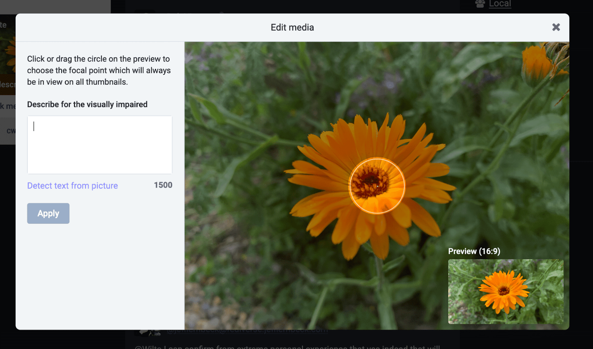
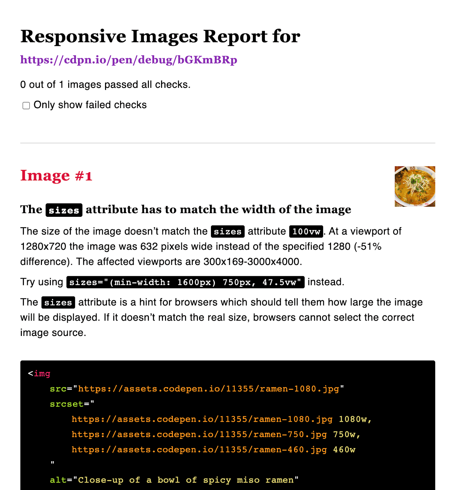
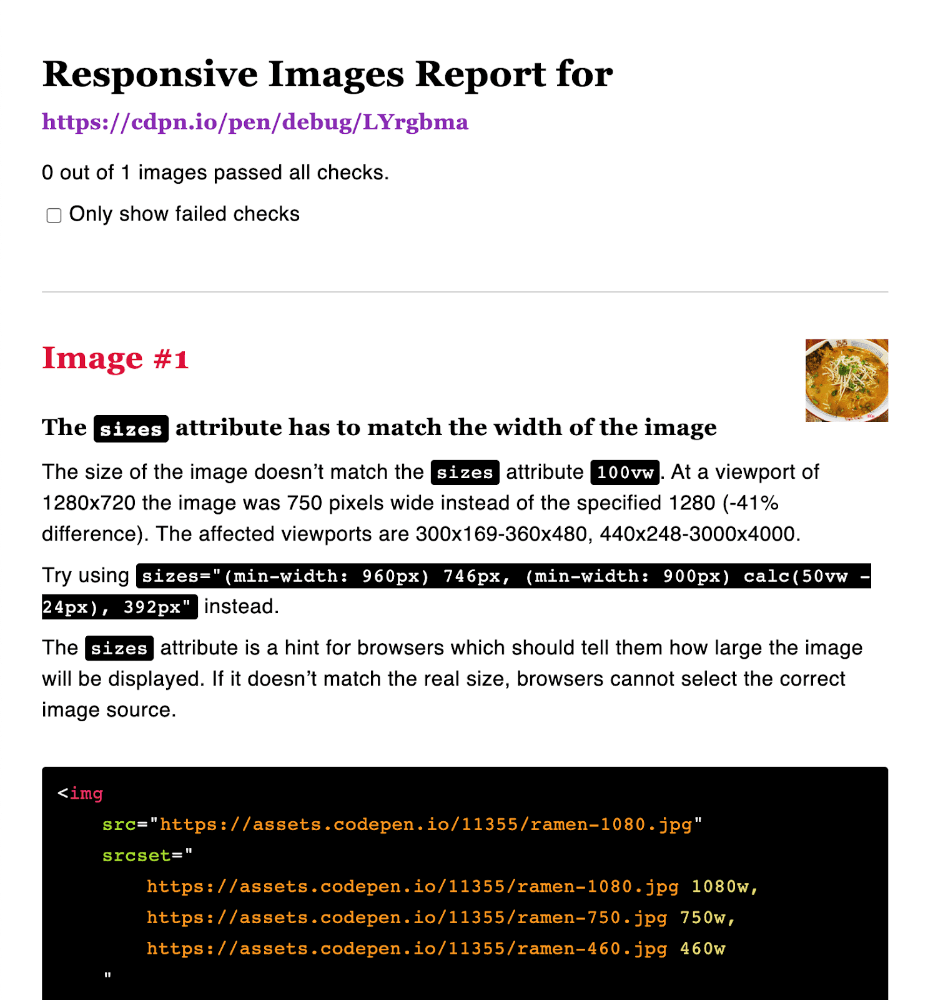

# 自动压缩和编码 

使生成高性能映像来源成为开发过程的无缝组成部分。

从图片数据编码到为[响应式图片](/blogs/web/images/responsive-images)提供支持的信息密集标记，本课程中的所有语法都是供机器与机器进行通信的方法。您已经了解了客户端浏览器向服务器传达其需求以及服务器进行此类响应的各种方式。自适应图片标记（特别是 `srcset` 和 `sizes`）能够用相对较少的字符描述大量信息。无论好坏，这种简洁是设计使然：简化这些语法，让开发者更易于解析，但可能会增加浏览器解析这些语法的难度。字符串越复杂，就越有可能出现解析器错误，或者从一个浏览器到另一个浏览器的行为出现意外差异。



然而，让这些主题显得令人望而生畏的相同特征也可以为您提供解决方案：机器可以轻松读取的语法，而机器编写的语法更容易。作为网络用户，您几乎肯定遇到过许多自动图片编码和压缩示例：通过社交媒体平台、内容管理系统 (CMS) 甚至电子邮件客户端上传到网络的任何图片，几乎都会不断地通过一个系统来调整其大小、重新编码和压缩。

同样，无论是通过插件、外部库、独立构建流程工具，还是负责任地使用客户端脚本，自适应图片标记都很容易实现自动化。

图片性能自动化涉及到两个主要问题：管理图片的创建（编码、压缩以及用于填充 `srcset` 属性的备用来源），以及生成面向用户的标记。在本单元中，您将了解在现代化工作流中管理图片的一些常用方法，有的采用开发过程中的自动化阶段，有的是通过为网站提供支持的框架或内容管理系统，有的是通过专门的内容分发网络几乎完全抽象化的方法。

## 自动压缩和编码

您不太可能需要花时间手动为要用于项目的每张图片手动确定理想的编码和压缩级别 —— 您也不想这样做。[尽可能减少图像传输大小同样重要](/blogs/web/images/performance-issues)，但微调压缩设置并为发往生产网站的每个图片资源重新保存备用来源，这将给您的日常工作带来巨大的瓶颈。

您在阅读各种图片格式和压缩类型时已经了解到，图片最高效的编码始终取决于其内容；正如您在[自适应图片](/blogs/web/images/responsive-images)中学到的，您需要的图片来源所需的备用尺寸将取决于这些图片在页面布局中的位置。在现代工作流中，您将整体处理这些决策，而不是单独处理这些决策 - 为图片确定一组合理的默认值，以便更好地适应图片的用途。

在为摄影图像目录选择编码时，[AVIF](/blogs/web/images/avif) 明显能在质量和传输大小方面更胜一筹，但支持有限，[WebP](/blogs/web/images/webp) 可提供经过优化的现代回退，[JPEG](/blogs/web/images/jpeg) 是最可靠的默认格式。对于旨在占据页面布局中边栏的图片，我们需要生成的备用尺寸与用于在最高断点处占据整个浏览器视口的图片相差很大。压缩设置需要关注多个生成的文件中的模糊处理和压缩伪影，从而腾出更少的空间来从每个图片中挖掘每个可能的字节，从而换取更灵活可靠的工作流程。总而言之，您要遵循的决策流程与本课程中学到的决策流程相同。

至于处理本身，有大量的开源图像处理库提供了批量转换、修改和编辑图像的方法，以提升速度、效率和可靠性。借助这些处理库，您可以一次性将编码和压缩设置应用于图片的整个目录，而无需打开图片编辑软件；此外，这些处理库还可在需要即时调整这些设置时保留原始图片来源。这些工具可以在各种环境中运行，从本地开发环境到 Web 服务器本身。例如，您可以通过一系列[插件](https://www.npmjs.com/search?q=keywords:imageminplugin)扩展适用于 Node.js 的压缩式 ImageMin 来满足特定应用的需求，而跨平台 [ImageMagick](https://imagemagick.org/) 和基于 Node.js 的 [Sharp](https://sharp.pixelplumbing.com/) 具有数量惊人的功能。

这些图像处理库使开发者能够构建各种工具，专用于在标准开发流程中无缝优化图像，确保您的项目始终引用可用于生产环境的映像源，并且开销尽可能低。

## 本地开发工具和工作流

Grunt、Gulp 或 Webpack 等任务运行程序和捆绑器可用于优化图片资源以及其他常见的性能相关任务，例如缩减 CSS 和 JavaScript 的大小。为了进行说明，我们来看一个相对简单的用例：您项目中的一个目录包含十几张图像，这些图片要在一个面向公众的网站上使用。

首先，您需要确保对这些图片进行一致、高效的编码。正如您在前面的单元中所学的，就质量和文件大小而言，WebP 是照片图片的高效默认设置。WebP 受到良好支持，但并未得到普遍支持，因此您还需要添加渐进式 JPEG 形式的后备。然后，为了利用 `srcset` 属性高效分发这些资源，您需要为每个编码生成多个备用尺寸。

虽然如果使用图片编辑软件来完成这项重复性工作，会非常耗时，但 [Gulp](https://gulpjs.com/) 等任务运行程序旨在自动完成此类重复。利用 [Sharp](https://www.npmjs.com/package/sharp) 的 [gulp-responsive](https://www.npmjs.com/package/gulp-responsive) 插件便是众多遵循类似模式的选项之一：收集源目录中的所有文件，对它们重新编码，然后根据您在[图片格式和压缩](/blogs/web/images/png)中了解的标准化“质量”简写法压缩这些文件。然后，生成的文件会输出到您定义的路径，供您在面向用户的 `img` 元素的 `src` 属性中引用，同时原始文件保持不变。

```javascript
const { src, dest } = require('gulp');
const respimg = require('gulp-responsive');

exports.webp = function() {
  return src('./src-img/*')
    .pipe(respimg({
      '*': [{
        quality: 70,
        format: ['webp', 'jpeg'],
        progressive: true
      }]
  }))
  .pipe(dest('./img/'));
}
```

采用这样的流程后，如果项目中有人不小心将编码为大量真彩色 PNG 的照片添加到了包含原始图片源的目录，对生产环境不会造成任何损害。无论原始图片采用何种编码，此任务都会生成高效的 WebP 和可靠的渐进式 JPEG 回退，并且采用可即时轻松调整的压缩级别。当然，此过程还可确保您的原始图片文件会保留在项目的开发环境中，这意味着您可以随时调整这些设置，仅覆盖自动输出。

为了输出多个文件，您需要传递多个配置对象（除了添加 `width` 键和以像素为单位的值之外），所有配置对象都是相同的：

```javascript
const { src, dest } = require('gulp');
const respimg = require('gulp-responsive');

exports.default = function() {
  return src('./src-img/*')
    .pipe(respimg({
    '*': [{
            width: 1000,
            format: ['jpeg', 'webp'],
            progressive: true,
            rename: { suffix: '-1000' }
            },
            {
            width: 800,
            format: ['jpeg', 'webp'],
            progressive: true,
            rename: { suffix: '-800' }
            },
            {
            width: 400,
            format: ['jpeg', 'webp'],
            progressive: true,
            rename: { suffix: '-400' },
        }]
        })
    )
    .pipe(dest('./img/'));
}
```

在上例中，原始图片 (monarch.png) 的大小超过 3.3MB。此任务生成的最大文件 (monarch-1000.jpeg) 约为 150KB。最小的 monarch-400.web 仅为 32KB。

```shell
[10:30:54] Starting 'default'...
[10:30:54] gulp-responsive: monarch.png -> monarch-400.jpeg
[10:30:54] gulp-responsive: monarch.png -> monarch-800.jpeg
[10:30:54] gulp-responsive: monarch.png -> monarch-1000.jpeg
[10:30:54] gulp-responsive: monarch.png -> monarch-400.webp
[10:30:54] gulp-responsive: monarch.png -> monarch-800.webp
[10:30:54] gulp-responsive: monarch.png -> monarch-1000.webp
[10:30:54] gulp-responsive: Created 6 images (matched 1 of 1 image)
[10:30:54] Finished 'default' after 374 ms
```

当然，您需要仔细检查结果中是否存在可见的压缩失真，或者可能增加压缩以进一步节省费用。由于此任务没有破坏性，因此可以轻松更改这些设置。

总而言之，只需通过谨慎的手动微优化节省多少 KB 的存储空间，您就会获得一个不仅高效，而且*弹性佳的*流程，该工具可将您对高性能图像资源知识无缝地运用到整个项目中，而无需任何人工干预。

### 自适应图片标记的实际运用

填充 `srcset` 属性通常是一项简单的手动过程，因为该属性实际上只会捕获您在生成源代码时已完成的配置的相关信息。在上述任务中，我们已确定属性将遵循的文件名和宽度信息：

```html
srcset="filename-1000.jpg 1000w, filename-800.jpg 800w, filename-400.jpg 400w"
```

请注意，`srcset` 属性的内容是描述性的，而不是规范性的。只要每个来源的宽高比一致，重载 `srcset` 属性并没有什么坏处。`srcset` 属性可以包含服务器生成的每个备用剪辑的 URI 和宽度，而不会产生任何不必要的请求，并且我们为渲染图片提供的候选来源越多，浏览器就能越高效地定制请求。

正如您在[自适应图片](/blogs/web/images/responsive-images)中学到的那样，您将需要利用 `` 元素来无缝处理 WebP 或 JPEG 后备模式。在本例中，您将与 `srcset` 结合使用 `type` 属性。

```html
<picture>
  <source type="image/webp" srcset="filename-1000.webp 1000w, filename-800.webp 800w, filename-400.webp 400w">
  
</picture>
```

如您所了解，支持 WebP 的浏览器会识别 `type` 属性的内容，并选择该 `` 元素的 `srcset` 属性作为候选图片列表。如果浏览器不能将 `image/webp` 识别为有效媒体类型，则会忽略此 ``，而改用内部 `` 元素的 `srcset` 属性。

在浏览器支持方面，还有一个因素：不支持任何自适应图片标记的浏览器仍然需要后备图片，否则，在尤其是旧的浏览环境中，我们可能会面临图片损坏的风险。由于 ``、`` 和 `srcset` 在这些浏览器中都会被忽略，因此我们需要在内部 `` 的 `src` 属性中指定默认来源。

由于向下缩放图片在视觉上是无缝的，并且 JPEG 编码受到普遍支持，因此最大的 JPEG 是合理的选择。

```html
<picture>
  <source type="image/webp" srcset="filename-1000.webp 1000w, filename-800.webp 800w, filename-400.webp 400w">
  
</picture>
```

`sizes` 可能更难处理。正如您已经[了解到](/blogs/web/images/responsive-images)的，`sizes` 必须是上下文信息；您不知道图片在呈现的布局中应占据的空间大小，就无法填充该属性。为了尽可能实现最高效的请求，在最终用户提出请求时，早在请求控制页面布局的样式之前，标记中就需要有准确的 `sizes` 属性。完全省略 `sizes` 不仅违反了 HTML 规范，还会导致等同于 `sizes="100vw"` 的默认行为，即告知浏览器此图片仅受视口本身约束，从而选择尽可能大的候选来源。

与任何特别繁重的 Web 开发任务一样，我们开发了许多工具来抽象化手写 `sizes` 属性的过程。[`respImageLint`](https://ausi.github.io/respimagelint/) 是绝对必需的代码段，用于检查 `sizes` 属性的准确性，并提供改进建议。它以小书签的形式运行，这是一种您在浏览器中运行的工具，它指向包含图片元素的完全呈现页面。在浏览器充分了解页面布局的环境中，它也将能够近乎像素地完美感知图片在每种可能的视口尺寸中应占据的空间。



对 `sizes` 属性执行 lint 请求的工具当然很有用，但作为一种工具批发属性，它更有价值。如您所知，`srcset` 和 `sizes` 语法旨在以视觉化的方式优化针对图片素材资源的请求。虽然不应该在生产环境中使用，但在本地开发环境中处理页面布局时，`100vw` 的默认 `sizes` 占位符值非常合理。设置好布局样式后，运行 `respImageLint` 将为您提供量身定制的 `sizes` 属性，您可以将这些属性复制并粘贴到标记中，其详细程度远远超过手动撰写的信息：



虽然由服务器渲染的标记发起的图片请求速度过快，导致 JavaScript 无法生成客户端 `sizes` 属性，但如果请求是在客户端发起的，则此原因不适用。例如，通过 [Lazysizes](https://github.com/aFarkas/lazysizes) 项目，您可以将图片请求完全推迟到布局建立之后，这样 JavaScript 就能为我们生成 `sizes` 值。这对您来说非常便捷，同时可以保证尽可能为用户提供最高效的请求。但请注意，这种方法确实意味着会牺牲服务器呈现的标记的可靠性和浏览器中内置的速度优化功能，并且仅在网页呈现完毕后才发起这些请求，会对 LCP 得分产生极大的负面影响。

当然，如果您已经在依赖 React 或 Vue 等客户端渲染框架，那就已经承担了这笔债务，在此类情况下，使用 Lazysizes 意味着可以几乎完全提取 `sizes` 属性。更好的是：随着延迟加载图片上的 [`sizes="auto"`](https://github.com/whatwg/html/pull/8008) 获得共识和原生实现，Lazysizes 实际上将成为这种新标准化浏览器行为的 polyfill。