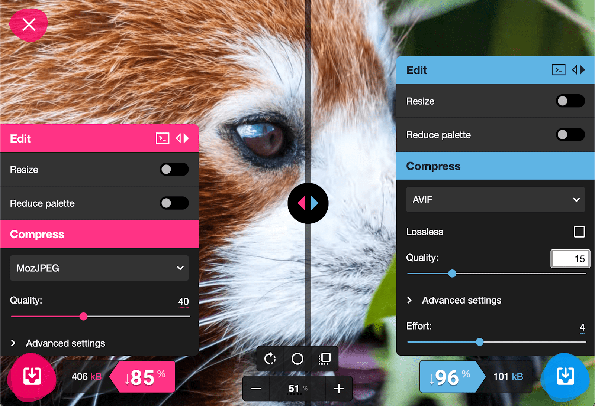

# 图片格式：AVIF 

AV1 图片文件格式 (AVIF) 是一种基于开源 AV1 视频编解码器的编码。AVIF 比 WebP [更新](https://caniuse.com/avif)，自 2020 年以来仅支持 Chrome 和 Opera、2021 年的 Firefox 以及 2022 年的 Safari。与 WebP 一样，AVIF 旨在满足网上光栅图片的所有可能用例：类似于 GIF 的动画、类似于 PNG 的透明度，以及在大小小于 JPEG 或 WebP 的文件下提升感知质量。

到目前为止，AVIF 显示了 promise。由 Netflix 开发的[测试框架](https://github.com/Netflix/image_compression_comparison)（[开放媒体联盟](https://aomedia.org/)（负责开发 AV1 编解码器的团体）的创始成员 Netflix 开发的这一测试框架）显示，与 JPEG 或 WebP 相比，[可显著缩减文件大小](https://netflixtechblog.com/avif-for-next-generation-image-coding-b1d75675fe4)。[Cloudinary](https://cloudinary.com/blog/contemplating-codec-comparisons) 和 [Chrome 编解码器团队](https://storage.googleapis.com/avif-comparison/index.html)的其他研究结果表明，它相对于当前编码标准有利。

虽然工具相对有限，但您可以而且应该现在就[开始试用 AVIF](https://jakearchibald.com/2020/avif-has-landed/)，作为 Squoosh 提供的编码之一：

## 浏览器支持

现在，如果您好奇为何 AVIF 和 WebP 能为我们提供更优质的结果和更小的文件大小，为何我们花费了这么多时间来讨论 JPEG，这是因为它们以及任何新的图片编码都存在一个重大问题。数十年来，我们保证所有浏览器都支持 GIF、PNG 和 JPEG。相对于这些旧版图片格式，AVIF 是全新的，虽然现代浏览器对 WebP 的支持非常[出色](https://caniuse.com/?search=webp)，但并非整个网络都能支持。

可以想象，我们投入了大量的时间和精力来开发新的图片格式，旨在提高质量和传输大小。WebP、AVIF 和 [JPEG XL](https://jpeg.org/jpegxl/) 等格式（[在任何浏览器中都不支持](https://caniuse.com/jpegxl)）旨在成为网络光栅图片的统一解决方案，因为 SVG 是矢量。其他格式（例如 JPEG 2000，仅在 Safari 中受支持）旨在满足与基准 JPEG 相同的所有用例，但改进了压缩方法，以提供外观类似但更小的图片。

虽然其中一些新格式具有相同的 JPEG 名称，但其编码与 JavaScript 和 Java 的编码完全不同。不支持特定编码的浏览器根本无法解析该图片文件。这就好像是我指示您用您不懂的语言填写方格纸像素网格一样。浏览器会请求图片数据并尝试解析，如果解析失败，则会舍弃该图片而不渲染任何内容。对于我们的内容和整个网络来说，如果图片来源无法在现代浏览器之外呈现，就会成为一个巨大的故障点：图片损坏，并浪费全球大量用户的带宽。您不应该为了提高性能而牺牲一个更有弹性的网络。

很久以来，我们的志同道合的朋友 `` 都非常难以使用任何新的图片格式，不管它看起来多么有前景。请记住，``仅支持单个源文件，而且经过了高度优化，可以快速传输该文件。实际上，这种文件传输速度非常快，以至于我们无法通过 JavaScript 拦截该请求。直到最近，唯一可行的选择是向所有用户提供全新类型的图片，并在浏览器触发错误时请求一种“旧版”格式，从而在第一个文件被浪费后进行第二次文件传输。

因此，存在数十年的 `` 必须有所改变。在下一个单元（即[自适应图片](/blogs/web/images/responsive-images)）中，您将了解为解决这些问题而引入的 HTML 规范功能，以及如何在日常工作中使用这些功能。