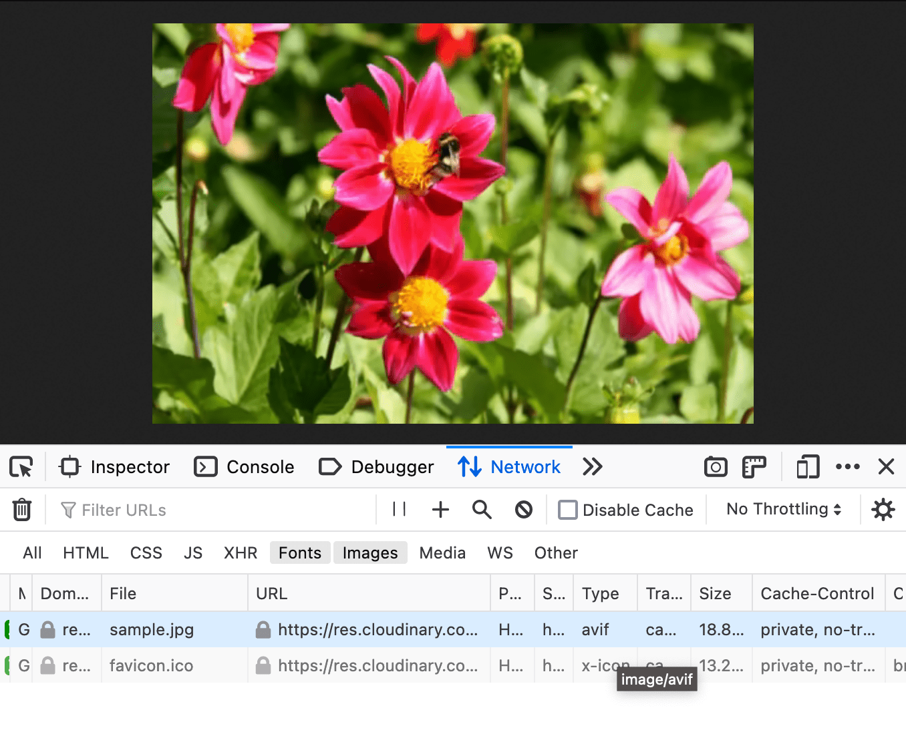

# 图片内容分发网络 


您可能已经熟悉内容分发网络 (CDN) 的核心概念：由分布式但互连的服务器组成的网络，可快速高效地向用户分发资源。将文件上传到 CDN 提供商后，系统会在遍布全球的 CDN 网络的其他节点上创建副本。当用户请求文件时，数据将由地理位置最接近该用户的节点发送，从而缩短延迟时间。CDN 的分布式特性还可在网络中断或硬件故障时提供冗余，以及提供负载均衡以缓解流量高峰。

图片 CDN 可以提供所有这些优势，但有一个关键区别：它能够根据用于访问图片的网址的字符串来转换和优化图片内容。

用户需要向提供程序上传一张高分辨率的规范图片，提供程序会生成用于访问该图片的网址：

```html
https://res.cloudinary.com/demo/image/upload/sample.jpg
```

虽然使用的确切语法因提供商而异，但至少所有图片 CDN 都允许您更改源图片的尺寸、编码和压缩设置。例如，[Cloudinary](https://cloudinary.com/) 通过以下语法对上传的图片执行[动态大小调整](https://cloudinary.com/documentation/resizing_and_cropping#setting_the_resize_dimensions)：`h_` 后跟以像素为单位的数字高度，`w_` 后跟宽度，以及可让您指定[关于图片应如何缩放或剪裁的详细信息](https://cloudinary.com/documentation/resizing_and_cropping#crop)。`c_`

可以通过向网址添加逗号分隔值（在文件名和扩展名前面）来应用任意数量的转换，这意味着，可以通过请求上传图片的 `img` 元素的 `src` 来根据需要处理上传的图片。

```html

```

当用户首次访问包含这些转换的网址时，系统会生成并发送一个按比例缩放至宽度 400 像素 (`w_400`) 的新版图片。然后，系统会在整个 CDN 中缓存新创建的文件，以便将其发送给请求同一网址的任何用户，而无需按需重新创建。

虽然图片 CDN 提供商提供[软件开发套件](https://cloudinary.com/documentation/cloudinary_sdks)来促进高级使用以及与各种技术堆栈的集成并不罕见，但仅凭这种可预测的网址格式，我们就能轻松地将单个上传的文件转换为可行的 `srcset` 属性，而无需任何其他开发工具：

```html

```

现在，我们可以使用熟悉的语法来手动指定所需的压缩级别：`q_`，“质量”的缩写，后跟压缩级别的数字简写：

```html

```

您需要手动包含此类信息的情况很少见，不过，这得益于大多数图片 CDN 提供的一系列极其强大的功能：全自动压缩、编码和内容协商。

## 自动压缩

图片 CDN 拥有强大的计算能力，这意味着它们能够提供极其强大的功能：分析图片内容，通过算法确定其理想的压缩级别和编码设置，就像您或我会为我们的每张图片手动微调压缩一样。

这些算法会自动做出平衡文件大小和感知质量的决策，分析图片内容是否有可衡量的降级迹象，并相应地微调压缩设置。与通用的手动压缩方法相比，这通常意味着文件会大幅缩减。

这可能听起来十分复杂，但实现起来要简单得多：对于 Cloudinary，通过在图片网址中添加 `q_auto` 即可实现此功能：

```html

<!-- 250 KB-->


<!-- 134 KB-->
```

## 自动编码和内容协商

收到图片请求后，图片 CDN 会通过浏览器发送的 [HTTP 标头](https://developer.mozilla.org/docs/Web/HTTP/Headers)和资源请求（具体而言，`Accept` 标头）来确定浏览器支持的最现代编码。此标头使用我们用于填充 `` 元素的 `` 的 `type` 属性的相同[媒体类型](https://developer.mozilla.org/docs/Web/HTTP/Basics_of_HTTP/MIME_types)，指示浏览器能够理解的编码。

例如，将 `f_auto` 参数添加到资源网址中的图片转换列表，可明确指示 Cloudinary 提供浏览器能够理解的最高效的编码：

```html

```

然后，服务器会使用该编码生成图片版本，并为使用相同浏览器支持级别的所有后续用户缓存结果。该响应包含一个 [`Content-Type` 标头](https://developer.mozilla.org/docs/Web/HTTP/Headers/Content-Type)，用于明确告知浏览器文件的编码，而不考虑文件扩展名。即使使用现代浏览器的用户请求以 `.jpg` 结尾的文件，该请求都会附带一个标头，以告知服务器支持 AVIF，并且服务器会发送 AVIF 编码文件，以及一条明确指示将该文件视为 AVIF。



最终结果不仅使您无需再创建交替编码文件和手动微调压缩设置（或维护一个为您执行这些任务的系统），而且无需使用 `` 和 `type` 属性来有效地将这些文件提供给用户。因此，如果仅使用 `srcset` 和 `sizes` 语法，系统仍可向用户提供编码为 AVIF 的图片、回退到 WebP 格式的图片（如果只使用 JPEG-2000 格式，则只使用 JPEG-2000 格式），从而回退到最合理的旧版编码。

与技术相比，使用图片 CDN 的缺点更偏重于技术性，其中最主要的是成本因素。虽然图片 CDN 通常会提供功能强大、供个人使用的免费方案，但生成图片资源需要带宽和存储空间来进行上传、在服务器上进行处理以转换图片，以及为缓存的转换结果提供额外的空间，因此高级使用和高流量应用可能需要付费方案。