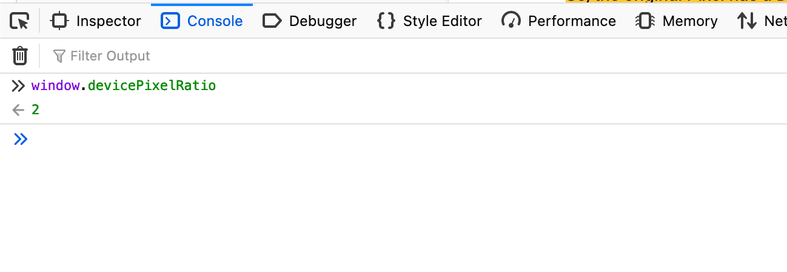

# 描述性语法 

在本单元中，您将学习如何为浏览器提供图片选择，以便浏览器可以就显示内容做出最佳决策。`srcset` 不是在特定断点交换图像源的方法，也不意味着将一张图片替换为另一张图片。这些语法可以让浏览器独立于我们来解决非常困难的问题：无缝请求并渲染根据用户浏览上下文定制的图片来源，包括视口大小、显示密度、用户偏好设置、带宽和各种其他因素。

这是一个很大的要求 - 在我们简单地为网页标记图片时，肯定比我们想考虑的要多。如果做好了这方面的工作，涉及到的信息量超出我们所能获取的信息。

## 使用 `x` 描述密度

具有固定宽度的 `` 在任何浏览上下文中都会占据相同数量的视口，而不考虑用户屏幕的密度（即构成屏幕的物理像素数量）。例如，在原版 Google Pixel 和新款 Pixel 6 Pro 上，固有宽度为 `400px` 的图片几乎会占据整个浏览器视口。这两款设备都具有标准化 `412px` 逻辑像素宽视口。

不过，Pixel 6 Pro 的显示屏要更加清晰：6 Pro 的物理分辨率为 1440 × 3120 像素，而 Pixel 的物理分辨率为 1080 × 1920 像素（即构成屏幕本身的硬件像素数量）。

设备的逻辑像素与物理像素之间的比率就是相应显示屏 (DPR) 的设备像素比。DPR 的计算方法是设备的实际屏幕分辨率除以视口的 CSS 像素。



因此，原始 Pixel 的 DPR 为 2.6，而 Pixel 6 Pro 的 DPR 为 3.5。

iPhone 4 是第一款 DPR 大于 1 的设备，其报告的设备像素比为 2（屏幕的物理分辨率是逻辑分辨率的两倍）。iPhone 4 之前的所有设备的 DPR 为 1：一个逻辑像素对应一个物理像素。

如果您在 DPR 为 `2` 的屏幕上查看该宽度为 `400px` 的图像，则每个逻辑像素在屏幕的四个物理像素（2 个水平和 2 个垂直像素）上渲染。高密度显示屏对图片没有好处，它看起来与 DPR 为 `1` 的显示屏上相同。当然，系统会绘制由浏览器的渲染引擎“绘制”的所有内容（例如文本、CSS 形状或 SVG），以适应更高密度的显示屏。但正如您在[图片格式和压缩](/blogs/web/images/raster-images)中所学到的，光栅图片是固定的像素网格。虽然并不总是很明显，但为了适应更高密度的显示屏而调大后的光栅图片看起来分辨率较低（与周围的页面相比）。

为了防止这种放大，正在渲染的图片的固有宽度必须至少为 `800` 像素。当缩小以适应宽度为 400 逻辑像素的布局中的空间时，800 像素的图像源的像素密度翻了一番，在 DPR 为 `2` 的屏幕上，看起来美观又清晰。


<iframe allow="camera; clipboard-read; clipboard-write; encrypted-media; geolocation; microphone; midi;" loading="lazy" src="https://codepen.io/web-dot-dev/embed/QWBGVyo?height=300&amp;theme-id=light&amp;default-tab=html%2Ccss%2Cresult&amp;editable=true" data-darkreader-inline-border-top="" data-darkreader-inline-border-right="" data-darkreader-inline-border-bottom="" data-darkreader-inline-border-left="" data-title="web-dot-dev 上的 Pen QWBGVyo" style="color-scheme: initial; box-sizing: inherit; border: 0px; height: 300px; width: 100%; --darkreader-inline-border-top: 0px; --darkreader-inline-border-right: 0px; --darkreader-inline-border-bottom: 0px; --darkreader-inline-border-left: 0px;"></iframe>

由于 DPR 为 `1` 的显示屏无法利用增加密度的图片，因此系统会*缩小*以匹配显示屏——您也知道，*缩小后*图片也可以正常显示。在低密度显示屏上，适合高密度显示屏的图片看起来与任何其他低密度图片一样。

正如您在[图片和性能](/blogs/web/images/performance-issues)中所学的，使用低密度显示屏的用户查看缩小到 `400px` 的图片来源时，只需固有宽度为 `400px` 的来源。虽然较大的图像适合所有用户的视觉，但在小型低密度显示屏上渲染的大型高分辨率图像来源看起来与任何其他小型低密度图像一样，但感觉速度要慢得多。

您可能猜到，DPR 为 1 的移动设备[非常少见](https://jakearchibald.com/2021/serving-sharp-images-to-high-density-screens/)，不过它在[“桌面设备”浏览环境中很常见](https://twitter.com/TimVereecke/status/1587878439729725442)。根据 [Matt Hobbs](https://nooshu.com/) 分享的数据，在 2022 年 11 月以来的 [GOV.UK](https://www.gov.uk/) 浏览会话中，大约 18% 的浏览会话表示 DPR 为 1。虽然高密度图像看起来就像这些用户可能预期的一样，但它们的带宽和处理成本要高得多，如果使用旧款设备、但仍然可能使用低密度显示屏的设备性能较低，用户需要特别担心。

使用 `srcset` 可确保只有具有高分辨率显示屏的设备才能接收足够大的图片源以保证清晰照片，而不会将同样的带宽成本转给分辨率较低的用户。

`srcset` 属性用于标识用于渲染图片的一个或多个以逗号分隔的候选对象。每个候选字符由两部分组成：一个网址（如您在 `src` 中使用的网址）和用于描述该图片来源的语法。`srcset` 中的每个候选字符都由其固有的“宽度”（“`w` 语法”）或预期的“密度”（“`x` 语法”）进行描述。

`x` 语法是“此来源适用于具有此密度的显示屏”的简写形式，在 DPR 为 2 的显示屏后面加上 `2x` 的候选字词适合。

```html

```

支持 `srcset` 的浏览器将呈现两个候选版本：`double-density.jpg`（`2x` 将其描述为适用于 DPR 为 2 的显示屏）和 `low-density.jpg`（如果在 `srcset` 中找不到更合适的选项，系统即会选择的候选版本）。`src`对于不支持 `srcset` 的浏览器，该属性及其内容将被忽略，系统会照常请求 `src` 的内容。

很容易将 `srcset` 属性中指定的值误认为是说明。该 `2x` 会告知浏览器关联的源文件适合在 DPR 为 2（即关于来源本身的信息）的显示屏上使用。它不会告知浏览器如何使用相应来源，而只是告知浏览器如何使用该来源。这是一个细微但重要的区别：这是双密度*图片*，而不是双密度显示屏*图片*。

说明“此来源适用于 `2x` 显示屏”的语法与显示“在 `2x` 显示屏上使用此来源”的语法之间的差异很小，但显示密度只是浏览器用于确定要渲染的候选内容的大量互联因素之一，只有其中一部分是您能够知道的。例如：具体而言，您可以确定用户已通过 `prefers-reduced-data` 媒体查询启用了“节省带宽”的浏览器偏好设置，并据此始终选择让用户进入低密度图片，而不管其显示密度如何；但如果每个开发者在每个网站上一致地实现，这对用户而言并没有多大用处。他们可能在一个网站上尊重了他们的偏好，而在下一个网站上遇到一面占用带宽的图片墙。

`srcset`/`sizes` 使用刻意含糊的资源选择算法留出了空间，让浏览器可以决定选择存在带宽低谷的低密度图片，或者根据偏好以最大限度地减少数据使用量，而无需我们对如何、何时或在什么阈值下承担责任。浏览器没有必要承担责任和额外的工作，因为这可以更好地为您处理。

## 使用 `w` 描述宽度

`srcset` 接受图片源候选项的第二种描述符。它的强大得多，就我们而言，要理解也要容易得多。`w` 语法会描述每个候选来源的固有宽度，而不是将候选网络标记为具有适合给定显示密度的尺寸。同样，每个候选版本在尺寸上都是相同的，即相同的内容、相同的剪裁和相同的宽高比。但在本例中，您希望用户的浏览器在两个候选对象之间进行选择：small.jpg（固有宽度为 600px 的源）和 large.jpg（固有宽度为 1200px 的源）。

```html
srcset="small.jpg 600w, large.jpg 1200w"
```

这不会告知浏览器如何处理此信息，而只为其提供用于显示图片的候选列表。在浏览器确定要呈现哪个来源之前，您需要再多提供一些信息：关于图片在网页上的呈现方式的说明。为此，请使用 `sizes` 属性。

## 通过 `sizes` 描述使用情况

在传输图像方面，浏览器的性能非常出色。请求图片资源的时间早于对样式表或 JavaScript 的请求，通常是在标记完全解析之前。当浏览器发出这些请求时，除了标记之外，它并不知道网页本身的相关信息。甚至可能还没有发起对外部样式表的请求，更不用说已应用它们了。当浏览器解析标记并开始发出外部请求时，仅包含浏览器级别的信息：用户视口的大小、用户显示屏的像素密度、用户偏好设置等。

这并不能告诉我们任何关于图片在页面布局中的渲染方式的信息。它甚至不能将视口用作 `img` 尺寸上限的代理，因为它可能会占据水平滚动的容器。因此，我们需要向浏览器提供这些信息，并使用标记来完成此操作。以上就是我们能针对这些请求使用的所有功能。

与 `srcset` 一样，`sizes` 的作用是在解析标记后立即提供有关图片的信息。正如 `srcset` 属性是“此处是源文件及其固有大小”的简写形式，`sizes` 属性是“此处是布局中已渲染图片的大小”的简写。您描述图片的方式与视口相关。同样，发出图片请求时，浏览器仅有的布局信息。

这在输出中可能听起来有点复杂，但在实践中更易于理解：

```html

```

在这里，此 `sizes` 值会告知浏览器：`img` 所占的布局空间的宽度为 `80vw`——视口的 80%。请注意，这并非*指令*，而是对页面布局中图片大小的说明。这并不是说“让此图片占据 80% 的视口”，而是“当网页渲染后，这张图片最终将占据 80% 的视口”。

<iframe allow="camera; clipboard-read; clipboard-write; encrypted-media; geolocation; microphone; midi;" loading="lazy" src="https://codepen.io/web-dot-dev/embed/PoBWLYP?height=500&amp;theme-id=light&amp;default-tab=html%2Cresult&amp;editable=true" data-darkreader-inline-border-top="" data-darkreader-inline-border-right="" data-darkreader-inline-border-bottom="" data-darkreader-inline-border-left="" data-title="由 web-dot-dev 在 Codepen 上发布的 Pen PoBWLYP" style="color-scheme: initial; box-sizing: inherit; border: 0px; height: 500px; width: 100%; --darkreader-inline-border-top: 0px; --darkreader-inline-border-right: 0px; --darkreader-inline-border-bottom: 0px; --darkreader-inline-border-left: 0px;"></iframe>

作为开发者，您的工作已完成。您已经在 `srcset` 中准确描述了候选来源列表，并在 `sizes` 中描述了图片的宽度，就像 `srcset` 中的 `x` 语法一样，其余均由浏览器决定。

但为了全面了解这些信息的使用方式，让我们花点时间了解一下用户的浏览器在遇到此标记时做出的决定：

您已告知浏览器此图片将占据可用视口的 80%，因此，如果我们在视口宽度为 1,000 像素的设备上渲染此 `img`，此图片将占用 800 像素。然后，浏览器将获取该值，并除以我们在 `srcset` 中指定的每个候选图片来源的宽度。最小来源的固有大小为 600 像素，因此：600÷800=.75。我们的中等图片宽度为 1200 像素：1200÷800=1.5。最大的图片宽度为 2000 像素：2000÷800=2.5。

这些计算的结果（`.75`、`1.5` 和 `2.5`）实际上是*专门针对用户的视口大小量身定制的 DPR 选项*。由于浏览器也掌握了有关用户显示密度的信息，因此会做出一系列决定：

在此视口大小下，无论用户的显示密度如何，系统都会舍弃 `small.jpg` 候选版本。由于计算得出的 DPR 低于 `1`，此来源需要针对任何用户进行放大，因此不适合使用。在 DPR 为 `1` 的设备上，`medium.jpg` 提供最接近的匹配项，该来源适合以 `1.5` 的 DPR 显示，因此它比所需的大小略大，但请注意，缩小是一个在视觉上无缝的过程。在 DPR 为 2 的设备上，`large.jpg` 是最接近的匹配项，因此会被选中。

如果在 600 像素的宽视口上渲染同一张图片，则计算结果将完全不同：80vw 现在为 480px。 用源宽度除以宽度值时，会得到 `1.25`、`2.5` 和 `4.1666666667`。在此视口大小下，`small.jpg` 将在 1x 设备上选择，`medium.jpg` 将在 2x 设备上匹配。

这张图片在所有这些浏览环境中看起来都一样：我们所有的源文件除了尺寸外完全一样，并且每个文件都会按照用户的显示密度所允许的极限渲染。不过，系统始终不会为了适应最大视口和最高密度的显示屏而向每个用户提供 `large.jpg`，而是始终向用户提供最小合适的候选版本。如果使用描述性语法而不是规范性语法，您就无需手动设置断点，也无需考虑未来的视口和 DPR，只需为浏览器提供信息，让浏览器为您确定答案即可。

由于 `sizes` 值与视口相关，并且完全独立于页面布局，因此它会添加一层复杂功能。图像只占据一定比例的视口，没有任何固定宽度的外边距、内边距或受页面上其他元素的影响，这种情况很少见。您经常需要使用以下单位组合来表示图片的宽度：百分比、`em`、`px` 等。

幸运的是，您可以在此使用 `calc()`，任何原生支持自适应图片的浏览器都支持 `calc()`，这让我们能够混合搭配 CSS 单元，例如，占据用户视口的整个宽度，两侧减去 `1em` 外边距的图片：

```html

```

## 描述断点

如果您花了很多时间使用自适应布局，可能会注意到这些示例中缺少了一些内容：图片在布局中占据的空间很可能会在布局的断点处发生变化。在这种情况下，您需要将一些详细信息传递给浏览器：`sizes` 接受一组以英文逗号分隔的图片渲染大小候选字符，就像 `srcset` 接受逗号分隔的图片源候选字符一样。这些条件使用熟悉的媒体查询语法。 此语法是首次匹配：只要媒体条件匹配，浏览器就会停止解析 `sizes` 属性，并且应用指定的值。

假设您有一张图片要占据 80% 的视口，在两侧分别减去 1 `em` 的内边距，在 1200px 以上的视口上，该图片会占据视口的整个宽度。

```html
  
```

<iframe allow="camera; clipboard-read; clipboard-write; encrypted-media; geolocation; microphone; midi;" loading="lazy" src="https://codepen.io/web-dot-dev/embed/RwBoYRx?height=500&amp;theme-id=light&amp;default-tab=html%2Cresult&amp;editable=true" data-darkreader-inline-border-top="" data-darkreader-inline-border-right="" data-darkreader-inline-border-bottom="" data-darkreader-inline-border-left="" data-title="由 web-dot-dev 在 Codepen 上开发的 Pen RwBoYRx" style="color-scheme: initial; box-sizing: inherit; border: 0px; height: 500px; width: 100%; --darkreader-inline-border-top: 0px; --darkreader-inline-border-right: 0px; --darkreader-inline-border-bottom: 0px; --darkreader-inline-border-left: 0px;"></iframe>

如果用户的视口大于 1200px，`calc(80vw - 2em)` 表示图片在我们布局中的宽度。如果 `(min-width: 1200px)` 条件不匹配，浏览器会继续转移下一个值。由于此值没有关联的特定媒体条件，因此系统将使用 `100vw` 作为默认值。如果您使用 `max-width` 媒体查询编写此 `sizes` 属性：

```html
  
```

<iframe allow="camera; clipboard-read; clipboard-write; encrypted-media; geolocation; microphone; midi;" loading="lazy" src="https://codepen.io/web-dot-dev/embed/BaPQOzO?height=500&amp;theme-id=light&amp;default-tab=html%2Cresult&amp;editable=true" data-darkreader-inline-border-top="" data-darkreader-inline-border-right="" data-darkreader-inline-border-bottom="" data-darkreader-inline-border-left="" data-title="由 web-dot-dev 在 Codepen 上开发的 Pen BaPQOzO" style="color-scheme: initial; box-sizing: inherit; border: 0px; height: 500px; width: 100%; --darkreader-inline-border-top: 0px; --darkreader-inline-border-right: 0px; --darkreader-inline-border-bottom: 0px; --darkreader-inline-border-left: 0px;"></iframe>

用通俗易懂的语言：“`(max-width: 1200px)`匹配吗？如果没有，请继续。下一个值 (`calc(80vw - 2em)`) 没有限定条件，因此会被选中。

现在，您已为浏览器提供了有关 `img` 元素的所有相关信息（潜在来源、固有宽度，以及您打算如何向用户呈现图片），浏览器会使用一组模糊的规则来确定如何处理这些信息。如果这听起来含糊不清，那是因为存在误区。在 HTML 规范中编码的来源选择算法对于应如何选择来源并不明确。一旦来源、其描述符以及图片的呈现方式都已解析完毕，浏览器就可以随意执行所需的任何操作，而您*无法*确定浏览器会选择哪个来源。

“在高分辨率显示屏上使用此来源”的语法是可以预测的，但它无法解决自适应布局中图片的核心问题，即节省用户带宽。屏幕的像素密度只与互联网连接速度（如果有）相关。如果您使用的是高端笔记本电脑，但通过按流量计费的连接、与手机的网络共享或使用稳定的飞机 Wi-Fi 连接来浏览网页，那么无论显示屏的质量如何，您都可能需要停用高分辨率图片源。

与使用严格的规范语法相比，由浏览器最终决定要实现的性能提升要远远得多。例如：在大多数浏览器中，使用 `srcset` 或 `sizes` 语法的 `img` 永远不会费心请求其尺寸小于浏览器缓存中已有的尺寸的来源。如果浏览器可以无缝地缩小已有的图片来源，那么针对看似完全相同的来源提出新的请求意味着什么？但是，如果用户将视口放大到需要新图片的程度（以避免放大），系统仍会发出该请求，因此一切看起来都符合预期。

缺乏明确的控制听起来可能有点可怕，但由于您使用的源文件具有完全相同的内容，因此无论浏览器做出何种决定，我们不太可能会像使用单源 `src` 那样为用户带来“已损坏”的体验。

## 使用 `sizes` 和 `srcset`

对于您自己、读者和浏览器来说，这都是大量信息。`srcset` 和 `sizes` 都是密集语法，只用相对较少的字符描述大量信息。换而言之，无论从设计上看，还是从设计上来说：如果这些语法变得不那么简洁，而且更容易由我们人工解析，就可能会增加浏览器解析内容的难度。字符串的复杂性越高，出现解析器错误或在浏览器之间无意中出现行为差异的可能性就越大。然而，它有一个优点：一种语法更易于被机器读取，而机器编写的语法也更容易。

`srcset`是自动化的明确用例。您很少会为生产环境手动编写多个版本的映像，而是使用 Gulp 等任务运行程序、Webpack 等捆绑器、Cloudinary 等第三方 CDN 或所选 CMS 中内置的功能自动执行该流程。如果首先提供了足够的信息来生成我们的来源，那么系统就有足够的信息将其写入可行的 `srcset` 属性。

`sizes` 的自动化程度略有增加。如您所知，系统计算所渲染布局中图片大小的唯一方法是对布局进行渲染。幸运的是，许多开发者工具都弹出了，用于抽象化手写 `sizes` 属性的过程，其效率绝对无法手动实现。例如，[respImageLint](https://github.com/ausi/respimagelint) 就是一段代码，用于检查 `sizes` 属性的准确性并提供改进建议。[Lazysizes](https://github.com/aFarkas/lazysizes) 项目会将图片请求延迟到建立布局之后，在一定程度上降低效率，允许 JavaScript 为您生成 `sizes` 值。如果您使用的是完全客户端渲染框架（例如 React 或 Vue），则有许多解决方案可用于编写和/或生成 `srcset` 和 `sizes` 属性。