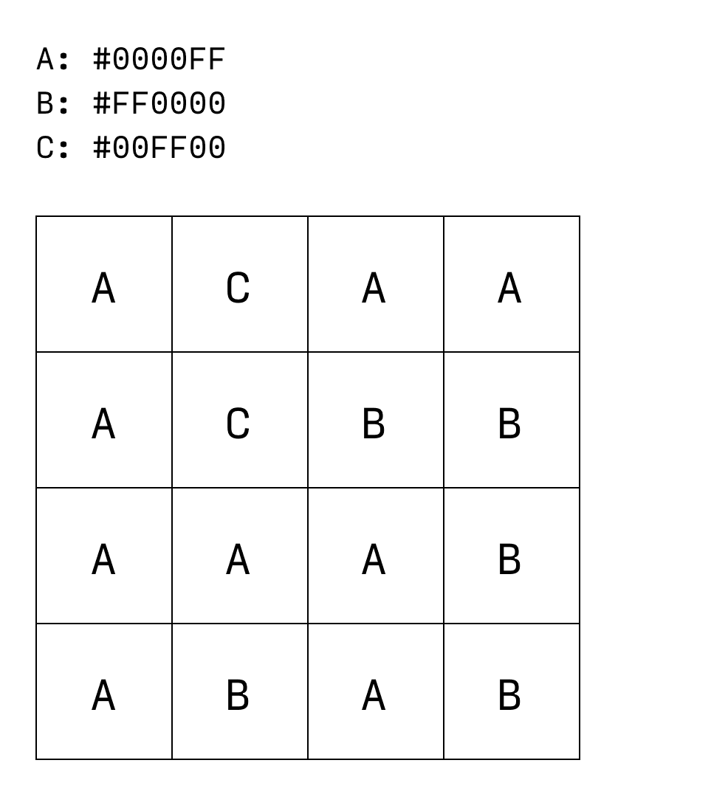
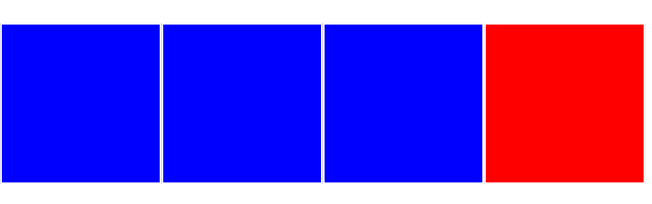
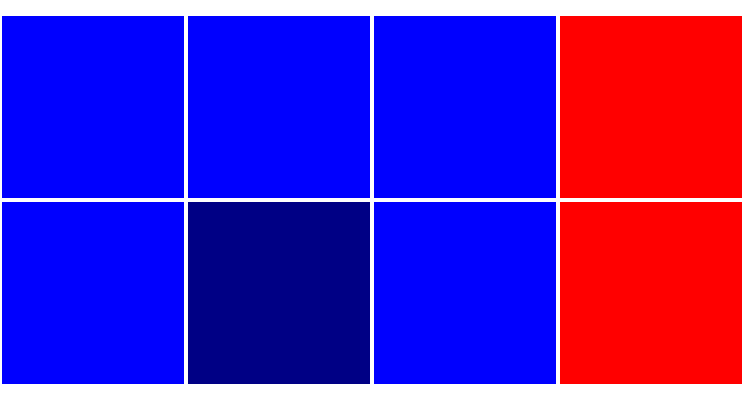
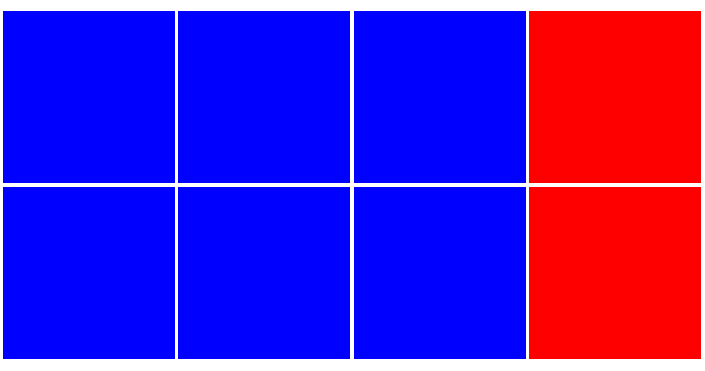
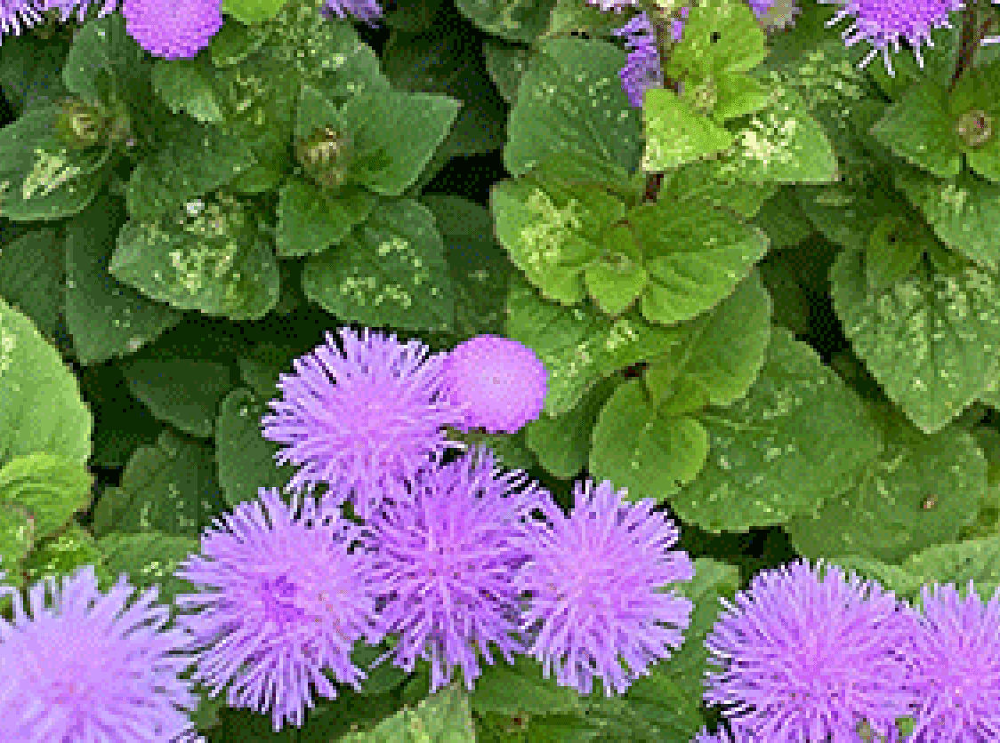

# 图片格式：GIF 

尽管在现代 Web 上用处不大，但 GIF（图形交换格式）可以深入介绍图片编码的核心概念。

GIF 可以看作是图片数据的封装容器。它有一个称为“逻辑屏幕”的视口，用于绘制图像数据的各个帧，有点类似于 Photoshop 文档中的图层。这就是 GIF 如何支持其类似翻页动画的动画：将单个帧绘制到逻辑屏幕，然后替换为另一个帧，接着是另一个帧。当然，当我们处理静态 GIF（由绘制到逻辑屏幕的单个帧）时，这种区别并不重要。

GIF 使用无损数据压缩方法，即“[Lempel-Ziv-Welch](https://en.wikipedia.org/wiki/Lempel–Ziv–Welch)”算法的变体，供您参考。关于此算法的工作原理，我们并不在这里要详细讨论，但概括来讲：它的运作方式有点类似于“精简”JavaScript，其中重复的字符字符串会保存到某种内部字典中，以便可以在每次出现时引用，而不是重复。

当然，[算法并不像按数字绘制那样简单](https://giflib.sourceforge.net/whatsinagif/lzw_image_data.html)。它会再次逐步检查生成的颜色代码表，以查找重复的像素颜色序列，并创建第二个可引用代码表。不过，图像数据绝不会丢失，只需以易于读取的方式进行排序和重新组织，而不必从根本上对其进行更改。

虽然从技术层面来讲，GIF 采用的是无损压缩，但它确实存在一个严重的局限性，这会严重影响图片的质量：将图片另存为 GIF 会导致保真度降低，除非图片已经使用了 256 种或更少的颜色。

GIF 逻辑屏幕绘制的每个帧最多可包含 256 种颜色。GIF 还支持“索引透明度”，即透明像素会引用颜色表中透明“颜色”的索引。

将一系列值缩减为较小、近似的输出值的做法称为“量化”，这个术语在学习图像编码时会经常用到。这种调色板量化的结果通常很明显：

为了更好地了解此过程，请回想一下您根据我的描述重建的光栅图像网格。

这一次，为原始图片添加一些细节：再增加一些像素，其中一个是略深的蓝色阴影：

如果不进行任何压缩，简而言之，您可以将此网格描述为：

> 第 1 行、第 1 列是 #0000FF。第 1 行、第 2 列的内容为 #0000FF。第 1 行、第 3 列是 #0000FF。第 1 行、第 4 列是 #FF0000。第二行，第一列是 #0000FF。第二行第 2 列的值是 #000085。第 2 行、第 3 列的内容为 #0000FF。第 2 行，第 4 列是 #FF0000。

使用类似于 GIF 的无损数据压缩和颜色索引的方法，您可以将其描述为：

> A：#0000FF，B：#FF0000，C：#000085。第 1 行第 1 列到第 3 列为 A。第 1 行、第 4 列是 B。第 2 行，第 1 列是 A。第 2 行，第 2 列是 C。第 2 行，第 3 列是 A。第 2 行，第 4 列是 B。

这种方法成功在几个位置将每个像素的说明精简到几个位置（“1-3 列是...”），并通过预先在分类字典中定义重复颜色来节省一些字符。视觉保真度没有变化。信息已经过压缩，没有丢失。

然而，您可以看到，单个深蓝色像素对编码大小的影响最大。如果我限定为使用量化调色板，可以进一步减少数量：

> 答：#0000FF，B：#FF0000。第 1 行第 1 列到第 3 列为 A。第 1 行、第 4 列是 B。第 2 行第 1 列到第 3 列的内容为 A。第 2 行，第 4 列是 B。

可惜，这些节省的字节最终会导致您失去像素完美的效果。

您作为渲染引擎当然不会知道，深蓝色像素的细节在我对源图片进行编码时遗漏了。 根据我们的对手头颜色的共同理解，您呈现的图片与我对图片进行编码时完全相同。

在这个夸张的示例中，将三种颜色减少到两种，可以明显改善品质。在尺寸较大且细节更清晰的图片上，这种效果可能不太明显，但仍然清晰可见。

将其编码为 GIF 后，阴影等细微的渐变会变得斑驳，各个像素都会从周围融为一体：

在实践中，无损压缩和调色板量化相结合意味着 GIF 在现代 Web 开发中不是很有用。无损压缩不足以缩减文件大小，而且调色板减少意味着画质明显降低。

归根结底，GIF 只是一种有效的编码格式，用于对已经使用有限的调色板、硬边缘（而非抗锯齿）以及纯色而非渐变的简单图片进行编码。在其他用例中，这些用例会比其他格式更好。对于光栅图像，尺寸较小且功能更丰富的 PNG 通常是更好的选择，但在文件大小和视觉保真度方面，对于图标或艺术线条这类用例，两者都远不如 SVG，其中矢量更明显。GIF 的最常见现代用例是动画，但还有更多高效且易于访问的现代视频格式可以实现这一目的。