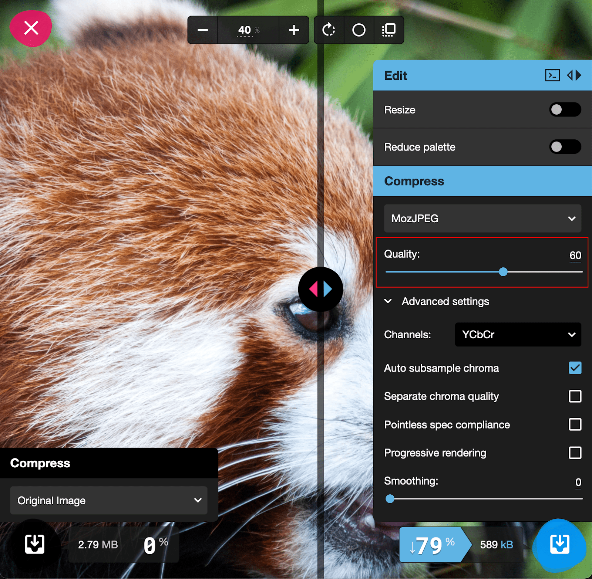

# 图片格式：JPEG 

JPEG 是网络上使用最普遍的图片类型，这方面的原因在于，几十年来，JPEG 几乎一直是照片编码的正确选择。用例就在名称中：JPEG 代表“联合摄影专家组”，这是负责 1992 年首次发布该标准的委员会。您会看到 JPEG 的文件扩展名为 .jpg 或 .jpeg，但后者在当今时代很少见。

无损压缩会尽可能地以最佳方式被动压缩图片数据，而 JPEG 的有损压缩会设法通过对图片数据进行细微且通常察觉不到的更改来提高压缩效率。JPEG 将图片数据编码为 8x8 像素块，并采用算法描述这些块，而不是描述这些块中的各个像素。

这可能听起来像是纸面上的学术区别：“GIF 使用由像素组成的网格，而 JPEG 使用由较小的像素网格组成的网格。” 在实践中，使用块（而不是像素）意味着 JPEG 非常适合图片更常见的用例：构成真实照片的微妙分层渐变。

即使是使用 GIF 样式编码来描述非常简单的单像素渐变，也会极其冗长：

> 第 1 行，第 1 至第 9 列为 #00CC00。第 1 行、第 10 列是 #00BB00。第 1 行、第 11 列是 #00AA00。第 1 行、第 12 列是 #009900。第 1 行第 13 列是 #008800。第 1 行第 14 列是 #007700。第 1 行第 15 列是 #006600。第 1 行、第 16 列是 #005500。

使用 JPEG 样式编码描述渐变的效率要高得多：

> 块一是 #00CC00。块 2 是从 #00CC00 到 #005500 的渐变色。

JPEG 真正的优势在于可以量化图片中的“高频”细节，而这些细节通常很难察觉。因此，将图片另存为 JPEG 格式通常意味着以可衡量的方式降低图片质量，但不一定是可见的。[如您所知](/web/images/gif)，GIF 样式的调色板量化是一种相对简单的操作：减少图片中的颜色数量会生成更小的文件，但肉眼可以轻松发现。

另一方面，JPEG 擅长量化量化的执行方式：JPEG 的有损压缩尝试量化图片源，方式与我们自己的心理视觉系统量化周围世界的方式大体一致。事实上，JPEG 会尝试舍弃我们一开始不太可能看到的细节，因此它可以偷偷地绕过我们。

人类的心理视觉系统会大量地“压缩”你不断采集的图像。当我看向外面的小花园时，可以立即处理大量信息，例如，每朵色彩鲜艳的花朵都格外醒目。我立刻发现，土壤是灰尘弥漫的灰色，叶子下面垂落——我的植物需要水。我看到但未完全处理，具体形状、大小、角度和绿色阴影为一片掉落的叶子。当然，我可以主动寻找这种程度的细节，但被动接受的信息过多，没有真正的好处。因此，我的心理视觉系统会对其自身进行一些量化，将这些信息提炼为“叶子下垂”。

实际上，JPEG 的工作原理相同。JPEG 的有损压缩采用有损压缩的方式，如果能在合理范围内完成，那么 JPEG 的有损压缩可能根本无法记录到我们的自然“有损”心理视觉系统，并且与仅采用无损压缩相比，这种压缩方式会提供更多的带宽节省机会。

例如，JPEG 利用了我们最大的心理视觉缺陷之一：我们的眼睛对亮度差异比对色相差异更敏感。在应用任何压缩之前，JPEG 使用“离散余弦转换”过程将图片拆分为多个单独的频率“层”，以表示亮度（亮度）和色度，或表示“亮度”和“色度”。

亮度层经过最低限度压缩，仅舍弃了人眼可能无法发现的小细节。

色度层明显减小。JPEG 可以执行一个名为“下采样”的过程，其中色度层以较低的分辨率存储，而不是简单地量化 GIF 等色度层的调色板。当通过在亮度层上有效拉伸低分辨率色度层进行重组时，通常几乎察觉不到差异。如果我们将原始图片来源与 JPEG 并排比较，但只有在我们确切知道要查找什么的情况下，色调上的细微差异可能会很明显。

不过，JPEG 并不完美。JPEG 像 JPEG 一样，偷袭压缩，如果拍摄得过远，就会变得显而易见。事实上，如果您花了很多时间在网络上（特别是很久以前上网），可能已经注意到 JPEG 压缩的效果过于久远：

过度压缩图片数据意味着细节级别会进一步降低，比我们的心理视觉系统自然忽略的程度更低，所以错觉就打破了。很明显，缺少细节。由于 JPEG 以块的形式运作，因此这些块之间的接缝可以开始显示。

## 渐进式 JPEG

渐进式 JPEG (PJPEG) 可有效地对渲染 JPEG 的过程进行重新排序。“基准”JPEG 会随着传输的推进从上到下呈现，而渐进式 JPEG 会将渲染分解成一组完整尺寸的“扫描”（同样从上到下完成），每次扫描都会提高图像质量。整张图片会立即显示，但会比较模糊，并随着转移的继续而变得更清晰。

这在纸上看似存在严格技术差异，但却有巨大的感知优势：通过立即向最终用户提供完整尺寸的图片版本（而不是空白区域），PJPEG 给最终用户带来的体验比基准 JPEG 更快。此外，除了最小的图片之外，将图片编码为 PJPEG 几乎总是意味着与基准 JPEG 相比，文件大小要小一些，但每个字节都会有所帮助。

不过，有一项微小的权衡：在客户端解码 PJPEG 会更复杂，这意味着在渲染期间会给浏览器和设备硬件带来更大的负担。这种渲染开销很难确切地量化，但它微乎其微，除了性能非常低的设备之外，不太可能注意到。这种取舍方式是值得的。总之，在将图片编码为 JPEG 时，渐进式是合理的默认方法。

## 使用 JPEG

对于这些信息，您可能会感到有点不知所措。不过，对于您日常工作来说，有个好消息：JPEG 压缩的技术性细节被抽象化，而是以单个“质量”设置（即 0 到 100 的整数）的形式公开。0 提供的文件大小可能最小，但正如您所预料的，它可能会呈现最差的视觉质量。随着速度从 0 增加到 100，质量和文件大小都会增加。当然，此设置具有主观性 - 并非所有工具都会以相同的方式解读“75”这个值，并且感知质量始终会根据图片内容而有所不同。

为了了解此压缩设置的工作原理，我们使用一种基于网络的常用工具优化图片文件：[Squoosh](https://squoosh.app/)。

[Squoosh](https://squoosh.app/)（由 Chrome 团队维护）对不同的编码和配置图像输出方法进行了并排比较，其配置选项范围从 0-100 全局“质量”滑块到微调色度和亮度重采样细节的功能。“质量”数越低，压缩就越高，所生成的文件也越小。

在此示例中，将“画质”设为 60 后，文件大小会缩减 79%。不要被此标签的含义所欺骗：即使进行并排比较，大部分量表的质量差异也是人眼察觉不到的。

要将源图片转换为渐进式 JPEG，请勾选“高级选项”下标记为“渐进式呈现”的复选框。 其中一些配置选项几乎可以肯定，比普通 Web 项目需要的更深入，但它们可以让您更深入地了解您学到的 JPEG 编码知识如何影响实际用例中的文件大小和质量。

实际上，尽管我们现在已经知道 JPEG 在内部使用起来有多复杂，但实际上并没有多大的意义。Squoosh 只是保存优化 JPEG 的*无数*方法之一，所有这些方法都使用类似的方法来确定压缩级别：介于 0 到 100 之间的单个整数。

鉴于 JPEG 编码的所有复杂性都被提炼为一个整数，尤其是在太多与图片内容重合时，确定图片的理想压缩级别是一项费时费力的工作。例如，考虑闪烁或呼吸，考虑 JPEG 压缩设置会改变我们对它们的感知方式。

现在回想一下，写完所有这些内容后，我的心理视觉处理变得越来越手动了。*现在*，我看到的是每一片叶子，即使照片本身没有变化，也是如此。这使得配置 JPEG 压缩变得轻而易举：您确切知道需要查找哪些类型的视觉缺陷。首先考虑图像压缩，您将重点放在每片叶片上，并且能够发现轻微的模糊和偶尔的压缩伪影。您在微调 JPEG 压缩设置时，越难寻找伪影，就越有可能找到伪影，而用户很可能不会发现。即使该用户明确知道要查找什么内容，也不太可能访问网页时想到了采用 JPEG 压缩格式。

因此，请避免本能地放大图像来寻找伪影，甚至过于仔细地观察图像中您知道首先出现伪影的部分。对于用户来说，微弱的伪影会与他们的有损心理视觉系统通常忽略的微小细节融为一体。事实上，即使了解 JPEG 尝试的特技，您在浏览网页时也不会注意到这些伪影，除非您主动寻找它们。因此，几乎总是将 JPEG 压缩率微移一点（略低于您认为可能明显的值）是安全的，尤其是在由于直接样式设置或周围布局设置的约束而显示的图片比其固有尺寸小时。