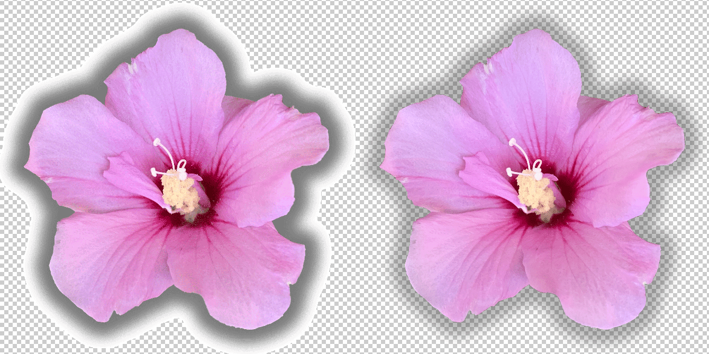
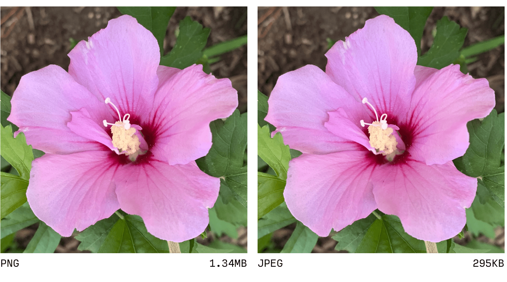
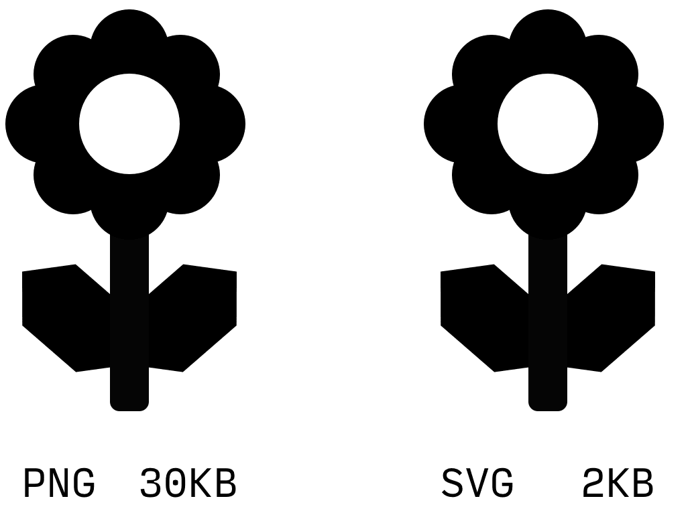

# 图片格式：PNG 

有一些方面使 PNG（便携式网络图形）与其他格式不同，因为它旨在替代 GIF（由于很久之前就存在专利争议），因此它在很多方面与 GIF 类似。PNG 还使用无损压缩，这意味着图片数据将在压缩时不会降低视觉保真度。图片的调色板可以进行量化，即“编入索引的颜色”，其中 PNG 利用的调色板仅限于 256 种颜色，就像 GIF 一样。更常见的“真彩色”PNG 可以包含许多更多颜色，最多 1600 万种。

PNG 和 GIF 都支持透明度，但有很大区别。GIF 将透明度视为二元主张：一个像素要么是不透明的颜色，要么是完全透明。PNG 支持“alpha 通道”透明度，这意味着每个像素都可以设置为 0（完全透明）到 255（完全不透明）之间的透明度。

实际上，缺乏大量量化和无损压缩意味着将图片另存为 PNG 绝不会导致画质下降。但是，与更现代的 Web 友好型编码相比，这几乎总是会导致文件过大。PNG 的传输大小意味着它们几乎从来不是摄影内容的正确选择。

过去几年，PNG 大多因单一用例更为普遍，因为是唯一支持半透明的光栅编码。 如今，仅应考虑将 PNG 用于需要半透明的简单图形（例如包含阴影的公司徽标），并且应仔细将其与支持半透明度的更现代格式（例如 WebP）进行比较。

与 GIF 非常相似，PNG 旨在解决在可伸缩性和文件大小方面通常最好使用 SVG 的用例。 因此，在少数不支持 SVG 的浏览器中，有时您会看到 PNG 作为界面元素的后备版本，尽管这种情况越来越少见。

实际上，PNG 是一种非常理想的选择，用于维护大小可管理的源映像的“规范”版本，该版本保存在本地开发环境中或提交到项目代码库，以便在需要以替代格式修改或重新保存该映像的未来版本时使用。

但值得注意的是，尽管编码是标准化的，但不同的修改工具执行该编码的方法不同，其中一些方法的效率要高得多。在任何上下文中传输 PNG 之前，请务必通过 [Squoosh](https://squoosh.app/) 或 [ImageOptim](https://imageoptim.com/) 等工具运行文件。