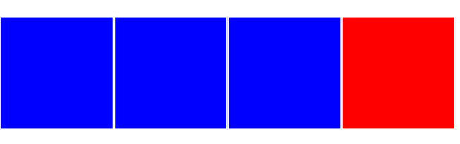

# 光栅格式图片 

光栅图像可以看作是一组用于渲染二维网格的逐像素指令。常见的光栅图片格式包括 GIF (.gif)、JPEG (.jpg)、PNG (.png) 和 WebP (.webp)。每种图片格式对这些说明的压缩和编码方式各不相同，从而导致文件大小差异巨大：编码为 JPEG 的照片图片可能只有几百 KB，而编码为 PNG 的相同图片可能有几兆字节，对最终用户来说没有明显的质量差异。

超出固有尺寸缩放的光栅图像来源会出现失真、块状或模糊：

<iframe allow="camera; clipboard-read; clipboard-write; encrypted-media; geolocation; microphone; midi;" loading="lazy" src="https://codepen.io/web-dot-dev/embed/ZEjBQqB?height=500&amp;theme-id=light&amp;default-tab=css%2Cresult&amp;editable=true" data-darkreader-inline-border-top="" data-darkreader-inline-border-right="" data-darkreader-inline-border-bottom="" data-darkreader-inline-border-left="" data-title="由 web-dot-dev 在 Codepen 上发布的 Pen ZEjBQqB" style="color-scheme: initial; box-sizing: inherit; border: 0px; height: 500px; width: 100%; --darkreader-inline-border-top: 0px; --darkreader-inline-border-right: 0px; --darkreader-inline-border-bottom: 0px; --darkreader-inline-border-left: 0px;"></iframe>

对于包含真实细节级别的艺术作品，光栅图像是适合用于此工作的工具。

与在光栅图像和矢量图像之间进行选择一样，合适类型的光栅图像最终取决于用例。 将光栅图像分解成不同的编码时，我们实际上讨论的是用于描述其内容的方法，以及我们应用的压缩方法（或缺少压缩方法）。请记住，服务器不是通过网络将图像发送到浏览器，而是描述构成图像的像素网格的字节流，以供客户端重组。

因此，为了更好地直观呈现将像素网格编码为字节流数据的过程，我希望您假设您充当网络浏览器。你有一张[毫米图纸](https://en.wikipedia.org/wiki/Graph_paper#Formats)和一盒品牌名称蜡笔。作为网络服务器，我有完全相同的组件，但我已经用蜡笔在图表纸中填充了源图片。如果要向您发送纯文本消息，我无法向您发送图片本身，但可以使用我们关于“像素”网格和颜色的共享标准，用我们都能理解的语言传达图片来源的相关信息：

> 从左上角开始。第 1 行和第 1 列显示为蓝色。第 1 行和第 2 列显示为蓝色。第 1 行和第 3 列显示为蓝色。第 1 行、第 4 列显示为红色。

有了这些文字信息，你就能完美地重现我在图表纸上的图片。

图片格式的差异以及它们被编码为数据的方式可以大致视为这些信息的格式。 例如，我发送给你的信息可以通过浅显易懂的方式表述：

> 从左上角开始。第 1 行第 1 列到第 3 列显示为蓝色。第 1 行、第 4 列显示为红色。

上述任一描述产生的图片都相同，但第二种描述却设法用更少的字符数描述同一张图片。这是一种无损压缩图片数据的方法，所有信息都相同，因此不会降低视觉保真度，但通过网络从我传输到您时的字节数更少。这是图像数据中相当于“运行长度编码”的普通语言，其中数据编码为要重复的值和计数，而不是多次重复完整的值。

反向有损压缩听起来像是非入门级压缩，为什么您会希望自己的图片看起来*更差*？ 不过，情况并非绝对，而且值得注意的是，我们的眼睛也没有完美的保真度。为图片压缩选择正确的格式和设置，就是要在我们能够感知的视觉细节程度和发送到浏览器的数据量之间取得平衡。这两个因素都由源图片的内容决定。

光栅图片格式是开发者最熟悉的格式，如 GIF、JPEG、PNG、WebP 等。在接下来的几个单元中，您将了解每个单元的功能。