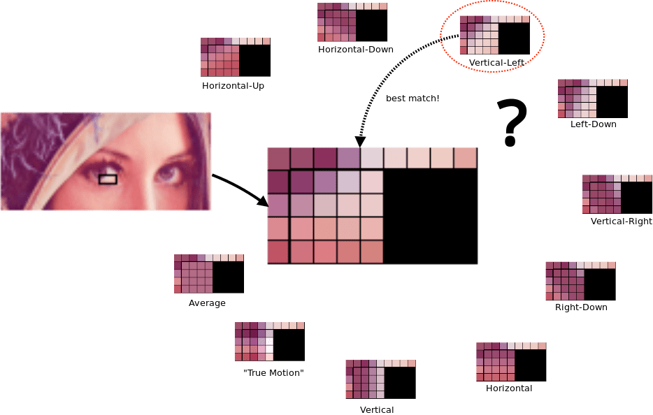
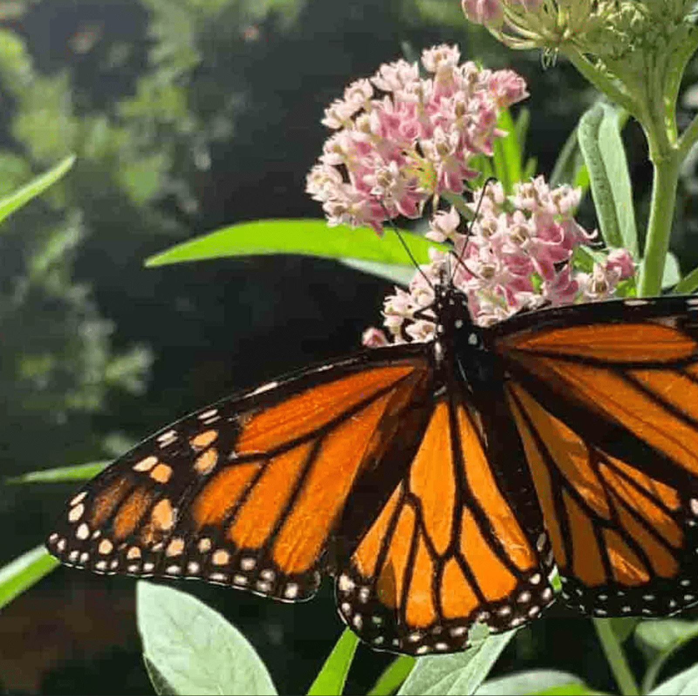
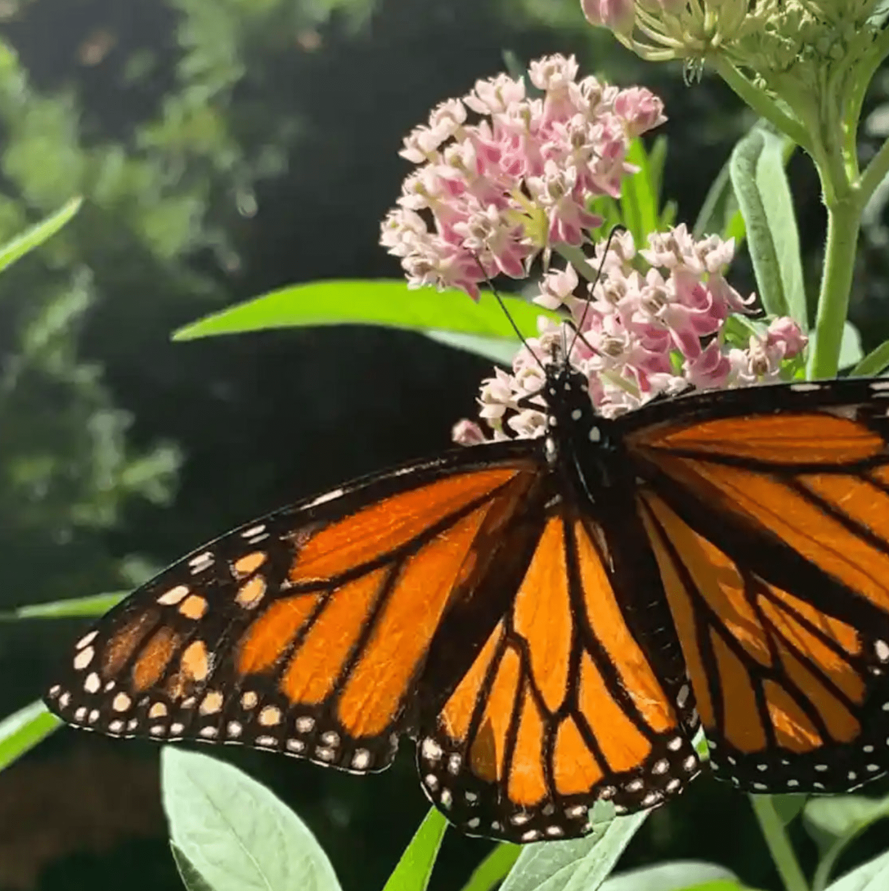

# 图片格式：WebP 

Google 最初开发 WebP 是一种有损图片格式，用于取代 JPEG，这种格式能够生成小于编码为 JPEG 的同等画质图片文件的文件。对该格式的后续更新引入了无损压缩选项，类似于 PNG 的 Alpha 通道透明度和类似于 GIF 的动画，所有这些都可以与 JPEG 样式的有损压缩一起使用。WebP 是一种功能*超乎想象*的多功能格式。

WebP 的有损压缩算法基于 [VP8 视频编解码器](https://datatracker.ietf.org/doc/html/draft-bankoski-vp8-bitstream-01#page-7)用于压缩视频中关键帧的方法。概括来讲，它与 JPEG 编码类似：WebP 以“块”而非单个像素的形式运作，并且具有类似的亮度和色度划分。WebP 的亮度块为 16x16，而色度块为 8x8，这些“宏块”进一步细分为 4x4 子块。

WebP 与 JPEG 的区别在于两个特征：“块预测”和“自适应块量化”。

## 屏蔽预测

块预测是系统根据周围块（特别是当前块上方和左侧的块）的值预测每个色度和亮度块的内容的过程。正如您可以想象的，完成这项工作的算法相当复杂，但简单来说，“如果当前块上方有蓝色，当前块左侧有蓝色，则假定此块是蓝色的。”

事实上，PNG 和 JPEG 也可以在一定程度上执行此类预测。不过，WebP 的独特之处在于它会对周围块的数据进行采样，然后尝试通过几种不同的“预测模式”填充当前块，实际上是尝试“绘制”图像的缺失部分。然后，系统会将每种预测模式提供的结果与实际图片数据进行比较，并选择最接近的预测性匹配。



当然，即使是最接近的预测匹配也不是完全正确的，因此该块的预测值和实际值之间的差异会编码在文件中。解码图片时，渲染引擎使用相同的数据来应用相同的预测逻辑，从而为每个块使用相同的预测值。然后，预测结果与文件中编码的预期图片之间的差异会应用于预测结果，这类似于 Git 提交表示应用于本地文件（而不是文件的全新副本）的差分补丁。

举例说明：我们不是深入研究真正的预测算法中涉及的复杂数学，而是使用单一预测模式发明一种类似于 WebP 的编码，并使用该模式高效地中继数字网格，就像使用传统格式时那样。我们的算法具有单一的预测模式，我们称之为“预测模式 1”：每个块的值都是其上方和左侧块的值的总和，从 1 开始。

现在，假设我们从以下真实图像数据开始：

```text
111151111
122456389
```

使用我们的预测模型确定 2x9 网格的内容，我们会得到以下结果：

```text
111111111
123456789
```

我们的数据非常适合我们发明的预测算法 - 预测的数据与我们的真实数据非常接近。 当然，这并不是万全之选，实际数据与预测数据有几处不同的块。因此，我们发送的编码不仅包括要使用的预测方法，还包括与其预测值不同的任何块的差异：

```text
_ _ _ _ +4 _ _ _ _
_ _ -1 _ _ _ -4 _ _
```

使用我们已经讨论过的一些旧版格式编码的普通语言：

> 使用预测模式 1 的 2x9 网格。+4 到 1x5、-1 到 2x3、-4 到 2x7。

最终生成一个非常高效的编码文件。

## 自适应块量化

JPEG 压缩是一种通用操作，对图片中的每个块应用相同级别的量化。在具有统一构图的图像中，这当然是有道理的，但现实世界的照片并不比我们周围的世界更统一。在实践中，这意味着 JPEG 压缩设置并非由高频细节决定（JPEG 压缩特别适合），而是由图片中最有可能出现压缩伪影的部分决定。



在这个夸张的示例中可以看到，前景中的君主翅膀看起来相对尖锐 - 与高分辨率原始图片相比，有一点颗粒，但在没有原始图片进行对比时，它们肯定不会很明显。同样，在前景中，你和我可能都能看到玉米草的繁茂花瓣和前景中的叶子，我们训练有素的眼睛也可能会看到压缩痕迹，但即使经过压缩，前景中的景物仍然会显得柔和清晰。图片左上角的低频信息（模糊的绿色叶子背景）看起来*糟糕*。即使未经训练的查看器也会立即注意到质量问题 - 背景中的细微渐变会四舍五入为锯齿状的纯色块。

为了避免这种情况，WebP 采用自适应方法进行量化：将图像分成最多四个在视觉上相似的片段，并单独调整这些片段的压缩参数。对 WebP 使用同样的超大压缩：



这两个图片文件的大小大致相同。在我们观察君主翅膀时，质量大致是相同的 - 如果您非常非常仔细地观察，就会发现最终结果中存在一些细微的差异，但整体质量没有真正的差异。在 WebP 中，乳草的花朵只是略显锐利的一点，同样，可能还不足以引起注意，除非您将两者并排比较，并真正寻找质量方面的差异，我们的方式也是这样。背景是一个完全不同的情况：它几乎没有什么 JPEG 明显的伪影。WebP 提供相同的文件大小，但图像质量要高得多，也就是说，如果我们没有进行这么密切的比较，我们的心理视觉系统将无法检测出一些微小的细节。

## 使用 WebP

WebP 的内部原理可能比 JPEG 编码复杂得多，但从日常工作的角度来说同样简单：WebP 编码的所有复杂性都围绕单个“质量”值（以 0-100 表示）进行标准化，就像 JPEG 一样。再次强调，这并不意味着您只能使用一项总体“质量”设置。如果只是为了更好地了解这些通常不可见的设置对文件大小和质量的影响，您可以并且应该修改 WebP 编码的所有细枝末节。

Google 提供了一个 `cwebp` 命令行编码器，可用于转换或压缩单个文件或整个图片目录：

```shell
$ cwebp -q 80 butterfly.jpg -o butterfly.webp

Saving file 'butterfly.webp'
File:   butterfly.jpg
Dimension: 1676 x 1418
Output: 208418 bytes Y-U-V-All-PSNR 41.00 43.99 44.95   41.87 dB
        (0.70 bpp)
block count:    intra4:     7644  (81.80%)
               Intra16:     1701  (18.20%)
               Skipped:       63  (0.67%)
bytes used:  header:            249  (0.1%)
              mode-partition:  36885  (17.7%)
Residuals bytes  |segment 1|segment 2|segment 3|segment 4|  total
macroblocks:     |       8%|      22%|      26%|      44%|   9345
quantizer:       |      27 |      25 |      21 |      13 |
filter level:    |       8 |       6 |      19 |      16 |
```

如果您不喜欢使用命令行，Squoosh 也可以帮助我们实现 WebP 编码。它使我们可以对不同编码、设置、质量级别以及文件大小与 JPEG 编码之间的差异进行并排比较。