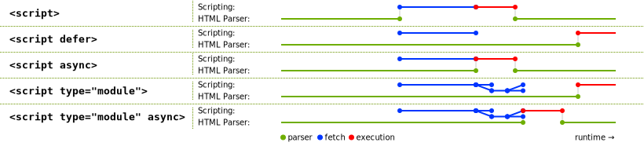

# 优化资源加载

在上一个单元中，我们探索了[关键渲染路径背后的一些理论](/web/performance/understanding-the-critical-path)，并说明了阻止渲染和解析器阻止的资源会如何延迟网页的初始渲染。现在您已经了解了其背后的一些理论，接下来就可以学习一些用于优化关键渲染路径的技巧了。

网页加载时，其 HTML 中会引用许多资源，这些资源通过 CSS 提供网页的外观和布局，并通过 JavaScript 提供互动性。在本单元中，我们介绍了一些与这些资源相关的重要概念，以及它们对网页加载时间的影响。

## 渲染阻塞

如[上一单元](/web/performance/understanding-the-critical-path)中所述，CSS 是一种阻塞渲染的资源，因为它会阻止浏览器渲染任何内容，直至您构建了 [CSS 对象模型 (CSSOM)](https://developer.mozilla.org/docs/Web/API/CSS_Object_Model)。[](https://web.dev/articles/critical-rendering-path/render-blocking-css)浏览器会阻止呈现，以防止出现[非样式内容闪烁 (FOUC)](https://en.wikipedia.org/wiki/Flash_of_unstyled_content)，这从用户体验的角度来看是不希望发生的。

一般来说，FOUC 是您通常不会看到的，但了解这个概念很重要，以便您了解浏览器为何在 CSS 下载并应用到网页之前阻止呈现网页。渲染阻塞未必是不可取的，但您需要通过对 CSS 进行优化来最大限度地缩短其持续时间。

## 解析器屏蔽

阻止解析器的资源会中断 HTML 解析器，例如没有 `async` 或 `defer` 属性的 `<script>` 元素。当解析器遇到 `<script>` 元素时，浏览器需要先评估并执行脚本，然后才能继续解析 HTML 的其余部分。这是设计使然，因为在 DOM 构建过程中，脚本可能会修改或访问 DOM。

```html
<!-- This is a parser-blocking script: -->
<script src="/script.js"></script>
```

使用外部 JavaScript 文件（不带 `async` 或 `defer`）时，从发现文件开始，到下载、解析和执行该文件，解析器才会被阻止。使用内嵌 JavaScript 时，解析器也会以类似方式被屏蔽，直到解析并执行内嵌脚本。

**注意** ：阻塞解析器的 `<script>` 还必须等待所有阻塞渲染的 CSS 资源到达并得到解析，然后浏览器才能执行这些资源。这也是设计要求，因为脚本可能会访问阻止呈现的样式表中声明的样式（例如，通过使用 `element.getComputedStyle()`）。## 预加载扫描器

[预加载扫描程序](https://web.dev/articles/preload-scanner)是一种浏览器优化，采用辅助 HTML 解析器的形式，可扫描原始 HTML 响应，以找出并推测性地提取资源，然后主 HTML 解析器才会发现这些资源。例如，即使 HTML 解析器在获取和处理 CSS 和 JavaScript 等资源时阻止了 HTML 解析器，预加载扫描程序也会允许浏览器开始下载 `` 元素中指定的资源。

为了充分利用预加载扫描器，服务器发送的 HTML 标记中应包含关键资源。预加载扫描器无法发现以下资源加载模式：

* 由 CSS 使用 `background-image` 属性加载的图片。这些图片引用位于 CSS 中，预加载扫描器无法发现这些引用。
* 动态加载的脚本，采用 `<script>` 元素标记（使用 JavaScript 注入 DOM）或使用[动态 `import()`](https://developer.mozilla.org/docs/Web/JavaScript/Reference/Operators/import) 加载的模块。
* 使用 JavaScript 在客户端上呈现的 HTML。此类标记包含在 JavaScript 资源的字符串中，预加载扫描器无法发现此类标记。
* CSS `@import` 声明。

这些资源加载模式都是后来发现的资源，因此无法从预加载扫描器中受益。请尽可能避免。但是，如果无法避免此类模式，您或许可以使用 `preload` 提示来避免资源发现延迟。

**注意** ：[关于资源提示的下一个单元](/web/performance/resource-hints)介绍了 `preload` 资源提示。## CSS

CSS 决定了网页的呈现方式和布局。如前所述，CSS 是一种阻止呈现的资源，因此优化 CSS 可能会对整体网页加载时间产生重大影响。

### 缩减大小

[缩减 CSS 文件大小](https://web.dev/articles/minify-css)可缩减 CSS 资源的文件大小，从而缩短下载速度。这主要是通过从 CSS 源文件中移除内容（例如空格和其他不可见字符）并将结果输出到新优化的文件来实现的：

```css
/* Unminified CSS: */

/* Heading 1 */
h1 {
  font-size: 2em;
  color: #000000;
}

/* Heading 2 */
h2 {
  font-size: 1.5em;
  color: #000000;
}
```

```css
/* Minified CSS: */
h1,h2{color:#000}h1{font-size:2em}h2{font-size:1.5em}
```

**注意** ：某些高级 CSS 缩减器可能会采用其他优化措施，例如将冗余规则合并到多个选择器中。 不过，此类高级 CSS 优化可能存在风险，可能无法针对所有 CSS 方法或设计系统顺畅运行或扩展。就最基本的形式而言，CSS 缩减是一种有效的优化，可以提高网站的 FCP，在某些情况下或许甚至是 LCP。[捆绑器](https://bundlers.tooling.report/)等工具可以在正式版 build 中自动为您执行此优化。

### 移除未使用的 CSS

在呈现任何内容之前，浏览器需要先下载并解析所有样式表。完成解析所需的时间还包括当前网页上未使用的样式。如果您使用的打包器将所有 CSS 资源合并到一个文件中，那么您的用户下载的 CSS 可能会比呈现当前网页所需的数量多。

如需发现当前网页未使用的 CSS，请使用 Chrome 开发者工具中的[覆盖率工具](https://developer.chrome.com/docs/devtools/css/reference/#coverage)。


Chrome 开发者工具中的覆盖率工具可用于检测当前页面未使用的 CSS（和 JavaScript）。它可用于将 CSS 文件拆分为多个资源，以供不同页面加载，而无需发送可能会延迟网页呈现的更大得多的 CSS 软件包。

移除未使用的 CSS 会产生双重效果：除了缩短下载时间之外，您还可以优化渲染树的构建，因为浏览器需要处理的 CSS 规则更少。

**重要提示** ：根据您网站的架构，可能无法完全清除未使用的 CSS，您也不需要这样做。关注大成功：如果您发现当前网页未使用的大部分 CSS 文件已被其他网页使用（您可以将其完全移至其他文件中），也可以在项目中不再使用该 CSS 时将其完全删除。### 避免使用 CSS `@import` **声明**

虽然这看起来似乎很方便，但您应避免在 CSS 中使用 `@import` 声明：

```css
/* Don't do this: */
@importurl('style.css');
```

与 `<link>` 元素在 HTML 中的工作方式类似，CSS 中的 `@import` 声明允许您从样式表中导入外部 CSS 资源。这两种方法的主要区别在于，HTML `<link>` 元素是 HTML 响应的一部分，因此会比通过 `@import` 声明下载的 CSS 文件更早地被发现。

这是因为，为了让系统发现 `@import` 声明，必须先下载包含该声明的 CSS 文件。这会产生所谓的请求链（就 CSS 而言），请求链会延迟网页首次呈现所需的时间。另一个缺点是，预加载扫描器无法发现使用 `@import` 声明加载的样式表，因而会延迟发现会阻塞渲染的资源。

```html
<!-- Do this instead: -->
<link rel="stylesheet" href="style.css">
```

在大多数情况下，您可以使用 `<link rel="stylesheet">` 元素替换 `@import`。与 `@import` 声明相反，`@import` 声明可以连续下载样式表。`<link>`

**注意** ：如果您需要使用 `@import`（例如用于[级联层](https://developer.mozilla.org/docs/Learn/CSS/Building_blocks/Cascade_layers)或第三方样式表），可以通过对导入的样式表使用 `preload` 指令来缩短延迟。此外，CSS 预处理器（例如 SASS 或 LESS）通常使用 `@import` 语法来改进开发者体验，从而提供单独的、更加模块化的源文件。不过，当 CSS 预处理器遇到 `@import` 声明时，引用的文件会捆绑并写入单个样式表中，从而避免 `@import` 在普通 CSS 中导致的连续请求惩罚。### 内嵌关键 CSS

下载 CSS 文件所需的时间可能会增加网页的 FCP。在文档 `<head>` 中内嵌关键样式可以消除对 CSS 资源的网络请求，并且如果操作正确，可以在用户的浏览器缓存尚未准备好时缩短初始加载时间。其余 CSS 可以[异步](https://www.filamentgroup.com/lab/load-css-simpler/)加载，也可以附加到 `<body>` 元素的末尾。

**关键术语** ：关键 CSS 是指渲染在初始视口中可见的内容所需的样式。初始视口的概念有时称为“首屏”。网页上的其余内容将保持未设置样式，而其余的 CSS 将异步加载。

```html
<head>
  <title>Page Title</title>
  <!-- ... -->
  <style>h1,h2{color:#000}h1{font-size:2em}h2{font-size:1.5em}</style>
</head>
<body>
  <!-- Other page markup... -->
  <linkrel="stylesheet"href="non-critical.css">
</body>
```

**重要提示** ：提取和维护关键样式可能并非易事。应包含哪些样式？应定位到哪个/哪些视口？这个过程可以自动完成吗？如果用户在非关键 CSS 加载完成之前向下滚动，会发生什么情况？如果用户遇到 FOUC，会有何影响？这些都是值得考虑的好问题，因为您网站的架构可能会使关键 CSS 的使用变得极其困难。不过，在某些特定情况下，性能优势可能是值得的，因此请调查关键 CSS 是否是您网站的可行方案！但其缺点是，内嵌大量 CSS 会导致初始 HTML 响应的字节增多。由于 HTML 资源通常无法缓存很长时间（甚至根本无法缓存），因此对于可能在外部样式表中使用同一 CSS 的后续网页，系统不会缓存内联的 CSS。请测试和衡量网页的性能，以确保权衡取舍是值得的。

### CSS 演示

<iframe allow="camera; clipboard-read; clipboard-write; encrypted-media; geolocation; microphone; midi" loading="lazy" src="https://glitch.com/embed/#!/embed/learn-performance-css?attributionHidden=true&amp;sidebarCollapsed=true&amp;previewSize=100" data-darkreader-inline-border-top="" data-darkreader-inline-border-right="" data-darkreader-inline-border-bottom="" data-darkreader-inline-border-left="" data-title="Glitch 上的 learn-performance-css"></iframe>

## JavaScript

JavaScript 在网络上实现了大部分互动，但这需要付出代价。 加载过多的 JavaScript 可能会导致网页在网页加载期间响应缓慢，甚至可能导致响应速度问题减慢互动速度 - 这两种情况都会令用户感到沮丧。

### 阻止呈现的 JavaScript

加载不带 `defer` 或 `async` 属性的 `<script>` 元素时，浏览器会阻止解析和呈现，直到脚本下载、解析并执行完毕。同样，内联脚本也会阻止解析器，直到解析和执行脚本。

### `async` **与** `defer`

`async` 和 `defer` 允许加载外部脚本，而不会阻止 HTML 解析器，而具有 `type="module"` 的脚本（包括内嵌脚本）会自动延迟。不过，`async` 和 `defer` 之间存在一些差异，请务必理解。


来源：https://html.spec.whatwg.org/multipage/scripting.html

使用 `async` 加载的脚本会在下载后立即解析和执行，而使用 `defer` 加载的脚本会在 HTML 文档解析完成时执行 - 这与浏览器的 `DOMContentLoaded` 事件同时发生。此外，`async` 脚本可能会不按顺序执行，而 `defer` 脚本则会按照它们在标记中出现的顺序执行。

**注意** ：默认情况下，使用 `type="module"` 属性加载的脚本会处于延迟状态，而使用 JavaScript 将 `<script>` 标记注入 DOM 中加载的脚本则像 `async` 脚本。### 客户端渲染

通常，您应避免使用 JavaScript 来呈现任何关键内容或网页的 [LCP 元素](https://web.dev/articles/lcp#what-elements-are-considered)。这称为客户端渲染，是一种在单页应用 (SPA) 中广泛使用的技术。

由 JavaScript 呈现的标记会绕过预加载扫描程序，因为它[无法发现](https://web.dev/articles/preload-scanner#rendering_markup_with_client-side_javascript)客户端呈现的标记中包含的资源。这可能会延迟关键资源（例如 LCP 图片）的下载。只有在脚本执行完毕后，浏览器才会开始下载 LCP 图片，并将该元素添加到 DOM 中。反过来，脚本只有在被发现、下载并解析后才能执行。这称为关键请求链，应尽量避免使用。

此外，与响应导航请求从服务器下载的标记相比，使用 JavaScript 呈现标记更有可能生成[长任务](https://web.dev/articles/long-tasks-devtools)。[在客户端在客户端渲染 HTML 会对互动延迟时间产生负面影响](https://web.dev/articles/client-side-rendering-of-html-and-interactivity)。在[网页的 DOM 非常大](https://web.dev/articles/dom-size-and-interactivity)的情况下尤其如此，因为当 JavaScript 修改 DOM 时，会触发大量的呈现工作。

### 缩减大小

与 CSS 类似，[缩减 JavaScript 大小](https://developer.chrome.com/en/docs/lighthouse/performance/unminified-javascript/)可缩减脚本资源的文件大小。 这可以加快下载速度，使浏览器能够更快地继续解析和编译 JavaScript 的过程。

此外，缩减 JavaScript 的大小比缩减其他资源（如 CSS）更进一步。缩减 JavaScript 的大小时，不仅会去除空格、制表符和注释等内容，而且源 JavaScript 中的符号也会被缩短。此过程有时称为“伪造”。如需查看不同之处，请参考以下 JavaScript 源代码：

```javascript
// Unuglified JavaScript source code:
exportfunction injectScript (){
  const scriptElement = document.createElement('script');
  scriptElement.src ='/js/scripts.js';
  scriptElement.type ='module';

  document.body.appendChild(scriptElement);
}
```

如果上述 JavaScript 源代码已做简化处理，结果可能类似于以下代码段：

```javascript
// Uglified JavaScript production code:
export function injectScript(){const t=document.createElement("script");t.src="/js/scripts.js",t.type="module",document.body.appendChild(t)}
```

在前面的代码段中，您可以看到源代码中人类可读的变量 `scriptElement` 已缩短为 `t`。当应用于大量脚本时，您可以节省相当大的开销，而不会影响网站正式版 JavaScript 提供的功能。

如果您使用打包器处理网站的源代码，系统通常会针对正式版 build 自动执行伪装功能。压缩器（例如 [Terser](https://terser.org/)）也具有高度可配置性，可让您调整伪装算法的攻击性以最大限度地节省费用。但是，任何污化工具的默认值通常足以在输出大小和功能保留之间实现适当的平衡。

### JavaScript 演示

<iframe allow="camera; clipboard-read; clipboard-write; encrypted-media; geolocation; microphone; midi" loading="lazy" src="https://glitch.com/embed/#!/embed/learn-performance-javascript?attributionHidden=true&amp;sidebarCollapsed=true&amp;previewSize=100" data-darkreader-inline-border-top="" data-darkreader-inline-border-right="" data-darkreader-inline-border-bottom="" data-darkreader-inline-border-left="" data-title="Glitch 上的“learn-performance-javascript”"></iframe>

