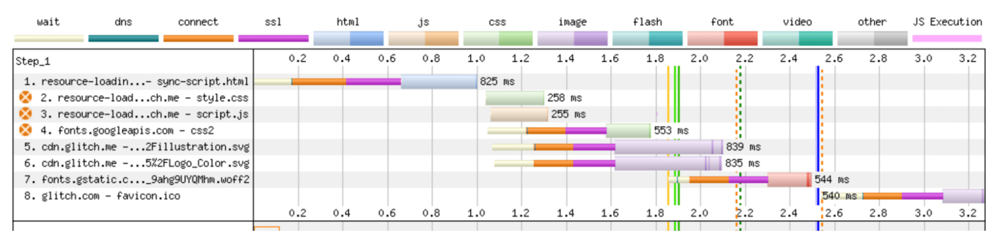
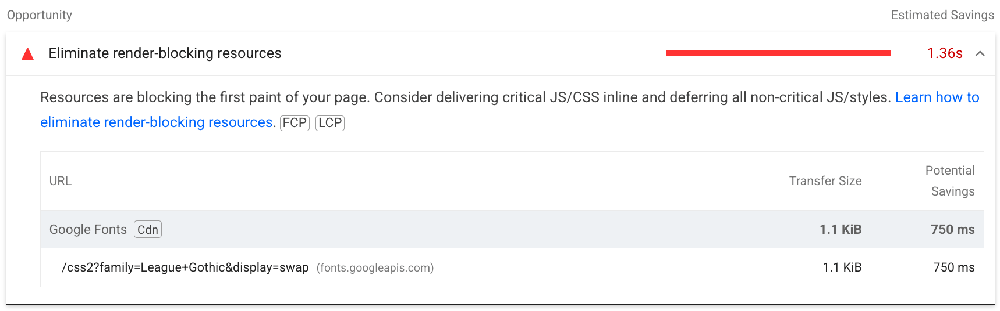
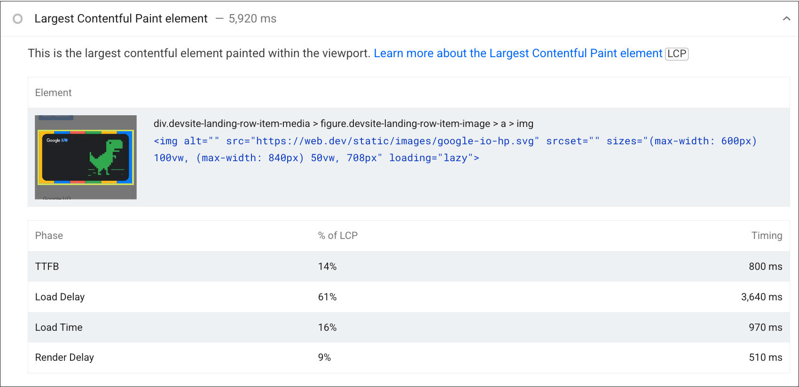
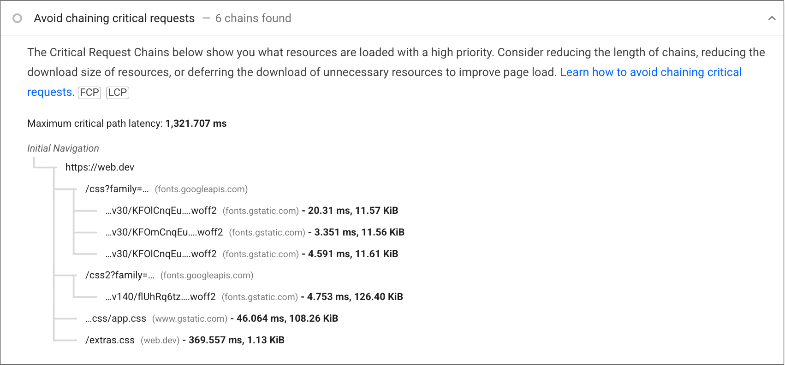

# 了解关键路径

关键呈现路径是指网页开始在浏览器中呈现之前所涉及的步骤。为了呈现网页，浏览器需要 HTML 文档本身以及呈现该文档所需的所有关键资源。

之前的[常规 HTML 性能注意事项单元](/blogs/web/performance/general-html-performance)介绍了如何将 HTML 文档发送到浏览器。不过，在本单元中，我们将详细了解浏览器在下载 HTML 文档以呈现网页之后会执行哪些操作。

## 渐进式渲染

网络是天生散布的。与在使用前安装的原生应用不同，浏览器不能依赖于具有呈现网页所需的所有资源的网站。因此，浏览器非常擅长渐进地呈现网页。原生应用通常包括安装阶段和运行阶段。但是，对于网页和 Web 应用，这两个阶段之间的界限没有明显，浏览器在设计时就考虑到了这一点。

浏览器获取用于呈现网页的资源后，通常会开始呈现网页。因此，需要选择何时呈现：何时显示过早？

如果浏览器在只需要一些 HTML 时（但在它尚未添加任何 CSS 或必要的 JavaScript 之前）尽快呈现，网页就会立即看起来损坏，并且会在进行最终呈现时发生显著变化。这种体验比最初显示空白屏幕一段时间，直到浏览器具有初始渲染所需的更多资源，从而提供更好的用户体验，这种体验会更糟糕。

另一方面，如果浏览器等待*所有*资源可用，而不是进行任何顺序渲染，那么用户就会等待很长时间；如果网页在很早之前就可用，这往往是不必要的。

浏览器需要了解其应等待的最低资源数量，以免呈现明显中断的体验。另一方面，在向用户显示某些内容之前，浏览器也不应等待超过必要时间。浏览器在执行初始渲染之前执行的一系列步骤称为“关键渲染路径”。

了解关键渲染路径可确保您不会过度地阻止初始网页渲染，从而帮助您提高网页性能。但同时，也请务必从关键渲染路径中移除首次渲染所需的资源，以免过早地进行渲染。

## （关键）渲染路径

呈现路径涉及以下步骤：

* 通过 HTML 构建文档对象模型 (DOM)。
* 通过 CSS 构建 CSS 对象模型 (CSSOM)。
* 应用任何会更改 DOM 或 CSSOM 的 JavaScript。
* 通过 DOM 和 CSSOM 构建渲染树。
* 在页面上执行样式和布局操作，看看哪些元素适合显示。
* 在内存中绘制元素的像素。
* 如果有任何像素重叠，则合成像素。
* 以物理方式将所有生成的像素绘制到屏幕上。

只有在完成所有这些步骤后，用户才会在屏幕上看到内容。

**了解详情** ：如需详细了解各个步骤，请参阅[这篇文章](https://web.dev/articles/critical-rendering-path)及其链接的模块，[这些步骤可能比这些步骤中说明的更复杂](https://developer.chrome.com/articles/renderingng-architecture)。不过，若要对 Web 性能有一个初步的了解，此简要概览应该已足够。这一呈现过程会发生多次。初始渲染会调用此流程，但随着更多会影响网页渲染的资源可用，浏览器将会重新运行此流程（或许只是其中的一部分），以更新用户看到的内容。关键渲染路径侧重于之前为初始渲染概述的流程，并依赖于执行初始渲染所需的关键资源。

### 关键渲染路径上有哪些资源？

浏览器需要等待一些关键资源下载完毕，然后才能完成初始渲染。这些资源包括：

* HTML 的一部分。
* `<head>` 元素中阻塞渲染的 CSS。
* `<head>` 元素中的阻塞渲染的 JavaScript。

关键在于浏览器以流式方式处理 HTML。浏览器一旦获取网页 HTML 的任何部分，就会开始对其进行处理。然后，浏览器就可以（并且通常确实）决定先呈现网页，然后再接收网页的其余部分 HTML。

重要的是，在首次渲染时，浏览器通常不会等待：

* 所有 HTML。
* 字体。
* Images.
* `<head>` 元素外（例如，位于 HTML 末尾的 `<script>` 元素）之外的非阻塞渲染的 JavaScript。
* `<head>` 元素外或[`media` 属性](https://developer.mozilla.org/docs/Web/HTML/Element/link#conditionally_loading_resources_with_media_queries)值不适用于当前视口的 CSS，不会阻止内容渲染。

浏览器通常将字体和图片视为要在后续页面重新渲染时填充的内容，因此不需要延迟初始渲染。不过，这可能意味着，初始渲染中留下了空白区域，而文本被隐藏并等待字体显示，或直到有图像可用为止。更糟糕的是，当某些类型的内容没有预留足够的空间时（尤其是当 HTML 中未提供图片尺寸时），网页布局可能会在这些内容稍后加载时发生变化。这方面的用户体验是通过[累计布局偏移 (CLS)](https://web.dev/articles/cls) 指标来衡量的。

`<head>` 元素是处理关键渲染路径的关键。内容介绍过，[下一部分会进行详细介绍](/blogs/web/performance/optimize-resource-loading)。优化 `<head>` 元素的内容是提升网页性能的一个关键方面。不过，目前若想了解关键渲染路径，您只需要知道 `<head>` 元素包含有关页面及其资源的元数据，但不包含用户可以看到的实际内容。可见内容包含在 `<head>` 元素后面的 `<body>` 元素中。浏览器在渲染任何内容之前，需要*同时*需要渲染的内容以及有关如何渲染该内容的元数据。

不过，并非 `<head>` 元素中引用的所有资源都是首次呈现网页所必需的，因此浏览器只会等待那些资源。为了确定哪些资源处于关键渲染路径中，您需要了解阻塞渲染和解析器的 CSS 和 JavaScript。

### 阻塞渲染的资源

有些资源被认为非常关键，以至于浏览器会暂停网页呈现，直到它处理完毕。CSS 默认属于此类别。

当浏览器看到 CSS（无论是 `<style>` 元素中的内嵌 CSS，还是由 `<link rel=stylesheet href="...">` 元素指定的外部引用的资源）时，浏览器在完成对该 CSS 的下载和处理之前，将避免呈现更多内容。

**注意** ：尽管 CSS 默认会阻塞渲染，但也可以通过更改 `<link>` 元素的 `media` 属性来指定与当前条件不匹配的值，将其转换为不阻塞渲染的资源：`<link rel=stylesheet href="..." media=print>`。 [过去已使用此方法](https://www.filamentgroup.com/lab/load-css-simpler/)，以允许非关键 CSS 以不阻塞渲染的方式加载。资源阻塞渲染并不一定意味着它会阻止浏览器执行任何其他操作。浏览器会尽可能地提高效率，因此，当浏览器发现需要下载某项 CSS 资源时，它会请求该 CSS 资源并暂停 *渲染* ，但仍会继续*处理*其余 HTML 并寻找其他工作。

阻塞渲染的资源（如 CSS）用于在发现这些资源时阻止网页的所有呈现。这意味着，某些 CSS 是否会阻止内容呈现，取决于浏览器是否发现了此类 CSS。一些浏览器（最初 [Firefox](https://jakearchibald.com/2016/link-in-body/)，现在还有 Chrome 浏览器）只会阻止渲染阻塞渲染的资源下方的内容。这意味着，对于阻塞渲染的关键路径，我们通常关注的是 `<head>` 中阻塞渲染的资源，因为它们会有效阻止整个网页的渲染。

最近的一项创新是 [Chrome 105 中](https://chromestatus.com/feature/5452774595624960)新增的 [`blocking=render` 属性](https://html.spec.whatwg.org/multipage/urls-and-fetching.html#blocking-attributes)。这样一来，开发者可以将 `<link>`、`<script>` 或 `<style>` 元素明确标记为阻塞渲染，直到该元素处理完毕，但仍允许解析器继续处理文档。

### 阻塞解析器的资源

阻塞解析器的资源是指那些阻止浏览器通过继续解析 HTML 来寻找要执行的其他工作的资源。默认情况下，JavaScript 会阻塞解析器（除非明确标记为[异步](https://developer.mozilla.org/docs/Web/HTML/Element/script#async)或[延迟](https://developer.mozilla.org/docs/Web/HTML/Element/script#defer)），因为 JavaScript 可能会在执行时更改 DOM 或 CSSOM。因此，在了解所请求 JavaScript 对网页 HTML 造成的全部影响之前，浏览器就不可能继续处理其他资源。因此，同步 JavaScript 会阻止解析器。

阻塞解析器的资源实际上也是阻碍呈现的。由于解析器在完成解析之前无法继续跳过会阻塞解析的资源，因此它无法访问和呈现它之后的内容。浏览器在等待期间可以呈现到目前为止所收到的任何 HTML，但在涉及关键呈现路径的情况下，`<head>` 中任何阻止解析器的资源实际上意味着，所有网页内容都被阻止呈现。

阻塞解析器可能会消耗巨大的性能成本，远不止阻塞渲染的成本。因此，浏览器会使用辅助 HTML 解析器（称为预加载扫描程序）在主要 HTML 解析器被屏蔽时下载即将到来的资源，从而降低此成本。虽然不如实际解析 HTML 好，但至少允许浏览器中的网络功能先于被屏蔽的解析器运行，这意味着它将来再次被屏蔽的可能性更小。

### 识别阻塞资源

许多性能审核工具都会识别阻塞渲染和解析器的资源。[WebPageTest](https://www.webpagetest.org/) 会使用资源网址左侧橙色圆圈标记阻止呈现的资源：

所有阻塞渲染的资源都需要先下载并处理，然后才能开始渲染，广告瀑布流中的深绿色实线表示这一点。

Lighthouse 还会以更巧妙的方式突出显示阻塞渲染的资源，并且仅会在该资源实际延迟页面渲染时突出显示。这有助于避免误报，即通过其他方式最大限度地减少阻塞渲染的误报。通过 Lighthouse 运行与上述 WebPageTest 图相同的页面网址，只会将其中一个样式表识别为阻塞渲染的资源。

### 优化关键渲染路径

优化关键渲染路径涉及减少接收 HTML 的时间（由[首字节时间 (TTFB) 指标](https://web.dev/articles/ttfb)表示），如上一单元中所述，以及降低阻塞渲染的资源的影响。这些概念会在后续单元中进行探讨。

## 关键内容渲染路径

长期以来，关键渲染路径一直关注的是初次渲染。然而，出现了更多[以用户为中心的 Web 性能指标](https://web.dev/articles/user-centric-performance-metrics)，这让用户质疑关键渲染路径的端点应该是首次渲染，还是之后内容更丰富的渲染之一。

另一种方法是将注意力集中在内容渲染路径（或其他人可能称之为[关键路径](https://twitter.com/csswizardry/status/1681317156494139396)）的 [Largest Contentful Paint (LCP)](https://web.dev/articles/lcp)（甚至是 [First Contentful Paint (FCP)](https://web.dev/articles/fcp)）之前。在这种情况下，您可能需要包含不一定会阻塞的资源（这一直是关键渲染路径的典型定义），但这些资源对于渲染内容渲染是必需的。

无论您对“关键”内容有何确切定义，了解阻碍任何初始渲染的因素和关键内容非常重要。首次渲染用于衡量首次可能有机会为用户渲染 *任何内容* 。理想情况下，这应该有意义，而不是像背景颜色一样，但即使它没有内容，呈现给用户仍然是有价值的，这也是衡量关键渲染路径（如传统上所定义）的一个参数。同时，衡量何时向用户呈现主要内容也有价值。

### 确定内容呈现路径

许多工具都可以识别 LCP 元素及其呈现时间。除了 [LCP 元素](https://developer.chrome.com/docs/lighthouse/performance/lighthouse-largest-contentful-paint/)之外，Lighthouse 还可以帮助您确定 [LCP 阶段](https://web.dev/articles/optimize-lcp#lcp_breakdown)以及每个阶段所花费的时间，以帮助您了解最集中的优化工作：

对于更复杂的网站，[Lighthouse 还会在一项单独的审核中突出显示关键请求链](https://developer.chrome.com/docs/lighthouse/performance/critical-request-chains/)：

此 Lighthouse 评估会观察所有以高优先级加载的资源，因此它包含 Chrome 设置为高优先级资源的网络字体和其他内容，即使这些资源实际上并未阻止渲染也是如此。
