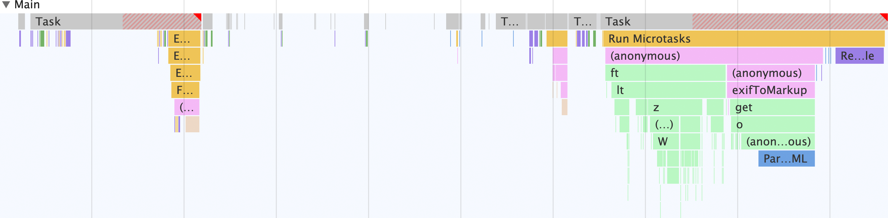
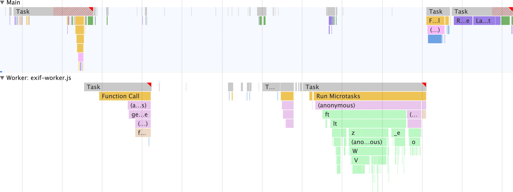

# Web Worker 的具体用例

**试试看** ：本部分依靠 [Glitch 演示](https://exif-worker.glitch.me/)来说明如何使用 Web 工作器将工作从主线程分流到单独的线程。赶快去看看吧！在上一个单元中，我们概述了 [Web 工作器](/web/performance/web-worker-overview)。Web 工作器可以将 JavaScript 从主线程移到单独的网络工作器线程，以此来提高输入响应速度。当您的工作不需要直接访问主线程时，这有助于改善网站的 [Interaction to Next Paint (INP)](https://web.dev/articles/inp)。不过，仅有概览是不够的，本单元还将介绍 Web 工作器的具体用例。

例如，网站需要从图片中去除 [Exif 元数据](https://en.wikipedia.org/wiki/Exif)，这并不是一个遥不可及的概念。事实上，Flickr 等网站为用户提供了查看 Exif 元数据的一种方法，用于了解有关其托管图片的技术细节，例如色深、相机品牌和型号以及其他数据。

但是，如果完全在主线程上执行提取图片、将其转换为 [`ArrayBuffer`](https://developer.mozilla.org/docs/Web/JavaScript/Reference/Global_Objects/ArrayBuffer) 以及提取 Exif 元数据的逻辑，则相应的逻辑开销可能会很高。幸运的是，Web Worker 作用域允许在主线程以外完成这项工作。然后，使用 Web 工作器的消息流水线，Exif 元数据以 HTML 字符串的形式传回主线程，并向用户显示。

### 在不使用 Web Worker 的情况下，主线程是什么样子

首先，观察在不使用 Web Worker 的情况下执行此工作时主线程是什么样子。为此，请执行以下步骤：

1. 在 Chrome 中打开一个新标签页，然后打开其开发者工具。
2. 打开 **性能面板** 。
3. 前往 [https://exif-worker.glitch.me/without-worker.html](https://exif-worker.glitch.me/without-worker.html)。
4. 在性能面板中，点击开发者工具窗格右上角的  **Record** 。
5. 在该字段中粘贴[此图片链接](images/Vespula_germanica_Richard_Bartz.jpg)或您选择的其他包含 Exif 元数据的链接，然后点击 **Get that JPEG!** 按钮。
6. 一旦界面填充了 Exif 元数据，再次点击 **Record** 即可停止录制。


图片元数据提取器应用中的主线程 activity。请注意，所有 activity 都在主线程上发生。

请注意，除了可能存在的其他线程（例如光栅器线程等）之外，应用中的所有内容都在主线程中进行。在主线程上，会发生以下情况：

1. 该表单会接受输入并分派 `fetch` 请求，以获取包含 Exif 元数据的图片的初始部分。
2. 图片数据会转换为 `ArrayBuffer`。
3. [`exif-reader`](https://www.npmjs.com/package/exif-reader) 脚本用于从映像中提取 Exif 元数据。
4. 系统会爬取元数据以构建 HTML 字符串，然后该字符串会填充元数据查看器。

现在，将其与相同行为的实现（但使用的是 Web Worker）进行对比！

### 主线程与 Web Worker*配合使用*时的情况

现在，您已经了解了从主线程上的 JPEG 文件提取 Exif 元数据的情况，再来看一下同时使用 Web worker 时的情况：

1. 在 Chrome 中打开另一个标签页，然后打开其开发者工具。
2. 打开 **性能面板** 。
3. 前往 [https://exif-worker.glitch.me/with-worker.html](https://exif-worker.glitch.me/with-worker.html)。
4. 在性能面板中，点击开发者工具窗格右上角的 **记录按钮** 。
5. 将[该图片链接](images/Vespula_germanica_Richard_Bartz.jpg)粘贴到相应字段中，然后点击 **获取该图片！** 按钮。
6. 一旦界面填充了 Exif 元数据，请再次点击**录制按钮**以停止录制。


图片元数据提取器应用中的主线程活动。请注意，还有一个额外的 Web 工作器线程，用于完成大部分工作。

这就是 Web Worker 的强大功能。除了在元数据查看器中填充 HTML 之外，其他所有操作都是在单独的线程中完成的，而不是在主线程上执行 *所有操作* 。这意味着主线程可以释放出来执行其他工作。

也许这里的最大优势在于，与不使用 Web 工作器的此应用版本不同，`exif-reader` 脚本不是在主线程上加载，而是在 Web 工作器线程上加载。这意味着下载、解析和编译 `exif-reader` 脚本的费用是在主线程以外完成的。

现在，我们来深入了解让这一切成为可能的 Web Worker 代码！

## 了解 Web Worker 代码

仅仅查看 Web Worker 带来的不同是不够的，还有助于您了解（至少在此情况下）代码是什么样子，以便您了解 Web Worker 作用域中可能发生的情况。

**注意** ：下面的代码并非详尽无遗，只是相关部分。如需查看实际运作方式，请[查看编辑器模式下的 Glitch 演示](https://glitch.com/edit/#!/exif-worker?path=js%2Fwith-worker%2Fscripts.js%3A1%3A10)。从在网页工作器进入图片之前需要发生的主线程代码开始：

```javascript
// scripts.js

// Register the Exif reader web worker:
const exifWorker =newWorker('/js/with-worker/exif-worker.js');

// We have to send image requests through this proxy due to CORS limitations:
const imageFetchPrefix ='https://res.cloudinary.com/demo/image/fetch/';

// Necessary elements we need to select:
const imageFetchPanel = document.getElementById('image-fetch');
const imageExifDataPanel = document.getElementById('image-exif-data');
const exifDataPanel = document.getElementById('exif-data');
const imageInput = document.getElementById('image-url');

// What to do when the form is submitted.
document.getElementById('image-form').addEventListener('submit', event =>{
  // Don't let the form submit by default:
  event.preventDefault();

  // Send the image URL to the web worker on submit:
  exifWorker.postMessage(`${imageFetchPrefix}${imageInput.value}`);
});

// This listens for the Exif metadata to come back from the web worker:
exifWorker.addEventListener('message',({ data })=>{
  // This populates the Exif metadata viewer:
  exifDataPanel.innerHTML = data.message;
  imageFetchPanel.style.display ='none';
  imageExifDataPanel.style.display ='block';
});
```

此代码在主线程上运行，并设置表单以将图片网址发送到 Web 工作器。然后，Web 工作器代码会从 [`importScripts`](https://developer.mozilla.org/docs/Web/API/WorkerGlobalScope/importScripts) 语句开始，该语句会加载外部 `exif-reader` 脚本，然后为主线程设置消息传递流水线：

```javascript
// exif-worker.js

// Import the exif-reader script:
importScripts('/js/with-worker/exifreader.js');

// Set up a messaging pipeline to send the Exif data to the `window`:
self.addEventListener('message',({ data })=>{
  getExifDataFromImage(data).then(status =>{
    self.postMessage(status);
  });
});
```

**注意** ：虽然用于将外部脚本导入 Web 工作器范围的 `importScripts` 语法具有广泛的兼容性，但在大多数浏览器中，也可以使用静态 `import` 语法将模块导入 Web 工作器。如需了解详情，请参阅[使用模块工作器对 Web 进行线程处理](https://web.dev/articles/module-workers)。这段 JavaScript 代码会设置消息传递流水线，以便在用户提交包含 JPEG 文件网址的表单时，该网址会到达 Web 工作器。接下来，这段代码会从 JPEG 文件中提取 Exif 元数据，构建 HTML 字符串，然后将该 HTML 发送回 `window`，以便最终向用户显示：

```javascript
// Takes a blob to transform the image data into an `ArrayBuffer`:
// NOTE: these promises are simplified for readability, and don't include
// rejections on failures. Check out the complete web worker code:
// https://glitch.com/edit/#!/exif-worker?path=js%2Fwith-worker%2Fexif-worker.js%3A10%3A5
const readBlobAsArrayBuffer = blob =>newPromise(resolve =>{
  const reader =newFileReader();

  reader.onload =()=>{
    resolve(reader.result);
  };

  reader.readAsArrayBuffer(blob);
});

// Takes the Exif metadata and converts it to a markup string to
// display in the Exif metadata viewer in the DOM:
const exifToMarkup = exif =>Object.entries(exif).map(([exifNode, exifData])=>{
  return`
    <details>
      <summary>
        <h2>${exifNode}</h2>
      </summary>
      <p>${exifNode === 'base64' ? ``:typeof exifData.value ==='undefined'? exifData : exifData.description || exifData.value}</p>
    </details>
  `;
}).join('');

//Fetches a partial image and gets its Exif data
const getExifDataFromImage = imageUrl =>newPromise(resolve =>{
  fetch(imageUrl,{
    headers:{
      // Use a range request to only download the first 64 KiB of an image.
      // This ensures bandwidth isn't wasted by downloading what may be a huge
      // JPEG file when all that's needed is the metadata.
      'Range':`bytes=0-${2**10*64}`
    }
  }).then(response =>{
    if(response.ok){
      return response.clone().blob();
    }
  }).then(responseBlob =>{
    readBlobAsArrayBuffer(responseBlob).then(arrayBuffer =>{
      const tags =ExifReader.load(arrayBuffer,{
        expanded:true
      });

      resolve({
        status:true,
        message:Object.values(tags).map(tag => exifToMarkup(tag)).join('')
      });
    });
  });
});
```

这有点读起来，但对于 Web Worker 来说，这也是一个相当复杂的应用场景。不过，结果是值得的，而不仅限于此用例。您可以将 Web 工作器用于各种用途，例如隔离 `fetch` 调用和处理响应、在不阻塞主线程的情况下处理大量数据 - 这仅供新手使用。

在提高 Web 应用的性能时，请开始考虑可以在 Web 工作器上下文中合理地执行的任何操作。这样做可能会显著提高网站的整体用户体验。
